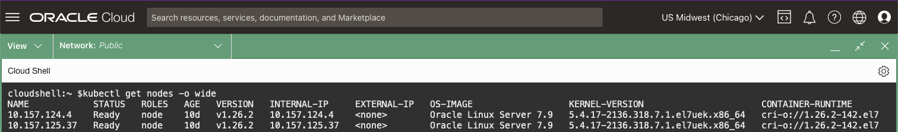
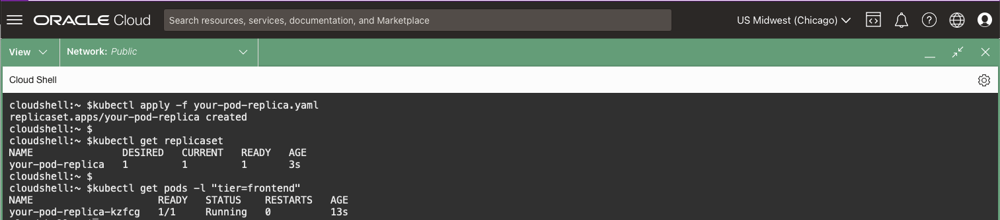

# Explore The Cluster

## Introduction

In this lab you will explore the the Kubernetes Cluster.  You've already seen the *kube-apiserver* and *etcd* components of the *Control Plane* node, now explore the rest of the cluster to gain a better understanding of the **why** and **how** Kubernetes is an exciting technology.

*Estimated Time:* 10 minutes

### Objectives

* Understand the Core Components of Kubernetes

### Prerequisites

This lab assumes you have:

* An accessible Oracle Kubernetes Engine Cluster
* [Generated a Kubeconfig File](?lab=access-cluster)

## Task 1: Pods

*Pods* are the data of a Database.  Without data, there is no point to a Database and, similarly, without *Pods* there is no point to Kubernetes.  Everything in Kubernetes revolves around *Pods*, the smallest computing object in a Kubernetes Cluster.

*Pods* consists of one or more *Containers*, applications with all their libraries and dependencies, packaged to run in any environment.


1. Start a *Pod* called `your-pod` that runs the container image `nginx`, a lightweight web server:

    ```bash
    <copy>
    kubectl run your-pod --image=nginx --restart=Never
    </copy>
    ```

2. Use the `kubectl get` verb to query the *Pod*:

    ```bash
    <copy>
    kubectl get pod your-pod -o wide
    </copy>
    ```

    

3. Access the *Pod* and make a call to the application:

    As the application is currently not accessible outside of the *Pod*, the syntax below will connect directly to the container in the *Pod* to run the command (`curl localhost`).  You will look at exposing the application to inside the cluster and to the outside world later in this Workshop.

    ```bash
    <copy>
    kubectl exec -it your-pod -- /bin/bash -c "curl localhost"
    </copy>
    ```

    

4. Cause a *Pod* failure:

    ```bash
    <copy>
    kubectl exec -it your-pod -- /bin/bash -c "kill 1"
    </copy>
    ```

5. Query the *Pod*:

    ```bash
    <copy>
    kubectl get pod your-pod -o wide
    </copy>
    ```

6. Retry accessing your *Pod* and make a call to the application:

    ```bash
    <copy>
    kubectl exec -it your-pod -- /bin/bash -c "curl localhost"
    </copy>
    ```

    You won't get the same output as in Step 2 as the application is no longer running.

7. Delete the *Pod*:

    ```bash
    <copy>
    kubectl delete pod your-pod
    </copy>
    ```

If you are familiar with running containerised applications on your Desktop, this would have felt very familiar to you.  However, in this case, when you started your *Pod* it was running inside the cluster on a *Worker Node*, as displayed when you ran the command `kubectl get pod your-pod -o wide`.

## Task 2: Worker Nodes

*Worker Nodes* are often referred to as the backbone of a Kubernetes cluster. They form the foundation and perform the bulk of the computational and operational tasks.

*Worker Nodes* have three main components:

* *Container Runtime* - Responsible for pulling containers and running the container images.
* *Kubelet* - The primary `node-agent` responsible for interacting with the *Container Runtime* to ensure that containers are running and healthy on the node.
* *Kube-Proxy* - Acts as a sort of proxy and load-balancer, responsible for routing traffic to the appropriate container based on IP and port number of the incoming request.


1. Ask the *kube-apiserver* about your *Worker Nodes*:

    ```bash
    <copy>
    kubectl get nodes -o wide
    </copy>
    ```

    Your output will be similar to:

    

    which shows you the Nodes status, Kubernetes Version, OS, and Container Runtime version.

2. Connect to a *Worker Node*:

    ```bash
    <copy>
    NODE_IP=$(kubectl get nodes \
      -o=jsonpath='{.items[0].status.addresses[?(@.type=="InternalIP")].address}')

    kubectl debug node/$NODE_IP -it --image=oraclelinux:8
    </copy>
    ```

3. See the core process that make this a *Worker Node* in the cluster (make sure to `exit`):

    ```bash
    <copy>
    ps -e |grep crio
    ps -e |grep kubelet
    ps -e |grep kube-proxy

    exit
    </copy>
    ```

    

## Task 3: kube-scheduler

When you interacted with the *kube-apiserver* to create `your-pod`, the *kube-scheduler* determined which *Worker Node* it could be run, or *scheduled*, based on constraints and available resources.  


The *kube-apiserver* then stored the information in *etcd* that "`your-pod` should run on nodeX," following that decision made by the *kube-scheduler*.  The *kube-apiserver* then instructs the *kubelet* on `nodeX` to execute the actions against the `nodeX` *container runtime* to ensure `your-pod` is running, as it was defined, with the containers described in that *Pod*Spec.

1. Create a *manifest file* for `your-pod`:

    In **Task 1** you created `your-pod` by running `kubectl run ...`, however, it is more common to use what is known as a *manifest file* to create Kubernetes resources.  This allows you to version control your resources and provides a better mechanism for DevOps operations.

    ```bash
    <copy>
    cat > your-pod.yaml << EOF
    apiVersion: v1
    kind: Pod
    metadata:
      name: your-pod
    spec:
      containers:
      - name: nginx
        image: nginx:latest
    EOF
    </copy>
    ```

    The *manifest file* states that you are using the "core" API `v1` to define a *Pod* named `your-pod`.  The *Pod* will have one *container* called `nginx` running the `nginx:latest` image.

2. Create `your-pod` using the *manifest file*:

    ```bash
    <copy>
    kubectl apply -f your-pod.yaml
    </copy>
    ```

3. Determine the *Worker Node* it was placed on:

    ```bash
    <copy>
    ORIG_NODE=$(kubectl get pod your-pod -o jsonpath='{.spec.nodeName}')
    echo $ORIG_NODE
    </copy>
    ```

4. Update the *manifest file* to instruct the *kube-scheduler* that `your-pod` **should not** run on the `$ORIG_NODE`

    This uses an advanced feature, `nodeAffinity`, simply to demonstrate how the *kube-scheduler* can pick a node based on constraints.

    ```bash
    <copy>
    cat > your-pod.yaml << EOF
    apiVersion: v1
    kind: Pod
    metadata:
      name: your-pod
    spec:
      containers:
        - name: nginx
          image: nginx:latest
      affinity:
        nodeAffinity:
          requiredDuringSchedulingIgnoredDuringExecution:
            nodeSelectorTerms:
            - matchExpressions:
              - key: internal_addr
                operator: NotIn 
                values:
                  - $ORIG_NODE
    EOF
    </copy>
    ```

5. Recreate the *Pod*:

    ```bash
    <copy>
    kubectl delete -f your-pod.yaml
    kubectl apply -f your-pod.yaml
    </copy>
    ```

6. Check which *Worker Node* the *Pod* is running on:

    ```bash
    <copy>
    NEW_NODE=$(kubectl get pod your-pod -o jsonpath='{.spec.nodeName}')
    echo "Pod was scheduled on $ORIG_NODE, but now is scheduled on $NEW_NODE"
    </copy>
    ```

    Based on the `nodeAffinity` constraint placed on the *Pod*, the *kube-scheduler* was limited as to where the *Pod* could be scheduled.

7. Delete the *Pod*:

    ```bash
    <copy>
    kubectl delete -f your-pod.yaml
    </copy>
    ```

**Bonus**: What happens if you constrained the *Pod* from being *scheduled* on all **Worker Nodes**?

## Task 3: ReplicaSet

In *Task 1* when you caused an unrecoverable failure of `your-pod` the application was no longer available... **a full outage**... until you manually recreated `your-pod`.  In that case, you might as well do away with Kubernetes as it gives you no advantage of running your container outside the cluster.  Kubernetes, however, is an orchestration system and you can tell it: "I always want one instance, or *replica*, of my container to be running".

1. Create a *ReplicaSet* to create your *Pod*:

    ```bash
    <copy>
    cat > your-pod-replica.yaml << EOF
    apiVersion: apps/v1
    kind: ReplicaSet
    metadata:
      name: your-pod-replica
      labels:
        tier: frontend
    spec:
      replicas: 1
      selector:
        matchLabels:
          tier: frontend
      template:
        metadata:
          labels:
            tier: frontend
        spec:
          containers:
          - name: nginx
            image: nginx:latest
    EOF
    </copy>
    ```

    In the above **manifest file** you are calling the `apps/v1` API to create a *ReplicaSet* called `your-pod-replica` to maintain `your-pod`.  The *labels* field is important.  It tells the *kubelet* to look for *Pods* with the *label* `tier=frontend` and ensure there are `x replicas` of it (in this case `1`).

2. Create the *ReplicaSet*:

    ```bash
    <copy>
    kubectl apply -f your-pod-replica.yaml
    </copy>
    ```

3. Query the *ReplicaSet*:

    ```bash
    <copy>
    kubectl get replicaset
    </copy>
    ```

4. Get all *Pods* with the *label* `tier=frontend`:

    ```bash
    <copy>
    kubectl get pods -l "tier=frontend"
    </copy>
    ```

    Take note of the "Restarts" Column

    

5. Cause a failure and query the *Pod*:

    ```bash
    <copy>
    POD_NAME=$(kubectl get pod -l "tier=frontend" -o custom-columns=NAME:.metadata.name --no-headers)

    kubectl exec -it $POD_NAME -- /bin/bash -c "kill 1"
    </copy>
    ```

6. Re-query your *replica*:

    ```bash
    <copy>
    kubectl get pod -l "tier=frontend"
    </copy>
    ```

    This time `your-pod-replica` was automatically restarted for you and your application, while experiencing a brief outage, continues to be available.

    

7. Scale the *ReplicaSet*:

    To avoid that brief outage when `your-pod-replica` had a failure, redefine the *ReplicaSet* to ensure there are always `2` *replica* of `your-pod-replica`

    ```bash
    <copy>
    kubectl scale --replicas=2 replicaset/your-pod-replica
    </copy>
    ```

8. Query the *Pod*:

    ```bash
    <copy>
    kubectl get pod -l "tier=frontend"
    </copy>
    ```

    Now you'll see two *Pods* giving your application higher availability.

    

9. Delete the *ReplicaSet*:

    ```bash
    <copy>
    kubectl delete -f your-pod-replica.yaml
    </copy>
    ```

## Task 4: Deployment, StatefulSet, DaemonSet

While running *Pods* is at the heart of Kubernetes, it is uncommon to run them directly or as *ReplicaSets* as you did in **Task 1 and 3**.  You will, most of the time, run a *Pod* as part of a *Deployment* and less often as part of a *StatefulSet* or *DaemonSet*.

* **Deployment** - Manages *ReplicaSets* (which manage *Pods*).  *Deployments* allow you to change the desired state of your *Pod* at a controlled rate.
* **StatefulSet** - Like *Deployments* but ensures *Pods* are created and recreated with a persistent identifier.  This is useful when using persistent storage as it allows Kubernetes to match that persistent storage with its *Pod*
* **DaemonSet** - Ensures that all eligible *Worker Nodes* run a copy of its *Pod*.  A *DaemonSet* does not have the concept of a *ReplicaSet*, rather its `replicas` is equal to the number of eligible *Worker Nodes*

1. Create a *manifest file* for `your-pod-deployment`:

    ```bash
    <copy>
    cat > your-pod-deployment.yaml << EOF
    apiVersion: apps/v1
    kind: Deployment
    metadata:
      name: your-pod-deployment
      labels:
        tier: frontend
    spec:
      replicas: 3
      selector:
        matchLabels:
          tier: frontend
      template:
        metadata:
          labels:
            tier: frontend
        spec:
          containers:
          - name: nginx
            image: nginx:1.14.2
    EOF
    </copy>
    ```

    This *manifest file* looks similar to the *ReplicaSet* manifest; but you have changed the `kind` to *Deployment* and are making another change to the *Pod* specification.  Previously you were using the `latest` version of `nginx`.  This is generally **bad practice** as you are handing over the applications version control over to the *container engine*.  Now you are following **best practices** and specifying a specific version of `nginx`.

2. Create your *Deployment*: and list out `your-pod-deployments`

    ```bash
    <copy>
    kubectl apply -f your-pod-deployment.yaml
    </copy>
    ```

3. Query the *Pod*, filtering on the *label* `tier=frontend`:

    ```bash
    <copy>
    kubectl get pod -l "tier=frontend"
    </copy>
    ```

4. Perform an Upgrade

    You are going to upgrade `nginx` from `1.14.2` to `1.25.1`.  This will show the power of the *Deployment* and you are encouraged to try the same thing with the *ReplicaSet* to understand the additional functionality a *Deployment* brings.  Use the Linux `watch` command so you don't miss out on the action:

    ```bash
    <copy>
    sed -i s/"1.14.2"/"1.25.1"/g your-pod-deployment.yaml
    </copy>
    ```

    ```bash
    <copy>    
    kubectl apply -f your-pod-deployment.yaml && watch -n 1 -d kubectl get pod -l "tier=frontend"
    </copy>
    ```

    If the `watch` was quick enough, you would have seen that the *Deployment* caused the upgrade to be rolled out.  It ensured that the specified number of `replica` were always available, replacing *Pods* with the older `nginx` with *Pods* running the newer version in a graceful manner.

5. Delete your *Deployment*

    ```bash
    <copy>
    kubectl delete -f your-pod-deployment.yaml
    </copy>
    ```

This lab has given you a general idea of the basics of a Kubernetes Cluster.  More concepts will be explored as you move through the rest of the Workshop.

You may now **proceed to the next lab**

## Learn More

* [Kubernetes Worker Nodes](https://kubernetes.io/docs/concepts/architecture/nodes/)
* [Kubernetes Control Plane Components](https://kubernetes.io/docs/concepts/overview/components/)
* [Kubernetes ReplicaSet](https://kubernetes.io/docs/concepts/workloads/controllers/replicaset/)
* [Kubernetes Deployment](https://kubernetes.io/docs/concepts/workloads/controllers/deployment/)
* [Kubernetes StatefulSet](https://kubernetes.io/docs/concepts/workloads/controllers/statefulset/)
* [Kubernetes DaemonSet](https://kubernetes.io/docs/concepts/workloads/controllers/daemonset/)

## Acknowledgements

* **Authors** - [](var:authors)
* **Contributors** - [](var:contributors)
* **Last Updated By/Date** - John Lathouwers, July 2023
