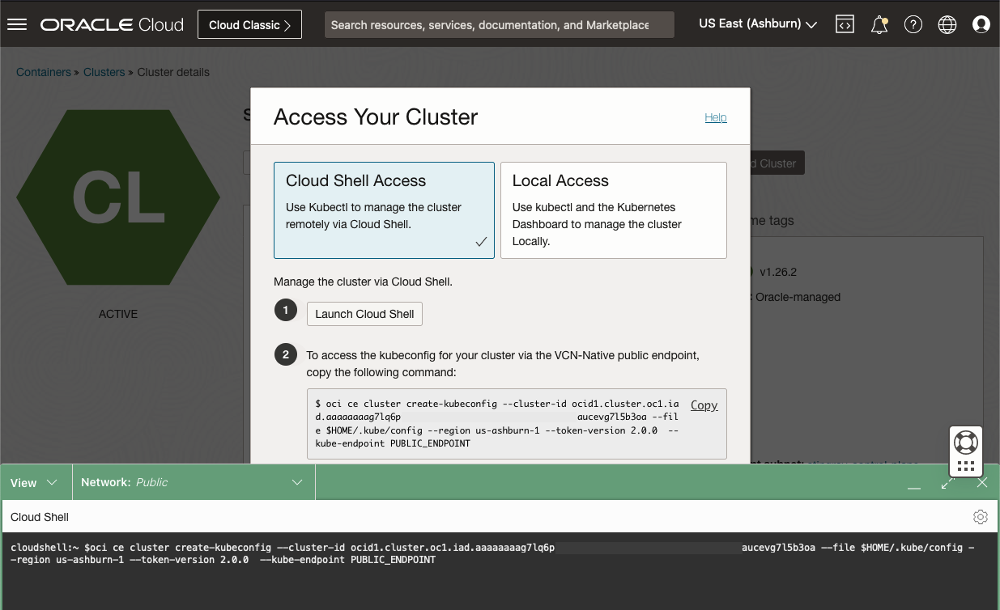

# Deploy the Oracle Operator for Kubernetes (OraOperator)

## Introduction

This lab will walk you through establishing a connection to the Kubernetes Cluster.

*Estimated Lab Time:* 1 minute

Watch the video below for a quick walk through of the lab.
[](youtube:zNKxJjkq0Pw)

### Objectives

* Establish a connection and interact with the cluster

### Prerequisites

This lab assumes you have:

* An accessible Oracle Kubernetes Engine Cluster provisioned

## Task 1: Create the Kubeconfig file

In OCI, navigate to Developer Services -> Kubernetes Clusters(OKE).


Select your cluster and click the "Access Cluster" button. Follow the steps to "Manage the cluster via Cloud Shell".



Paste the copied command into Cloud Shell.  This will create a configuration file, the `kubeconfig`, that `kubectl` uses to access the cluster.

## Task 2: Test Kubernetes Access

Just as with `srvctl`, used to query the resources in a Oracle Grid Infrastructure Cluster, use `kubectl` to query the resources in the K8s cluster.

In Cloud Shell:

```bash
<copy>
kubectl get all -A
</copy>
```

The command should return a table like structure of pods and namespaces.  If an error is returned, ensure the K8s cluster is up and running and that the `kubeconfig` file was properly generated in *Task 1*.
