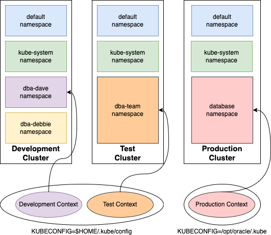

# Generate the Kubeconfig File

"Invention, my dear friends, is 93% perspiration, 6% electricity, 4% evaporation, and 2% butterscotch ripple."
\- Willy Wonka

## Introduction

This lab will walk you through establishing a connection to the Kubernetes cluster by generating a `kubeconfig` file.

*Estimated Lab Time:* 1 minute

Watch the video below for a quick walk through of the lab.
[](youtube:zNKxJjkq0Pw)

### Objectives

* Establish a connection and interact with the cluster

### Prerequisites

This lab assumes you have:

* An accessible Oracle Kubernetes Engine Cluster provisioned

## Kubeconfig File

The Kubernetes command-line tool, `kubectl`, relies on the "Kubeconfig file" for logging in and working with Kubernetes clusters.  The kubeconfig file, which is not named kubeconfig but rather `config`, holds important details like cluster info, login methods, and user credentials.  It is usually found in `$HOME/.kube/config`, but can be placed anywhere with the `KUBECONFIG` environment file pointing to its directory.

With kubeconfig files, you can organize your clusters, users, and namespaces. You can also define contexts to quickly and easily switch between clusters and namespaces.

Suppose you have a development and test cluster.  In the development cluster you work in your own namespace and in the test cluster all DBAs share the same namespace.  Additionally, the development cluster permits username/password authentication, while in the test cluster, you must use a certificate.



All this information can be stored in a single kubeconfig file and you can define a `context` to group the cluster, user AuthN, and namespace together.  Switching between clusters would then be a matter of changing the context, similar to: `kubectl config use-context development` to use the development cluster.

The Production cluster information maybe stored in an entirely different kubeconfig file, using it would be a matter of setting the `KUBECONFIG` environment variable to its location.

## Task 1: Create the Kubeconfig file

In OCI, navigate to Developer Services -> Kubernetes Clusters(OKE).


Select your cluster and click the "Access Cluster" button. Follow the steps to "Manage the cluster via Cloud Shell".


Paste the copied command into Cloud Shell.  This will create a configuration file, the `kubeconfig`, that `kubectl` uses to access the cluster.

## Task 2: Test Kubernetes Access

Just as with `srvctl`, used to query the resources in a Oracle Grid Infrastructure Cluster, use `kubectl` to query the resources in the K8s cluster.

In Cloud Shell:

```bash
<copy>
kubectl get all -A
</copy>
```

The command should return all the resources in the K8s cluster.  If an error is returned, ensure the K8s cluster is up and running and that the `kubeconfig` file was properly generated in *Task 1*.


## Learn More

* [Command line tool (kubectl)](https://kubernetes.io/docs/reference/kubectl/)
* [Organizing Cluster Access Using kubeconfig Files](https://kubernetes.io/docs/concepts/configuration/organize-cluster-access-kubeconfig/)

## Acknowledgements

* **Author** - John Lathouwers, Developer Advocate, Database Development Operations
* **Last Updated By/Date** - John Lathouwers, May 2023
