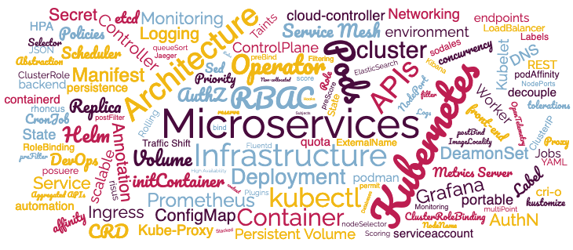

# Introduction

## About this Workshop

Oracle DBAs: Explore Microservices Architecture and Kubernetes Infrastructure with the Oracle Database.

As an Oracle DBA you are likely more familiar with the concepts behind Microservices and Kubernetes than you may realise.  In fact, you've probably been naturally evolving the Oracle databases you support into a Microservices-like architecture running on a Kubernetes-like infrastructure.

This Workshop was designed by an Oracle DBA, for Oracle DBAs, to introduce the concepts of Microservices and basics of Kubernetes.  

This Workshop will demystify the terminology and buzz-words of these exciting solutions so you can confidently support your organisations next Microservice project with the Oracle Database.

Estimated Workshop Time: 1 hour 30 minutes

### Objectives

In this Workshop, you will learn:

* The basics of Microservices and Kubernetes
* How to perform lifecycle operations using the Oracle Operator for Kubernetes
* Deploy SQLDeveloper Web as a Microservice Application

### Prerequisites

This lab assumes you have:

* Access to Oracle Cloud Infrastructure ([Free-Tier](https://www.oracle.com/uk/cloud/free/) or Paid Tenancy)
* Previous experience as an Oracle DBA

## Learn More

* [Kubernetes](https://kubernetes.io/)
* [Microservices](https://microservices.io/)

## Acknowledgements

* **Authors** - 
* **Contributors** - 
* **Last Updated By/Date** - John Lathouwers, July 2023
