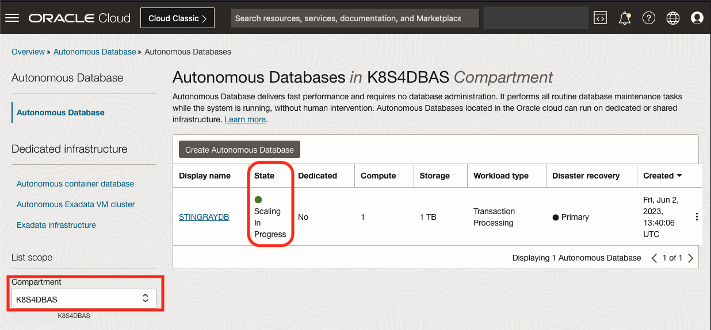
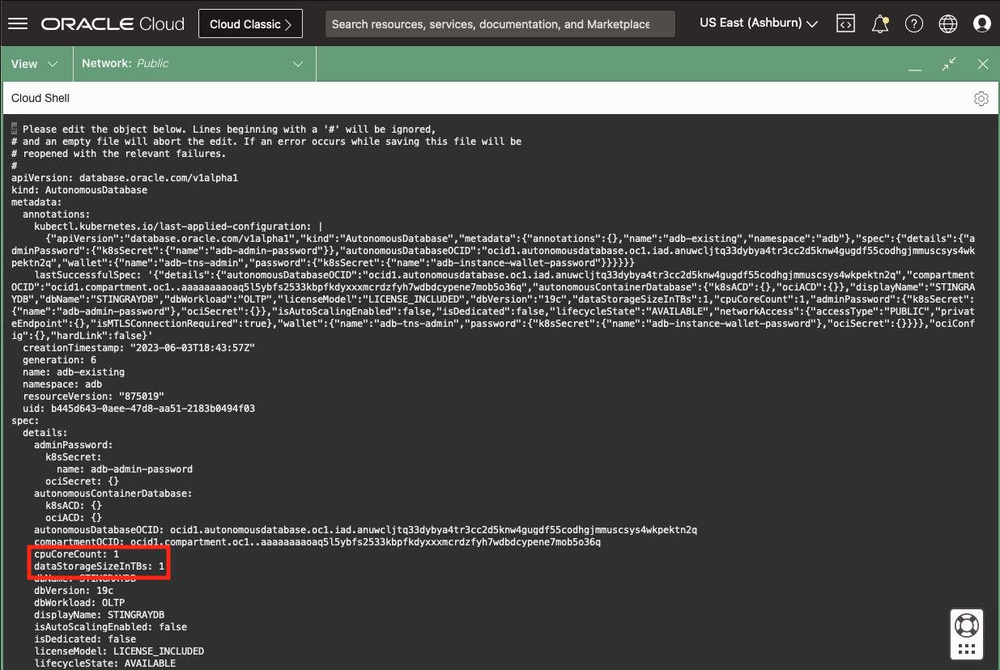
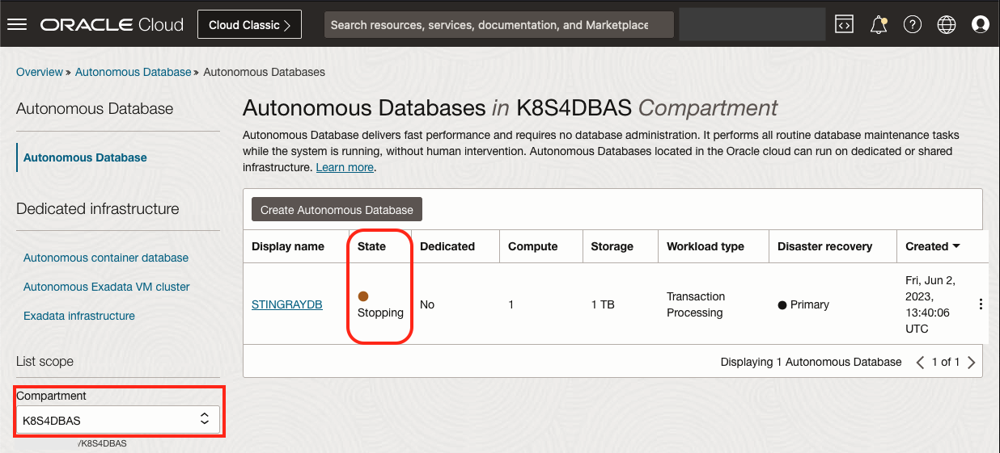

# Lifecycle Operations - Oracle Autonomous Database (ADB)

## Introduction

In this lab, you use the OraOperator to perform Lifecycle operations against an Oracle Autonomous Database (ADB).

*Estimated Lab Time:* 10 minutes

Watch the video below for a quick walk through of the lab.
[](youtube:zNKxJjkq0Pw)

### Objectives

* Perform Lifecycle Operations on an ADB using the OraOperator

### Prerequisites

This lab assumes you have:

* [Generated a Kubeconfig File](?lab=generate-kubeconfig)
* A [Running and Healthy OraOperator](?lab=deploy-oraoperator)
* The [OraOperator bound to an ADB](?lab=bind-adb)

## Task 1: Retrieve the existing ADB OCID

During the [Deploy Workshop Stack Lab](?lab=setup-stack), a new Autonomous Database was provisioned in Oracle Cloud Infrastructure for you.

Retrieve the OCID for the Autonomous Database, by running the following in Cloud Shell:

```bash
<copy>
# Get the Compartment OCID
COMPARTMENT_OCID=$(oci iam compartment list \
  --name [](var:oci_compartment) | 
  jq -r '.data[].id')

# Get the ADB OCID from the Compartment
ADB_OCID=$(oci db autonomous-database list \
  --compartment-id $COMPARTMENT_OCID | 
  jq -r '.data[].id')

echo "ADB OCID: $ADB_OCID"
</copy>
```

## Task 2: Set Password/Generate Wallet

The password currently assigned to the ADB was randomised and is unknown, so you will need to set it for connectivity.  As calls to the OraOperator controllers are declarative you will be instructing the Controller to modify the ADB to the newly defined, desired state.  In regards to the ADMIN password, it will currently not be what you will define in the K8s Secret, and therefor it will be modified accordingly.

Additionally, the ADB was provisioned with mTLS, so you will need a Wallet to connect to the ADB securely.  You'll create a Secret for the Wallet password and the OraOperator will download the wallet into another Secret.

In Cloud Shell, assign the `ADB_PWD` variable a password (for Workshop purposes only).  You can choose any password so long as it complies with the [Password Complexity](https://docs.oracle.com/en/cloud/paas/autonomous-database/adbsa/manage-users-create.html#GUID-72DFAF2A-C4C3-4FAC-A75B-846CC6EDBA3F) rules.

For example:

```bash
<copy>
ADB_PWD=$(echo "K8s4DBAs_$(date +%H%S%M)")
</copy>
```

Start a manifest file to create a Secret and apply it to the exiting ADB:

```bash
<copy>
cat > adb_modify.yaml << EOF
---
apiVersion: v1
kind: Secret
type: Opaque
metadata:
  name: adb-admin-password
stringData:
  adb-admin-password: $ADB_PWD
---
apiVersion: v1
kind: Secret
type: Opaque
metadata:
  name: adb-instance-wallet-password
stringData:
  adb-instance-wallet-password: $ADB_PWD
---
apiVersion: database.oracle.com/v1alpha1
kind: AutonomousDatabase
metadata:
  name: adb-existing
spec:
  details:
    autonomousDatabaseOCID: $ADB_OCID
    adminPassword:
      k8sSecret:
        name: adb-admin-password
    wallet:
      name: adb-tns-admin
      password:
        k8sSecret:
          name: adb-instance-wallet-password
EOF
</copy>
```

Take a quick look at the syntax:  

You are defining two resources of `kind: Secret` of `type: Opaque`.  The first is named: `adb-admin-password` and the second is named: `adb-instance-wallet-password`.  The last part of the manifest **redefines** the `adb-existing` resource, setting the adminPassword and wallet.  Under the wallet section, you are specifying the name of the `Secret`, `adb-tns-admin` that will be defined to to store the wallet.

Apply the manifest in Cloud Shell:

```bash
<copy>
kubectl apply -f adb_modify.yaml -n adb
</copy>
```

Output:

```text
secret/adb-admin-password created
secret/adb-instance-wallet-password created
autonomousdatabase.database.oracle.com/adb-existing configured
```

Get the Secrets in the ADB namespace (`kubectl get secrets -n <namespace>`):

```bash
<copy>
kubectl get secrets -n adb
</copy>
```

Output:

```text
NAME                           TYPE     DATA   AGE
adb-admin-password             Opaque   1      13m
adb-instance-wallet-password   Opaque   1      13m
adb-tns-admin                  Opaque   9      13m
```

You created the first two and instructed OraOperator to create the third `adb-tns-admin`.  Take a closer look at the **adb-tns-admin** secret by describing it (`kubectl describe secrets <secret_name> -n <namespace>`):

```bash
<copy>
kubectl describe secrets adb-tns-admin -n adb
</copy>
```

Output:

```text
Name:         adb-tns-admin
Namespace:    adb
Labels:       app=adb
Annotations:  <none>

Type:  Opaque

Data
====
ojdbc.properties:  691 bytes
sqlnet.ora:        114 bytes
cwallet.sso:       5349 bytes
ewallet.p12:       5304 bytes
ewallet.pem:       5710 bytes
keystore.jks:      3191 bytes
tnsnames.ora:      1310 bytes
truststore.jks:    2056 bytes
README:            3037 bytes
```

You'll see what equates to a `TNS_ADMIN` directory, and in fact, this Secret will be used by applications for just that purpose.

## Task 3: Database Connectivity

As you are working with an ADB, there are numerous ways to download the Wallet to access the Database using mTLS.  One way is by extracting the K8s Wallet secret that was created for you by the OraOperator.

In Cloud Shell:

```bash
<copy>
export ORACLE_HOME=$(pwd)
export TNS_ADMIN=$ORACLE_HOME/network/admin
mkdir -p $ORACLE_HOME/network/admin
# Extract the tnsnames.ora secret
kubectl get secret/adb-tns-admin -n adb --template="{{ index .data \"tnsnames.ora\" | base64decode }}" > $ORACLE_HOME/network/admin/tnsnames.ora
# Extract the sqlnet.ora secret
kubectl get secret/adb-tns-admin -n adb --template="{{ index .data \"sqlnet.ora\" | base64decode }}" > $ORACLE_HOME/network/admin/sqlnet.ora
# Extract the Wallet for mTLS
kubectl get secret/adb-tns-admin -n adb --template="{{ index .data \"cwallet.sso\" | base64decode }}" > $ORACLE_HOME/network/admin/cwallet.sso
</copy>
```

Feel free to examine the contents of the files created by extracting the different secrets (e.g `cat $ORACLE_HOME/network/admin/tnsnames.ora`)

In `Task 2` you set a new password for the ADB, if you have forgotten it, you can retrieve it from the secret:

```bash
<copy>
kubectl get secrets/adb-admin-password -n adb --template="{{index .data \"adb-admin-password\" | base64decode}}"
<copy>
```

Now connect to the ADB via SQL*Plus, using the ADMIN password from the secret:

```bash
<copy>
SERVICE_NAME=$(kubectl get adb -n adb -o json | jq -r .items[0].spec.details.dbName)_TP

sqlplus admin@$SERVICE_NAME
</copy>
```

You should get the all familiar `SQL>` prompt.  `EXIT` when ready.

## Task 4: Scale the OCPU and Storage

You can again, **redefine** the ADB resource to adjust its OCPU and Storage.  While you could create a new manifest file and apply it, try a different approach and use the `kubectl patch` functionality to update the **AutonomousDatabase** resource in place.  

The usage of the `--type=merge` is known as a *JSON Merge Patch* and simply specifies what should be different after execution.

```bash
<copy>
kubectl patch AutonomousDatabase adb-existing -n adb \
  -p '{"spec":{"details":{"cpuCoreCount":2,"dataStorageSizeInTBs":2}}}' \
  --type=merge
</copy>
```

Output:

```text
autonomousdatabase.database.oracle.com/adb-existing patched
```

In the OCI Console, Navigate to Oracle Databases -> Autonomous Database and you should see your ADB in a "Scaling In Progress" state, increasing the OCPU and Storage.



You've now have seen how to apply a manifest to define and redefine a K8s resource, but you can also edit the resource directly:

```bash
<copy>
kubectl edit AutonomousDatabase adb-existing -n adb
</copy>
```

Find the `cpuCoreCount` and `dataStorageSizeInTBs` fields (they should both be set to 2) and change them back to 1:

In the vi editor:

1. Move the cursor over the `2` value for cpuCoreCount and type `x`
2. Type `i` and `<space>` `1`, hit the `esc` key
3. Repeat the 1 and 2 for dataStorageSizeInTBs
4. Type `:wq`



In the OCI Console, Navigate to Oracle Databases -> Autonomous Database and you should see your ADB back in a "Scaling In Progress" state, decreasing the OCPU and Storage.

## Task 5: Scheduled Stop and Start

You can execute any of the methods you used to scale the ADB to also change the ADBs `lifecycleState` (AVAILABLE or STOPPED) manually.  However, you can also take advantage of another built-in K8s resource, the `CronJob`, to schedule a a change in the `lifecycleState`.  

This is especially useful for Autonomous Databases as when the database is STOPPED, you are not charged for the CPUs.

Now up to this point you have pretty much been able to do everything in the K8s cluster and you might be wondering about security.  The access you are using from the `kubeconfig` file has given you `SYSDBA` like privileges in the K8s cluster.  
> you might be wondering about security

However, in this next example, you will be using an in-built `Service Account` called `default` to stop and start your ADB on a schedule.  The `default` account doesn't have any privileges on your **AutonomousDatabase** resource, so you will need to create a `Role` and grant, or "bind", that `Role` to the `default` account:

### Grant Permissions

Create a role called `autonomousdatabases-reader` which has permissions to `get`, `list`, and `patch` the Autonomous Database.  Bind that role with a resource called `autonomousdatabases-reader-binding` to the `ServiceAccount` `default` to provide it with the required access:

```bash
<copy>
cat > adb_role.yaml << EOF
---
apiVersion: rbac.authorization.k8s.io/v1
kind: Role
metadata:
  name: autonomousdatabases-reader
rules:
- apiGroups: ["database.oracle.com"]
  resources: ["autonomousdatabases"]
  verbs: ["get", "list", "patch"]
---
apiVersion: rbac.authorization.k8s.io/v1
kind: RoleBinding
metadata:
  name: autonomousdatabases-reader-binding
subjects:
- kind: ServiceAccount
  name: default
roleRef:
  kind: Role
  name: autonomousdatabases-reader
  apiGroup: rbac.authorization.k8s.io
EOF
</copy>
```

Apply the Role and RoleBinding resources:

```bash
<copy>
kubectl apply -f adb_role.yaml -n adb
</copy>
```

Output:

```text
role.rbac.authorization.k8s.io/autonomousdatabases-reader created
rolebinding.rbac.authorization.k8s.io/autonomousdatabases-reader-binding created
```

### Schedule a CronJob

The below manifest will create two CronJob resources to stop the ADB at 1800 everyday and start it at 0800 everyday.  Modify the `adb-stop` schedule to be 1-2 minute from now so that you can see it work (hint: type `date` in Cloud Shell to ensure you are using the correct timezone):

```bash
<copy>
cat > adb_cron.yaml << EOF
---
apiVersion: batch/v1
kind: CronJob
metadata:
  name: adb-stop
spec:
  schedule: "00 18 * * *"
  concurrencyPolicy: Forbid
  jobTemplate:
    spec:
      ttlSecondsAfterFinished: 86400
      backoffLimit: 2
      activeDeadlineSeconds: 600
      template:
        spec:
          restartPolicy: Never
          containers:
            - name: kubectl
              image: bitnami/kubectl
              command:
                - 'kubectl'
                - 'patch'
                - 'adb'
                - 'adb-existing'
                - '-n'
                - 'adb'
                - '-p'
                - '{"spec":{"details":{"lifecycleState":"STOPPED"}}}'
                - '--type=merge'
---
apiVersion: batch/v1
kind: CronJob
metadata:
  name: adb-start
spec:
  schedule: "00 8 * * *"
  concurrencyPolicy: Forbid
  jobTemplate:
    spec:
      ttlSecondsAfterFinished: 86400
      backoffLimit: 2
      activeDeadlineSeconds: 600
      template:
        spec:
          restartPolicy: Never
          containers:
            - name: kubectl
              image: bitnami/kubectl
              command:
                - 'kubectl'
                - 'patch'
                - 'adb'
                - 'adb-existing'
                - '-n'
                - 'adb'
                - '-p'
                - '{"spec":{"details":{"lifecycleState":"AVAILABLE"}}}'
                - '--type=merge'
EOF
</copy>
```

Apply the manifest:

```bash
<copy>
kubectl apply -f adb_cron.yaml -n adb
</copy>
```

Output:

```text
cronjob.batch/adb-stop created
cronjob.batch/adb-start created
```

Take a quick look at the cronjobs in the `adb` namespace:

```bash
<copy>
kubectl get cronjob -n adb
<copy>
```

Output:

```text
NAME        SCHEDULE      SUSPEND   ACTIVE   LAST SCHEDULE   AGE
adb-start   00 8 * * *    False     0        <none>          32s
adb-stop    00 18 * * *   False     0        <none>          82m
```

This next command will watch the CronJobs and output when one runs. If you scheduled the job to run 1 minute from now, wait for that 1 minute to elapse.

```bash
<copy>
kubectl get jobs --watch -n adb
</copy>
```

Output after 1 minute:

```text
NAME                COMPLETIONS   DURATION   AGE
adb-stop-28098047   0/1                      0s
adb-stop-28098047   0/1           0s         0s
adb-stop-28098047   0/1           5s         5s
adb-stop-28098047   1/1           5s         5s
```

In the OCI Console, Navigate to Oracle Databases -> Autonomous Database and you should see your ADB in a "Stopping" state.



You can also check the logs of the job by replacing `<job_name>` in the following command:

 `kubectl logs job/<job_name> -n adb`

Make sure to start your ADB for future labs:

```bash
<copy>
kubectl patch adb adb-existing -n adb -p '{"spec":{"details":{"lifecycleState":"AVAILABLE"}}}' --type=merge
</copy>
```

## Learn More

* [Oracle Autonomous Database](https://www.oracle.com/uk/autonomous-database/)
* [Kubernetes CronJobs](https://kubernetes.io/docs/concepts/workloads/controllers/cron-jobs/)

## Acknowledgements

* **Author** - John Lathouwers, Developer Advocate, Database Development Operations
* **Last Updated By/Date** - John Lathouwers, May 2023
