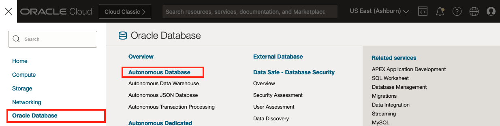

# Lifecycle Operations - Oracle Autonomous Database (ADB)

"Life is really simple, but we insist on making it complicated."
\- Confucius

## Introduction

In this lab, you use the OraOperator to perform Lifecycle operations against an Oracle Autonomous Database (ADB).

In order to manage the **AutonomousDatabase** type, the OraOperator has custom **Controllers** to manage the  **AutonomousDatabase** type within the K8s cluster. These controllers act as "built-in SOPs" specifically designed for handling the  **AutonomousDatabase** resource.

The controllers provide a declarative API, allowing users to specify the desired state of the  **AutonomousDatabase** resource.  They continuously monitor the current state of the resource and take actions to reconcile any differences between the desired state and the actual state.


The actions that the AutonomousDatabase controller can perform includes:

* Create an Autonomous Database
* Manage ADMIN database user password
* Download instance credentials (wallets)
* Scale the OCPU core count or storage
* Rename an Autonomous Database
* Stop/Start/Terminate an Autonomous Database
* Delete the resource from the K8s cluster

*Estimated Lab Time:* 15 minutes

Watch the video below for a quick walk through of the lab.
[](youtube:zNKxJjkq0Pw)

### Objectives

* Perform Lifecycle Operations on an ADB using the OraOperator

### Prerequisites

This lab assumes you have:

* [Generated a Kubeconfig File](?lab=generate-kubeconfig)
* A [Running and Healthy OraOperator](?lab=deploy-oraoperator)
* The [OraOperator bound to an ADB](?lab=bind-adb)

## Task 1: Create Manifest for new ADB

Use the OraOperator to provision a new Autonomous Database by creating a manifest file that will:

* Define a Secret to hold the ADMIN password
* Provision a new ADB

```bash
<copy>
cat > adb_provision.yaml << EOF
---
apiVersion: v1
kind: Secret
type: Opaque
metadata:
  name: adb-devops-admin-password
stringData:
  adb-devops-admin-password: Th1s_W1ll_N0t_l1v3
---
apiVersion: database.oracle.com/v1alpha1
kind: AutonomousDatabase
metadata:
  name: adb-devops
spec:
  hardLink: true
  details:
    compartmentOCID: $COMPARTMENT_OCID
    dbName: DEVOPSDB
    displayName: DEVOPSDB
    dbVersion: 19c
    dbWorkload: OLTP
    cpuCoreCount: 1
    dataStorageSizeInTBs: 1
    adminPassword:
      k8sSecret:
        name:  adb-devops-admin-password
EOF
</copy>
```

The above YAML invokes the K8s built-in `v1` API to define an `Opaque` `Secret` resource called `adb-devops-admin-password` with the value of `Th1s_W1ll_N0t_l1v3`.  As the `Secret` doesn't currently exist, it will be created and K8s will store the base64 encoded value of the password.

The YAML will also access the OraOperators' custom controller API `database.oracle.com/v1alpha1` to define an `AutonomousDatabase` (custom) resource in the `$COMPARTMENT_OCID` (substituted by the real value stored in *Task 2*) with the self-explanatory properties in the `spec.details` section.

**Important:** the `spec.hardLink: true` field indicates that if you delete this `AutonomousDatabase` resource from the K8s cluster, also delete the ADB associated with it.
> Good for DevOps CI/CD... Bad for Production!

If it were set to `false` then deleting the resource from K8s would *NOT* delete ADB itself.

## Task 2: Apply the new ADB Manifest

Define the new ADB in the `adb` namespace:

```bash
<copy>
kubectl apply -f adb_provision.yaml -n adb
</copy>
```

Output:

```text
secret/adb-new-admin-password created
autonomousdatabase.database.oracle.com/adb-new created
```

## Task 3: Verify new ADB Provisioning

In the OCI Console, navigate to Oracle Database -> Autonomous Database.  



Ensure you are in the K8S4DBAS Compartment and you will see the `DEVOPSDB` being provisioned.


## Task 4: Delete the Provisioned ADB

The ADB provisioned by the OraOperator is great for DevOps, after which it should be deleted.  The physical ADB is deleted because you specified a `hardLink` between the K8s resource and the database.  There is no reason to keep its ADMIN secret around, so delete that as well:

```bash
<copy>
kubectl delete adb adb-devops -n adb
kubectl delete secret adb-devops-admin-password -n adb
</copy>
```

Output:

```text
autonomousdatabase.database.oracle.com "adb-devops" deleted
secret "adb-devops-admin-password" deleted
```

## Task 5: Verify ADB Termination

In the OCI Console, navigate to Oracle Database -> Autonomous Database.  


Ensure you are in the K8S4DBAS Compartment and you will see the `DEVOPSDB` being terminated.


## Task 6: Database Connectivity

As you are working with an ADB, there are numerous ways to download the Wallet to access the Database using mTLS.  One way is by extracting the K8s Wallet secret that was just created for you by the OraOperator.

In Cloud Shell:

```bash
<copy>
export ORACLE_HOME=$(pwd)
export TNS_ADMIN=$ORACLE_HOME/network/admin
mkdir -p $ORACLE_HOME/network/admin

# Extract the tnsnames.ora secret
kubectl get secret/adb-tns-admin -n adb \
  --template="{{ index .data \"tnsnames.ora\" | base64decode }}" > $ORACLE_HOME/network/admin/tnsnames.ora

# Extract the sqlnet.ora secret
kubectl get secret/adb-tns-admin -n adb \
  --template="{{ index .data \"sqlnet.ora\" | base64decode }}" > $ORACLE_HOME/network/admin/sqlnet.ora

# Extract the Wallet for mTLS
kubectl get secret/adb-tns-admin -n adb \
  --template="{{ index .data \"cwallet.sso\" | base64decode }}" > $ORACLE_HOME/network/admin/cwallet.sso
</copy>
```

Feel free to examine the contents of the files created by extracting the different secrets (e.g `cat $ORACLE_HOME/network/admin/tnsnames.ora`)

In a previous lab you set a new password for the ADB, if you have forgotten it, you can retrieve it from the secret:

```bash
<copy>
kubectl get secrets/adb-admin-password -n adb --template="{{index .data \"adb-admin-password\" | base64decode}}"
<copy>
```

Now connect to the ADB via SQL*Plus, using the ADMIN password from the secret; extract the name of the database from the resource for the Service Name:

```bash
<copy>
SERVICE_NAME=$(kubectl get adb -n adb -o json | jq -r .items[0].spec.details.dbName)_TP

sqlplus admin@$SERVICE_NAME
</copy>
```

You should get the all familiar `SQL>` prompt.  `EXIT` when ready.

## Task 7: Scale the OCPU and Storage

You can again, **redefine** the ADB resource to adjust its OCPU and Storage.  While you could create a new manifest file and apply it, try a different approach and use the `kubectl patch` functionality to update the **AutonomousDatabase** resource in place.  

The usage of the `--type=merge` is known as a *JSON Merge Patch* and simply specifies what should be different after execution.

```bash
<copy>
kubectl patch AutonomousDatabase adb-existing -n adb \
  -p '{"spec":{"details":{"cpuCoreCount":2,"dataStorageSizeInTBs":2}}}' \
  --type=merge
</copy>
```

Output:

```text
autonomousdatabase.database.oracle.com/adb-existing patched
```

In the OCI Console, Navigate to Oracle Databases -> Autonomous Database and you should see your ADB in a "Scaling In Progress" state, increasing the OCPU and Storage.


You've now have seen how to apply a manifest to define and redefine a K8s resource, but you can also edit the resource directly:

```bash
<copy>
kubectl edit AutonomousDatabase adb-existing -n adb
</copy>
```

Find the `cpuCoreCount` and `dataStorageSizeInTBs` fields (they should both be set to 2) and change them back to 1:

In the vi editor:

1. Move the cursor over the `2` value for cpuCoreCount and type `x`
2. Type `i` and `<space>` `1`, hit the `esc` key
3. Repeat steps 1 and 2 for dataStorageSizeInTBs
4. Type `:wq`


In the OCI Console, Navigate to Oracle Databases -> Autonomous Database and you should see your ADB back in a "Scaling In Progress" state, decreasing the OCPU and Storage.

## Task 8: Scheduled Stop and Start

You can execute any of the methods you used to scale the ADB to also change the ADBs `lifecycleState` (AVAILABLE or STOPPED) manually.  However, you can also take advantage of another built-in K8s resource, the `CronJob`, to schedule a a change in the `lifecycleState`.  

This is especially useful for Autonomous Databases as when the database is STOPPED, you are not charged for the CPUs.

Now up to this point you have pretty much been able to do everything in the K8s cluster and you might be wondering about security.  The access you are using from the `kubeconfig` file has given you `SYSDBA` like privileges in the K8s cluster.  
> you might be wondering about security

However, in this next example, you will be using an in-built `Service Account` called `default` to stop and start your ADB on a schedule.  The `default` account doesn't have any privileges on your **AutonomousDatabase** resource, so you will need to create a `Role` and grant, or "bind", that `Role` to the `default` account:

### Grant Permissions

Create a role called `autonomousdatabases-reader` which has permissions to `get`, `list`, and `patch` the Autonomous Database.  Bind that role with a resource called `autonomousdatabases-reader-binding` to the `ServiceAccount` `default` to provide it with the required access:

```bash
<copy>
cat > adb_role.yaml << EOF
---
apiVersion: rbac.authorization.k8s.io/v1
kind: Role
metadata:
  name: autonomousdatabases-reader
rules:
- apiGroups: ["database.oracle.com"]
  resources: ["autonomousdatabases"]
  verbs: ["get", "list", "patch"]
---
apiVersion: rbac.authorization.k8s.io/v1
kind: RoleBinding
metadata:
  name: autonomousdatabases-reader-binding
subjects:
- kind: ServiceAccount
  name: default
roleRef:
  kind: Role
  name: autonomousdatabases-reader
  apiGroup: rbac.authorization.k8s.io
EOF
</copy>
```

Apply the Role and RoleBinding resources:

```bash
<copy>
kubectl apply -f adb_role.yaml -n adb
</copy>
```

Output:


### Schedule a CronJob

The below manifest will create two CronJob resources to stop the ADB at 1800 everyday and start it at 0800 everyday:

```bash
<copy>
cat > adb_cron.yaml << EOF
---
apiVersion: batch/v1
kind: CronJob
metadata:
  name: adb-stop
spec:
  schedule: "00 18 * * *"
  concurrencyPolicy: Forbid
  jobTemplate:
    spec:
      ttlSecondsAfterFinished: 86400
      backoffLimit: 2
      activeDeadlineSeconds: 600
      template:
        spec:
          restartPolicy: Never
          containers:
            - name: kubectl
              image: bitnami/kubectl
              command:
                - 'kubectl'
                - 'patch'
                - 'adb'
                - 'adb-existing'
                - '-n'
                - 'adb'
                - '-p'
                - '{"spec":{"details":{"lifecycleState":"STOPPED"}}}'
                - '--type=merge'
---
apiVersion: batch/v1
kind: CronJob
metadata:
  name: adb-start
spec:
  schedule: "00 8 * * *"
  concurrencyPolicy: Forbid
  jobTemplate:
    spec:
      ttlSecondsAfterFinished: 86400
      backoffLimit: 2
      activeDeadlineSeconds: 600
      template:
        spec:
          restartPolicy: Never
          containers:
            - name: kubectl
              image: bitnami/kubectl
              command:
                - 'kubectl'
                - 'patch'
                - 'adb'
                - 'adb-existing'
                - '-n'
                - 'adb'
                - '-p'
                - '{"spec":{"details":{"lifecycleState":"AVAILABLE"}}}'
                - '--type=merge'
EOF
</copy>
```

Apply the manifest:

```bash
<copy>
kubectl apply -f adb_cron.yaml -n adb
</copy>
```

Output:


Take a quick look at the cronjobs in the `adb` namespace:

```bash
<copy>
kubectl get cronjob -n adb
<copy>
```

Output:


Reschedule the `adb-stop` CronJob to run 1 minute from now and verify the update:

```bash
<copy>
NEW_SCHED="$(date -d '1 mins' +'%M %H') * * *"

kubectl patch CronJob adb-stop -n adb \
  -p '{"spec":{"schedule": "'"${NEW_SCHED}"'" }}' \
  --type=merge

kubectl get cronjob -n adb
<copy>
```

This next command will watch the CronJobs and output when one runs. If you scheduled the job to run 1 minute from now, wait for that 1 minute to elapse.

```bash
<copy>
kubectl get jobs --watch -n adb
</copy>
```

Output after 1 minute:


In the OCI Console, Navigate to Oracle Databases -> Autonomous Database and you should see your ADB in a "Stopping" state.


You can also check the logs of the job by replacing `<job_name>` in the following command:

 `kubectl logs job/<job_name> -n adb`

Make sure to start your ADB for future labs:

```bash
<copy>
kubectl patch adb adb-existing -n adb -p '{"spec":{"details":{"lifecycleState":"AVAILABLE"}}}' --type=merge
</copy>
```

## Learn More

* [Oracle Autonomous Database](https://www.oracle.com/uk/autonomous-database/)
* [Kubernetes CronJobs](https://kubernetes.io/docs/concepts/workloads/controllers/cron-jobs/)

## Acknowledgements

* **Author** - John Lathouwers, Developer Advocate, Database Development Operations
* **Last Updated By/Date** - John Lathouwers, May 2023
