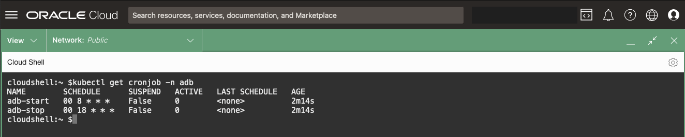
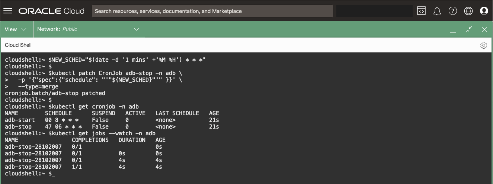

# Lifecycle Operations - Oracle Autonomous Database (ADB)

## Introduction

In this lab, you use the **OraOperator** to perform Lifecycle operations against an Oracle Autonomous Database (ADB).

In order to manage the **AutonomousDatabase** type, the **OraOperator** has *Custom Controllers* to manage the  **AutonomousDatabase** type within the Kubernetes cluster. These *controllers* act as "built-in Standard Operating Procedures" specifically designed for handling the **AutonomousDatabase** resource type.

The actions that the **OraOperator** support for the AutonomousDatabase resource type includes:

* Create an Autonomous Database
* Manage ADMIN database user password
* Download instance credentials (wallets)
* Scale the CPU or storage
* Rename an Autonomous Database
* Stop/Start/Terminate an Autonomous Database
* Delete the resource from the Kubernetes cluster

*Estimated Time:* 15 minutes

[Lab 9](videohub:1_2me0ogqv)


### Objectives

* Perform Lifecycle Operations on an ADB using the **OraOperator**

### Prerequisites

This lab assumes you have:

* [Generated a Kubeconfig File](?lab=access-cluster)
* A [Running and Healthy OraOperator](?lab=deploy-oraoperator)
* The [OraOperator bound to an ADB](?lab=bind-adb)

## Task 1: Database Connectivity

In the [Bind to an ADB](?lab=bind-adb) Lab, you redefined the `adb-existing` resource to include its mTLS Wallet.  The **OraOperator** created a new *Secret* called `adb-tns-admin` with the wallets contents.

1. Extract the `adb-tns-admin` Secret:

    ```bash
    <copy>
    export ORACLE_HOME=$(pwd)
    export TNS_ADMIN=$ORACLE_HOME/network/admin
    mkdir -p $ORACLE_HOME/network/admin

    # Extract the tnsnames.ora secret
    kubectl get secret/adb-tns-admin \
      --template="{{ index .data \"tnsnames.ora\" | base64decode }}" > $ORACLE_HOME/network/admin/tnsnames.ora

    # Extract the sqlnet.ora secret
    kubectl get secret/adb-tns-admin \
      --template="{{ index .data \"sqlnet.ora\" | base64decode }}" > $ORACLE_HOME/network/admin/sqlnet.ora

    # Extract the Wallet for mTLS
    kubectl get secret/adb-tns-admin \
      --template="{{ index .data \"cwallet.sso\" | base64decode }}" > $ORACLE_HOME/network/admin/cwallet.sso
    </copy>
    ```

2. Feel free to examine the contents of the files created by extracting *Secret* data:

    ```bash
    <copy>
    cat $ORACLE_HOME/network/admin/tnsnames.ora
    </copy>
    ```

3. Retrieve the `adb-admin-password` *Secret* value and save to an environment variable:

    ```bash
    <copy>
    ADB_PWD=$(kubectl get secrets/adb-admin-password --template="{{index .data \"adb-admin-password\" | base64decode}}")
    </copy>
    ```

4. Retrieve the `SERVICE_NAME` from the ADB resource and save to an environment variable:

    ```bash
    <copy>
    SERVICE_NAME=$(kubectl get adb -o json | jq -r .items[0].spec.details.dbName)_TP
    </copy>
    ```

5. Connect to the ADB via SQL*Plus:

    ```bash
    <copy>
    sqlplus admin/$ADB_PWD@$SERVICE_NAME
    </copy>
    ```

    You should get the all familiar `SQL>` prompt.  `EXIT` when ready.

Everything you needed to make a connection to the ADB could be obtained from Kubernetes.  Applications in Kubernetes using the ADB as a backend data store will be able to do the same.

## Task 2: Scale the CPU and Storage - Up

1. **Redefine** the ADB resource to adjust its CPU and Storage.

    While you could modify the *manifest file* used to bind to the ADB and apply it, try a different approach and use the `kubectl patch` functionality to update the **AutonomousDatabase** resource in place.

    The usage of the `--type=merge` is known as a *JSON Merge Patch* and simply specifies what should be different after execution.

    ```bash
    <copy>
    kubectl patch AutonomousDatabase adb-existing \
      -p '{"spec":{"details":{"cpuCoreCount":2,"dataStorageSizeInTBs":2}}}' \
      --type=merge
    </copy>
    ```

    

2. In the OCI Console, Navigate to Oracle Databases -> Autonomous Database and you should see your ADB in a "Scaling In Progress" state, increasing the CPU and Storage.

    

3. You can also watch the ADB Resource scale from Kubernetes.

    You'll already be familiar with the `kubectl get` command; by appending a `-w` you can put `kubectl` into a "Watch" loop:

    ```bash
    <copy>
    kubectl get adb adb-existing -w
    </copy>
    ```

    Press `Ctrl-C` to break the loop

## Task 3: Scale the CPU and Storage - Down

You have now seen how to apply a *manifest file* and use `kubectl patch` to redefine a Kubernetes resource, but you can also edit the resource directly:

1. Edit the resource:

    ```bash
    <copy>
    kubectl edit AutonomousDatabase adb-existing
    </copy>
    ```

    Find the `cpuCoreCount` and `dataStorageSizeInTBs` fields (they should both be set to 2) and change them back to 1:

    In the vi editor:

    1. Move the cursor over the `2` value for cpuCoreCount and type `x`
    2. Type `i` and `<space>` `1`, hit the `esc` key
    3. Repeat steps 1 and 2 for dataStorageSizeInTBs
    4. Type `:wq`

    

2. In the OCI Console, Navigate to Oracle Databases -> Autonomous Database and you should see your ADB in the "Scaling In Progress" state, decreasing the CPU and Storage.

3. Of course you can also watch it from Kubernetes:

    ```bash
    <copy>
    kubectl get adb adb-existing -w
    </copy>
    ```

    Press `Ctrl-C` to break the loop

## Task 4: Role Based Access Controls (RBAC)

Now up to this point you have pretty much been able to do everything in the Kubernetes cluster and you might be wondering about security.  The access you are using from the *kubeconfig* file has given you `SYSDBA` like privileges in the Kubernetes cluster.

> you might be wondering about security

However, in the next Tasks, you will be using an in-built *Service Account* called `default` to stop and start your ADB on a schedule.  The `default` account doesn't have any privileges on your **AutonomousDatabase** resources and so you will need to grant them using the *Role* and *RoleBinding* resources.

1. Verify that you have the necessary *Roles* that will enable you to stop and start an `adb` resource :

    ```bash
    <copy>
    kubectl auth can-i list adb
    kubectl auth can-i get adb
    kubectl auth can-i patch adb
    </copy>
    ```

    You should see a "yes" response for all the above.

2. Verify that the `default Service Account` does not:

    ```bash
    <copy>
    kubectl auth can-i list adb --as system:serviceaccount:default:default
    kubectl auth can-i get adb --as system:serviceaccount:default:default
    kubectl auth can-i patch adb --as system:serviceaccount:default:default
    </copy>
    ```

    You should see a "no" response for all the above.

3. Start a manifest to create a new *Role* called `autonomousdatabases-reader` which has permissions to `get`, `list`, and `patch` an `autonomousdatabases` resource (i.e. `CREATE ROLE autonomousdatabases-reader; GRANT get, list, patch TO autonomousdatabases-reader`):

    ```bash
    <copy>
    cat > adb_rbac.yaml << EOF
    ---
    apiVersion: rbac.authorization.k8s.io/v1
    kind: Role
    metadata:
      name: autonomousdatabases-reader
    rules:
    - apiGroups: ["database.oracle.com"]
      resources: ["autonomousdatabases"]
      verbs: ["get", "list", "patch"]
    EOF
    </copy>
    ```

4. Append to the *manifest file* a *RoleBinding* (i.e. `GRANT ROLE autonomousdatabases-reader TO default;`):

    ```bash
    <copy>
    cat >> adb_rbac.yaml << EOF
    ---
    apiVersion: rbac.authorization.k8s.io/v1
    kind: RoleBinding
    metadata:
      name: autonomousdatabases-reader-binding
    subjects:
    - kind: ServiceAccount
      name: default
    roleRef:
      kind: Role
      name: autonomousdatabases-reader
      apiGroup: rbac.authorization.k8s.io
    EOF
    </copy>
    ```

5. Apply the *Role* and *RoleBinding* resources:

    ```bash
    <copy>
    kubectl apply -f adb_rbac.yaml
    </copy>
    ```

    

6. Verify that the `default Service Account` now has the ability to stop/start the `adb` resource:

    ```bash
    <copy>
    kubectl auth can-i list adb --as system:serviceaccount:default:default
    kubectl auth can-i get adb --as system:serviceaccount:default:default
    kubectl auth can-i patch adb --as system:serviceaccount:default:default
    </copy>
    ```

    You should see a "yes" response for all the above.

## Task 5: Scheduled Stop and Start

You can execute any of the methods you used to scale the ADB to also change the ADBs `lifecycleState` (AVAILABLE or STOPPED) manually.  However, you can also take advantage of another built-in Kubernetes resource, the *CronJob*, to schedule a change to the `lifecycleState`.

This is especially useful for Autonomous Databases as when the database is STOPPED you are not charged for the CPUs.  With the *Role* and *RoleBindings* in-place for the `default Service Account`, create a *CronJob*:

### Schedule a CronJob

1. Create a *manifest file* for two *CronJob* resources to stop the ADB at 1800 everyday and start it at 0800 everyday:

    ```bash
    <copy>
    cat > adb_cron.yaml << EOF
    ---
    apiVersion: batch/v1
    kind: CronJob
    metadata:
      name: adb-stop
    spec:
      schedule: "00 18 * * *"
      concurrencyPolicy: Forbid
      jobTemplate:
        spec:
          ttlSecondsAfterFinished: 86400
          backoffLimit: 2
          activeDeadlineSeconds: 600
          template:
            spec:
              restartPolicy: Never
              containers:
                - name: kubectl
                  image: docker.io/bitnami/kubectl
                  command:
                    - 'kubectl'
                    - 'patch'
                    - 'adb'
                    - 'adb-existing'
                    - '-p'
                    - '{"spec":{"details":{"lifecycleState":"STOPPED"}}}'
                    - '--type=merge'
    ---
    apiVersion: batch/v1
    kind: CronJob
    metadata:
      name: adb-start
    spec:
      schedule: "00 8 * * *"
      concurrencyPolicy: Forbid
      jobTemplate:
        spec:
          ttlSecondsAfterFinished: 86400
          backoffLimit: 2
          activeDeadlineSeconds: 600
          template:
            spec:
              restartPolicy: Never
              containers:
                - name: kubectl
                  image: docker.io/bitnami/kubectl
                  command:
                    - 'kubectl'
                    - 'patch'
                    - 'adb'
                    - 'adb-existing'
                    - '-p'
                    - '{"spec":{"details":{"lifecycleState":"AVAILABLE"}}}'
                    - '--type=merge'
    EOF
    </copy>
    ```

    The *CronJob* is using the same `patch` method you used to scale the CPU and Storage up.

2. Apply the manifest:

    ```bash
    <copy>
    kubectl apply -f adb_cron.yaml
    </copy>
    ```

    

3. Take a quick look at the *CronJobs*:

    ```bash
    <copy>
    kubectl get cronjob
    </copy>
    ```

    

4. Reschedule the `adb-stop` *CronJob* to run 1 minute from now and verify the update:

    ```bash
    <copy>
    NEW_SCHED="$(date -d '1 mins' +'%M %H') * * *"

    kubectl patch CronJob adb-stop \
      -p '{"spec":{"schedule": "'"${NEW_SCHED}"'" }}' \
      --type=merge

    kubectl get cronjob
    </copy>
    ```

5. Watch the *CronJobs*.

    If you scheduled the job to run 1 minute from now, wait for that 1 minute to elapse.

    ```bash
    <copy>
    kubectl get jobs -w
    </copy>
    ```

    After 1 minute:

    

    In the OCI Console, Navigate to Oracle Databases -> Autonomous Database and you should see your ADB in a "Stopping" state.

    

    You can also check the logs of the job by replacing `<job_name>` in the following command:

    `kubectl logs job/<job_name>`

6. Delete the CronJob

    ```bash
    <copy>
    kubectl delete -f adb_cron.yaml
    </copy>
    ```

7. Start your ADB for future Labs:

    ```bash
    <copy>
    kubectl patch adb adb-existing -p '{"spec":{"details":{"lifecycleState":"AVAILABLE"}}}' --type=merge
    </copy>
    ```

You may now **proceed to the next lab**

## Learn More

* [Oracle Autonomous Database](https://www.oracle.com/uk/autonomous-database/)
* [Kubernetes CronJobs](https://kubernetes.io/docs/concepts/workloads/controllers/cron-jobs/)

## Acknowledgements

* **Authors** - [](var:authors)
* **Contributors** - [](var:contributors)
* **Last Updated By/Date** - John Lathouwers, July 2023
