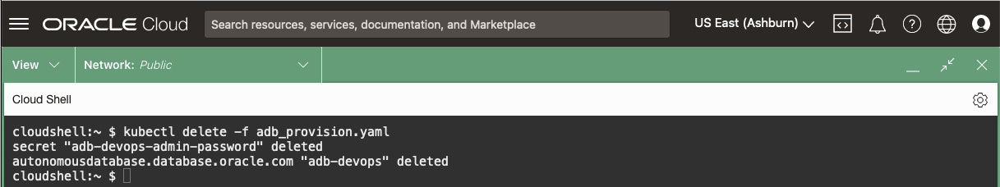

# Provision - Oracle Autonomous Database (ADB)

## Introduction

In this lab, you use the **OraOperator** to Provision and Terminate an Oracle Autonomous Database (ADB).  This process is invaluable for DevOps Testing operations where you require a short-lived Oracle Database.

*Estimated Time:* 5 minutes

[Lab 10](videohub:1_kxpskcle)


### Objectives

* Provision an ADB
* Terminate an ADB

### Prerequisites

This lab assumes you have:

* [Generated a Kubeconfig File](?lab=access-cluster)
* A [Running and Healthy OraOperator](?lab=deploy-oraoperator)

## Task 1: Create Manifest for new ADB

Use the **OraOperator** to provision a new ADB by creating a *manifest file* that will:

* Define a Secret to hold the ADMIN password
* Provision a new ADB

1. Retrieve the [](var:oci_compartment) Compartment OCID

    ```bash
    <copy>
    COMPARTMENT_OCID=$(oci iam compartment list \
        --name [](var:oci_compartment) | jq -r '.data[].id')

    echo "Compartment OCID: $COMPARTMENT_OCID"
    </copy>
    ```

2. Write a *manifest file* to provision an ADB

    ```bash
    <copy>
    cat > adb_provision.yaml << EOF
    ---
    apiVersion: v1
    kind: Secret
    type: Opaque
    metadata:
      name: adb-devops-admin-password
    stringData:
      adb-devops-admin-password: Th1s_W1ll_N0t_l1v3
    ---
    apiVersion: database.oracle.com/v1alpha1
    kind: AutonomousDatabase
    metadata:
      name: adb-devops
    spec:
      hardLink: true
      details:
        compartmentOCID: $COMPARTMENT_OCID
        dbName: DEVOPSDB
        displayName: DEVOPSDB
        dbVersion: 19c
        dbWorkload: OLTP
        cpuCoreCount: 1
        dataStorageSizeInTBs: 1
        adminPassword:
          k8sSecret:
            name:  adb-devops-admin-password
    EOF
    </copy>
    ```

    The above YAML invokes the Kubernetes "core" built-in `v1` API to define an `Opaque` *Secret* resource called `adb-devops-admin-password` with the value of `Th1s_W1ll_N0t_l1v3`.  As the *Secret* doesn't currently exist, it will be created and Kubernetes will store the base64 encoded value of the password.

    The YAML will also access the **OraOperators**' *Custom Controller* API `database.oracle.com/v1alpha1` to define an `AutonomousDatabase` (custom) resource in the `$COMPARTMENT_OCID` with the self-explanatory properties in the `spec.details` section.

    **Important:** the `spec.hardLink: true` field indicates that if you delete this `AutonomousDatabase` resource from the Kubernetes cluster, also delete the ADB associated with it.

    > Good for DevOps CI/CD... Bad for Production!

    If it were set to `false` then deleting the resource from Kubernetes would *NOT* delete ADB itself.

## Task 2: Apply the new ADB Manifest

1. Define the new ADB database:

    ```bash
    <copy>
    kubectl apply -f adb_provision.yaml
    </copy>
    ```

    

## Task 3: Verify new ADB Provisioning

1. Watch the ADB being provisioned from Kubernetes:

    ```bash
    <copy>
    kubectl get adb adb-devops -w
    </copy>
    ```

    Press `Ctrl-C` to break the loop

2. In the OCI Console, navigate to Oracle Database -> Autonomous Database.

    

    Ensure you are in the K8S4DBAS Compartment and you will see the `DEVOPSDB` being provisioned.

    

## Task 4: Delete the Provisioned ADB

The ADB provisioned by the **OraOperator** is great for DevOps, after which it should be deleted.  The physical ADB will be deleted because you specified a `hardLink` between the Kubernetes resource and the database.  There is no reason to keep its ADMIN secret around, so delete everything in the adb_provision.yaml manifest.

1. Delete the resource, using the *manifest file*:

    ```bash
    <copy>
    kubectl delete -f adb_provision.yaml
    </copy>
    ```

    

    *Note* that you could have also deleted each resource individually by running:

    ```text
    kubectl delete adb adb-devops
    kubectl delete secret adb-devops-admin-password
    ```

## Task 5: Verify ADB Termination

1. In the OCI Console, navigate to Oracle Database -> Autonomous Database.

    

    Ensure you are in the K8S4DBAS Compartment and you will see the `DEVOPSDB` being terminated.

    

You may now **proceed to the next lab**

## Learn More

* [Oracle Autonomous Database](https://www.oracle.com/uk/autonomous-database/)
* [Kubernetes CronJobs](https://kubernetes.io/docs/concepts/workloads/controllers/cron-jobs/)

## Acknowledgements

* **Authors** - [](var:authors)
* **Contributors** - [](var:contributors)
* **Last Updated By/Date** - John Lathouwers, July 2023
