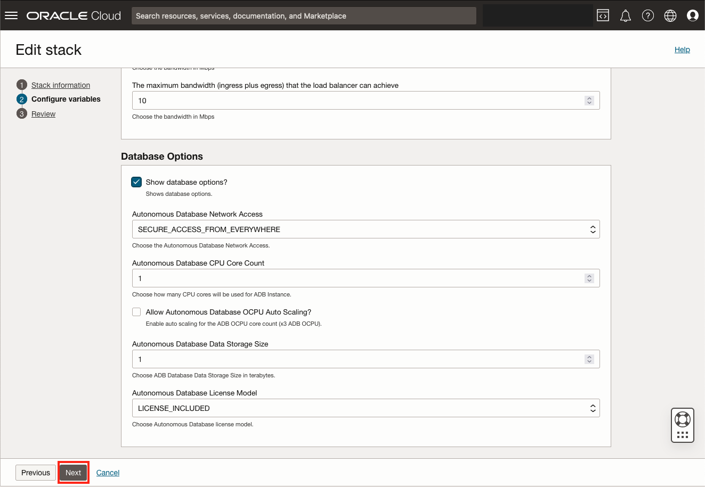

# Provision and Configure the Cloud Infrastructure

"And sure enough, even waiting will end... if you can just wait long enough."
\- William Faulkner

## Introduction

In this lab, we will provision and configure the cloud resources required for the Workshop using *Oracle Resource Manager (ORM)*.  ORM will stand-up the Infrastructure using *Terraform* and perform some basic configuration using *Ansible*.  Don't panic, we'll go over how all this works... while it is working.

*Estimated Lab Time:* 20 minutes

Watch the video below for a quick walk through of the lab.

### Objectives

* Apply the Oracle Resource Manager (ORM) Stack
* Learn about Infrastructure as Code (IaC) and Terraform
* Learn about Configuration Management and Ansible

### Prerequisites

This lab assumes you have:

* An Oracle Cloud User with the policies outlined in [Prepare the OCI Tenancy](../setup-iam/setup-iam.md)

## Task 1: Click the Magic Button

The below "Magic Button" will take you directly to the the Create Stack page in the Oracle Cloud Infrastructure (OCI) Console. The button is linked to the Terraform configuration file package which contains the Infrastructure as Code for this workshop.

### Notes

* If you are not logged into OCI, you will be prompted to login after pushing the button.
* If you are logged into OCI, you will not be prompted to login.  Verify you are in the correct tenancy as the correct user.
* If the  Compartment does not exist, you are either in the wrong tenancy or logged in as the wrong user.

### Press the Magic Button to begin the deployment process

[![Deploy to Oracle Cloud][magic_button]][magic_arch_stack]

## Task 2: Update the Stack Information

1. Tick the "Oracle Terms of Use"
2. Change "Create in compartment" to: ``
3. Click "Next"

## Task 3: Review the Configuration Variables

Using variables in IaC helps improve the maintainability, reusability, and flexibility of your infrastructure code.  It allows you to reuse the same infrastructure definition across different environments and projects.

For example, the IaC in this particular stack is used in two different OCI Marketplace Offerings:

* [Oracle Backend for Spring Boot](https://cloudmarketplace.oracle.com/marketplace/en_US/listing/138899911 "Oracle Backend for Spring Boot")
* [Oracle Backend for Parse Platform](https://cloudmarketplace.oracle.com/marketplace/en_US/listing/139274906 "Oracle Backend for Parse Platform")

but it has been slimmed down, via variables, specifically for this workshop.  This demonstrates how easy it is to modify infrastructure configurations, as needed, without requiring any changes to the underlying code.

### We are not going to change anything on this page and click "Next"

## Task 4: Apply! the Stack

We're ready to deploy the Infrastructure and do some minor Configuration Management.

1. Tick "Run apply"
2. Click "Create"

The Infrastructure deployment and configuration will take approximately **15 minutes**.  Grab a cup of tea and continue to the next tasks to learn about IaC using Terraform and Ansible for Configuration Management using Ansible.

## Task 5: Learn about Infrastructure as Code (IaC) using Terraform

Terraform is a tool for managing infrastructure as code (IaC). IaC is the practice of writing code to describe the infrastructure of your application or service, rather than manually configuring it using a graphical user interface (GUI) or command-line interface (CLI). By defining your infrastructure as code, you can version control your infrastructure configurations, automate deployments, and make your infrastructure more reliable, scalable, and maintainable.

Terraform works by defining your infrastructure using a declarative configuration language. You write code that describes the resources you want to create, such as virtual machines, networks, and storage, and how they should be configured, such as the size, location, and permissions. Terraform then uses this code to create and manage your infrastructure, ensuring that it matches the desired state specified in the configuration.

By using Terraform, you can:

* Manage infrastructure at scale: With Terraform, you can manage thousands of resources across multiple environments with a single, consistent workflow.
* Automate deployments: Terraform allows you to automate the creation, updating, and deletion of infrastructure, making it easier to deploy and manage your applications.
* Increase collaboration: By using a version-controlled infrastructure configuration, you can collaborate more easily with other developers and stakeholders, and track changes over time.

## Task 6: Learn about Configuration Management using Ansible

Ansible is an open-source automation tool used for configuration management, application deployment, and task automation. It is designed to be simple and easy to use, and it uses a declarative language to describe the desired state of a system, allowing users to focus on the "what" instead of the "how".

Ansible works by connecting to nodes (servers, virtual machines, or containers) and running "tasks" on them. Tasks are defined in playbooks, which are YAML files that specify the actions to be taken on each node. Playbooks can contain a series of tasks, and they can also include conditionals, loops, and error handling.

One of the key benefits of Ansible is its agent-less architecture. Unlike other automation tools that require agents to be installed on each node, Ansible uses SSH or WinRM to connect to nodes and run tasks directly on them. This makes it easier to manage and secure the nodes, as there are no additional components that need to be installed.

Ansible also has a feature called "playbooks," which allow you to define a series of tasks to be executed on a set of hosts. Playbooks are written in YAML, making them easy to read and write.

With Ansible, you can also use "roles" to organize your tasks into reusable components. A role is a collection of tasks, templates, files, and variables that can be shared across playbooks. This makes it easy to manage complex configurations and repeatable tasks.

Finally, Ansible has a robust community and ecosystem, with many third-party modules available for common tasks like interacting with cloud providers, databases, and other services.

Overall, Ansible is a powerful tool for automating IT tasks and managing infrastructure as code, and it's relatively easy to get started with even if you have no prior experience with it.

## Task 7: Check the status of the Stack Deployment

## Learn More

* [Oracle Resource Manager (ORM)](https://www.oracle.com/uk/devops/resource-manager/)
* [Using the Deploy to Oracle Cloud Button](https://docs.oracle.com/en-us/iaas/Content/ResourceManager/Tasks/deploybutton.htm)
* [Terraform](https://registry.terraform.io/providers/oracle/oci/latest/docs)
* [Ansible](https://docs.oracle.com/en-us/iaas/Content/API/SDKDocs/ansible.htm)

## Acknowledgements

* **Author** - John Lathouwers, Developer Advocate, Database Development Operations
* **Last Updated By/Date** - John Lathouwers, May 2023

[magic_button]: https://oci-resourcemanager-plugin.plugins.oci.oraclecloud.com/latest/deploy-to-oracle-cloud.svg
[magic_arch_stack]: https://cloud.oracle.com/resourcemanager/stacks/create?zipUrl=https://github.com/oracle/microservices-datadriven/releases/download/23.5.1/hol-k8s4dbas.zip
