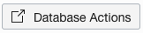
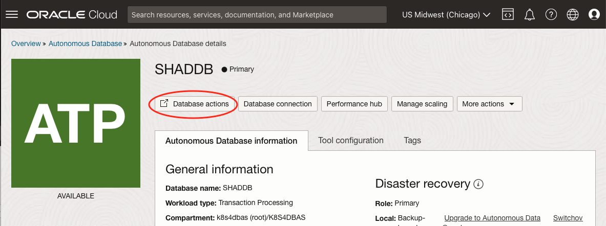
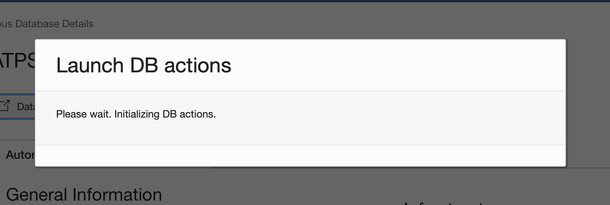
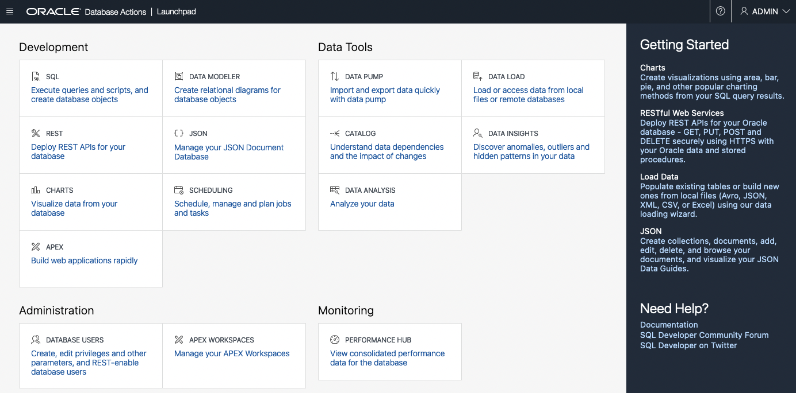
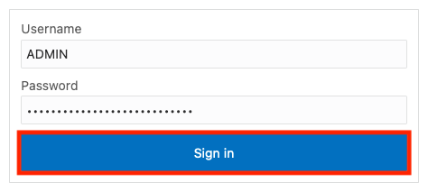
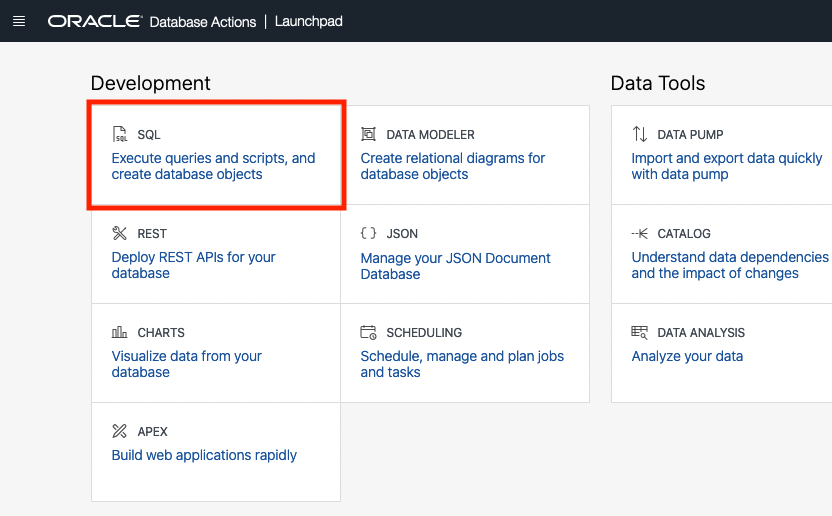
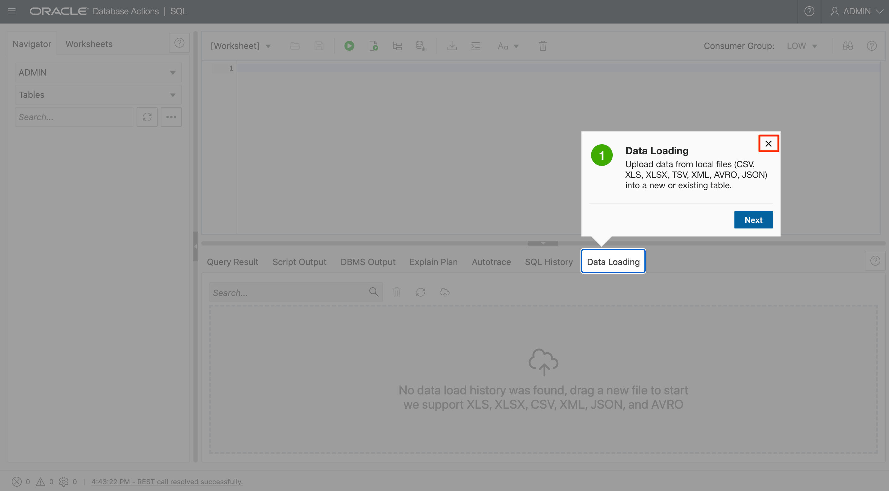

# Connect to Oracle Autonomous Database

## Introduction

This lab walks you through the steps to access the Oracle Autonomous Database instance on Oracle Cloud and connect to your Autonomous database using SQL Developer Web as the Admin user.

Included with Oracle REST Data Services, *Oracle SQL Developer Web* is the web-based version of Oracle SQL Developer that enables you to execute queries and scripts, create database objects, build data models, and monitor database activity.

Oracle SQL Developer Web runs in Oracle REST Data Services, and access to it is provided through schema-based authentication. To use Oracle SQL Developer Web, you must sign in as a database user whose schema has been enabled for SQL Developer Web.

In Oracle Autonomous Database, the ADMIN user is pre-enabled for SQL Developer Web.

Estimated time: 5 minutes

### Objectives

In this lab, you will:

* Connect to your Autonomous Database using the SQL Developer Web

### Prerequisites

This lab assumes you have:

* [Deployed the Workshop Stack](?lab=deploy-stack)

## Task 1: Connect to Your Autonomous Database Using SQL Developer Web

1. The [Deploy Stack](?lab=deploy-stack) has created an Autonomous Database for you.  Click the navigation menu in the upper left to show top-level navigation choices.

    > **Note:** You can also directly access your Autonomous Data Warehouse or Autonomous Transaction Processing service in the **Launch Resources** section of the dashboard.

    

2. Navigate to your Autonomous Database, so click **Oracle Database**, then **Autonomous Transaction Processing**.

    

3. Make sure your Workload Type is **Transaction Processing** or **All** and the Compartment is **** to see your Autonomous Transaction Processing instance.  Use the **List Scope** drop-down menu to select the  compartment.

    

4. From the databases displayed, click the name of your database to navigate to your ADB details page.

5. From the ADB Details page, click **Database Actions**. 

    

6. The **Launch DB actions modal** window will appear. If you have pop-up blockers on, you have to open pop-up windows manually and turn on the radio button to allow access to the [cloud.oracle.com](https://cloud.oracle.com) site to view the Database Actions homepage.

    

7. Wait for the Database Actions Launchpad to open in another tab of the browser. You are automatically signed in as the ADMIN user.

    

8. If you are directed to the *Sign In* page, sign in as the ADMIN user by providing the database instance’s default administrator account credentials, **Username - ADMIN** with the admin password you specified when creating the database. Click **Sign in**.

    

9. From the Database Action menu, select the **SQL** tile.

    

10. SQL Developer Web opens on a worksheet tab. The first time you open SQL Developer Web, a series of pop-up informational boxes introduce the main features.

    

Congratulations! You are now connected to your Autonomous Database using SQL Developer Web.

You may now **proceed to the next lab**.

## Acknowledgements

* **Author** - Troy Anthony, Database Product Management, May 2020
* **Contributors** - Anoosha Pilli, Product Manager; Brian Spendolini; Arabella Yao, Product Manager; John Lathouwers, Developer Advocate
* **Last Updated By/Date** - John Lathouwers, June 2023
