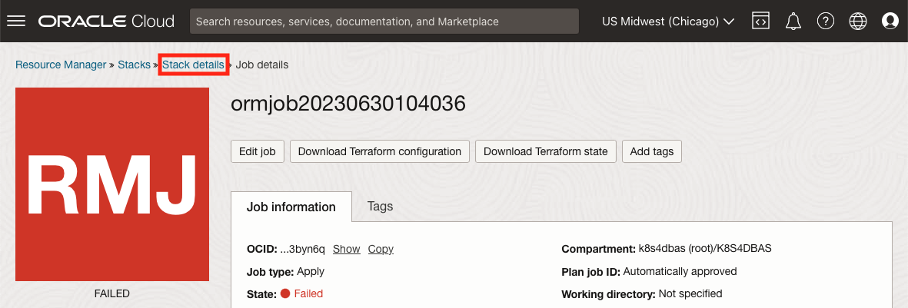
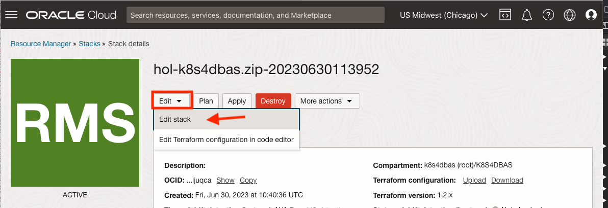
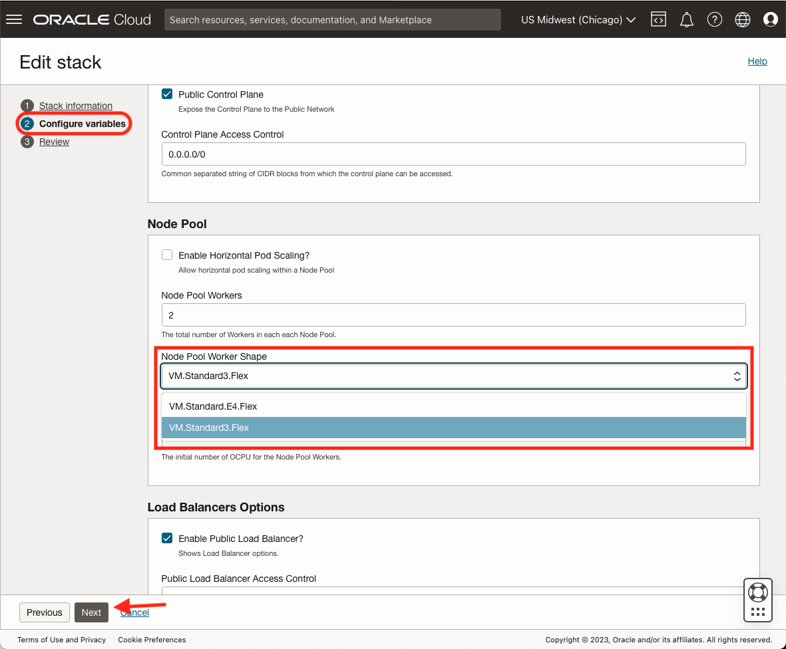
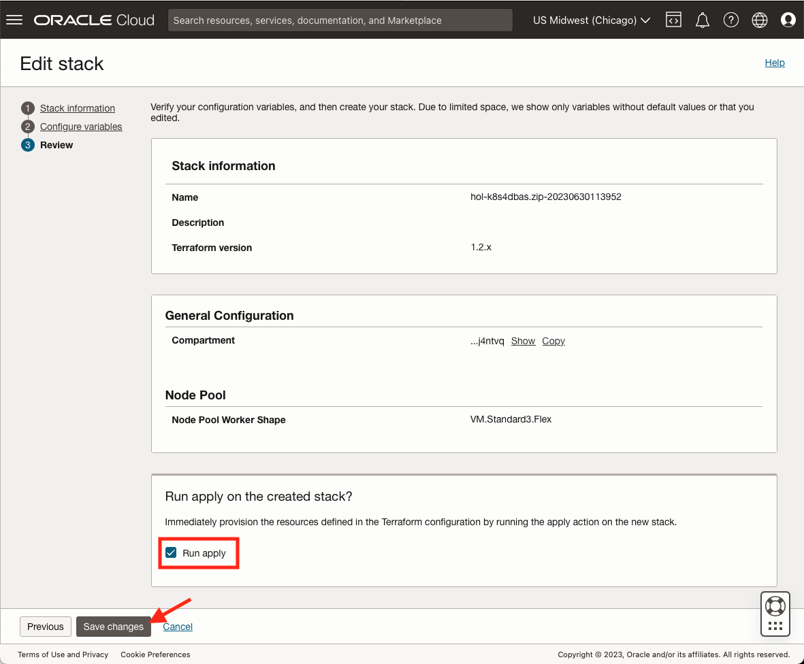

# Troubleshooting

## Introduction

Every effort is made to ensure this Workshop functions in its entirety without any errors.  Unfortunately, variables and the continual evolution of technology will inevitably cause some tasks to fail.  Below are known issues and their resolutions.

## Out of Capacity

When [deploying the Stack](?lab=deploy-stack#Task4:ApplytheStack "Deploy Stack") with the defaults, it may fail due to compute capacity issues.  This can be resolved by changing the shape of the compute instances.

### Task 1: Stack Details

Use the breadcrumb to navigate back to the "Stack Details"

### Task 2: Edit Stack

Select the "Edit" Dropdown and Click "Edit Stack"

### Task 3: Change Worker Pool Shape

On the first screen, "Stack Information", click "Next".  On the "Configure Variables" screen, change the `Node Worker Pool Shape` and click "Next".

### Task 4: Apply the Stack

Ensure the "Run apply" checkbox is ticked and click "Save changes"

## Acknowledgements

* **Authors** - 
* **Contributors** - 
* **Last Updated By/Date** - John Lathouwers, July 2023