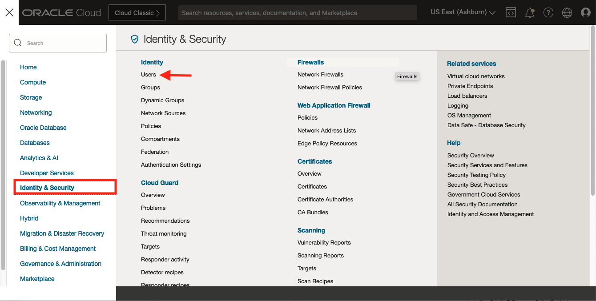
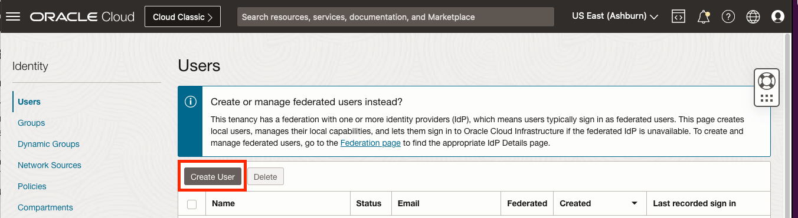

# Troubleshooting

## Introduction

Every effort is made to ensure this Workshop functions in its entirety without any errors.  Unfortunately, variables and the continual evolution of technology will inevitably cause some tasks to fail.  Below are known issues and their resolutions.

## Task 1: IAM User Error

When [preparing the OCI Tenancy](?lab=prepare-oci#Task4:AssignUsertoGroup "Prepare the OCI Tenancy") and assigning your user to the group, it may fail due to your account being in an IDCS Federated identity domain.  This can be resolved by creating a temporary, local OCI user to use for the duration of the Workshop.

1. As an Administrator, navigate to "Identity & Security" and select "Users"

    

2. Click the Create User button

    

3. Select IAM User and create a user called K8S4DBAS with the Description: "Temporary Workshop Account"

    

4. Click the "Create/Reset Password" button and copy/save the generated one time password

    
    

5. Assign the to the user to 

    

6. Log out of OCI and re-login as the new user to continue the rest of the Workshop

The user can be delete after the workshop has been cleaned up.

## Task 2: Out of Capacity

When [deploying the Stack](?lab=deploy-stack#Task4:ApplytheStack "Deploy Stack") with the defaults, it may fail due to compute capacity issues.  This can be resolved by changing the shape of the compute instances.

1. Use the breadcrumb to navigate back to the "Stack Details"

    

2. Select the "Edit" Dropdown and Click "Edit Stack"

    

3. On the first screen, "Stack Information", click "Next".  On the "Configure Variables" screen, change the `Node Worker Pool Shape` and click "Next".

    

4. Apply the Stack

    Ensure the "Run apply" checkbox is ticked and click "Save changes"

    

## Task 3: Unauthorized when running kubectl

The authentication token generated by the Oracle Cloud Infrastructure CLI command in the kubeconfig file are short-lived, cluster-scoped, and specific to individual users. As a result, you cannot share kubeconfig files between users to access Kubernetes clusters.

If you perform this workshop over a number of hours or days, the authentication token could expire resulting in an error:

`error: You must be logged in to the server (Unauthorized)`

To resolve, re-run [Create the Kubeconfig File](?lab=access-cluster#Task1:CreatetheKubeconfigfile).

## Acknowledgements

* **Authors** - 
* **Contributors** - 
* **Last Updated By/Date** - John Lathouwers, July 2023
