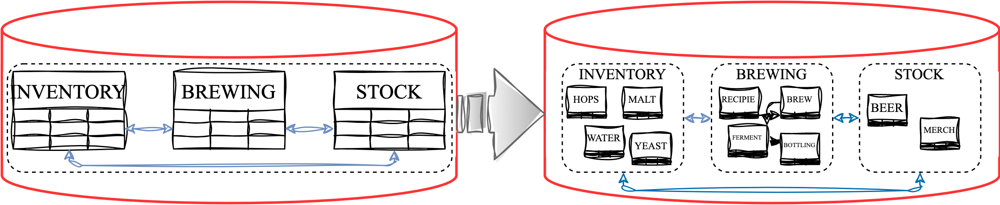
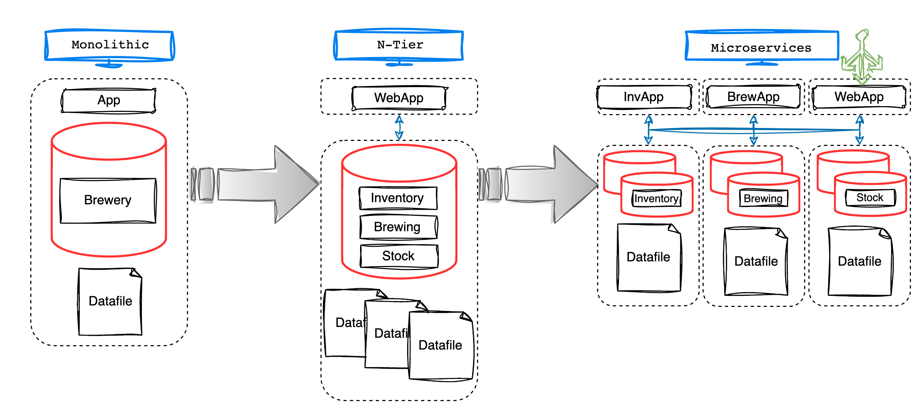

# Understanding Microservices and Kubernetes

## Introduction

It is not uncommon for the Oracle DBA to have little or no exposure to Microservices Architecture or Kubernetes Infrastructure, in fact, the same could be said for Microservice Developers and the Oracle Database.

This is an unfortunate situation, for both the DBA and Developer, which often results in the Oracle Database being overlooked as a viable data store solution for Microservice projects.

>often results in the Oracle Database being overlooked as a viable data store solution for Microservice projects

However, this couldn't be further from the truth.  Not only is the Oracle Database a suitable data store solution for Microservice projects, it could also be the 

when move from a traditional Monolithic 

You may not have had the exposure due to specialised databases being used instead
New SOPs have had to be implemented
Unnecessary when Oracle can handle it all

The emergence of Microservice architecture

In recent years, you may have noticed the trend of Microservices emerging in the world of software development.  Monolithic applications are being broken down into smaller, independent services that can be developed, deployed, and scaled individually.  With this architectural shift, there has been a proliferation of "specialised" databases being introduced into estates to support new Microservice projects.

> there has been a proliferation of "specialised" databases being introduced into estates

As an Oracle DBA, 

and the Oracle Database is often overlooked as a feasible data store for Microservices.

Organisations are adopting the Microservices Architecture and Kubernetes

With the increasing adoption of Microservices Architecture and Kubernetes Infrastructure, there has been a proliferation of "specialised" databases catering to these implementations.  Regrettably, the Oracle Database often goes unnoticed when it comes to considering these architecture and infrastructure solutions, but not for good reason.

> the Oracle Database often goes unnoticed when it comes to considering these architecture and infrastructure solutions

As more companies adopt Microservices Architecture and Kubernetes Infrastructure, there has been a  of "specialised" databases entering the market to support these implementations.  Unfortunately the Oracle Database can be overlooked for these architecture and infrastructure solutions.

As an Oracle DBA, you may have noticed the introduction of several different, "specialised" databases being deployed into your estate to support Microservice Applications running in Kubernetes Clusters.  

This often occurs because the Oracle Database is overlooked as a viable persistent storage solution for these architecture and infrastructure solutions, resulting in a lack of exposure for the Oracle DBA.

> Often, the Oracle Database is overlooked... for these architecture and infrastructure solutions

In this lab, you can explore the fundamental aspects of the Microservices Architecture and Kubernetes Infrastructure, learn how to 

This will empower you, the Oracle DBA, to not only gain proficiency in these solutions but also to advocate for the Oracle Database as the optimal database storage solution.

If you are already familiar and comfortable with these concepts/technology, please feel free to move onto [Get Started](https://oracle-livelabs.github.io/common/labs/cloud-login/cloud-login.md) for the hands-on portion of the Workshop.

*Estimated Lab Time:* 10 minutes

### Objectives

* Understand the Microservices Architecture
* Understand the Kubernetes Infrastructure

## Task 1: What are Microservices?

By definintion, Microservices 

Imagine yourself in the role of an Oracle DBA for a new micro-brewery, "Query Brews".  It is a small-scale operation featuring a single standout beer known as the "Drop Cascade IPA," but your responsibilities as the Oracle DBA will be significant. You have been entrusted with designing and supporting the database that will:

* Record ingredient inventory.
* Manage the brewing process.
* Track the available stock for sale.

Given the size and sole beer offering, you choose a straightforward and efficient approach by implementing a single schema design, enabling **seamless data access** and **streamlined querying** with **minimal complexity**.  Each application has different data type requirements, but fortunately Oracle can handle them all, eliminating the need to support multiple special-purpose database technologies.

### *Local Legends* - Containers

After a highly successful year, a range of fresh new beers, such as the "SQL Saison" and "OLAP Porter," were meticulously crafted to expand the brewery's offerings.  However, these additions required modifications to the current single schema objects.

It became apparent that modifying the single schema was challenging, **prone to errors**, and **disruptive** to the different operations the database supported.  In response, you made the strategic decision to segregate the inventory, brewing, and stock objects into dedicated schemas, ensuring **greater organisation** while **minimising potential disruptions** between the different operations during change operations.

In a sense, you can say that you **Containerised** the schemas based on their operational functionality.  It took a bit of work to get there though, you had to:

* Identify all object inter-dependencies required for each function to operate correctly.
* Establish new Roles and Privileges for cross-schema access.
* Build new Stored Procedures and Packages (APIs) to abstract underlying schema design changes.

However, as a result, you now have:

* **Enhanced Security** allowing for separation between the brewery's operations.
* **Isolation** to develop individual brewery operation functionality without impacting the others.
* **Portability** of each schema using tools such datapump and transportable tablespaces.

### *National Icons* - Microservices

Query Brews has evolved into a national success with "Relational Red Ale" being voted the Countries Favourite!  Ingredients are being shipped in by the truck-load, brews are being produced round-the-clock, and the online store is getting tens-of-thousands hits per day.  Unfortunately the database is struggling to perform during the customers "weekend preparations", which is having a negative impact on the other brewery operations.  It has also been a real struggle to co-ordinate database patches, upgrades, and outages with the different business units.

Building on the benefits of the "containerised" schemas, you decide to take action and break the infrastructure up.   Each brewery function is allocated its own Real Application Cluster (RAC) database, ensuring:

* **Improved Fault Tolerance and Resilience** both at the Application and Database layer by using High Availability Solutions, such as RAC.
* **Improved Scalability** by allowing different parts of the system to scale based on its specific needs.
* **Team Autonomy** each brewery unit can make independent decisions without impacting the entire system.
* **Ease of Maintenance** by breaking the system down into smaller parts, the brewery's IT implementation is easier to understand, develop, test, and maintain.

With this infrastructure re-organisation, you've naturally embraced the [**Microservices**](https://developer.oracle.com/technologies/microservices.html) architecture.  There have been challenges you had to overcome, including:

* Handling distributed transactions across the different databases.
* Messaging between the databases using [Transactional Event Queues (TxEventQ)](https://www.oracle.com/database/advanced-queuing/)

However, with careful planning and taking advantage of the Oracle database features, utilising the Oracle Database in a Microservices Architecture has been an overwhelming success.

## Task 2: What is Kubernetes?

As the Query Brew's reputation soars, a number of short-comings in the infrastructure has come to the surface.  The current infrastructure, which has significantly increased, has led to certain applications having **unused resources** while others are **overwhelmed** at different times of the day.  **Monitoring** the environment to get a holistic view of all operations, from the application to the database, is complex and requires a number of tools that necessitates integration and maintenance.  Additionally, **obtaining consensus for modifications** to the applications and **coordinating maintenance tasks** with the database has proved to be an insurmountable challenge.  These tasks need to be carefully **orchestrated** to prevent any service disruptions or outages.

This is where *Kubernetes* can help... Kubernetes plays a crucial role by acting as an intelligent overseer for your Microservices, it:

* Allows you to easily scale your applications based on demand.
* Provides extensive capabilities for monitoring, alerting, visualisation, and log analysis.
* Automatically handles application failures.
* Simplifies deployment and updates of applications whether on-premises or in the Cloud.

Let's take a closer look at some of these points:

### Resource Optimisation and Scalability

Beer production stops on Wednesdays and Thursdays, giving the brewers a well needed break, with the focus shifting to online sales and stock.  This switch has a direct impact on the infrastructure as there is, understandably, a massive spike in the online web application and stock database on "weekend preparation" days.  Instead of over-allocating resources to handle peaks, Kubernetes can be used re-allocate resources and scale the applications up or down when needed.

With Kubernetes, you can efficiently allocate and manage resources. It intelligently schedules and balances services across the cluster, maximising resource utilisation and performance.  It also provides built-in scaling features.  Kubernetes allows you to easily increase or decrease the resources of your application based on demand, ensuring optimal resource utilisation and responsiveness.

### Observability

As the infrastructure spread out to enable isolation, visibility and insights into the performance, health, and behaviour of the applications and their databases became more difficult obtain.  Collating and centralising logging, metric, and health information to detect and resolve issues promptly, optimise resource utilisation, and ensure the overall health and availability of your system was a full-time job.

Kubernetes provides a solid foundation for observability by offering native support for logging, metrics, health checks, and resource monitoring. It also fosters an ecosystem of observability tools, such as Prometheus and Grafana, and integrations that further enhance the monitoring and troubleshooting capabilities of Kubernetes environments.

### High Availability

A lot of infrastructure was put into place to ensure High Availability at Query Brews.  Each microservices has a number of application and database servers dedicated to them should node failures occur.  Unfortunately, due to their hardware isolation, just like with the resources, none of them can take advantage of the others hardware should multiple failures occur.

Kubernetes provides built-in mechanisms for high availability. It automatically restarts failed containers or reschedules them on other healthy nodes, minimising downtime and ensuring uninterrupted service availability while still maintaining isolation.  Combined this with the Resource Optimisation and Scalability features, the existing hardware can be consolidated.

### Hybrid or Multi-Cloud Deployments

As Query Brews continues to experience success, it may become more cost-effective for them to consider transitioning some of their services to the cloud instead of investing in additional hardware and expanding the data centre.

Kubernetes supports hybrid or multi-cloud deployments. It provides portability and flexibility, allowing consistent management of applications across different environments, whether on-premises or across multiple cloud providers... Run the applications in the Cloud with the database on-premises, the options are endless.

## Task 3: Kubernetes Infrastructure

At the heart of Kubernetes (K8s) is the cluster, it forms the core infrastructure where the Microservices are deployed, managed, and monitored.  Understanding the infrastructure and components of the Kubernetes (K8s) cluster is essential for providing the best Oracle database support to the Microservices running within it, which may include the Oracle database itself.

### *Worldwide Trailblazers* - Kubernetes Cluster

Even though you may have never been exposed to Kubernetes, as an experienced Oracle DBA with knowledge of Oracle Real Application Clusters (**RAC**), you can leverage your familiarity RAC and Grid Infrastructure to comprehend the Kubernetes infrastructure.  As Query Brews begins its transition to the Kubernetes environment, you embark on a journey to grasp the essential components of a Kubernetes cluster.

Lets see how Kubernetes (**K8s**) Compares to an Oracle RAC running on Grid Infrastructure (**GI**).

### *User Interface* - Kubectl and SRVCTL

When managing a RAC Cluster, such as creating, starting, stopping, or deleting cluster resources, your go-to CLI tool is SRVCTL (or CRSCTL if you're feeling brave).  A similar CLI tool is used for managing a K8s cluster, kubectl.

Kubectl allows you to interact with the K8s API server and perform various operations such as deploying applications, managing pods, services, and scaling resources.  It operates at the container and cluster level, allowing management of pods, deployments, services, replica sets, and other Kubernetes-specific resources.

You will be using Kubectl throughout the workshop to interact with the K8s Cluster.

### *Control Plane*

Similar to the Clusterware stack in Oracle GI, the *Control Plane* in K8s plays a crucial role as the central point in managing and controlling cluster operations.  Both the GI Clusterware Stack and the K8s *Control Plane* are composed of multiple components that work together to provide essential services and functionalities such as high availability, scalability, and extensibility.

The K8s *Control Plane* consists of the following components:

* **API Server:** The API server exposes the Kubernetes API, which allows users, via kubectl, and other components to interact with the cluster.  It handles API requests, authentication, and authorisation.
* **Scheduler:** The scheduler assigns pods to available nodes based on resource requirements, constraints, and other policies.
* **Controller Manager:** The controller manager runs various controllers that handle cluster-wide functions such as node management, pod replication, and service discovery.
* **etcd:** etcd is a distributed key-value store used by Kubernetes to store cluster configuration data, including the state of the cluster, configuration settings, and metadata.

### *etcd* and OCR

Oracle Cluster Registry (OCR) and etcd are both distributed key-value stores which maintain cluster state and configuration in their respective systems.

OCR stores cluster configuration information, resource dependencies, and policies in a distributed manner.  It ensures consistency and synchronisation of cluster state across multiple nodes.

Similarly, etcd stores critical cluster information, including configuration data, service discovery, and coordination among cluster nodes.  etcd provides a reliable and distributed data store that allows consistent data access and coordination among the nodes in the cluster.

Just as in GI and the OCR, it is highly recommended to regularly backup the etcd data.

### *API Server* and CSSD

Both the Oracle Cluster Synchronisation Services Daemon (CSSD) and Kubernetes API Server provide an interface for managing and controlling cluster operations, handle coordination among cluster nodes, and facilitate communication between various components in the cluster.

The Kubernetes API Server accepts API requests from users, administrators, and other components, processing and executing them to manage the cluster's state and resources.  Similarly, the Oracle CSSD in Oracle Clusterware handles cluster synchronisation, coordinates actions among cluster nodes, and ensures consistent communication and control throughout the cluster.

### *Nodes* - Worker and RAC

A worker node is one of the key components that make up a Kubernetes cluster.  A worker node, just like a RAC node, is a physical or virtual machine.  It runs the containerised workloads orchestrated by Kubernetes similarly to a RAC node running a database instance.  Worker Nodes consists of several key components, including the container runtime (such as Docker), kubelet, and optional features like the kube-proxy.

The worker node is responsible for executing and managing containers, as well as communicating with the control plane components of Kubernetes.

### *Kubelet* and CRSD

The Kubelet and the Cluster Ready Services Daemon (CRSD) operate at the node level and are responsible for managing and controlling resources on individual cluster nodes.  They both have built-in monitoring capabilities to detect failures and ensure the cluster, as well as its resources, remain highly available.

### *Kube-Proxy*, *Services* and Listeners

Kube-Proxy and Services provide the network abstraction and stable endpoints for accessing Microservices in a K8s cluster.  Kube-Proxy operates at the Node Level, just as Local Listeners do, while Services operate at the "Namespace" level and are similar to the SCAN Listener.  They all contribute to achieving high availability, load balancing, and routing.

### *Namespaces*

One distinct advantage to a K8s cluster that is not available in Grid Infrastructure clusters is the Namespace.  A Namespace is virtual clusters within the physical cluster and is used to create logical partitions and separate resources. They provide isolation, resource allocation, and security boundaries for applications running in the cluster.

Consider when having to consolidate multiple databases onto the same cluster.  Isolation is difficult to achieve.  Sure you can implement strategies, such as instance caging, to address resource limits, but physical access to the database host brings challenges, especially with security boundaries and administrators.  Namespaces address these challenges in a K8s cluster and in the case of a database, you could have the Inventory, Brewing, and Stock databases all running in the same physical cluster, in separate Namespaces to provide complete operational separation.

### *Containers and Pods*

Containerisation involves encapsulating an application, along with its dependencies and runtime environment, into a self-contained unit that can be executed consistently across different computing environments.

Let's consider a RAC node as an illustration for a container. Envision the ability to bundle the OS, GI, ORACLE_HOMEs, TNS_ADMIN, along with all the necessary patches into a single, installable package.  You would then be able to effortlessly deploy it to either expand an existing cluster or establish a new one.  The time, effort, and potential for errors that could be eliminated would be substantial.

A pod can be thought of as a logical host for containers, where each container within the pod shares the same IP address and port space. Containers within the same pod can communicate with each other using localhost, making it easier to build and manage interconnected applications.

A Pod would be the equivalent of a "shared database server", where multiple databases, independent of each other run on the same host.

## Task 4: Summarise

Initially, when Query Brews began with its single beer offering, both the business and its supporting IT infrastructure were straightforward and manageable. At that point, adopting a Microservices Architecture and Kubernetes Infrastructure would have been excessive and unnecessary. However, as the business expanded, it became evident that adjustments were necessary to enable IT to scale alongside it.  Luckily, as an Oracle DBA, you played a crucial role in facilitating a smooth transition for the organisation to the new architecture and infrastructure. The Oracle database served as the central component of the data persistence layer, and your expertise ensured a seamless migration.

Microservices and Kubernetes are powerful tools and architectural approaches that would bring numerous benefits to Query Brews. However, whether they are the right choice depends on various factors and considerations.

Here are some advantages and disadvantages to keep in mind:

### Advantages

* **Flexibility and Agility**: Microservices with Kubernetes promotes flexibility as each service can be developed, deployed, and updated independently.  This allows for faster development cycles and allows for developers to easily adapt to changing requirements.

* **Scalability**: Microservices architecture allows for independent scaling of individual services based on their specific needs.  Kubernetes automates the scaling and distribution of the microservices within the cluster, ensuring efficient resource utilisation and cost efficiency.

* **Fault Isolation**: With microservices, if one service fails or experiences issues, it does not affect the entire system and Kubernetes self-healing/fault tolerance features enables this seamlessly.

* **Team Autonomy**: Microservices architecture and Kubernetes infrastructure enables different teams to work independently on different services.  This autonomy allows teams to choose the most efficient development processes and deployment strategies for their specific service.

* **Continuous Deployment and DevOps**: Microservices are well-suited for continuous deployment and DevOps practices.  Since services can be deployed independently, updates and bug fixes can be rolled out more frequently, enabling faster delivery of new features.  Kubernetes can be used to orchestrate the rollouts.

### Disadvantages

* **Learning Curve**: Adopting microservices requires a shift in mindset and skill set for both development teams and operational teams.  Understanding and implementing the principles and best practices of microservices architecture may involve a learning curve.  Kubernetes, even for those familiar with related technologies, has its own set of tools, concepts, and terminologies that need to be understood.

* **Increased Complexity**: Microservices and Kubernetes introduce additional complexity due to the distributed nature of the architecture.  Managing inter-service communication, data consistency, and service discovery can be challenging.

* **Distributed System Challenges**: Effective communication between services is essential, but it can also introduce challenges such as latency, network failures, and longer response times. Therefore, it becomes imperative to establish resilient and robust communication mechanisms to mitigate these issues.

* **Service Coordination**: In scenarios where multiple services need to work together to accomplish a task, coordinating and managing the flow of data and transactions across services can be complex and require careful design.

## Learn More

* [Oracle Converged Database](https://blogs.oracle.com/database/post/what-is-a-converged-database)
* [Oracle Container Engine for Kubernetes (OKE)](https://www.oracle.com/uk/cloud/cloud-native/container-engine-kubernetes/)
* [Kubernetes](https://kubernetes.io/)

## Acknowledgements

* **Author** - John Lathouwers, Developer Advocate, Database Development Operations
* **Last Updated By/Date** - John Lathouwers, June 2023
