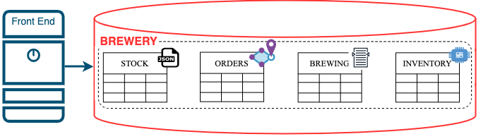
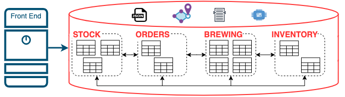
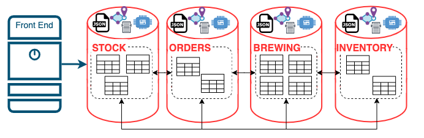
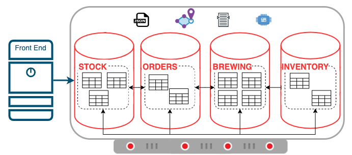

# Understanding Microservices

## Introduction

Many Oracle DBAs may have limited or no formal exposure to Microservices Architecture, but it is highly likely that you have instinctively adopted and implemented microservice concepts in the Oracle Database, even without realising it.

This Lab provides an overview of the Microservices Architecture and does not include any Hands-On Activities.  If you are already familiar and comfortable with Microservice Architecture, please feel free to move onto the next Lab for the hands-on portion of the Workshop.

*Estimated Lab Time:* 2 minutes

### Objectives

* Understand the Microservices Architecture

## Task 1: What are Microservices?

To explore the concepts of the Microservice Architecture, including its benefits and drawbacks, imagine that you are supporting an Oracle Database at a new Micro-Brewery, "Query Brews".  It is a small-scale operation featuring a single standout beer known as the "Drop Cascade IPA".  You'll be working with an application developer, who has limited knowledge of databases, to establish an online store.  

Let's get DBA'ing...

### *Friends and Family* - Monolith

Given the size and sole beer offering, you choose a straightforward and efficient approach by implementing a single schema design, enabling **seamless data access** and **streamlined querying** with **minimal complexity**.  Each application has different data type requirements, but fortunately Oracle can handle them all, eliminating the need to support multiple special-purpose database technologies.

*Monolithic*

### *Local Legends* - Containers

After a highly successful year and a fresh, new range of beers, such as the "SQL Saison" and "OLAP Porter," it became apparent that maintaining the single schema was challenging, **prone to errors**, and **disruptive** to the different operations the database supported.  In response, you made the strategic decision to segregate the stock, orders, and customer objects into dedicated schemas.

This architectural change ensured **greater organisation** while **minimising potential disruptions** between the different operations.

*Containerised*

In a sense, you can say that you **Containerised** the schemas based on their operational functionality.  It took a bit of work to get there though, you had to:

* Identify all object inter-dependencies required for each function to operate correctly.
* Establish new Roles and Privileges for cross-schema access.
* Build new Stored Procedures and Packages (APIs) to abstract underlying schema design changes.

However, as a result, you now have:

* **Enhanced Security** allowing for separation between the brewery's operations.
* **Isolation** allowing for the development individual brewery operation functionality without impacting the others.
* **Portability** of each schema using tools such datapump and transportable tablespaces.

### *National Icons* - Microservices

Query Brews has evolved into a national success with "Relational Red Ale" being voted the Countries Favourite!  The `ORDERS` schema/service is especially busy during the customers "weekend preparations", which is having a negative impact on the other brewery operations.  It has also been a real struggle to co-ordinate database patches, upgrades, and outages with the different business units.

Building on the benefits of the "containerised" schemas, you and your team of DBAs decide to take action and break the infrastructure up.

*Microservices*

Each brewery function is allocated its own database, ensuring:

* **Improved Fault Tolerance and Resilience** as no one operation can impact another - "Noisy Neighbours"
* **Improved Scalability** by allowing different parts of the system to scale based on its specific needs.
* **Team Autonomy** each brewery unit can make independent decisions without impacting the entire system.
* **Ease of Maintenance** by breaking the system down into smaller parts, the brewery's IT implementation is easier to understand, develop, test, and maintain.

With this infrastructure re-organisation, you've naturally embraced the [**Microservices Architecture**](https://developer.oracle.com/technologies/microservices.html).  

There have been challenges you had to overcome, including:

* Handling distributed transactions across the different databases.
* Messaging between the databases using [Transactional Event Queues (TxEventQ)](https://www.oracle.com/database/advanced-queuing/)

However, with careful planning and taking advantage of the Oracle database features, utilising the Oracle Database in a Microservices Architecture has been an overwhelming success.

### *Worldwide Success* - Infrastructure

Business has been bubbling along for Query Brews and they are now recognised as one of the best micro-breweries internationally.  It seems like minutes ago there was one database and one database server and now you are managing multiple databases on multiple servers, all with their own High Availability and Disaster Recovery infrastructure.   Unfortunately, as you've expanded the database estate you also had to over-allocate resources to handle the peaks and troughs of the day-to-day operations.

This appears to be a significant short-coming in the Microservices Architecture and the Brew Master is asking you to rein it in.  Taking a que from your previous successes you've decided to take advantage of Oracle's Pluggable Databases.

*Containerised Pluggable Database*

Maintaining of all the benefits of the Microservices Architecture such as *Isolation*, *Portability*, and *Autonomy*, Pluggable Databases also allows for *Consolidation*, better *Resource Management*, and easier *Maintenance*.  

Using Pluggable Databases is an infrastructure change to complement the Microservices Architecture... which leads you into the Hands-On portion of this Workshop where we explore *Kubernetes Infrastructure*.

But before you do, here's a summary of the key aspects of the Microservices Architecture.

## Task 2: Summary

Microservices is great architectural approach that brought numerous benefits to Query Brews. However, adopting a Microservices Architecture depends on various factors and considerations.

Here are some advantages and considerations to keep in mind:

### Advantages

* **Flexibility and Agility**: Microservices promotes flexibility as each service can be developed, deployed, and updated independently.  This allows for faster development cycles and allows for DBAs and developers to easily adapt to changing requirements.

* **Scalability**: Microservices architecture allows for independent scaling of individual services based on their specific needs.

* **Fault Isolation**: With microservices, if one service fails or experiences issues, it does not affect the entire system.

* **Team Autonomy**: Microservices architecture enables different teams to work independently on different services.  This autonomy allows teams to choose the most efficient development processes and deployment strategies for their specific service.

* **Continuous Deployment and DevOps**: Microservices are well-suited for continuous deployment and DevOps practices.  Since services can be deployed independently, updates and bug fixes can be rolled out more frequently, enabling faster delivery of new features.

### Considerations

* **Learning Curve**: Adopting microservices requires a shift in mindset and skill set for both development teams and operational teams.  Understanding and implementing the principles and best practices of microservices architecture may involve a learning curve.

* **Increased Complexity**: Microservices introduce additional complexity due to the distributed nature of the architecture.  Managing inter-service communication, data consistency, and service discovery can be challenging.

* **Distributed System Challenges**: Effective communication between services is essential, but it can also introduce challenges such as latency, network failures, and longer response times. Therefore, it becomes imperative to establish resilient and robust communication mechanisms to mitigate these issues.

* **Service Coordination**: In scenarios where multiple services need to work together to accomplish a task, coordinating and managing the flow of data and transactions across services can be complex and require careful design.

## Learn More

* [Microservices](https://microservices.io)
* [Oracle Converged Database](https://blogs.oracle.com/database/post/what-is-a-converged-database)

## Acknowledgements

* **Authors** - 
* **Contributors** - 
* **Last Updated By/Date** - John Lathouwers, July 2023
