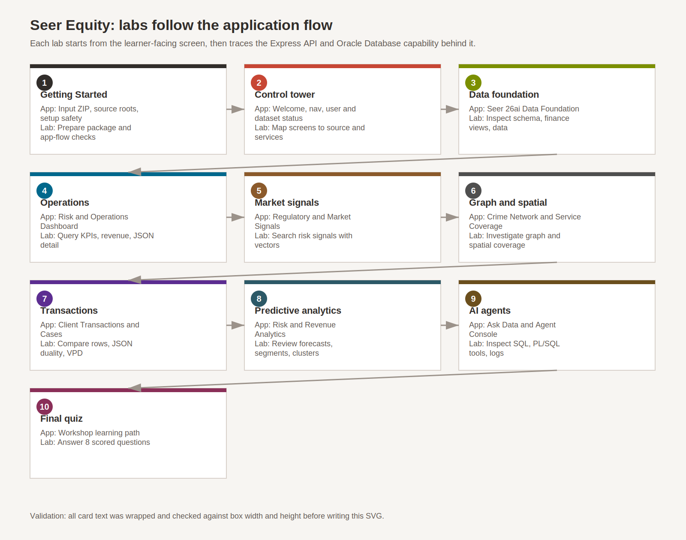

# Seer Equity: Oracle AI Database for Financial Services

## Introduction

Financial services teams need governed access to transactions, risk signals, client coverage, fraud networks, and AI-assisted decisions. This workshop follows the Seer Equity LiveStack from screen flow to API calls and Oracle Database objects.

You will not rebuild the full application. Instead, you will inspect the packaged source and run focused SQL checks that explain how Oracle AI Database 26ai powers the app.

### Prerequisites

- Access to Oracle AI Database 26ai or Oracle Autonomous Database 26ai.
- SQL Worksheet, SQLcl, or another SQL client connected to the workshop schema.
- The supplied Seer Equity LiveStack input package with `database-source/`, `frontend-source/`, `backend-source/`, and `api-map.md`.
- Basic familiarity with SQL, REST APIs, JSON, and web application flow.

### Objectives

In this workshop, you will:

- Map Seer Equity screens to database-backed services.
- Inspect relational, JSON, vector, graph, spatial, security, and AI objects.
- Query finance views, risk signals, transactions, service centers, and agent logs.
- Trace React calls to Express routes and Oracle SQL behavior.
- Identify optional features that depend on database packages, models, or OCI access.

Estimated Workshop Time: 98 minutes

### Workshop labs

The graphic below shows how the lab layout follows the actual Seer Equity application flow.

- Getting Started
- Lab1: Orient to the Seer Equity control tower
- Lab2: Explore the financial services data foundation
- Lab3: Query dashboard and operational intelligence
- Lab4: Search regulatory and market signals
- Lab5: Investigate financial crime networks and service coverage
- Lab6: Inspect transactions as rows and JSON documents
- Lab7: Review predictive risk and revenue analytics
- Lab8: Ask data and automate governed actions
- Lab9: Final Quiz

## Acknowledgements

* **Author** - Oracle LiveLabs
* **Last Updated By/Date** - Oracle LiveLabs, May 2026
