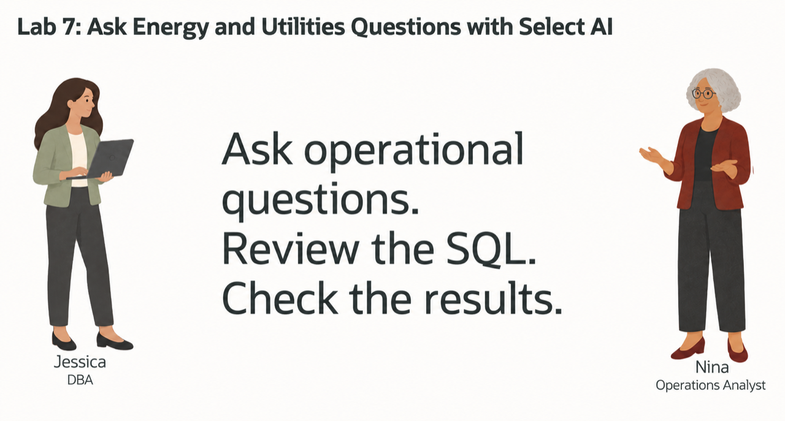
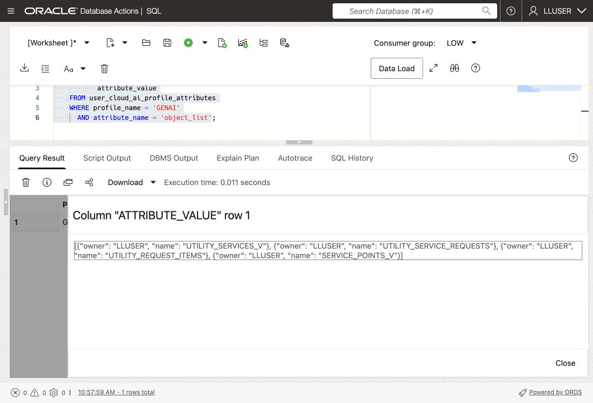
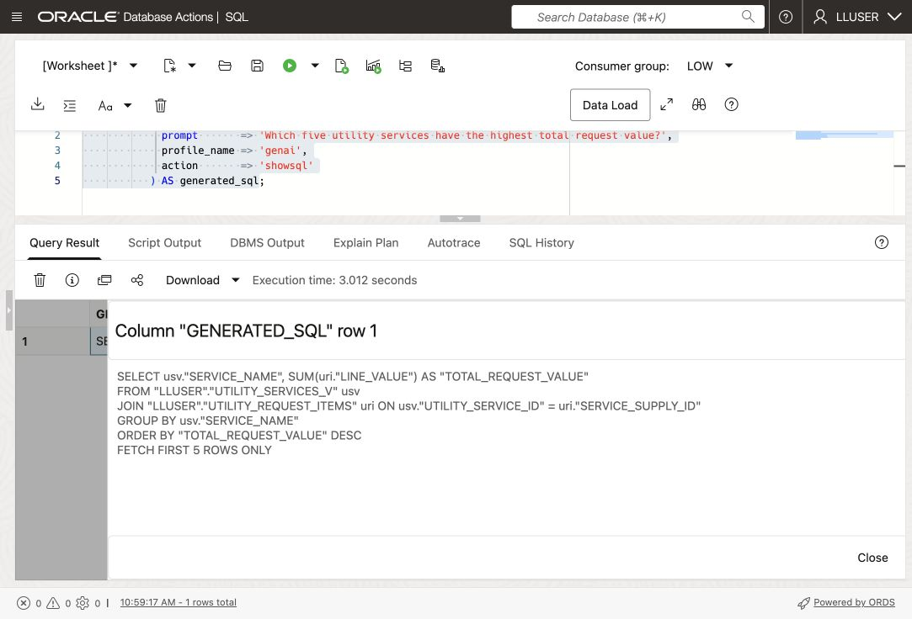
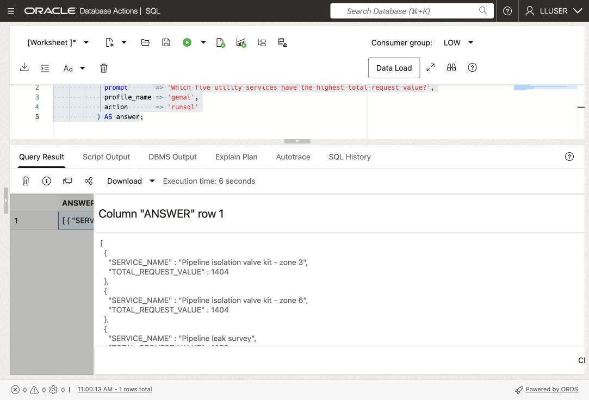
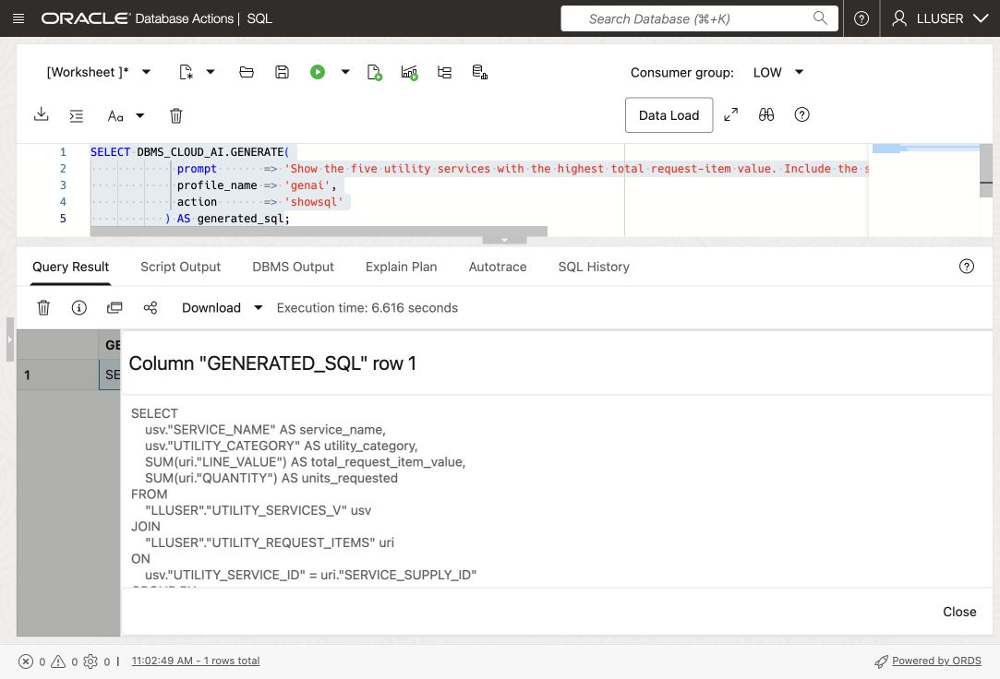
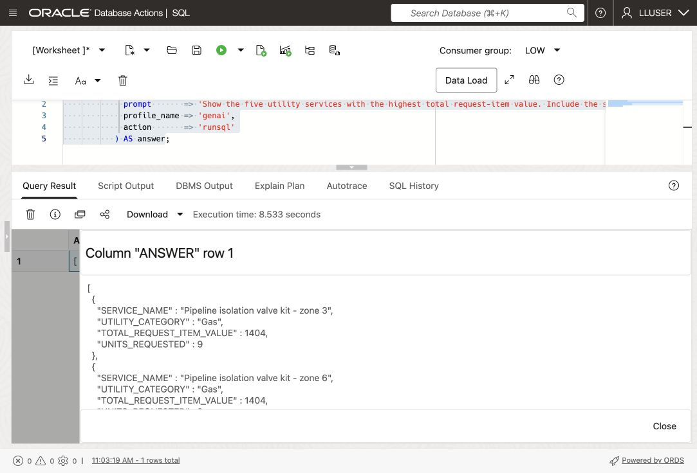
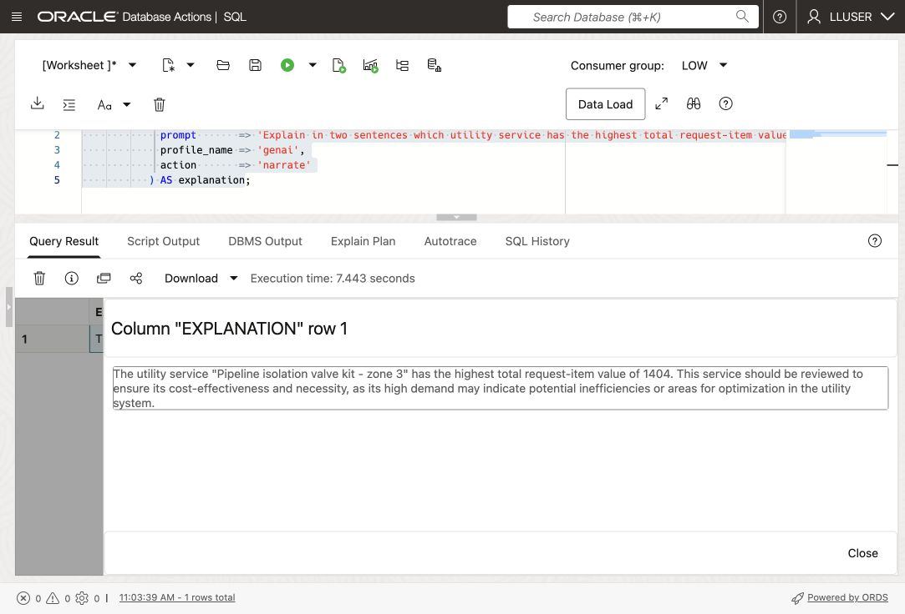

# Ask Energy & Utilities Questions with Select AI

## Introduction

Nina Patel, Seer Utility Network's operations analyst, wants to know which utility services have the highest request value. Jessica has configured a Select AI profile so Nina can ask in ordinary language.

Generate SQL, inspect its tables and calculations, then request the result. Refine the question when the answer lacks the details Nina needs.



<details>
<summary><strong>Key terms: Select AI, AI profile, generated SQL, and natural-language prompt</strong></summary>

> - **Select AI** lets a user work with database information through a natural-language question.
>
> - An **AI profile** connects Select AI to an AI provider and identifies the database objects that may be used for the question.
>
> - **Generated SQL** is the SQL statement created from the question. Nina should inspect it before relying on the result.
>
> - A **natural-language prompt** is the question sent to Select AI, such as `Which five utility services have the highest total request value?`

</details>

### Objectives

- Check which Select AI profile is available in the schema.
- Add the utilities tables that Select AI may use to the profile.
- Generate SQL from an Energy & Utilities question and inspect it.
- Run a natural-language question through `DBMS_CLOUD_AI.GENERATE`.
- Improve a question so the result contains the business details Nina needs.
- Explain why generated SQL still requires review.

Estimated Time: **10 minutes**

> **Video pending:** A Utilities walkthrough for this lesson has not yet been recorded.

> **SQL Worksheet:** [Getting Started: open SQL Worksheet as LLUSER](?lab=getting-started), Task 2.

> **AI setup:** Initialization creates the LLUSER-owned `GENAI` profile and credential. This lab configures its four Utilities views.

## Task 1: Check the Select AI profile

First, confirm that `GENAI` is available in `LLUSER`.

1. Run this query:

    ```sql
    <copy>
    SELECT profile_name,
           status,
           description
    FROM user_cloud_ai_profiles
    ORDER BY profile_name;
    </copy>
    ```

    Confirm that `GENAI` is enabled. If it is missing or disabled, ask the facilitator to resolve setup before continuing.

2. Review the profile attributes:

    ```sql
    <copy>
    SELECT profile_name,
           attribute_name,
           attribute_value
    FROM user_cloud_ai_profile_attributes
    ORDER BY profile_name, attribute_name;
    </copy>
    ```

    The attributes show how the profile is configured and which database objects are available to Select AI. Do not copy credentials. In Task 2, you will change only the profile's `object_list`.

## Task 2: Add the utilities tables to the profile

Add the four views that supply service, request, item, and service-point data.

1. Add the utilities tables to the profile:

    ```sql
    <copy>
    BEGIN
      DBMS_CLOUD_AI.SET_ATTRIBUTE(
        profile_name    => 'genai',
        attribute_name  => 'object_list',
        attribute_value => '[{"owner": "' || USER || '", "name": "UTILITY_SERVICES_V"}, {"owner": "' || USER || '", "name": "UTILITY_SERVICE_REQUESTS"}, {"owner": "' || USER || '", "name": "UTILITY_REQUEST_ITEMS"}, {"owner": "' || USER || '", "name": "SERVICE_POINTS_V"}]'
      );
    END;
    /
    </copy>
    ```

2. Confirm the object list:

    ```sql
    <copy>
    SELECT profile_name,
           attribute_name,
           attribute_value
    FROM user_cloud_ai_profile_attributes
    WHERE profile_name = 'GENAI'
      AND attribute_name = 'object_list';
    </copy>
    ```

    The result should list `UTILITY_SERVICES_V`, `UTILITY_SERVICE_REQUESTS`, `UTILITY_REQUEST_ITEMS`, and `SERVICE_POINTS_V`. Select AI can now use these tables when it translates Nina's questions into SQL.

    

## Task 3: Ask a question and inspect the SQL

Nina starts with a simple question: which utility services have the highest request value? She first asks Select AI to show the SQL without running it.

Database Actions does not support the `SELECT AI` keyword. In SQL Worksheet, use `DBMS_CLOUD_AI.GENERATE` and provide the profile name directly.

1. Run the question with the `GENAI` profile:

    ```sql
    <copy>
    SELECT DBMS_CLOUD_AI.GENERATE(
             prompt       => 'Which five utility services have the highest total request value?',
             profile_name => 'genai',
             action       => 'showsql'
           ) AS generated_sql;
    </copy>
    ```

    

2. Read the generated SQL before running it.

    Check whether the statement uses the expected service and service-request activity, returns five rows, and calculates request value in a sensible way. Select AI can generate a valid-looking statement that does not answer the question precisely, so the generated SQL is part of the result Nina reviews.

## Task 4: Run the question in the database

Nina has reviewed the SQL. She now asks Select AI to run the question and return the database result.

1. Run the same question with the `runsql` action:

    ```sql
    <copy>
    SELECT DBMS_CLOUD_AI.GENERATE(
             prompt       => 'Which five utility services have the highest total request value?',
             profile_name => 'genai',
             action       => 'runsql'
           ) AS answer;
    </copy>
    ```

    

2. Compare the answer with the SQL you inspected in Task 3.

    Check the returned services, row count, and request-value calculation against the question.

    > **Note:** `runsql` generates and runs SQL for the prompt. Do not assume it executes the statement previously returned by `showsql`; compare the result. See the [action reference](https://docs.oracle.com/en-us/iaas/autonomous-database-serverless/doc/dbms-cloud-ai-package.html).

## Task 5: Improve the business question

Nina's first question gives her a service ranking, but she also needs enough detail to decide what to review. She changes the question to request the service category, total request value, and units requested.

1. Use `showsql` to inspect this revised prompt:

    ```sql
    <copy>
    SELECT DBMS_CLOUD_AI.GENERATE(
             prompt       => 'Show the five utility services with the highest total request-item value. Include the service name, utility category, total request-item value, and units requested.',
             profile_name => 'genai',
             action       => 'showsql'
           ) AS generated_sql;
    </copy>
    ```

    

2. Review the generated SQL, then run the revised question with `runsql`:

    ```sql
    <copy>
    SELECT DBMS_CLOUD_AI.GENERATE(
             prompt       => 'Show the five utility services with the highest total request-item value. Include the service name, utility category, total request-item value, and units requested.',
             profile_name => 'genai',
             action       => 'runsql'
           ) AS answer;
    </copy>
    ```

    

3. Compare the first and second questions.

    Check whether the added category and quantity columns make the ranking more useful for Nina's review.

## Task 6: Explain the result

Nina wants a short explanation of the revised result. Select AI can run the SQL and ask the AI provider to describe the returned rows.

1. Run the revised question with the `narrate` action:

    ```sql
    <copy>
    SELECT DBMS_CLOUD_AI.GENERATE(
             prompt       => 'Explain in two sentences which utility service has the highest total request-item value and why it should be reviewed. Use the database result; do not invent an operational cause.',
             profile_name => 'genai',
             action       => 'narrate'
           ) AS explanation;
    </copy>
    ```

    

2. Review the explanation against the SQL result.

    In the captured example, zone 3 and zone 6 tie at 1404, but the narration mentions only zone 3 and speculates about inefficiency. The query does not establish that cause. Identify these unsupported claims before reusing an AI explanation.

    > **Note:** The `narrate` action sends the query result to the AI provider configured in the profile. Use it only for data approved for that provider.

## Conclusion: Ask, Inspect, and Refine

Nina now has a service ranking and a way to check the SQL behind it. Check the AI explanation against the database result.

## Next Steps

For the full list of Select AI actions, profile attributes, and supported providers, see the [Oracle AI Database 26ai Select AI documentation](https://docs.oracle.com/en/database/oracle/oracle-database/26/selai/).

## Acknowledgements

* **Authors** - Matt Kowalik, Kevin Lazarz
* **Contributor** - Eugenio Galiano
* **Last Updated By/Date** - Oracle Database Product Management, October 2026
