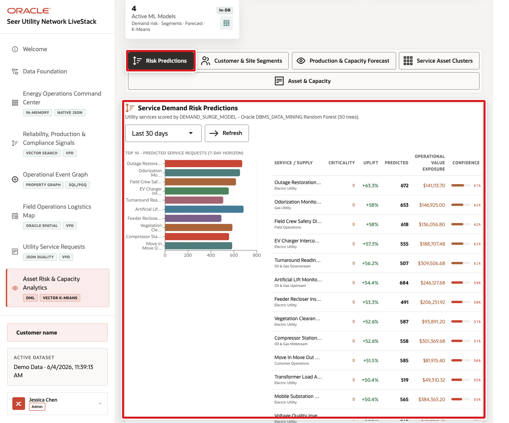

# Build an Asset Risk and Capacity Watchlist with Oracle Machine Learning

## Introduction

Otto Spencer is the data scientist. Field operations wants a short list of utility services that may face a demand surge, together with the sites already showing capacity risk. Oracle Machine Learning trains and scores in the database, close to the operational rows.

Estimated Time: **10 minutes**

### Objectives

- Inspect the demand-surge training view.
- Verify the persisted classification model.
- Combine model probability with site-capacity evidence.

### Hands-on Scenario

Otto reviews the prepared features, checks the deployed model, and builds a human-review queue. A model score prioritizes review; it does not dispatch a crew or purchase supplies automatically.

> **SQL Worksheet reminder:** Return to [Getting Started Task 2](?lab=getting-started#Task2:OpenSQLWorksheet) if you need the launch and execution steps.

## Task 1: Read the training data

1. Run the feature query.

    `DEMAND_CLASS` is the known historical outcome. The loader derives it from historical request urgency. The prepared view supplies service category, value, and request-volume measures as candidate predictors, but it does not supply urgency as a predictor.

    <copy>
    ```sql
    SELECT product_id AS utility_service_id,
           category AS utility_category,
           unit_price AS service_value,
           units_requested,
           request_value,
           demand_class
    FROM eu_oml_demand_surge_training_v
    ORDER BY units_requested DESC, product_id
    FETCH FIRST 15 ROWS ONLY;
    ```
    </copy>

## Task 2: Verify the model

1. Confirm the model is present and enabled.

    <copy>
    ```sql
    SELECT model_name,
           mining_function,
           algorithm
    FROM user_mining_models
    WHERE model_name = 'EU_DEMAND_SURGE_MODEL';
    ```
    </copy>

2. Inspect the model settings that matter for this small deterministic dataset.

    <copy>
    ```sql
    SELECT setting_name,
           setting_value,
           setting_type
    FROM user_mining_model_settings
    WHERE model_name = 'EU_DEMAND_SURGE_MODEL'
      AND setting_name IN (
        'ALGO_NAME',
        'ODMS_DEEPTREE',
        'ODMS_RANDOM_SEED',
        'PREP_AUTO',
        'RFOR_NUM_TREES',
        'TREE_TERM_MINREC_NODE',
        'TREE_TERM_MINREC_SPLIT'
      )
    ORDER BY setting_name;
    ```
    </copy>

    `ODMS_DEEPTREE_ENABLE` adjusts the Oracle Database tree-growth defaults so a Random Forest can split this intentionally small training set. The fixed random seed keeps the workshop build reproducible.

3. Inspect the fitted model signature.

    <copy>
    ```sql
    SELECT attribute_name,
           attribute_type,
           data_type,
           target
    FROM user_mining_model_attributes
    WHERE model_name = 'EU_DEMAND_SURGE_MODEL'
    ORDER BY target DESC, attribute_name;
    ```
    </copy>

    `DEMAND_CLASS` is the target. This fitted model retained `UNIT_PRICE`, `UNITS_REQUESTED`, and `REQUEST_VALUE` as active predictors. Oracle may omit a candidate column during model preparation when it does not contribute to the fitted model.

## Task 3: Evaluate held-out service demand

1. Run the classification query.

    <copy>
    ```sql
    WITH scored_test AS (
      SELECT product_id,
             demand_class,
             PREDICTION(
               EU_DEMAND_SURGE_MODEL
               USING category, unit_price, units_requested, request_value
             ) AS predicted_class,
             PREDICTION_PROBABILITY(
               EU_DEMAND_SURGE_MODEL, 'SURGE'
               USING category, unit_price, units_requested, request_value
             ) AS surge_probability
      FROM eu_oml_demand_surge_test_v
    )
    SELECT x.product_id AS utility_service_id,
           s.service_name AS utility_service_name,
           x.demand_class AS known_class,
           x.predicted_class,
           ROUND(x.surge_probability, 4) AS surge_probability
    FROM scored_test x
    JOIN eu_utility_services_v s
      ON s.utility_service_id = x.product_id
    ORDER BY surge_probability DESC, x.product_id;
    ```
    </copy>

2. Compare `KNOWN_CLASS` with `PREDICTED_CLASS`. These rows were withheld from model training, so the comparison is a small held-out evaluation rather than an in-sample check. Probability is the class-probability estimate produced by the model. It supports prioritization, not certainty, and it is not a calibrated operational-risk probability unless calibration is tested separately.

    **Expected output pattern**

    | Column | Stable check |
    | --- | --- |
    | `KNOWN_CLASS` | The label used to evaluate the model. |
    | `PREDICTED_CLASS` | `SURGE` or `STABLE`. |
    | `SURGE_PROBABILITY` | A value from 0 through 1; exact values can change after retraining. |

3. Summarize the held-out predictions as a confusion matrix with overall accuracy.

    <copy>
    ```sql
    WITH scored_test AS (
      SELECT demand_class AS known_class,
             PREDICTION(
               EU_DEMAND_SURGE_MODEL
               USING category, unit_price, units_requested, request_value
             ) AS predicted_class
      FROM eu_oml_demand_surge_test_v
    ),
    confusion_matrix AS (
      SELECT known_class,
             predicted_class,
             COUNT(*) AS case_count
      FROM scored_test
      GROUP BY known_class, predicted_class
    )
    SELECT known_class,
           predicted_class,
           case_count,
           SUM(case_count) OVER () AS test_cases,
           SUM(
             CASE WHEN known_class = predicted_class THEN case_count ELSE 0 END
           ) OVER () AS correct_predictions,
           ROUND(
             SUM(
               CASE WHEN known_class = predicted_class THEN case_count ELSE 0 END
             ) OVER () / SUM(case_count) OVER (),
             4
           ) AS accuracy
    FROM confusion_matrix
    ORDER BY known_class, predicted_class;
    ```
    </copy>

    Each row is one cell in the confusion matrix. Accuracy is the share of held-out cases whose predicted and known classes match. This six-row synthetic test set demonstrates the evaluation pattern; it is too small to establish production performance.

## Task 4: Apply the model and build the capacity watchlist

1. Join predictions for the six label-free, held-out scoring cases to current capacity evidence. These service cases were excluded from model training.

    <copy>
    ```sql
    WITH scored_unseen AS (
      SELECT product_id AS utility_service_id,
             PREDICTION(
               EU_DEMAND_SURGE_MODEL
               USING category, unit_price, units_requested, request_value
             ) AS predicted_class,
             PREDICTION_PROBABILITY(
               EU_DEMAND_SURGE_MODEL, 'SURGE'
               USING category, unit_price, units_requested, request_value
             ) AS surge_probability
      FROM eu_oml_demand_surge_scoring_v
    )
    SELECT c.utility_service_name,
           c.field_logistics_site_name,
           c.capacity_status,
           c.quantity_on_hand,
           c.quantity_reserved,
           c.reorder_point,
           ROUND(s.surge_probability, 4) AS surge_probability
    FROM scored_unseen s
    JOIN eu_asset_capacity_v c
      ON c.utility_service_id = s.utility_service_id
    WHERE s.predicted_class = 'SURGE'
      AND c.capacity_status IN ('AT_RISK', 'OUT_OF_STOCK')
    ORDER BY s.surge_probability DESC,
             c.quantity_on_hand - c.quantity_reserved,
             c.utility_service_id,
             c.field_logistics_site_id;
    ```
    </copy>

    

> **Checkpoint:** Use the held-out rows in Task 3 to examine errors before changing a threshold. This small synthetic test split demonstrates the workflow; it is not sufficient evidence for production performance. A narrower review queue can miss emerging operational risk.

> **🎯 Interactive challenge:** Add a surge-probability threshold to the watchlist. Compare the row count with the original result and document the recall tradeoff.

<details>
<summary><strong>Challenge answer</strong></summary>

Add the threshold to the outer `WHERE` clause:

    ```sql
    WHERE s.predicted_class = 'SURGE'
      AND c.capacity_status IN ('AT_RISK', 'OUT_OF_STOCK')
      AND s.surge_probability >= 0.55
    ```

Rerun the complete Task 4 query. A higher threshold shortens the queue but can exclude cases that a lower threshold would send for review; compare the held-out results before choosing a production threshold.

</details>

## Conclusion: Put prediction beside business evidence

Otto combined the model score with the service and capacity rows that operations can inspect. Human reviewers retain the final decision.

## Next Steps

Nina asks governed operations questions in ordinary language and inspects the generated SQL.

## Acknowledgements

* **Author** - Oracle Database Product Management
* **Last Updated By/Date** - Oracle Database Product Management, September 2026
