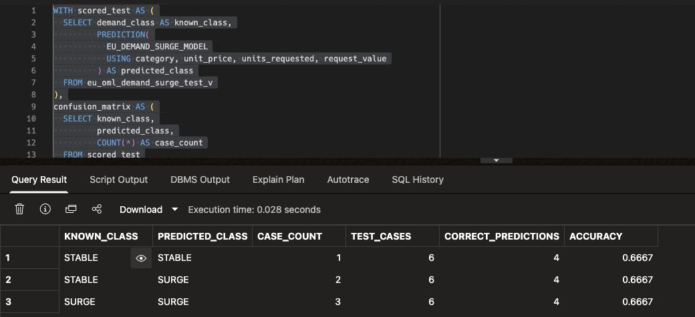
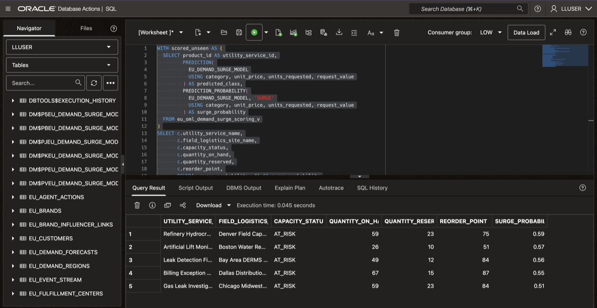

# Build a Demand and Capacity Watchlist with Oracle Machine Learning

## Introduction

Jessica has reviewed requests, relationships, and nearby sites. She now asks Otto Spencer, the data scientist, whether a model can help prioritize services whose demand signals coincide with capacity constraints.

Otto does not ask Jessica to trust a score on its own. You inspect the prepared model, evaluate it against labeled cases withheld from training, and then join predictions to current site-capacity evidence. The result is a watchlist for human review.

This lab evaluates and uses an existing Oracle Machine Learning model. You do not train a model, run AutoML, or forecast equipment failure. The synthetic demand labels demonstrate a classification workflow, not a validated forecast of future utility demand.

Estimated Time: **10 minutes**

### Objectives

- Inspect the demand-surge training view.
- Inspect the persisted classification model, settings, and fitted inputs.
- Evaluate predictions on a separate labeled test set.
- Combine model probability with site-capacity evidence.

### Hands-on Scenario

| Step | Energy & Utilities focus |
| --- | --- |
| Business problem | Operations needs a review list where possible demand pressure meets constrained support capacity. |
| Technical challenge | Jessica needs to understand model errors before using a prediction. |
| Persona focus | You follow Otto's evaluation and explain the resulting watchlist to Jessica. |
| What you will see | Held-out predictions, a confusion matrix, and service/site capacity rows. |
| Database capability | `PREDICTION` and `PREDICTION_PROBABILITY` use the prepared in-database model. |
| Outcome | A human reviewer can examine the model score beside concrete capacity evidence. |

<details>
<summary><strong>Key terms: feature, target, held-out test, and probability</strong></summary>

> - A **feature** is an input to the model. A **target** is the label it learns to predict: `SURGE` or `STABLE` here.
> - A **held-out test set** contains labeled cases excluded from training. Comparing predicted and known labels exposes errors.
> - A **confusion matrix** counts each known-label/predicted-label combination, including mistakes.
> - A **probability** is the model's class-probability estimate, used here as a confidence signal. It is neither certainty nor a separately calibrated operational-risk estimate.

</details>

> **SQL Worksheet reminder:** Return to [Getting Started Task 2](?lab=getting-started#Task2:OpenSQLWorksheet) if you need the launch and execution steps.

## Task 1: Read the training data

Otto first checks what the prepared model learned from. The training view contains 25 service cases; this query displays the 15 with the most requested units. It reads existing data and does not train or change the model.

1. Run the feature query.

    `DEMAND_CLASS` is a synthetic label derived from historical request urgency, not an observed future demand outcome. The prepared view supplies service category, value, and request-volume measures as candidate predictors, but it does not supply urgency as a predictor.

    <copy>
    ```sql
    SELECT product_id AS utility_service_id,
           category AS utility_category,
           unit_price AS service_value,
           units_requested,
           request_value,
           demand_class
    FROM eu_oml_demand_surge_training_v
    ORDER BY units_requested DESC, product_id
    FETCH FIRST 15 ROWS ONLY;
    ```
    </copy>

    **Checkpoint:** Identify the target column and two candidate predictors. A service identifier connects the prediction back to business data; it is not itself evidence of demand pressure.

## Task 2: Verify the model

The workshop environment already contains `EU_DEMAND_SURGE_MODEL`. Jessica checks its identity before relying on a dashboard that uses it.

1. Confirm the model is present. The result should identify a classification model using the Random Forest algorithm.

    <copy>
    ```sql
    SELECT model_name,
           mining_function,
           algorithm
    FROM user_mining_models
    WHERE model_name = 'EU_DEMAND_SURGE_MODEL';
    ```
    </copy>

2. Inspect the model settings that matter for this small deterministic dataset.

    <copy>
    ```sql
    SELECT setting_name,
           setting_value,
           setting_type
    FROM user_mining_model_settings
    WHERE model_name = 'EU_DEMAND_SURGE_MODEL'
      AND setting_name IN (
        'ALGO_NAME',
        'ODMS_DEEPTREE',
        'ODMS_RANDOM_SEED',
        'PREP_AUTO',
        'RFOR_NUM_TREES',
        'TREE_TERM_MINREC_NODE',
        'TREE_TERM_MINREC_SPLIT'
      )
    ORDER BY setting_name;
    ```
    </copy>

    The `ODMS_DEEPTREE` setting uses `ODMS_DEEPTREE_ENABLE` so the Random Forest can split this intentionally small training set. The fixed random seed supports a reproducible workshop build; it does not establish production model quality.

3. Inspect the fitted model signature.

    <copy>
    ```sql
    SELECT attribute_name,
           attribute_type,
           data_type,
           target
    FROM user_mining_model_attributes
    WHERE model_name = 'EU_DEMAND_SURGE_MODEL'
    ORDER BY target DESC, attribute_name;
    ```
    </copy>

    `DEMAND_CLASS` is the target. This fitted model retained `UNIT_PRICE`, `UNITS_REQUESTED`, and `REQUEST_VALUE` as active predictors. Oracle may omit a candidate column during model preparation when it does not contribute to the fitted model.

## Task 3: Evaluate held-out service demand

The test view contains six labeled service cases excluded from the 25 training cases. Otto uses their known labels only to evaluate predictions, not as model inputs.

1. Run the classification query. `PREDICTION` selects a class; `PREDICTION_PROBABILITY` returns the estimate for `SURGE`, even when the selected class is `STABLE`.

    <copy>
    ```sql
    WITH scored_test AS (
      SELECT product_id,
             demand_class,
             PREDICTION(
               EU_DEMAND_SURGE_MODEL
               USING category, unit_price, units_requested, request_value
             ) AS predicted_class,
             PREDICTION_PROBABILITY(
               EU_DEMAND_SURGE_MODEL, 'SURGE'
               USING category, unit_price, units_requested, request_value
             ) AS surge_probability
      FROM eu_oml_demand_surge_test_v
    )
    SELECT x.product_id AS utility_service_id,
           s.service_name AS utility_service_name,
           x.demand_class AS known_class,
           x.predicted_class,
           ROUND(x.surge_probability, 4) AS surge_probability
    FROM scored_test x
    JOIN eu_utility_services_v s
      ON s.utility_service_id = x.product_id
    ORDER BY surge_probability DESC, x.product_id;
    ```
    </copy>

2. Compare `KNOWN_CLASS` with `PREDICTED_CLASS`. These rows were withheld from model training, so the comparison is a small held-out evaluation rather than an in-sample check. Probability is the class-probability estimate produced by the model. It supports prioritization, not certainty, and it is not a calibrated operational-risk probability unless calibration is tested separately.

    **Expected output pattern**

    | Column | Stable check |
    | --- | --- |
    | `KNOWN_CLASS` | The label used to evaluate the model. |
    | `PREDICTED_CLASS` | `SURGE` or `STABLE`. |
    | `SURGE_PROBABILITY` | A value from 0 through 1; exact values can change after retraining. |

3. Summarize the held-out predictions as a confusion matrix with overall accuracy.

    <copy>
    ```sql
    WITH scored_test AS (
      SELECT demand_class AS known_class,
             PREDICTION(
               EU_DEMAND_SURGE_MODEL
               USING category, unit_price, units_requested, request_value
             ) AS predicted_class
      FROM eu_oml_demand_surge_test_v
    ),
    confusion_matrix AS (
      SELECT known_class,
             predicted_class,
             COUNT(*) AS case_count
      FROM scored_test
      GROUP BY known_class, predicted_class
    )
    SELECT known_class,
           predicted_class,
           case_count,
           SUM(case_count) OVER () AS test_cases,
           SUM(
             CASE WHEN known_class = predicted_class THEN case_count ELSE 0 END
           ) OVER () AS correct_predictions,
           ROUND(
             SUM(
               CASE WHEN known_class = predicted_class THEN case_count ELSE 0 END
             ) OVER () / SUM(case_count) OVER (),
             4
           ) AS accuracy
    FROM confusion_matrix
    ORDER BY known_class, predicted_class;
    ```
    </copy>

    Each row is one populated cell in the confusion matrix. Accuracy is the share of held-out cases whose predicted and known classes match. With the prepared model, four of six predictions are correct: one `STABLE` case and all three `SURGE` cases. Two `STABLE` cases are predicted as `SURGE`, giving accuracy `0.6667` after rounding.

    

    *The query excerpt scores `EU_OML_DEMAND_SURGE_TEST_V`. The three populated cells account for six test cases, four correct predictions, and accuracy `0.6667`.*

    Those two false positives matter: a reviewer may spend time on cases that do not carry the known surge label. This six-row synthetic test set demonstrates the evaluation pattern; it is too small to establish production performance. Exact probability decimals are not fixed expected answers and may change after a model rebuild.

## Task 4: Apply the model and build the capacity watchlist

Otto now translates predictions into something Jessica can review with field operations. The scoring view contains the same six held-out service cases without their labels. It is not a third independent dataset or a newly observed reporting period.

1. Join predictions for those label-free scoring cases to current capacity evidence. The query keeps predicted `SURGE` services only where a site reports `AT_RISK` or `OUT_OF_STOCK` capacity.

    <copy>
    ```sql
    WITH scored_unseen AS (
      SELECT product_id AS utility_service_id,
             PREDICTION(
               EU_DEMAND_SURGE_MODEL
               USING category, unit_price, units_requested, request_value
             ) AS predicted_class,
             PREDICTION_PROBABILITY(
               EU_DEMAND_SURGE_MODEL, 'SURGE'
               USING category, unit_price, units_requested, request_value
             ) AS surge_probability
      FROM eu_oml_demand_surge_scoring_v
    )
    SELECT c.utility_service_name,
           c.field_logistics_site_name,
           c.capacity_status,
           c.quantity_on_hand,
           c.quantity_reserved,
           c.reorder_point,
           ROUND(s.surge_probability, 4) AS surge_probability
    FROM scored_unseen s
    JOIN eu_asset_capacity_v c
      ON c.utility_service_id = s.utility_service_id
    WHERE s.predicted_class = 'SURGE'
      AND c.capacity_status IN ('AT_RISK', 'OUT_OF_STOCK')
    ORDER BY s.surge_probability DESC,
             c.quantity_on_hand - c.quantity_reserved,
             c.utility_service_id,
             c.field_logistics_site_id;
    ```
    </copy>

    

    *The query's capacity filter and ordering appear above all five `AT_RISK` service/site rows. Supporting quantities, reorder points, and surge probabilities are visible. These probabilities are model scores from this run, not promises of a surge or fixed expected decimals.*

    The prepared result contains five service/site rows, all `AT_RISK`. A service can appear for more than one site, so this is not a count of distinct predicted services. The query sorts by the unrounded probability, then net quantity and service/site identifiers. A displayed tie in rounded probability does not necessarily mean the underlying scores are equal.

> **Checkpoint:** Use the held-out rows in Task 3 to examine errors before changing a threshold. This small synthetic test split demonstrates the workflow; it is not sufficient evidence for production performance. A narrower review queue can miss emerging operational risk.

> **🎯 Interactive challenge:** Add a surge-probability threshold to the watchlist. Compare the row count with the original result. Can that count alone tell you whether the shorter queue misses true surge cases?

<details>
<summary><strong>Challenge answer</strong></summary>

Add the threshold to the outer `WHERE` clause:

    ```sql
    WHERE s.predicted_class = 'SURGE'
      AND c.capacity_status IN ('AT_RISK', 'OUT_OF_STOCK')
      AND s.surge_probability >= 0.55
    ```

Rerun the complete Task 4 query. With the prepared model, this threshold reduces five rows to four. The smaller queue does not measure recall: the watchlist result has no known labels to count missed true surge cases. A higher threshold can exclude cases worth reviewing, so evaluate thresholds against labeled data before choosing an operational policy.

</details>

## Conclusion: Put prediction beside business evidence

Otto and Jessica inspected an existing model, measured its held-out errors, and placed predictions beside capacity evidence. You used in-database scoring without exporting rows or training a replacement model. Human reviewers still decide whether and how to respond.

## Next Steps

Jessica now has several repeatable SQL evidence paths. In Lab 7, Nina explores how Select AI can help ask site, service, and capacity questions in ordinary language. That lab's live execution remains pending until the platform provides the approved `EU_GENAI` profile.

## Acknowledgements

* **Author** - Oracle Database Product Management
* **Last Updated By/Date** - Oracle Database Product Management, September 2026
