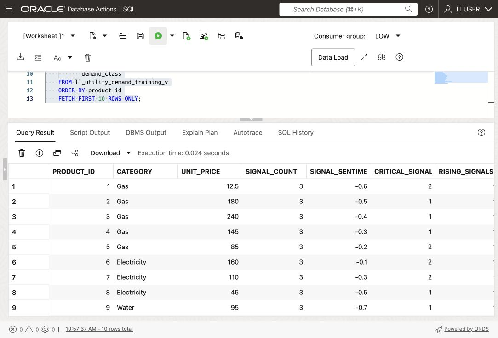
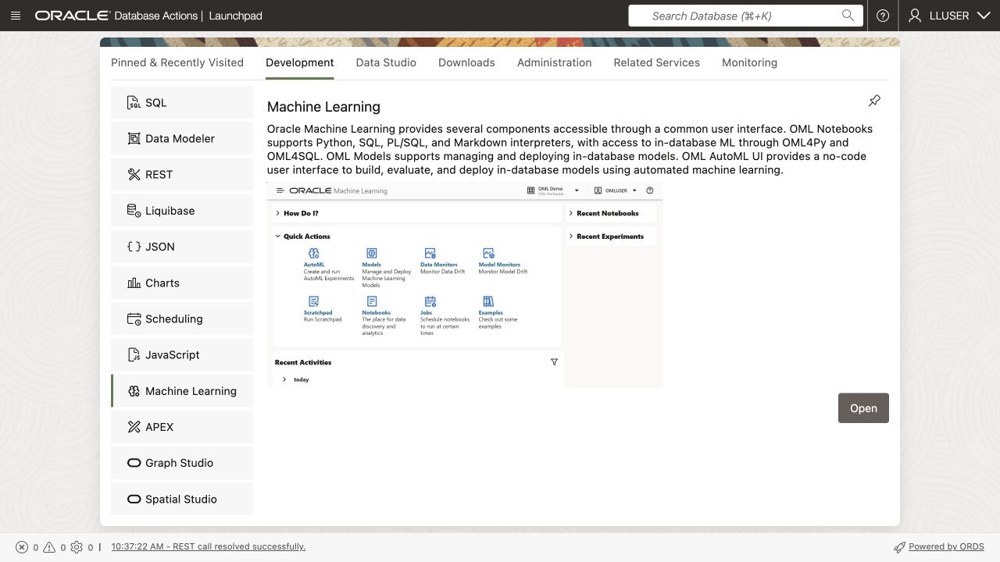
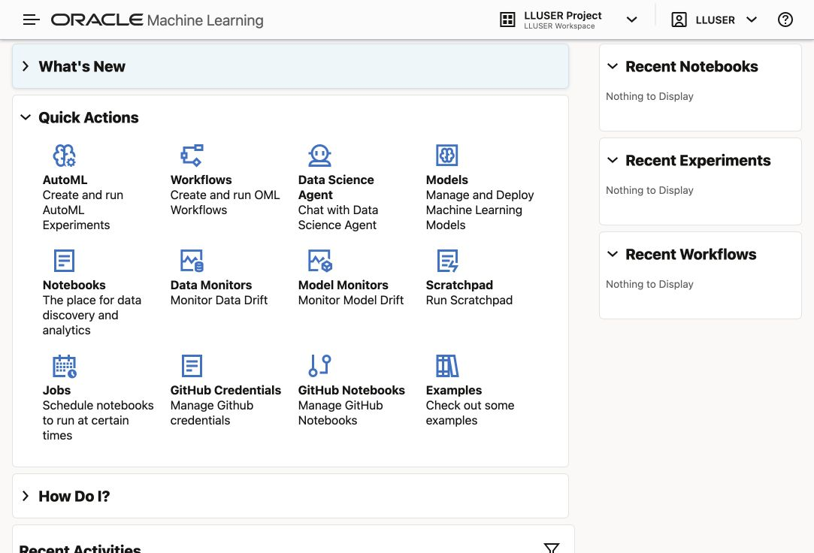
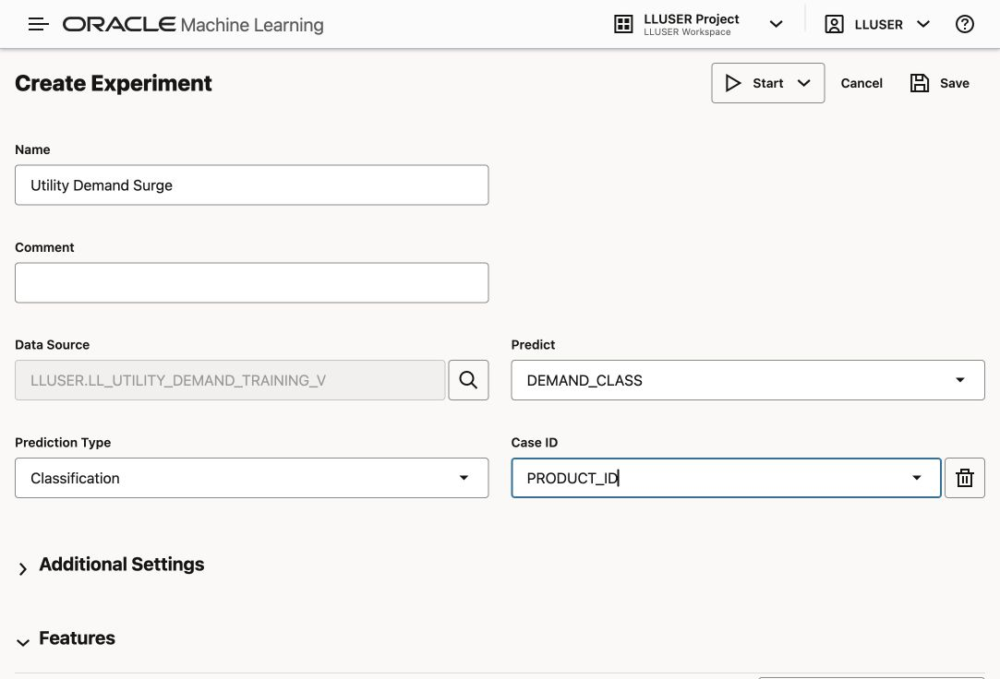
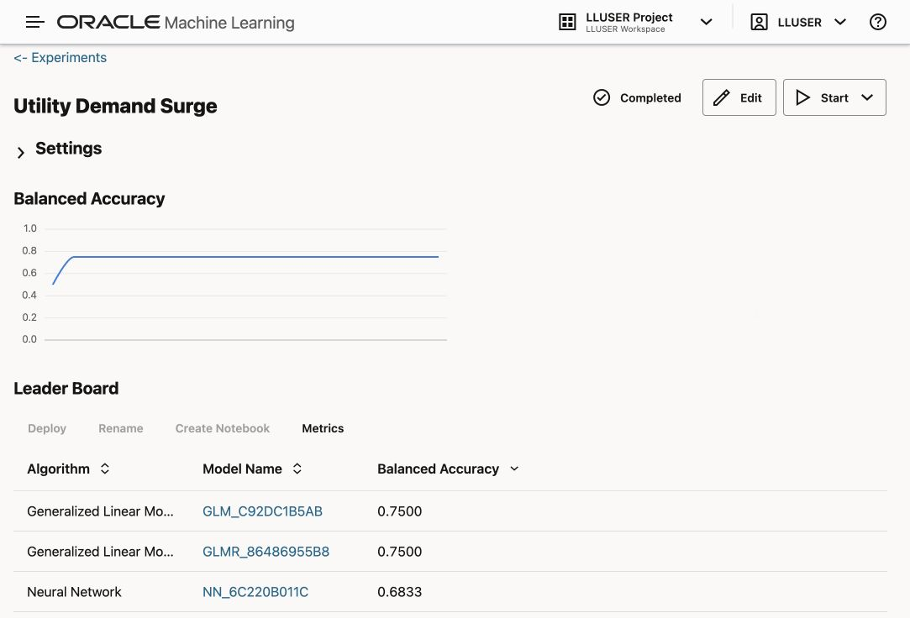
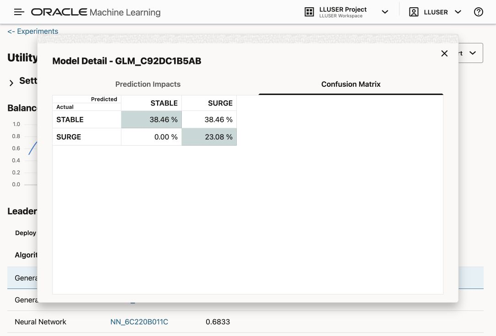
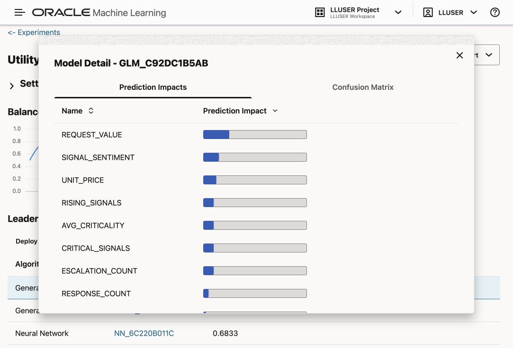
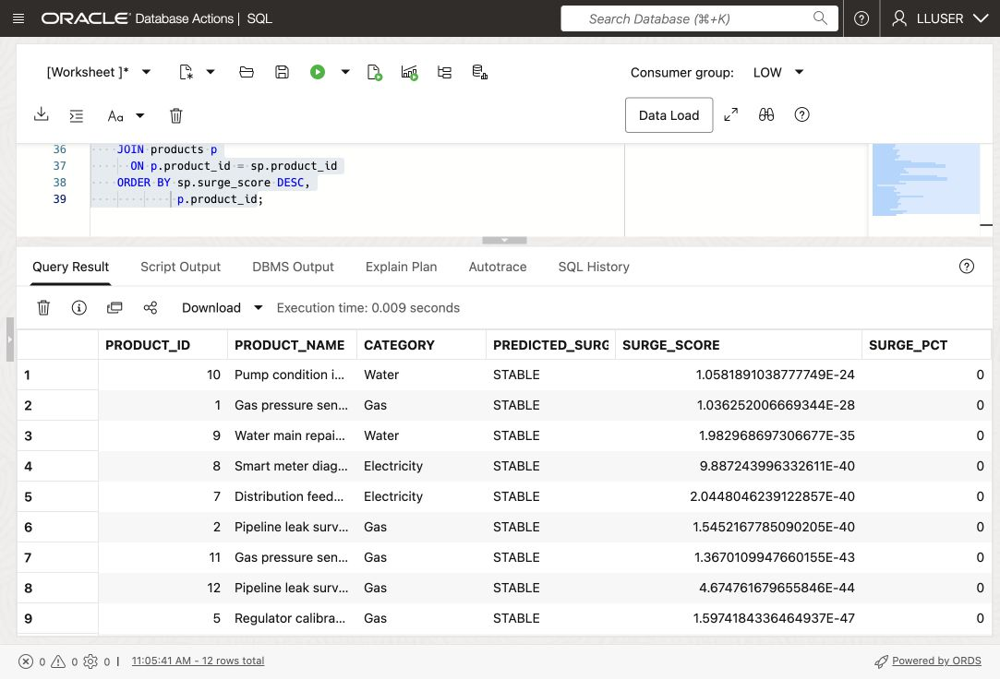

# Build a Service Demand Watchlist with Oracle Machine Learning

## Introduction

Otto Spencer, Seer Utility Network's data scientist, is building a demand watchlist for service planners. They need to see predicted demand alongside request value and operational activity.

Train a model in Oracle AI Database to classify services as `SURGE` or `STABLE`, then join its scores to the service details planners need.


<details>
<summary><strong>Key terms: model, feature, classification, probability, and in-database machine learning</strong></summary>

> - A **model** is a set of learned rules that turns input data into a prediction.
>
> - A **feature** is an input value used by the model. In this lab, features include service category, price, operational signals, and request value.
>
> - **Classification** predicts a label. Otto's model predicts either `SURGE` or `STABLE`.
>
> - A **probability** is the model's value for a class. In this lab, the value is displayed as a `SURGE_SCORE` to rank utility services for review. It is not a guarantee.
>
> - **In-database machine learning** means the model is trained or scored where the source data already lives. The SQL result can include the prediction and the data used to explain it.

</details>

### Objectives

- Read the prepared training data and identify the model target.
- Optionally use AutoML to compare classification models and inspect their predictions.
- Create the selected Generalized Linear Model inside Oracle AI Database.
- Score utility services with `PREDICTION` and `PREDICTION_PROBABILITY`.
- Combine model output with service, request value, and engagement data for a dashboard result.

Estimated Time: **10 minutes**

> **Video pending:** A Utilities walkthrough for this lesson has not yet been recorded.

> **SQL Worksheet:** [Getting Started: open SQL Worksheet as LLUSER](?lab=getting-started), Task 2.

## Task 1: Read the training data

> **Training data:** The loader creates `LL_UTILITY_DEMAND_TRAINING_V` and `LL_UTILITY_DEMAND_OUTCOMES`. Predictors use records through 31 August 2026; the synthetic labels describe the separate September window. The labels are assigned independently of predictor formulas, with 30 SURGE and 30 STABLE rows. This dataset teaches the workflow and does not establish operational predictive accuracy.

Otto starts with `LL_UTILITY_DEMAND_TRAINING_V`: one row per service with operational signals, request activity, and the synthetic `DEMAND_CLASS` label.

The outcome table records the predictor cutoff and later outcome window. Keep the target label out of the input features.

1. Run the training-data query:

    <copy>
    ```sql
    SELECT product_id,
           category,
           unit_price,
           signal_count,
           signal_sentiment,
           critical_signals,
           rising_signals,
           units_requested,
           request_value,
           demand_class
    FROM ll_utility_demand_training_v
    ORDER BY product_id
    FETCH FIRST 10 ROWS ONLY;
    ```
    </copy>

2. Identify the parts of each row.

    The numeric and category columns are the model inputs. `DEMAND_CLASS` is the answer the model learns to predict. `PRODUCT_ID` identifies the service but is not a business feature for this example.

    

## Task 2: Compare models with AutoML (optional)

Otto first uses the Oracle Machine Learning AutoML interface to compare candidate models. AutoML can select algorithms, tune them, and show how well each model identifies the two labels.

AutoML takes several minutes. Skip to Task 3 to focus on training and scoring with SQL.

1. Open **Machine Learning** from Database Actions.

    Sign in as `LLUSER` using your workshop credentials.

    

2. Click **AutoML**.

    

3. Create a new experiment with these settings:

    | Setting         | Value                   |
    | -----------------| -------------------------|
    | Experiment name | `Utility Demand Surge`  |
    | Data source     | `LL_UTILITY_DEMAND_TRAINING_V` |
    | Predict         | `DEMAND_CLASS`           |
    | Prediction type | `Classification`        |
    | Case ID         | `PRODUCT_ID`            |

    Select **Start**, then **Faster Results**, and wait for the model leaderboard. Runtime varies; the validation run completed in about three minutes.

    

4. Review the leaderboard and model details.

    

    Open candidate model details and compare their confusion matrices.

    Compare false negatives and false positives for both classes. A model that always predicts `STABLE` will miss every surge case.

    Use a Generalized Linear Model for the SQL exercise so you can inspect a named model and score it with SQL. The captured AutoML run shows both GLM variants at 0.75 balanced accuracy. Your result may differ; this small synthetic dataset is for learning, not operational model selection.

    

    Inspect feature impact where available. Signal counts or request activity can help explain the model's behavior, but a feature's influence does not prove an operational cause.

    

## Task 3: Create the selected model in SQL Developer Web

> **Learner-owned objects:** This lesson creates `LL_UTILITY_DEMAND_SETTINGS`, `LL_UTILITY_DEMAND_GLM` and `LL_UTILITY_DEMAND_SCORING`. The loader deliberately leaves them absent. The reset statements affect only these lab-owned names in your temporary workshop schema.

Create `LL_UTILITY_DEMAND_GLM`, a named model that SQL can call. Use Generalized Linear Model for this exercise whether or not you ran AutoML.

The settings table selects the algorithm. `PREP_AUTO` enables automatic preparation of input columns.

1. Create the settings table and train the model:

    <copy>
    ```sql

    DROP TABLE IF EXISTS ll_utility_demand_settings;

    CREATE TABLE ll_utility_demand_settings (
          setting_name  VARCHAR2(30),
          setting_value VARCHAR2(4000)
        );

    INSERT INTO ll_utility_demand_settings (setting_name, setting_value)
    VALUES ('ALGO_NAME', 'ALGO_GENERALIZED_LINEAR_MODEL');

    INSERT INTO ll_utility_demand_settings (setting_name, setting_value)
    VALUES ('PREP_AUTO', 'ON');

    INSERT INTO ll_utility_demand_settings (setting_name, setting_value)
    VALUES ('ODMS_RANDOM_SEED', '20260604');

    COMMIT;

    DECLARE
      l_model_count NUMBER;
    BEGIN
      SELECT COUNT(*)
      INTO l_model_count
      FROM user_mining_models
      WHERE model_name = 'LL_UTILITY_DEMAND_GLM';

      IF l_model_count > 0 THEN
        DBMS_DATA_MINING.DROP_MODEL('LL_UTILITY_DEMAND_GLM');
      END IF;
    END;
    /

    BEGIN
      DBMS_DATA_MINING.CREATE_MODEL(
        model_name           => 'LL_UTILITY_DEMAND_GLM',
        mining_function      => DBMS_DATA_MINING.CLASSIFICATION,
        data_table_name      => 'LL_UTILITY_DEMAND_TRAINING_V',
        case_id_column_name  => 'PRODUCT_ID',
        target_column_name   => 'DEMAND_CLASS',
        settings_table_name  => 'LL_UTILITY_DEMAND_SETTINGS'
      );
    END;
    /
    ```
    </copy>

    The model reads the training view, learns the relationship between the features and `DEMAND_CLASS`, and stores the trained model in the database. No service or signal data leaves Oracle Database during training.

2. Confirm that Oracle created the model:

    <copy>
    ```sql
    SELECT model_name,
           mining_function,
           algorithm
    FROM user_mining_models
    WHERE model_name = 'LL_UTILITY_DEMAND_GLM';
    ```
    </copy>

    The result should show `CLASSIFICATION` and `GENERALIZED_LINEAR_MODEL`. Otto now has a database model that SQL can call.

## Task 4: Score new service activity in SQL

Create a what-if scoring table by changing selected training-row inputs. These synthetic rows demonstrate scoring; they are not independent observations for measuring accuracy.

1. Create the scoring table and add the new activity snapshot:

    <copy>
    ```sql

    DROP TABLE IF EXISTS ll_utility_demand_scoring;

    CREATE TABLE ll_utility_demand_scoring (
      product_id    NUMBER,
      category      VARCHAR2(100),
      unit_price    NUMBER,
      signal_count   NUMBER,
      signal_sentiment NUMBER,
      response_count   NUMBER,
      escalation_count  NUMBER,
      signal_reach   NUMBER,
      avg_criticality  NUMBER,
      critical_signals   NUMBER,
      rising_signals  NUMBER,
      units_requested    NUMBER,
      request_value       NUMBER
    );

    INSERT INTO ll_utility_demand_scoring (
      product_id,
      category,
      unit_price,
      signal_count,
      signal_sentiment,
      response_count,
      escalation_count,
      signal_reach,
      avg_criticality,
      critical_signals,
      rising_signals,
      units_requested,
      request_value
    )
    SELECT product_id,
           category,
           unit_price,
           signal_count + 4,
           signal_sentiment,
           response_count + 25,
           escalation_count + 10,
           signal_reach + 500,
           LEAST(1, avg_criticality + 0.05),
           critical_signals + 1,
           rising_signals + 1,
           units_requested + 3,
           request_value + (unit_price * 3)
    FROM (
      SELECT product_id,
             category,
             unit_price,
             signal_count,
             signal_sentiment,
             response_count,
             escalation_count,
             signal_reach,
             avg_criticality,
             critical_signals,
             rising_signals,
             units_requested,
             request_value,
             ROW_NUMBER() OVER (ORDER BY product_id) AS row_num
      FROM ll_utility_demand_training_v
    )
    WHERE row_num <= 12;

    COMMIT;
    ```
    </copy>

    The scoring table omits `DEMAND_CLASS`; the target label must not be supplied as a predictor.

2. Run the scoring query:

    <copy>
    ```sql
    WITH scored_products AS (
      SELECT product_id,
             category,
             units_requested,
             request_value,
             signal_count,
             critical_signals,
             rising_signals,
             PREDICTION(
               LL_UTILITY_DEMAND_GLM USING
               category, unit_price, signal_count, signal_sentiment,
               response_count, escalation_count, signal_reach, avg_criticality,
               critical_signals, rising_signals, units_requested, request_value
             ) AS predicted_surge,
             PREDICTION_PROBABILITY(
                 LL_UTILITY_DEMAND_GLM,
                 'SURGE' USING
                 category, unit_price, signal_count, signal_sentiment,
                 response_count, escalation_count, signal_reach, avg_criticality,
                 critical_signals, rising_signals, units_requested, request_value
             ) AS surge_score
      FROM ll_utility_demand_scoring
    )
    SELECT p.product_id,
           p.product_name,
           sp.category,
           sp.predicted_surge,
           sp.surge_score,
           ROUND(sp.surge_score * 100, 2) AS surge_pct,
           sp.units_requested,
           sp.request_value,
           sp.signal_count,
           sp.critical_signals,
           sp.rising_signals
    FROM scored_products sp
    JOIN products p
      ON p.product_id = sp.product_id
    ORDER BY sp.surge_score DESC,
             p.product_id;
    ```
    </copy>

3. Read the result as a dashboard user.

    `PREDICTED_SURGE` tells the dashboard which label the model selected. `SURGE_SCORE` is the model value between 0 and 1, while `SURGE_PCT` presents the same value as a percentage for a dashboard user. The request value and activity columns give the business user something to review alongside the prediction.

    In the captured run, all twelve illustrative scenarios are classified as `STABLE`, with very small, nonzero surge probabilities. Keep the unrounded score for sorting; the percentage rounds to zero. Increasing selected inputs does not guarantee a surge prediction. Review the training distribution and evaluate the model on independent data before using these scores for planning.

    

## Conclusion: Put the Prediction Beside the Business Data

Otto has a query that returns predictions with their supporting service activity. Before using the watchlist for planning, evaluate the model on independent observations.

## Acknowledgements

* **Authors** - Matt Kowalik, Kevin Lazarz
* **Contributor** - Eugenio Galiano, Linda Foinding
* **Last Updated By/Date** - Oracle Database Product Management, October 2026
