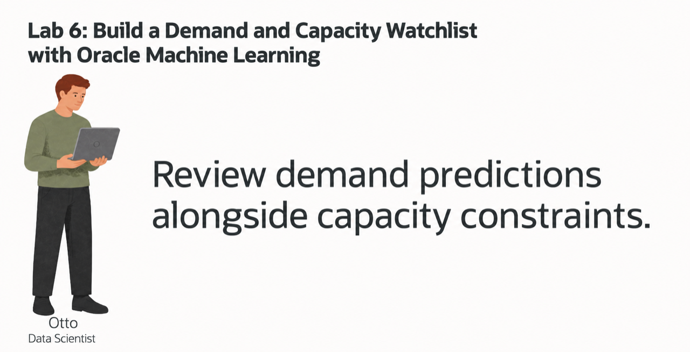
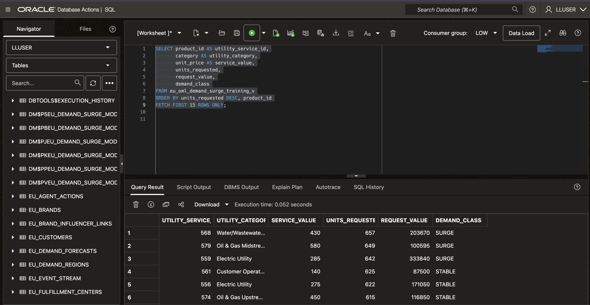
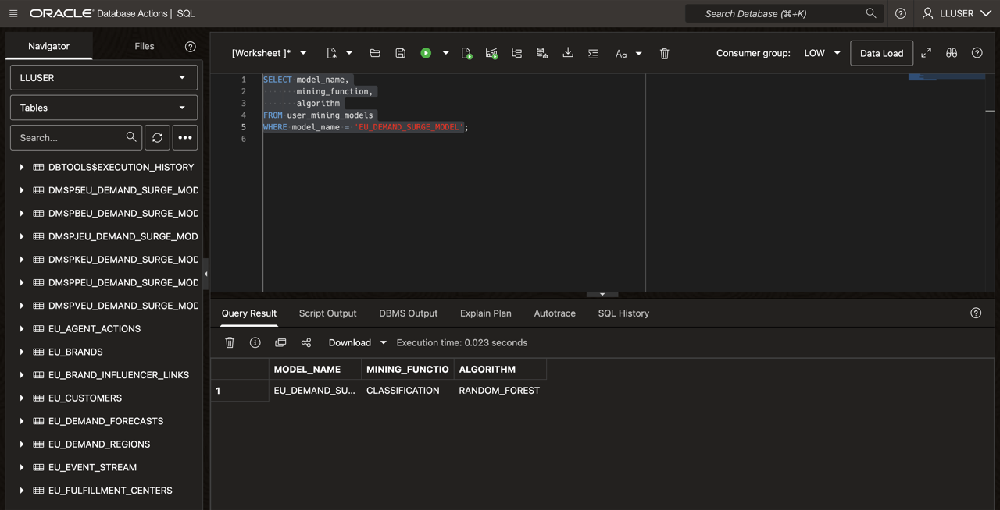
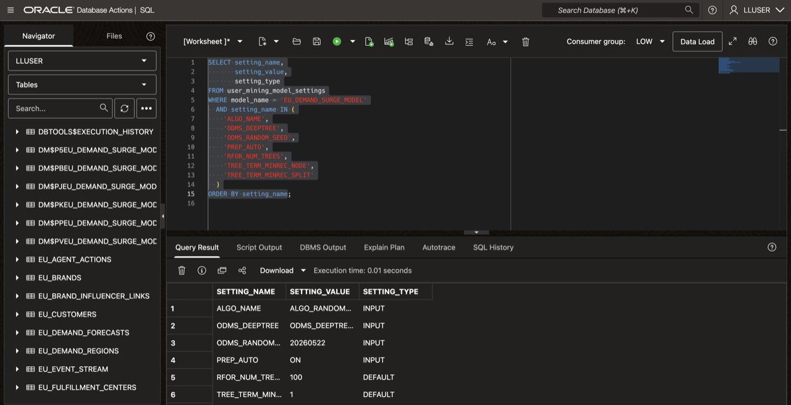
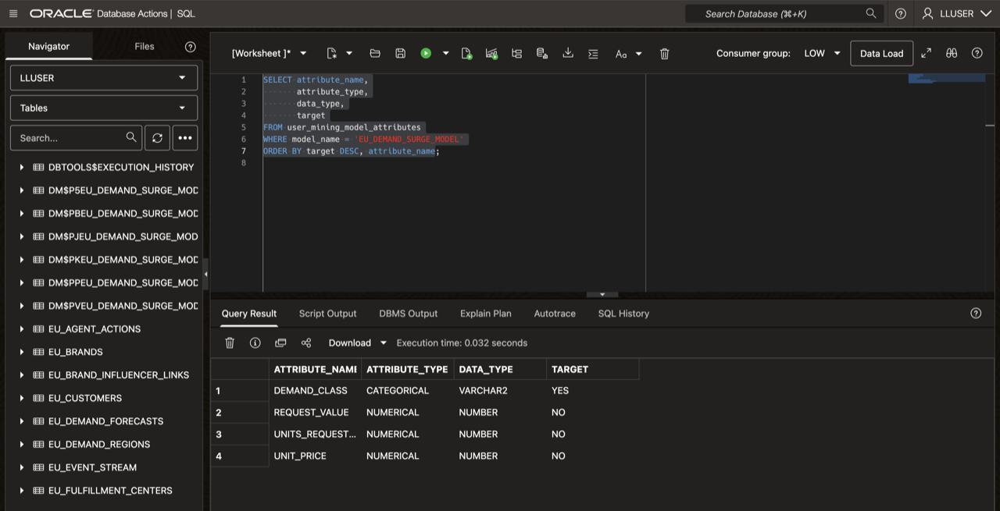
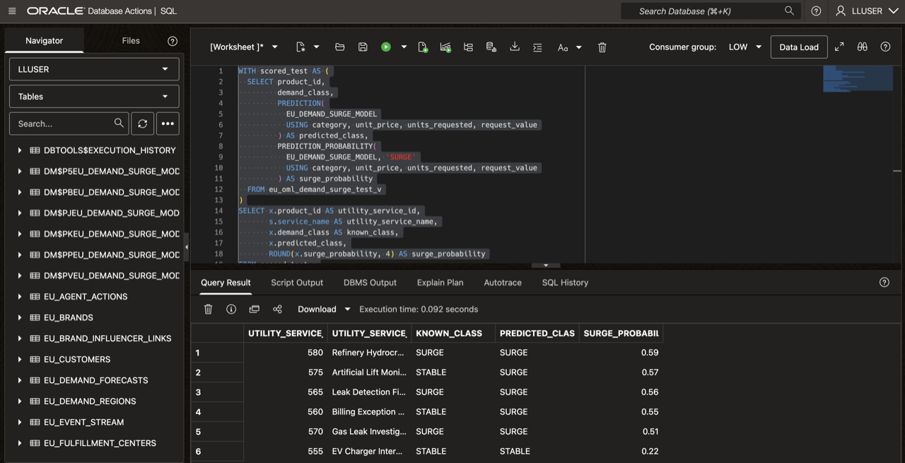

# Build a Demand and Capacity Watchlist with Oracle Machine Learning

## Introduction

Otto Spencer is the data scientist helping Jessica’s operations team review demand alongside field-logistics capacity. Jessica has examined service requests, operational relationships, and nearby sites. She now asks: **which utility services deserve closer review when model-predicted demand pressure coincides with constrained support capacity?**

A prediction alone cannot answer that question. Before using the model’s output, Otto wants Jessica to understand what the model learned, how it performs on cases excluded from training, and where it makes mistakes. He then connects its predictions to current site-capacity evidence so the team can review both together.

In this lab, you inspect a prepared Oracle Machine Learning classification model, evaluate its predictions against known labels in a held-out test set, and build a demand and capacity watchlist. Oracle AI Database lets you query the model’s predictions alongside operational records using SQL.

You evaluate and use an existing model; you do not train one, run AutoML, or forecast equipment failure. The synthetic demand labels demonstrate a classification workflow, not a validated forecast of future utility demand. The watchlist supports human review rather than automatically assigning work or resources.



<details>
<summary><strong>Key terms: feature, target, held-out test set, confusion matrix, and probability</strong></summary>

- A **feature** is an input the model uses to make a prediction. Reviewing the inputs helps Jessica understand what information the prediction is based on.

- A **target** is the label the model learns to predict. In this lab, the target classes are `SURGE` and `STABLE`.

- A **held-out test set** contains labeled cases excluded from training. Comparing predicted labels with known labels helps reveal how the model performs on those cases.

- A **confusion matrix** counts the combinations of known and predicted labels. It shows both correct classifications and mistakes, such as predicting `STABLE` for a case labeled `SURGE`.

- A **class probability** is the model’s estimated probability for a particular class. It is not certainty, a guarantee of model accuracy, or a separately validated estimate of operational risk.

</details>

### Objectives

- Inspect the prepared training data and identify the target and model inputs.
- Review the stored classification model, its settings, and input attributes.
- Compare predictions with known labels in a separate held-out test set.
- Interpret a confusion matrix and explain the limits of the evaluation.
- Combine model predictions and probabilities with site-capacity evidence to build a watchlist for human review.

Estimated Time: **10 minutes**

<video controls width="100%">
  <source src="https://c4u04.objectstorage.us-ashburn-1.oci.customer-oci.com/p/EcTjWk2IuZPZeNnD_fYMcgUhdNDIDA6rt9gaFj_WZMiL7VvxPBNMY60837hu5hga/n/c4u04/b/livelabsfiles/o/livestack%2FVideos%2FFinance%2F06-Finance%20Workshop_LAB-6_with-CC.mp4" type="video/mp4">
  Your browser does not support the video tag.
</video>

*The video uses a Finance example. Follow the E&U tasks below for this lab’s approved profile, views, and operational questions.*

### Hands-on Scenario

Otto helps Jessica assess the model’s limitations before combining its predictions with the capacity constraints that operations must review.

| Step | Energy & Utilities focus |
| --- | --- |
| Business Problem | Operations needs to identify services where predicted demand pressure coincides with constrained support capacity. |
| Technical Challenge | Evaluate model errors and connect predictions to operational evidence before using them to prioritize review. |
| Persona Focus | You follow Otto’s evaluation and explain the resulting watchlist to Jessica. |
| What You Will Do | Inspect a prepared model, evaluate held-out predictions, interpret a confusion matrix, and review a demand and capacity watchlist. |
| Database Capability | `PREDICTION` and `PREDICTION_PROBABILITY` apply the prepared in-database model through SQL. |
| Outcome | A human reviewer can examine predictions alongside capacity evidence while understanding the model’s limitations. |

> **SQL Worksheet reminder:** Need a reminder on how to open and use the SQL Worksheet? Return to [Getting Started Task 2: Open SQL Worksheet](?lab=getting-started#Task2:OpenSQLWorksheet) for the step-by-step graphic showing where to paste and run SQL statements.

## Task 1: Read the training data

Before reviewing predictions, Jessica asks Otto what the model learned from. Otto starts with the prepared training view, which contains 25 service cases. This query displays the 15 with the most requested units.

You inspect existing training data in this task. You do not train or change the model.

1. Run the training-data query.

    `DEMAND_CLASS` is the target: a synthetic label derived from historical request urgency, not an observed future demand outcome. The view supplies service category, value, and request-volume measures as candidate predictors. It does not include urgency as a predictor.

    ```sql
    <copy>
    SELECT product_id AS utility_service_id,
           category AS utility_category,
           unit_price AS service_value,
           units_requested,
           request_value,
           demand_class
    FROM eu_oml_demand_surge_training_v
    ORDER BY units_requested DESC, product_id
    FETCH FIRST 15 ROWS ONLY;
    </copy>
    ```

    **Expected output: Fifteen training cases**

    

    *Review the service category, value, and request-volume measures alongside each case’s `DEMAND_CLASS`. The query returns a sample of the training cases, not model predictions. Scroll through the result grid to inspect rows or columns outside the screenshot.*

2. Identify `DEMAND_CLASS` and two candidate predictors, such as `UNITS_REQUESTED` and `UTILITY_CATEGORY`. In the next task, inspect the model metadata to check which attributes the prepared model uses.

> **Checkpoint:** The target is what the model learns to predict; predictors are the inputs used to make that prediction. `UTILITY_SERVICE_ID` links a case back to business data—it is not, by itself, evidence of demand pressure.

## Task 2: Verify the model

The workshop environment already contains `EU_DEMAND_SURGE_MODEL`. Before Jessica uses its predictions, Otto checks the model’s identity, configuration, and recorded input attributes.

These queries inspect the existing model. They do not train, rebuild, or change it.

1. Confirm that the model is present.

    ```sql
    <copy>
    SELECT model_name,
           mining_function,
           algorithm
    FROM user_mining_models
    WHERE model_name = 'EU_DEMAND_SURGE_MODEL';
    </copy>
    ```

    **Expected output: The prepared classification model**

    

    Confirm that the result identifies `EU_DEMAND_SURGE_MODEL` as a classification model using the Random Forest algorithm. If no row is returned, stop and ask the workshop administrator to check the environment.

2. Inspect the selected model settings.

    ```sql
    <copy>
    SELECT setting_name,
           setting_value,
           setting_type
    FROM user_mining_model_settings
    WHERE model_name = 'EU_DEMAND_SURGE_MODEL'
      AND setting_name IN (
        'ALGO_NAME',
        'ODMS_DEEPTREE',
        'ODMS_RANDOM_SEED',
        'PREP_AUTO',
        'RFOR_NUM_TREES',
        'TREE_TERM_MINREC_NODE',
        'TREE_TERM_MINREC_SPLIT'
      )
    ORDER BY setting_name;
    </copy>
    ```

    **Expected output: Selected configuration settings**

    

    In the prepared model, `ODMS_DEEPTREE` is set to `ODMS_DEEPTREE_ENABLE`. The configuration supports the workshop’s intentionally small training dataset. The fixed random seed supports reproducibility; it does not establish model accuracy or suitability for production.

3. Inspect the model signature to identify its target and recorded input attributes.

    ```sql
    <copy>
    SELECT attribute_name,
           attribute_type,
           data_type,
           target
    FROM user_mining_model_attributes
    WHERE model_name = 'EU_DEMAND_SURGE_MODEL'
    ORDER BY target DESC, attribute_name;
    </copy>
    ```

    **Expected output: Model attributes and target**


    

    Identify `DEMAND_CLASS` as the target. In the validated workshop model, the recorded predictor attributes are `UNIT_PRICE`, `UNITS_REQUESTED`, and `REQUEST_VALUE`.

    Compare these names with Task 1. `UNIT_PRICE` appeared there under the learner-facing alias `SERVICE_VALUE`. The training query also displayed `CATEGORY` as `UTILITY_CATEGORY`; displaying a candidate column in the training view does not establish that it appears in the model signature.

> **Checkpoint:** Model metadata confirms what is present and how it is configured—not how well it predicts. Otto next compares predictions with known labels in the held-out test set.

## Task 3: Evaluate held-out service demand

Jessica knows which model is available and what inputs it uses. Before relying on its predictions, she asks Otto: **how often does it match the known labels, and what kinds of mistakes does it make?**

The test view contains six labeled service cases excluded from the 25 training cases. Otto uses their known labels to evaluate predictions, not as model inputs.

1. Run the classification query.

    `PREDICTION` returns the predicted class. `PREDICTION_PROBABILITY` returns the model’s probability estimate for `SURGE`, even when the predicted class is `STABLE`.

    ```sql
    <copy>
    WITH scored_test AS (
      SELECT product_id,
             demand_class,
             PREDICTION(
               EU_DEMAND_SURGE_MODEL
               USING category, unit_price, units_requested, request_value
             ) AS predicted_class,
             PREDICTION_PROBABILITY(
               EU_DEMAND_SURGE_MODEL, 'SURGE'
               USING category, unit_price, units_requested, request_value
             ) AS surge_probability
      FROM eu_oml_demand_surge_test_v
    )
    SELECT x.product_id AS utility_service_id,
           s.service_name AS utility_service_name,
           x.demand_class AS known_class,
           x.predicted_class,
           ROUND(x.surge_probability, 4) AS surge_probability
    FROM scored_test x
    JOIN eu_utility_services_v s
      ON s.utility_service_id = x.product_id
    ORDER BY surge_probability DESC, x.product_id;
    </copy>
    ```

    **Expected output: Predictions for six held-out service cases**

    

    *Compare the known and predicted class for each service. `SURGE_PROBABILITY` estimates the likelihood of the `SURGE` class according to the model; it is not the probability of whichever class appears in `PREDICTED_CLASS`.*

2. Identify the cases where `KNOWN_CLASS` and `PREDICTED_CLASS` differ.

    These cases were withheld from training, so this is a held-out evaluation rather than a check against the model’s training data.

    | Column | What to review |
    | --- | --- |
    | `KNOWN_CLASS` | The synthetic label used to evaluate the prediction. |
    | `PREDICTED_CLASS` | The model’s predicted label: `SURGE` or `STABLE`. |
    | `SURGE_PROBABILITY` | The model’s probability estimate for `SURGE`, from 0 through 1. |

    A probability estimate is not certainty. It is also not a validated probability of an operational incident or capacity shortage. Exact values may change after a model rebuild.

3. Summarize the predictions as a confusion matrix with overall accuracy.

    ```sql
    <copy>
    WITH scored_test AS (
      SELECT demand_class AS known_class,
             PREDICTION(
               EU_DEMAND_SURGE_MODEL
               USING category, unit_price, units_requested, request_value
             ) AS predicted_class
      FROM eu_oml_demand_surge_test_v
    ),
    confusion_matrix AS (
      SELECT known_class,
             predicted_class,
             COUNT(*) AS case_count
      FROM scored_test
      GROUP BY known_class, predicted_class
    )
    SELECT known_class,
           predicted_class,
           case_count,
           SUM(case_count) OVER () AS test_cases,
           SUM(
             CASE WHEN known_class = predicted_class THEN case_count ELSE 0 END
           ) OVER () AS correct_predictions,
           ROUND(
             SUM(
               CASE WHEN known_class = predicted_class THEN case_count ELSE 0 END
             ) OVER () / SUM(case_count) OVER (),
             4
           ) AS accuracy
    FROM confusion_matrix
    ORDER BY known_class, predicted_class;
    </copy>
    ```

    **Expected output: Populated confusion-matrix cells and overall accuracy**


    


    *In the captured run, the three populated cells account for six test cases, four correct predictions, and an overall accuracy of `0.6667`.*

    Each row represents one known-class/predicted-class combination that occurred. Combinations with zero cases are not displayed. The overall totals and accuracy repeat on each row; do not add those repeated totals together.

    With the prepared model, the results are:

    | Known class | Predicted class | Case count | Interpretation |
    | --- | --- | --- | --- |
    | `STABLE` | `STABLE` | 1 | Correct classification. |
    | `STABLE` | `SURGE` | 2 | False positives for `SURGE`. |
    | `SURGE` | `SURGE` | 3 | Correct classifications. |

    The two false positives matter: a reviewer may spend time investigating cases whose known label is `STABLE`. Accuracy summarizes the matches, while the confusion matrix shows the kinds of errors behind that number.

> **Checkpoint:** Four correct predictions out of six demonstrate the evaluation workflow—not production readiness. This small synthetic test set is insufficient to establish how reliably the model would perform on real utility demand.

## Task 4: Apply the model and build the capacity watchlist

Otto now turns the predictions into a watchlist Jessica can review with field operations: **which services are predicted as `SURGE` at sites that also report capacity constraints?**

The scoring view contains the same six held-out service cases from Task 3, but without their labels. It is not a third independent dataset or a newly observed reporting period.

1. Run the watchlist query.

    The query joins model predictions to capacity evidence and keeps predicted `SURGE` services only where a site reports `AT_RISK` or `OUT_OF_STOCK` capacity.

    ```sql
    <copy>
    WITH scored_unseen AS (
      SELECT product_id AS utility_service_id,
             PREDICTION(
               EU_DEMAND_SURGE_MODEL
               USING category, unit_price, units_requested, request_value
             ) AS predicted_class,
             PREDICTION_PROBABILITY(
               EU_DEMAND_SURGE_MODEL, 'SURGE'
               USING category, unit_price, units_requested, request_value
             ) AS surge_probability
      FROM eu_oml_demand_surge_scoring_v
    )
    SELECT c.utility_service_name,
           c.field_logistics_site_name,
           c.capacity_status,
           c.quantity_on_hand,
           c.quantity_reserved,
           c.reorder_point,
           ROUND(s.surge_probability, 4) AS surge_probability
    FROM scored_unseen s
    JOIN eu_asset_capacity_v c
      ON c.utility_service_id = s.utility_service_id
    WHERE s.predicted_class = 'SURGE'
      AND c.capacity_status IN ('AT_RISK', 'OUT_OF_STOCK')
    ORDER BY s.surge_probability DESC,
             c.quantity_on_hand - c.quantity_reserved,
             c.utility_service_id,
             c.field_logistics_site_id;
    </copy>
    ```

    **Expected output: A service-and-site capacity watchlist**

    

    *In the captured run, the watchlist contains five service/site rows, all marked `AT_RISK`. Review the quantities, reorder points, and surge probabilities together. The probabilities are model estimates, not guarantees of a demand surge.*

2. Review why each service/site combination appears in the watchlist.

    | Column | What to review |
    | --- | --- |
    | `UTILITY_SERVICE_NAME` | The service predicted as `SURGE`. |
    | `FIELD_LOGISTICS_SITE_NAME` | The site associated with the capacity evidence. |
    | `CAPACITY_STATUS` | The recorded constraint: `AT_RISK` or `OUT_OF_STOCK`. |
    | `QUANTITY_ON_HAND` and `QUANTITY_RESERVED` | The recorded quantities available for examining supply constraints. |
    | `REORDER_POINT` | A reference level to consider alongside the quantities. |
    | `SURGE_PROBABILITY` | The model’s probability estimate for the `SURGE` class. |

    A service can appear at more than one site, so five rows do not necessarily represent five distinct services.

    The query sorts by unrounded surge probability, then by quantity on hand minus quantity reserved, followed by service and site identifiers. Equal displayed probabilities do not necessarily mean the underlying scores are identical.

> **Checkpoint:** Review the held-out errors from Task 3 before deciding how to use the watchlist. A shorter queue is not automatically a better queue: it may remove useful review candidates as well as false positives.

**🎯 Interactive challenge:** Add a surge-probability threshold to the watchlist. Compare the row count with the original result. Can that count alone tell you whether the shorter queue excludes cases whose known label is `SURGE`?

<details>
<summary><strong>Challenge answer</strong></summary>

Add the threshold to the outer `WHERE` clause:

```sql
<copy>
WHERE s.predicted_class = 'SURGE'
  AND c.capacity_status IN ('AT_RISK', 'OUT_OF_STOCK')
  AND s.surge_probability >= 0.55
</copy>
```

Rerun the complete Task 4 query. With the prepared model, this threshold reduces the result from five service/site rows to four.

The smaller row count does not measure recall—the share of known `SURGE` cases retained. This watchlist omits known labels, can contain multiple rows per service, and already filters by capacity status.

To evaluate what the threshold excludes, compare the predictions with the labeled cases from Task 3 at the service level. Do not treat this six-case synthetic evaluation as enough evidence to establish an operational policy.

</details>

## Conclusion: Put prediction beside business evidence

Otto and Jessica inspected an existing model, evaluated its held-out errors, and combined its predictions with capacity evidence. The resulting watchlist combines services predicted as SURGE with site-level capacity constraints that deserve attention.

You used in-database scoring alongside operational records without exporting the data or training a replacement model. The watchlist supports human review; it does not establish that a surge will occur or decide how operations should respond.

## Next Steps

Jessica now has several repeatable SQL queries for operational review. In Lab 7, Nina explores how Select AI can help ask site, service, and capacity questions in ordinary language.

Live execution of Lab 7 remains environment-validation pending and requires the platform-provided, approved `EU_GENAI` profile and its supporting configuration.

## Acknowledgements

* **Author** - Zileyah Onafowora
* **Last Updated By/Date** - Zileyah Onafowora, September 2026
