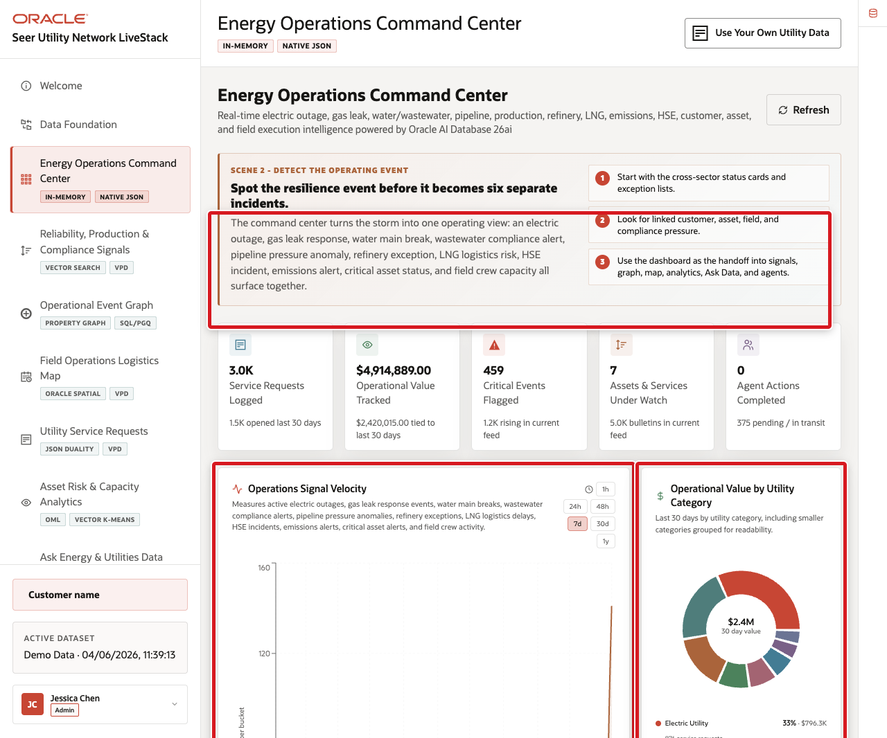

# Build a Converged Dashboard Query

## Introduction

Jessica Chan begins with the Energy Operations Command Center. Operators need one defensible answer to a practical question: **where are requests, reliability signals, and capacity constraints converging?** The LiveStack application presents the dashboard; this lab exposes the database evidence behind it.

Estimated Time: **10 minutes**

### Objectives

- Summarize current service-request risk.
- Connect request urgency to field-logistics capacity.
- Explain why a converged query reduces operational data copies.

### Hands-on Scenario

Jessica first verifies the command-center totals, then drills into the sites where high-priority requests and low capacity require review.

> **SQL Worksheet reminder:** Return to [Getting Started Task 2](?lab=getting-started#Task2:OpenSQLWorksheet) if you need the launch and execution steps.

## Task 1: Read the command-center KPIs

1. In SQL Worksheet, run the field-logistics KPI view.

    <copy>
    ```sql
    SELECT active_field_logistics_site_count,
           available_capacity_supply_units,
           pending_logistics_request_count,
           capacity_supply_alert_count,
           high_priority_alert_count,
           high_load_site_count
    FROM eu_field_logistics_kpis_v;
    ```
    </copy>

2. Confirm the query returns one summary row. Compare it with the KPI cards in the demo.

    

## Task 2: Build the operational review list

1. Run the detailed query.

    <copy>
    ```sql
    WITH request_services AS (
      SELECT DISTINCT i.service_request_id,
             i.service_supply_id,
             r.field_logistics_site_id
      FROM eu_utility_request_items i
      JOIN eu_utility_service_requests r
        ON r.service_request_id = i.service_request_id
    ),
    capacity_by_request AS (
      SELECT rs.service_request_id,
             MAX(CASE c.capacity_status
                   WHEN 'OUT_OF_STOCK' THEN 3
                   WHEN 'AT_RISK' THEN 2
                   WHEN 'ADEQUATE' THEN 1
                   ELSE 0
                 END) AS capacity_risk_rank,
             SUM(GREATEST(
               NVL(c.quantity_on_hand, 0) - NVL(c.quantity_reserved, 0), 0
             )) AS available_units
      FROM request_services rs
      JOIN eu_asset_capacity_v c
        ON c.utility_service_id = rs.service_supply_id
       AND c.field_logistics_site_id = rs.field_logistics_site_id
      GROUP BY rs.service_request_id
    )
    SELECT r.service_request_id,
           r.requesting_service_point_name,
           r.request_status_display_name,
           r.related_signal_label,
           ROUND(r.related_signal_criticality_score, 1) AS signal_criticality,
           ROUND(r.urgency_score, 1) AS urgency_score,
           r.field_logistics_site_name,
           CASE NVL(c.capacity_risk_rank, 0)
             WHEN 3 THEN 'OUT_OF_STOCK'
             WHEN 2 THEN 'AT_RISK'
             WHEN 1 THEN 'ADEQUATE'
             ELSE 'NO_CAPACITY_ROW'
           END AS worst_capacity_status,
           NVL(c.available_units, 0) AS available_units,
           NVL(c.capacity_risk_rank, 0) AS capacity_risk_rank
    FROM eu_utility_service_requests r
    LEFT JOIN capacity_by_request c
      ON c.service_request_id = r.service_request_id
    WHERE r.request_status IN ('pending', 'confirmed', 'processing', 'shipped')
    ORDER BY r.urgency_score DESC NULLS LAST,
             signal_criticality DESC NULLS LAST,
             r.service_request_id
    FETCH FIRST 15 ROWS ONLY;
    ```
    </copy>

2. Select one row and explain the evidence chain: request, service point, signal, assigned site, and available capacity.

    **Expected output pattern**

    | Evidence | Stable check |
    | --- | --- |
    | Request | A service request identifier and status appear. |
    | Risk | Urgency and, when present, signal criticality support the ordering. |
    | Response | The assigned site, capacity status, and available units are visible. |

> **Checkpoint:** The request identifier is the traceable key. The dashboard can summarize several capabilities, but every conclusion still leads back to governed rows in the same database.

> **🎯 Interactive challenge:** Order capacity alerts before request urgency. Compare the first three rows with the original result and explain which operational question each ordering answers.

<details>
<summary><strong>Challenge answer</strong></summary>

Use the complete alternate query below. The original ordering prioritizes request urgency; this version prioritizes the most constrained capacity evidence and uses the request identifier as a deterministic tie-breaker.

    ```sql
    WITH request_services AS (
      SELECT DISTINCT i.service_request_id,
             i.service_supply_id,
             r.field_logistics_site_id
      FROM eu_utility_request_items i
      JOIN eu_utility_service_requests r
        ON r.service_request_id = i.service_request_id
    ),
    capacity_by_request AS (
      SELECT rs.service_request_id,
             MAX(CASE c.capacity_status
                   WHEN 'OUT_OF_STOCK' THEN 3
                   WHEN 'AT_RISK' THEN 2
                   WHEN 'ADEQUATE' THEN 1
                   ELSE 0
                 END) AS capacity_risk_rank,
             SUM(GREATEST(
               NVL(c.quantity_on_hand, 0) - NVL(c.quantity_reserved, 0), 0
             )) AS available_units
      FROM request_services rs
      JOIN eu_asset_capacity_v c
        ON c.utility_service_id = rs.service_supply_id
       AND c.field_logistics_site_id = rs.field_logistics_site_id
      GROUP BY rs.service_request_id
    )
    SELECT r.service_request_id,
           r.requesting_service_point_name,
           r.request_status_display_name,
           r.related_signal_label,
           ROUND(r.related_signal_criticality_score, 1) AS signal_criticality,
           ROUND(r.urgency_score, 1) AS urgency_score,
           r.field_logistics_site_name,
           CASE NVL(c.capacity_risk_rank, 0)
             WHEN 3 THEN 'OUT_OF_STOCK'
             WHEN 2 THEN 'AT_RISK'
             WHEN 1 THEN 'ADEQUATE'
             ELSE 'NO_CAPACITY_ROW'
           END AS worst_capacity_status,
           NVL(c.available_units, 0) AS available_units,
           NVL(c.capacity_risk_rank, 0) AS capacity_risk_rank
    FROM eu_utility_service_requests r
    LEFT JOIN capacity_by_request c
      ON c.service_request_id = r.service_request_id
    WHERE r.request_status IN ('pending', 'confirmed', 'processing', 'shipped')
    ORDER BY capacity_risk_rank DESC,
             r.urgency_score DESC NULLS LAST,
             r.service_request_id
    FETCH FIRST 15 ROWS ONLY;
    ```

</details>

## Next Steps

Thomas now exposes one of those relational service requests as an application-ready JSON document.

## Acknowledgements

* **Author** - Oracle Database Product Management
* **Last Updated By/Date** - Oracle Database Product Management, September 2026
