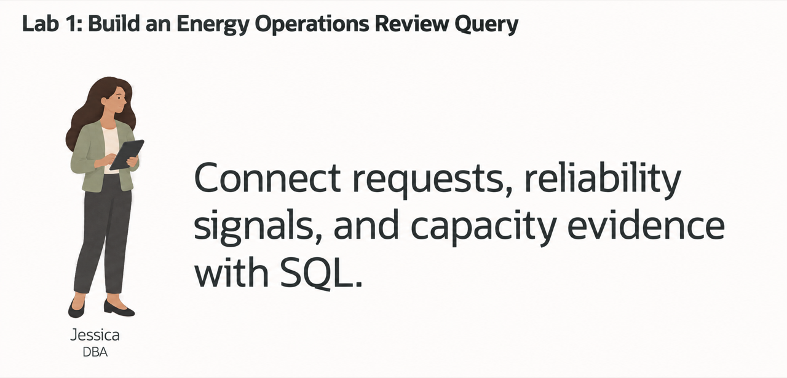
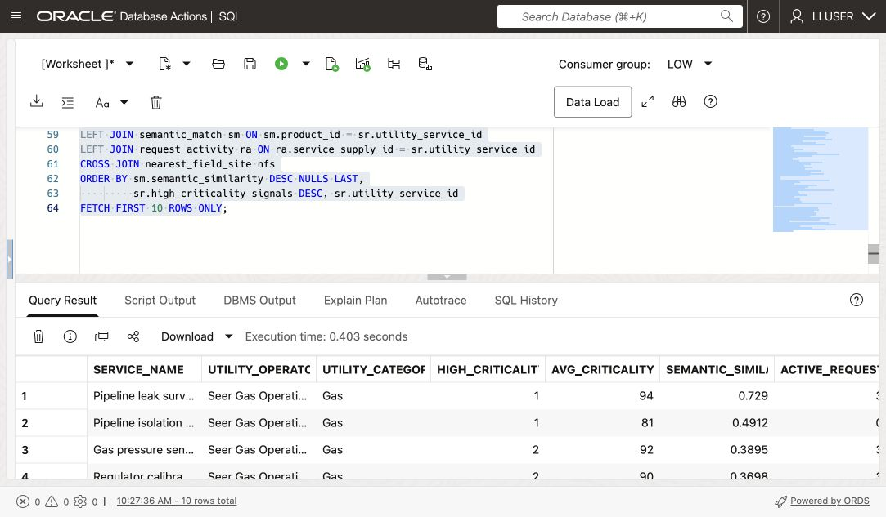
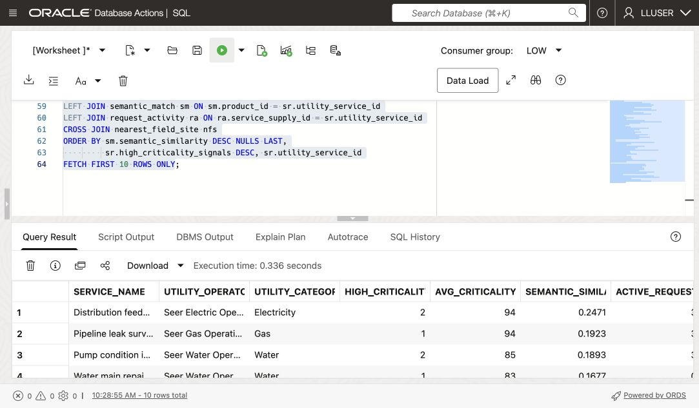

# Build a Converged Dashboard Query

## Introduction

Jessica Chen, Seer Utility Network's DBA, needs to help operations decide which utility services need attention first. The answer depends on warning signs, active service requests, service descriptions, and field-site locations.

Build the SQL behind her Energy Operations Command Center. One query combines relational risk data, vector search, JSON service requests, and spatial distance so operations can review the results together.



### Objectives

- Explain what Oracle AI Database convergence means in an Energy & Utilities decision workflow.
- Run one query that combines relational, vector, JSON, and spatial database capabilities.
- Modify the query to investigate a different risk question and explain the change in results.

Estimated Time: **10 minutes**

> **Video pending:** A Utilities walkthrough for this lesson has not yet been recorded.

> **SQL Worksheet:** [Getting Started: open SQL Worksheet as LLUSER](?lab=getting-started), Task 2.

## Task 1: Run a converged risk investigation

The dashboard is a starting point for the decision, not the decision itself. Run the query below to produce a compact investigation view for high-criticality utility services.

The query intentionally crosses four data models:

- **Relational:** `RELIABILITY_LOAD_SIGNALS_V`, `POST_PRODUCT_MENTIONS`, and `UTILITY_SERVICES_V` connect critical signals to services and partners.
- **Vector:** `PRODUCT_EMBEDDINGS` ranks services by similarity to the investigation phrase.
- **JSON:** `JSON_TABLE` projects `lineItems` from `UTILITY_SERVICE_REQUESTS_DV` so active service requests can be counted.
- **Spatial:** `SDO_GEOM.SDO_DISTANCE` compares active field sites with the Houston Metro service-territory polygon.

> **Prepared data:** The prepared schema includes Houston Metro, reliability scores from 0 to 100, a 384-dimensional embedding model owned by LLUSER, and the JSON fields used below. The threshold is 80. An empty territory selection makes the final cross join empty; investigate the setup before interpreting the result.

1. Open SQL Worksheet as `LLUSER`.

2. Run the query:

    <copy>
```sql
<copy>
WITH service_risk AS (
    SELECT us.utility_service_id, us.service_name,
           us.utility_operator_or_partner, us.utility_category,
           COUNT(DISTINCT rs.signal_id) AS high_criticality_signals,
           ROUND(AVG(rs.criticality_score), 1) AS avg_criticality
    FROM reliability_load_signals_v rs
    JOIN post_product_mentions ppm ON ppm.post_id = rs.signal_id
    JOIN utility_services_v us ON us.utility_service_id = ppm.product_id
    WHERE rs.criticality_score >= 80
    GROUP BY us.utility_service_id, us.service_name,
             us.utility_operator_or_partner, us.utility_category
), semantic_match AS (
    SELECT pe.product_id,
           ROUND(1 - VECTOR_DISTANCE(
             pe.embedding,
             VECTOR_EMBEDDING(LLUSER.ALL_MINILM_L12_V2
               USING 'gas pipeline pressure variance and leak response' AS DATA),
             COSINE), 4) AS semantic_similarity
    FROM product_embeddings pe
), request_activity AS (
    SELECT jt.service_supply_id,
           COUNT(DISTINCT jt.request_id) AS active_requests,
           SUM(jt.quantity) AS requested_units
    FROM utility_service_requests_dv d
    CROSS APPLY JSON_TABLE(d.data, '$' COLUMNS (
        request_id NUMBER PATH '$._id',
        request_status VARCHAR2(30) PATH '$.requestStatus',
        NESTED PATH '$.lineItems[*]' COLUMNS (
            service_supply_id NUMBER PATH '$.serviceSupplyId',
            quantity NUMBER PATH '$.quantity'
        )
    )) jt
    WHERE jt.request_status IN ('pending', 'confirmed', 'processing')
    GROUP BY jt.service_supply_id
), nearest_field_site AS (
    SELECT fc.center_name, fc.city, fc.state_province,
           dr.region_name, dr.demand_index,
           ROUND(SDO_GEOM.SDO_DISTANCE(
             fc.location, dr.boundary, 0.005, 'unit=KM'), 2) AS distance_km
    FROM fulfillment_centers fc
    CROSS JOIN demand_regions dr
    WHERE dr.region_name = 'Houston Metro'
      AND fc.is_active = 1
      AND fc.location IS NOT NULL
      AND dr.boundary IS NOT NULL
    ORDER BY SDO_GEOM.SDO_DISTANCE(
               fc.location, dr.boundary, 0.005, 'unit=KM'), fc.center_id
    FETCH FIRST 1 ROW ONLY
)
SELECT sr.service_name, sr.utility_operator_or_partner,
       sr.utility_category, sr.high_criticality_signals,
       sr.avg_criticality, sm.semantic_similarity,
       NVL(ra.active_requests, 0) AS active_requests,
       NVL(ra.requested_units, 0) AS requested_units,
       nfs.center_name AS nearest_field_site,
       nfs.city || ', ' || nfs.state_province AS field_site_location,
       nfs.region_name, nfs.demand_index, nfs.distance_km
FROM service_risk sr
LEFT JOIN semantic_match sm ON sm.product_id = sr.utility_service_id
LEFT JOIN request_activity ra ON ra.service_supply_id = sr.utility_service_id
CROSS JOIN nearest_field_site nfs
ORDER BY sm.semantic_similarity DESC NULLS LAST,
         sr.high_criticality_signals DESC, sr.utility_service_id
FETCH FIRST 10 ROWS ONLY;
</copy>
```
</copy>

3. Review the ranked services. Each row combines warning signs, semantic similarity, active requests, and field-site distance.

    

    Your numbers may be different if the demo data has changed. Each row should include all four types of data.

Use the first row to explain why the service needs review. Signals and requests indicate potential impact; similarity shows how it matches the concern; distance provides field-site context. Crew availability and capacity still need checking.

## Task 2: Change the investigation question

Jessica and an operations analyst now test a different concern. Change the embedded investigation phrase to:

```text
field service workload and restoration capacity
```



Run the query again and compare the top rows.

1. Which utility services moved into or out of the top ten?
2. Which utility services still have high relational signal counts but a lower semantic similarity to the new question?
3. Does the service-request activity make you more or less concerned about the operational impact?

Semantic similarity determines the review order; signal counts break ties. Explain how the new phrase changed the queue.

## Next Steps

Next, use JSON Relational Duality to expose the same service-request data as JSON for an application while keeping SQL access for the database team.

## Acknowledgements

* **Authors** - Matt Kowalik, Kevin Lazarz
* **Contributor** - Eugenio Galiano
* **Last Updated By/Date** - Oracle Database Product Management, October 2026
