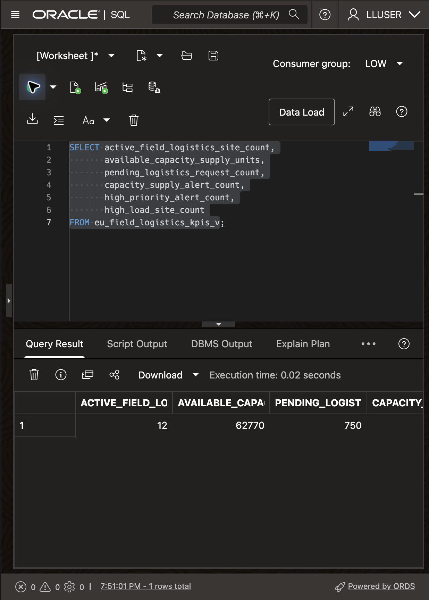
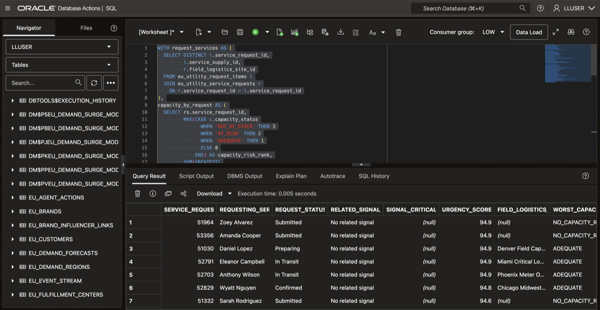

# Build an Energy Operations Review Query

## Introduction

Jessica Chan is the database administrator (DBA) responsible for keeping Seer Utility Network’s operational data reliable and useful. Every morning, the field-operations team asks her a familiar question: **which service requests need attention first, and what capacity is available to support the response?** Customers depend on reliable utility service; a request may need attention because of its urgency, related reliability evidence, or a shortage of response supplies.

Jessica can see the answer taking shape in the Energy Operations Command Center, but the supporting evidence is spread across related operational records. Service requests and urgency are relational rows. Reliability signals describe conditions that may affect those requests. Field-logistics capacity records show the availability of the services and supplies needed to respond. The data is connected by operational meaning, but that does not automatically make the investigation easy to query.

In the past, Jessica might have had to maintain reporting extracts, coordinate with field-logistics teams for capacity information, and reconcile separate operational dashboards before she could explain why a request should be reviewed. That creates more copies of operational data, more security boundaries, and more opportunities for the dashboard answer and the underlying detail to disagree. Her challenge is not simply finding another database feature. It is giving field operations one answer they can trace back to the same governed data.

Jessica sees an opportunity in Oracle AI Database’s converged architecture. A converged database lets one governed database support different data models and workloads together. Relational tables and views remain the foundation, while JSON documents, vectors, spatial geometry, graphs, and machine-learning results can be used alongside them when the operational question requires it. This reduces the need for complex integration across separate systems and data copies.

In this lab, you take Jessica’s role as the DBA developing an operational review query. You connect service-request urgency, related reliability evidence, assigned field-logistics sites, and available capacity in one relational SQL result. This query does not execute JSON, vector, graph, or spatial operations. Later labs use those capabilities on the same database foundation.


<details>
<summary><strong>Key terms: views, reliability evidence, and response capacity</strong></summary>

> - A **view** is a saved SQL query. The workshop views give operational rows business-readable names without requiring a separate reporting copy.
> - **Reliability evidence** describes a possible utility-service problem. An associated signal helps prioritize investigation; it does not establish that a failure occurred.
> - **Field-logistics capacity** is the availability of services and supplies that support a response. Available units here are on-hand units minus reservations, floored at zero—not electricity generation capacity or a confirmed dispatch allocation.

</details>

### Objectives

- Summarize current service-request risk.
- Connect request urgency to field-logistics capacity.
- Explain how relational evidence forms the foundation for the workshop’s converged database journey.

Estimated Time: **10 minutes**

<video controls width="100%">
  <source src="https://c4u04.objectstorage.us-ashburn-1.oci.customer-oci.com/p/EcTjWk2IuZPZeNnD_fYMcgUhdNDIDA6rt9gaFj_WZMiL7VvxPBNMY60837hu5hga/n/c4u04/b/livelabsfiles/o/livestack%2FVideos%2FFinance%2F01-Finance%20Workshop_LAB-1_with-CC.mp4">
  Your browser does not support the video tag.
</video>

### Hands-on Scenario

Jessica first verifies the command-center totals, then drills into the sites where high-priority requests and low capacity require review.

| Step | Energy & Utilities focus |
| --- | --- |
| Business Problem | Field operations need a clear way to identify service requests where urgency, reliability evidence, and capacity constraints require review. |
| Technical Challenge | The answer connects service requests, requested services, reliability signals, assigned field-logistics sites, and available capacity. |
| Persona Focus | Jessica Chan, the DBA, develops the query that explains the Energy Operations Command Center. |
| What You Will Do | Verify the command-center KPIs, then run one SQL query that produces a traceable operational review list. |
| Database Capability | Relational SQL joins governed Energy & Utilities views without separate reports or operational data copies. |
| Outcome | The learner can explain why a request needs review by tracing dashboard evidence back to its underlying operational rows. |

Persona focus: Help Jessica give field operations a reviewable request list, not an automatic dispatch decision.

> **SQL Worksheet reminder:** Need a reminder on how to open and use the SQL Worksheet? Return to [Getting Started Task 2: Open SQL Worksheet](?lab=getting-started#Task2:OpenSQLWorksheet) for the step-by-step guide showing how to run SQL statements.

## Task 1: Read the command-center KPIs

The dashboard is a starting point for the decision, not the decision itself. A key performance indicator (KPI) summarizes a measure. `EU_FIELD_LOGISTICS_KPIS_V` provides one row of site, request, and supply measures so Jessica can establish the scale of the operational workload before reviewing individual requests.

1. Open SQL Worksheet as `LLUSER`.

2. Run the query below to return the current command-center KPI summary.

    <copy>
    ```sql
    SELECT active_field_logistics_site_count,
           available_capacity_supply_units,
           pending_logistics_request_count,
           capacity_supply_alert_count,
           high_priority_alert_count,
           high_load_site_count
    FROM eu_field_logistics_kpis_v;
    ```
    </copy>

3. Review the result as the command-center summary behind Jessica’s dashboard. Compare the measures below; supply units and request counts measure different things and should not be subtracted from one another.

    **Expected output: Field-logistics summary**

    | Active sites | Available supply units | Pending requests | Supply alerts | High-priority alerts | High-load sites |
    | --- | --- | --- | --- | --- | --- |
    | 12 | 62,770 | 750 | 19 | 4 | 0 |

    
    These values describe the prepared workshop dataset. The screenshot shows all six summary values; the query above the grid supplies the full names for abbreviated column headings.

Use the row to explain the operational takeaway: the totals show the scale of current demand and response capacity, while the alert counts show where field operations may need to investigate further. The KPI summary identifies the need for review; it does not yet identify the individual service request or assigned site behind that need.

With separate reporting extracts, request, reliability, and capacity totals could become inconsistent or require manual reconciliation. Oracle AI Database keeps the governed operational data together, so the command center and its detailed review queries can use the same database foundation. In the next task, Jessica drills into the individual service requests behind these totals and traces each request to its related reliability evidence, assigned field-logistics site, and available response capacity.

## Task 2: Build the operational review list

The totals do not tell Jessica which request to investigate. The next query reads `EU_UTILITY_SERVICE_REQUESTS`, connects each request to its distinct requested services in `EU_UTILITY_REQUEST_ITEMS`, and looks up their capacity at the assigned site in `EU_ASSET_CAPACITY_V`.

Read its two named query blocks first: `request_services` avoids counting the same service twice within a request; `capacity_by_request` summarizes available units and the worst capacity status. The final `LEFT JOIN` keeps a request visible even when no matching capacity row exists. Urgency sorts first, then signal criticality, then the request identifier to break ties.

1. Run the detailed query and identify the first request Jessica should review under this urgency-first ordering.

    <copy>
    ```sql
    WITH request_services AS (
      SELECT DISTINCT i.service_request_id,
             i.service_supply_id,
             r.field_logistics_site_id
      FROM eu_utility_request_items i
      JOIN eu_utility_service_requests r
        ON r.service_request_id = i.service_request_id
    ),
    capacity_by_request AS (
      SELECT rs.service_request_id,
             MAX(CASE c.capacity_status
                   WHEN 'OUT_OF_STOCK' THEN 3
                   WHEN 'AT_RISK' THEN 2
                   WHEN 'ADEQUATE' THEN 1
                   ELSE 0
                 END) AS capacity_risk_rank,
             SUM(GREATEST(
               NVL(c.quantity_on_hand, 0) - NVL(c.quantity_reserved, 0), 0
             )) AS available_units
      FROM request_services rs
      JOIN eu_asset_capacity_v c
        ON c.utility_service_id = rs.service_supply_id
       AND c.field_logistics_site_id = rs.field_logistics_site_id
      GROUP BY rs.service_request_id
    )
    SELECT r.service_request_id,
           r.requesting_service_point_name,
           r.request_status_display_name,
           r.related_signal_label,
           ROUND(r.related_signal_criticality_score, 1) AS signal_criticality,
           ROUND(r.urgency_score, 1) AS urgency_score,
           r.field_logistics_site_name,
           CASE NVL(c.capacity_risk_rank, 0)
             WHEN 3 THEN 'OUT_OF_STOCK'
             WHEN 2 THEN 'AT_RISK'
             WHEN 1 THEN 'ADEQUATE'
             ELSE 'NO_CAPACITY_ROW'
           END AS worst_capacity_status,
           NVL(c.available_units, 0) AS available_units,
           NVL(c.capacity_risk_rank, 0) AS capacity_risk_rank
    FROM eu_utility_service_requests r
    LEFT JOIN capacity_by_request c
      ON c.service_request_id = r.service_request_id
    WHERE r.request_status IN ('pending', 'confirmed', 'processing', 'shipped')
    ORDER BY r.urgency_score DESC NULLS LAST,
             signal_criticality DESC NULLS LAST,
             r.service_request_id
    FETCH FIRST 15 ROWS ONLY;
    ```
    </copy>

2. Select one row and explain the evidence chain: request, service point, signal, assigned site, and available capacity.

    **Expected output: 15 requests for operational review**

    | Evidence | Stable check |
    | --- | --- |
    | Request | A service request identifier and status appear. |
    | Risk | Urgency and, when present, signal criticality support the ordering. |
    | Response | The assigned site, capacity status, and available units are visible. |

    `NO_CAPACITY_ROW` means evidence is missing; it is not an observed stockout. Available units summarize the matched service/site rows and do not guarantee that every requested service can be fulfilled.

    

    *This screenshot shows seven operational-review rows, beginning with request `51964`. Some headings, site names, and capacity-status values are truncated. Inspect the full values and additional columns in your own result grid.*

    The KPI pending count includes `pending`, `confirmed`, and `processing` requests; this review also includes `shipped`. Likewise, the KPI supply alert includes quantities at the reorder point, while `AT_RISK` requires a quantity below it. The two results answer related questions, not identical counts.

> **Checkpoint:** The request identifier is the traceable key. The dashboard can summarize several capabilities, but every conclusion still leads back to governed rows in the same database.

> **🎯 Interactive challenge:** Order capacity alerts before request urgency. Compare the first three rows with the original result and explain which operational question each ordering answers.

<details>
<summary><strong>Challenge answer</strong></summary>

Use the complete alternate query below. The original ordering prioritizes request urgency; this version prioritizes the most constrained capacity evidence and uses the request identifier as a deterministic tie-breaker.

    ```sql
    WITH request_services AS (
      SELECT DISTINCT i.service_request_id,
             i.service_supply_id,
             r.field_logistics_site_id
      FROM eu_utility_request_items i
      JOIN eu_utility_service_requests r
        ON r.service_request_id = i.service_request_id
    ),
    capacity_by_request AS (
      SELECT rs.service_request_id,
             MAX(CASE c.capacity_status
                   WHEN 'OUT_OF_STOCK' THEN 3
                   WHEN 'AT_RISK' THEN 2
                   WHEN 'ADEQUATE' THEN 1
                   ELSE 0
                 END) AS capacity_risk_rank,
             SUM(GREATEST(
               NVL(c.quantity_on_hand, 0) - NVL(c.quantity_reserved, 0), 0
             )) AS available_units
      FROM request_services rs
      JOIN eu_asset_capacity_v c
        ON c.utility_service_id = rs.service_supply_id
       AND c.field_logistics_site_id = rs.field_logistics_site_id
      GROUP BY rs.service_request_id
    )
    SELECT r.service_request_id,
           r.requesting_service_point_name,
           r.request_status_display_name,
           r.related_signal_label,
           ROUND(r.related_signal_criticality_score, 1) AS signal_criticality,
           ROUND(r.urgency_score, 1) AS urgency_score,
           r.field_logistics_site_name,
           CASE NVL(c.capacity_risk_rank, 0)
             WHEN 3 THEN 'OUT_OF_STOCK'
             WHEN 2 THEN 'AT_RISK'
             WHEN 1 THEN 'ADEQUATE'
             ELSE 'NO_CAPACITY_ROW'
           END AS worst_capacity_status,
           NVL(c.available_units, 0) AS available_units,
           NVL(c.capacity_risk_rank, 0) AS capacity_risk_rank
    FROM eu_utility_service_requests r
    LEFT JOIN capacity_by_request c
      ON c.service_request_id = r.service_request_id
    WHERE r.request_status IN ('pending', 'confirmed', 'processing', 'shipped')
    ORDER BY capacity_risk_rank DESC,
             r.urgency_score DESC NULLS LAST,
             r.service_request_id
    FETCH FIRST 15 ROWS ONLY;
    ```

</details>

## Next Steps

Jessica now has a traceable request list and can explain how a different ordering changes the review priority. Thomas next reads a service request as an application-ready JSON document while retaining this relational foundation.

## Acknowledgements

* **Author** - Zileyah Onafowora
* **Last Updated By/Date** - Zileyah Onafowora, September 2026
