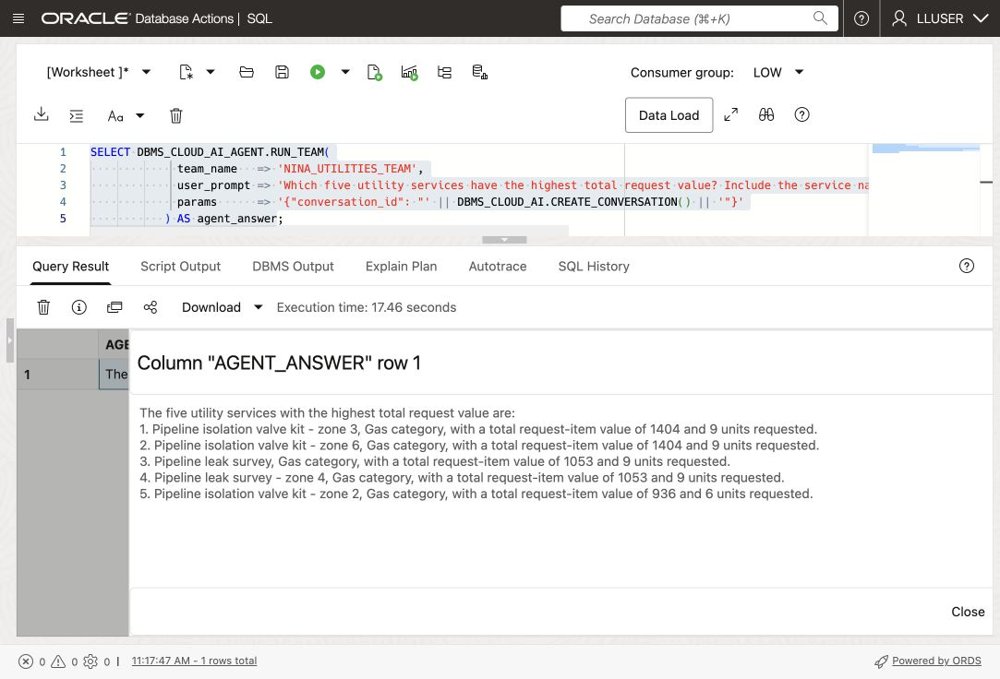
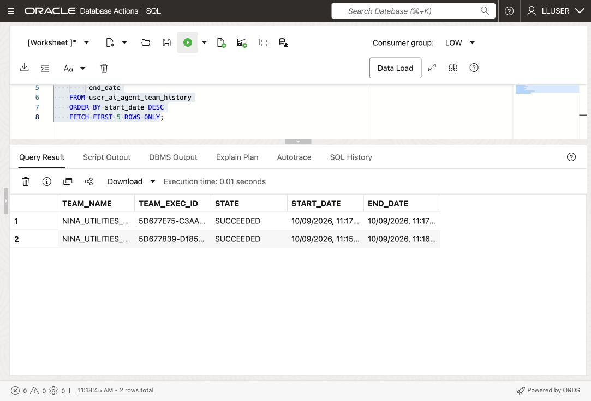
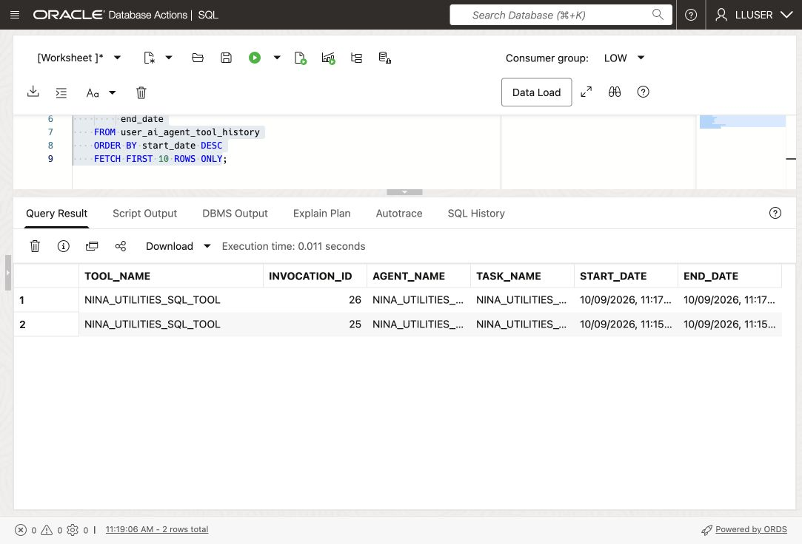

# Build an Energy & Utilities Agent with Select AI Agent

## Introduction

Nina Patel now needs a repeatable assistant for her service-request review screen. Build on the previous lab by giving an agent a role, task, and SQL tool, then inspect how it answers a request.

Jessica configures one tool using the `GENAI` profile and its Utilities views. Database privileges enforce access; the profile and agent instructions guide behavior.

The built-in SQL tool uses Select AI actions such as `runsql` and `showsql`; this lesson adds no custom write function. See the [Oracle package reference](https://docs.oracle.com/en-us/iaas/autonomous-database-serverless/doc/dbms-cloud-ai-agent-package.html).

<details>
<summary><strong>Key terms: agent, tool, task, and team</strong></summary>

> - An **agent** is a configured role that follows instructions when it handles a request.
>
> - A **tool** is a capability the agent is allowed to call. In this lab, the tool runs SQL through the `GENAI` profile.
>
> - A **task** tells the agent what to do and which tools it may use.
>
> - A **team** connects the agent and task so an application or SQL session can run them together.

</details>

### Objectives

- Confirm that the `GENAI` profile from the previous lab is available.
- Verify which utilities tables the SQL tool may use.
- Register a SQL query tool for the Utilities views.
- Create an agent, task, and team with `DBMS_CLOUD_AI_AGENT`.
- Run an Energy & Utilities question through the team.
- Review the agent's tool history and explain why the tool boundary matters.

Estimated Time: **15 minutes**

> **Video pending:** A Utilities walkthrough for this lesson has not yet been recorded.

> **Prerequisite:** Complete [Lab 7: Ask Energy & Utilities Questions with Select AI](?lab=ask-energy-utilities). This lab uses the `GENAI` profile and its `object_list`.

> **AI setup:** The SQL tool retains `GENAI`. You create a separate reasoning profile and remove it with the agent objects in the reset step.

## Task 1: Check the profile and table access

Check `GENAI` and its object list. Generated SQL runs with the current database user's privileges.

1. Check the profile:

    <copy>
    ```sql
    SELECT profile_name,
           status
    FROM user_cloud_ai_profiles
    WHERE profile_name = 'GENAI';
    ```
    </copy>

    The profile should be enabled. If it is not present, complete Lab 7 first or ask the DBA which profile to use.

2. Check the tables listed in the profile:

    <copy>
    ```sql
    SELECT profile_name,
           attribute_name,
           attribute_value
    FROM user_cloud_ai_profile_attributes
    WHERE profile_name = 'GENAI'
      AND attribute_name = 'object_list';
    ```
    </copy>

    The list should contain only the workshop tables needed for this lab: `UTILITY_SERVICES_V`, `UTILITY_SERVICE_REQUESTS`, `UTILITY_REQUEST_ITEMS`, and `SERVICE_POINTS_V`. The `object_list` guides SQL generation; it is not a replacement for database grants.

3. Check the agent objects already in your schema:

    <copy>
    ```sql
    SELECT agent_name,
           status
    FROM user_ai_agents
    ORDER BY agent_name;
    ```
    </copy>

    The workshop objects use names beginning with `NINA_UTILITIES_`. If you already ran this lab, use the reset block in the appendix before recreating the objects.

4. Create a separate profile for the agent's reasoning. The SQL tool continues to use `GENAI` and its approved object list. This profile reuses the existing OCI connection settings and credential; it does not create a new credential.

    <copy>
    ```sql
    DECLARE
      l_attributes CLOB;
    BEGIN
      SELECT JSON_OBJECTAGG(
               attribute_name VALUE DBMS_LOB.SUBSTR(attribute_value, 4000, 1)
               RETURNING CLOB)
      INTO l_attributes
      FROM user_cloud_ai_profile_attributes
      WHERE profile_name = 'GENAI'
        AND attribute_name IN
            ('provider', 'credential_name', 'region', 'oci_compartment_id');

      SELECT JSON_MERGEPATCH(
               l_attributes,
               '{"model":"meta.llama-3.3-70b-instruct","temperature":0}'
               RETURNING CLOB)
      INTO l_attributes
      FROM dual;

      DBMS_CLOUD_AI.CREATE_PROFILE(
        profile_name => 'NINA_UTILITIES_PROFILE',
        attributes   => l_attributes
      );
    END;
    /
    ```
    </copy>

    This reasoning model was tested in `us-chicago-1`. If unavailable in your region, ask the facilitator for a tested replacement. Keeping it separate from `GENAI` leaves the SQL tool configuration intact.

## Task 2: Register the SQL tool

Register the SQL tool with `GENAI` so it uses the object list checked in Task 1.

1. Register the tool:

    <copy>
    ```sql
    BEGIN

      DBMS_CLOUD_AI_AGENT.CREATE_TOOL(
        tool_name   => 'NINA_UTILITIES_SQL_TOOL',
        attributes  => '{"tool_type": "SQL", "tool_params": {"profile_name": "genai"}}',
        description => 'Query the workshop Utilities views through Select AI'
      );
    END;
    /
    ```
    </copy>

    The object list guides SQL generation; it does not enforce read-only access. LLUSER owns the workshop tables, so check the actual SQL calls in Task 5.

2. Confirm the tool definition:

    <copy>
    ```sql
    SELECT tool_name,
           status,
           description
    FROM user_ai_agent_tools
    WHERE tool_name = 'NINA_UTILITIES_SQL_TOOL';
    ```
    </copy>

## Task 3: Create Nina's agent, task, and team

The tool by itself does nothing. Nina's agent needs a role, a task needs instructions, and a team connects the two.

1. Create the agent:

    <copy>
    ```sql
    BEGIN
      DBMS_CLOUD_AI_AGENT.CREATE_AGENT(
        agent_name  => 'NINA_UTILITIES_AGENT',
        attributes  => '{"profile_name": "NINA_UTILITIES_PROFILE", "role": "You answer utilities database questions using the SQL tool and report the returned data. Do not invent values or request changes to records.", "enable_human_tool": false}',
        description => 'Energy & Utilities assistant for Nina Patel'
      );
    END;
    /
    ```
    </copy>

2. Create the task:

    <copy>
    ```sql
    BEGIN
      DBMS_CLOUD_AI_AGENT.CREATE_TASK(
        task_name  => 'NINA_UTILITIES_TASK',
        attributes => '{"instruction": "Use the SQL tool to answer this database question: {query}. Report the database result. Do not change records.", "tools": ["NINA_UTILITIES_SQL_TOOL"], "enable_human_tool": false}',
        description => 'Answer utility service and service-point questions'
      );
    END;
    /
    ```
    </copy>

3. Create the team:

    <copy>
    ```sql
    BEGIN
      DBMS_CLOUD_AI_AGENT.CREATE_TEAM(
        team_name  => 'NINA_UTILITIES_TEAM',
        attributes => '{"agents": [{"name": "NINA_UTILITIES_AGENT", "task": "NINA_UTILITIES_TASK"}], "process": "sequential"}',
        description => 'Utilities question team'
      );
    END;
    /
    ```
    </copy>

    The team is the runnable unit. It connects Nina's role, the task instructions, and the SQL tool.

## Task 4: Run an Energy & Utilities question

Database Actions does not support the `SELECT AI AGENT` command directly. Use `DBMS_CLOUD_AI_AGENT.RUN_TEAM` in SQL Worksheet and provide the team name in the function call.

1. Ask the agent:

    <copy>
    ```sql
    SELECT DBMS_CLOUD_AI_AGENT.RUN_TEAM(
             team_name   => 'NINA_UTILITIES_TEAM',
             user_prompt => 'Which five utility services have the highest total request value? Include the service name, utility category, total request-item value, and units requested.',
             params      => '{"conversation_id": "' || DBMS_CLOUD_AI.CREATE_CONVERSATION() || '"}'
           ) AS agent_answer;
    ```
    </copy>

    Database Actions does not keep an agent conversation ID for this call, so the query creates one and passes it to `RUN_TEAM`. The ID lets Oracle record the prompt and response in the agent conversation history.

    

2. Review the answer.

    Look for the service ranking, category, request value, and units requested. The exact wording may vary because an AI provider generates the response, but the answer should be based on the utilities tables available through `GENAI`.

3. Optional challenge: ask a follow-up question that connects the highest-request-value service to its customers and orders. A more detailed request may take longer because the agent has to interpret more steps.

## Task 5: Inspect what the agent did

Nina needs more than a final answer. She also wants to know whether the agent called the approved tool and how the request was processed.

1. Review the latest team runs:

    <copy>
    ```sql
    SELECT team_name,
         team_exec_id,
         state,
         start_date,
         end_date
    FROM user_ai_agent_team_history
    ORDER BY start_date DESC
    FETCH FIRST 5 ROWS ONLY;
    ```
    </copy>

    

2. Review the latest tool calls:

    <copy>
    ```sql
    SELECT tool_name,
         invocation_id,
         agent_name,
         task_name,
         start_date,
         end_date
    FROM user_ai_agent_tool_history
    ORDER BY start_date DESC
    FETCH FIRST 10 ROWS ONLY;
    ```
    </copy>

    

    The history should show `NINA_UTILITIES_SQL_TOOL`. This gives Nina and Jessica a database record of the agent activity instead of treating the answer as an unexplained chat response.

## Conclusion: Give the agent a controlled way to work

Nina has a callable assistant with a defined task and one SQL tool. Jessica can inspect its tool history to verify how it obtained the answer.

## Appendix: Reset the workshop objects

Run this block to recreate the lab setup. It removes the team, task, agent, SQL tool, and reasoning profile created here.

<copy>
```sql
BEGIN
  DBMS_CLOUD_AI_AGENT.DROP_TEAM('NINA_UTILITIES_TEAM', TRUE);
  DBMS_CLOUD_AI_AGENT.DROP_TASK('NINA_UTILITIES_TASK', TRUE);
  DBMS_CLOUD_AI_AGENT.DROP_AGENT('NINA_UTILITIES_AGENT', TRUE);
  DBMS_CLOUD_AI_AGENT.DROP_TOOL('NINA_UTILITIES_SQL_TOOL', TRUE);
  DBMS_CLOUD_AI.DROP_PROFILE('NINA_UTILITIES_PROFILE', TRUE);
END;
/
```
</copy>

## Next Steps

Read the [Oracle AI Database Select AI Agent documentation](https://docs.oracle.com/en/database/oracle/oracle-database/26/selai/).

## Acknowledgements

* **Authors** - Matt Kowalik, Kevin Lazarz
* **Contributor** - Eugenio Galiano
* **Last Updated By/Date** - Oracle Database Product Management, October 2026
