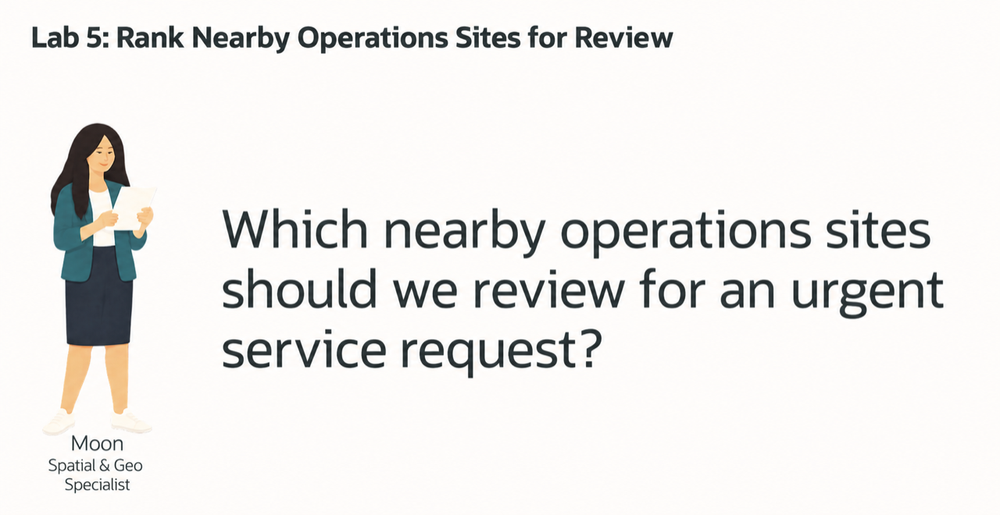
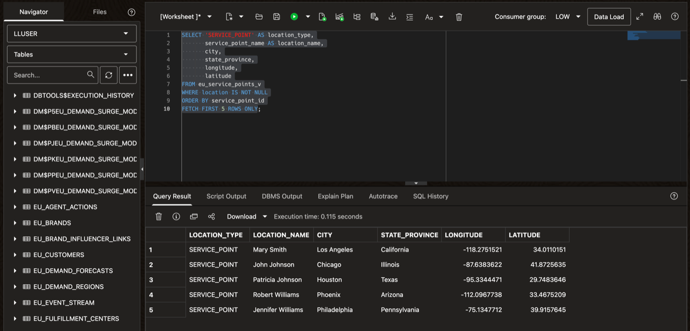
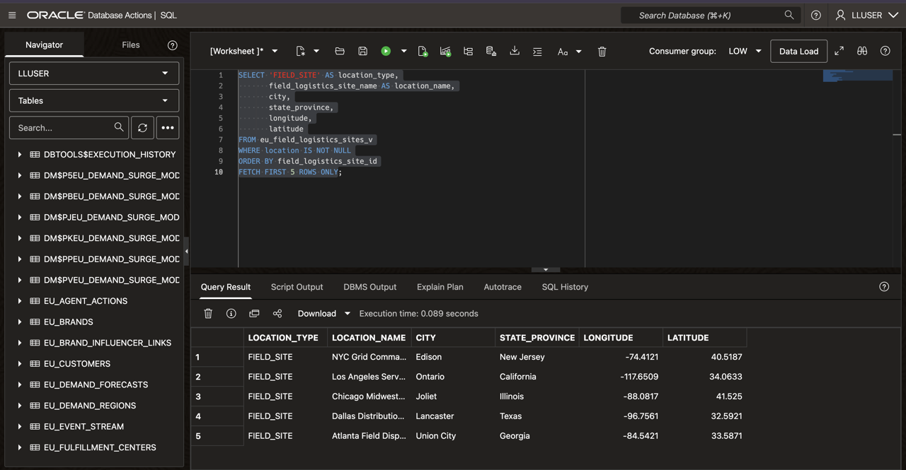
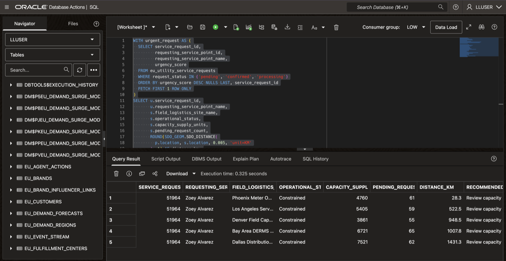

# Rank Nearby Operations Sites for Review

## Introduction

Moon Kai is the spatial specialist at Seer Utility Network. She helps Jessica’s operations team answer a practical question: **which nearby field-logistics sites should a dispatcher review when an urgent service request needs support?**

The closest site is a useful starting point, but proximity alone does not establish that it can help. A nearby site may already have a heavy workload or limited capacity. Jessica needs to see those constraints alongside location information before discussing the options with a dispatcher.

Moon uses Oracle Spatial to compare the request’s location with stored field-logistics site locations. By combining spatial distance with operational data in SQL, she can present nearby sites and their workload context in one result.

In this lab, you inspect the stored point locations, then rank five active sites near the highest-urgency open request. Review the distances and capacity constraints to explain which sites deserve further consideration.

The result is a shortlist for human review, not a dispatch instruction. Geographic proximity does not establish road travel time, crew availability, or a site’s ability to fulfill the request.



<details>
<summary><strong>Key terms: point geometry, coordinate system, geodetic distance, and field-logistics capacity</strong></summary>

- A **point geometry** represents one geographic location. In this lab, Oracle Spatial stores service-point and field-logistics site locations using `SDO_GEOMETRY`.

- A **coordinate system** defines how coordinates represent locations on Earth. The prepared locations use longitude and latitude in the World Geodetic System 1984 (WGS84), identified by spatial reference identifier (SRID) `4326`.

- **Geodetic distance** measures separation between locations over the Earth’s surface. This lab reports the distance between the request’s service-point location and each field-logistics site in kilometers. It does not calculate road routes or travel time.

- **Field-logistics capacity** describes the supplies or operational support available for a response. An active, nearby site may still have capacity constraints that a dispatcher must review. This is not a measurement of electrical generation capacity.

</details>

### Objectives

- Inspect the stored locations used for service points and field-logistics sites.
- Use Oracle Spatial to rank five active sites near the highest-urgency open service request.
- Compare geographic distance with the workload and capacity information returned by the query.
- Explain why the closest active site is not automatically the best site to support a request.
- Present a shortlist for dispatcher review without treating the result as an automatic dispatch decision.

Estimated Time: **10 minutes**


<video controls width="100%">
  <source src="https://c4u04.objectstorage.us-ashburn-1.oci.customer-oci.com/p/EcTjWk2IuZPZeNnD_fYMcgUhdNDIDA6rt9gaFj_WZMiL7VvxPBNMY60837hu5hga/n/c4u04/b/livelabsfiles/o/livestack%2FVideos%2FFinance%2F05-Finance%20Workshop_LAB-5_with-CC.mp4" type="video/mp4">
  Your browser does not support the video tag.
</video>

*The video uses a Finance example. Follow the E&U tasks below for this lab’s approved profile, views, and operational questions.*

### Hands-on Scenario

Moon helps Jessica identify nearby field-logistics sites for an urgent service request, while keeping capacity constraints visible for dispatcher review.

| Step | Energy & Utilities focus |
| --- | --- |
| Business Problem | An urgent service request needs operational support, but the closest site may have limited capacity. |
| Technical Challenge | Combine geographic proximity with workload and capacity information in one SQL result. |
| Persona Focus | You follow Moon’s spatial analysis to help Jessica explain the available options. |
| What You Will Do | Rank five active sites by distance from the service point associated with the highest-urgency open request. |
| Database Capability | `SDO_GEOM.SDO_DISTANCE` calculates point-to-point distance using stored spatial geometries. |
| Outcome | Produce a shortlist with distance and capacity context for a dispatcher to review—not an automatic dispatch decision. |


> **SQL Worksheet reminder:** Need a reminder on how to open and use the SQL Worksheet? Return to [Getting Started Task 2: Open SQL Worksheet](?lab=getting-started#Task2:OpenSQLWorksheet) for the step-by-step graphic showing where to paste and run SQL statements.


## Task 1: Inspect stored locations

Before comparing nearby sites, Moon checks the locations used on both sides of the calculation: the service point needing support and the field-logistics sites that could provide it.

These queries display longitude and latitude for the first five records with non-null geometry in each view. They show samples, not the total number of locations or a complete geometry-validation check.

1. Run the service-point inventory. A service point represents the location associated with a customer’s request.

    ```sql
    <copy>
    SELECT 'SERVICE_POINT' AS location_type,
           service_point_name AS location_name,
           city,
           state_province,
           longitude,
           latitude
    FROM eu_service_points_v
    WHERE location IS NOT NULL
    ORDER BY service_point_id
    FETCH FIRST 5 ROWS ONLY;
    </copy>
    ```

    **Expected output: Five service-point locations**

    

2. Run the field-site inventory as a separate statement. These sites represent potential sources of operational support; this inventory does not yet filter for active sites or assess their capacity.

    ```sql
    <copy>
    SELECT 'FIELD_SITE' AS location_type,
           field_logistics_site_name AS location_name,
           city,
           state_province,
           longitude,
           latitude
    FROM eu_field_logistics_sites_v
    WHERE location IS NOT NULL
    ORDER BY field_logistics_site_id
    FETCH FIRST 5 ROWS ONLY;
    </copy>
    ```

    **Expected output: Five field-logistics site locations**

    

> **Checkpoint:** Both statements should return five rows in the prepared dataset. Longitude and latitude are coordinates, not distance values. Task 2 uses the stored `LOCATION` geometries to calculate distances.

## Task 2: Find the closest active sites

Jessica wants one reproducible starting case. The `urgent_request` clause selects the highest-urgency request with status `pending`, `confirmed`, or `processing`; request ID breaks a tie. The main query compares its service point with every active site that has a location.

1. Run the proximity candidate query.

    ```sql
    <copy>
    WITH urgent_request AS (
      SELECT service_request_id,
             requesting_service_point_id,
             requesting_service_point_name,
             urgency_score
      FROM eu_utility_service_requests
      WHERE request_status IN ('pending', 'confirmed', 'processing')
      ORDER BY urgency_score DESC NULLS LAST, service_request_id
      FETCH FIRST 1 ROW ONLY
    )
    SELECT u.service_request_id,
           u.requesting_service_point_name,
           s.field_logistics_site_name,
           s.operational_status,
           s.capacity_supply_units,
           s.pending_request_count,
           ROUND(SDO_GEOM.SDO_DISTANCE(
             p.location, s.location, 0.005, 'unit=KM'
           ), 1) AS distance_km,
           s.recommended_action
    FROM urgent_request u
    JOIN eu_service_points_v p
      ON p.service_point_id = u.requesting_service_point_id
    CROSS JOIN eu_field_logistics_sites_v s
    WHERE p.location IS NOT NULL
      AND s.location IS NOT NULL
      AND s.is_active = 1
    ORDER BY distance_km, s.field_logistics_site_id
    FETCH FIRST 5 ROWS ONLY;
    </copy>
    ```

    **Expected output: Five active sites ranked by proximity**

    For the prepared dataset, request `51964` is the starting case. Phoenix Meter Operations Hub appears first at about `28.3` km. All five returned sites are `Constrained`, so proximity alone does not identify an unconstrained response location.

    

    *The screenshot shows the distance-query excerpt and five candidate sites. Distances are reported in kilometers, not travel times. Some site names and recommended-action text are truncated; expand the cells or columns in the worksheet to review the full values.*

2. Identify the nearest candidate site, then review its operational status, capacity supply units, pending work, and recommended action.

    | Column | What to review |
    | --- | --- |
    | `DISTANCE_KM` | Nonnegative distances ordered from nearest to farthest at the displayed precision. |
    | `OPERATIONAL_STATUS` | Indicates operational constraints that may affect suitability. |
    | `CAPACITY_SUPPLY_UNITS` | Provides supply-capacity context for the site. |
    | `PENDING_REQUEST_COUNT` | Shows the site's pending request workload. |
    | `RECOMMENDED_ACTION` | Provides guidance for human review, not an automatic dispatch instruction. |

    The query compares every eligible site in this small dataset using `SDO_GEOM.SDO_DISTANCE`. It does not use the `SDO_NN` nearest-neighbor operator or demonstrate indexed nearest-neighbor retrieval.

    Distances represent geodetic proximity over the Earth's surface, not road routes or travel time. The query rounds kilometers to one decimal place before sorting on `DISTANCE_KM`; site ID breaks ties at that displayed precision.

> **Checkpoint:** An active site is not necessarily an unconstrained site. Moon's result identifies nearby candidates, but a dispatcher must review their capacity and workload before deciding whether they can support the request.

## Task 3: Explain the proximity evidence

Moon has given Jessica a ranked list, but the closest site is not automatically the right choice. Jessica now needs to explain what the result supports and what a dispatcher must still verify.

1. Review the five candidate sites. Identify the nearest site and explain how its operational status, capacity supply units, and pending requests affect your recommendation for further investigation.

> **Checkpoint:** Distance is one input, not an automatic dispatch command. A dispatcher also considers safety, crew skills, required parts, service territory, workload, and current site constraints. This query does not verify all those conditions.

**🎯 Interactive challenge:** Does the five-row result establish that any candidate is unconstrained? Recommend the first site to investigate and name one additional fact a dispatcher would need before assigning work.

<details>
<summary><strong>Challenge answer</strong></summary>

No. All five sites are `Constrained` in the prepared dataset, so the result does not identify an unconstrained candidate.

Phoenix Meter Operations Hub is a reasonable first site to investigate because it is the nearest candidate. That does not establish that it can accept the work.

Before assigning a response, the dispatcher would need additional evidence, such as crew availability, appropriate skills, required parts, or service-territory eligibility. The query has not tested those conditions.

</details>

## Conclusion: Add location evidence to a service decision

Moon combined geographic distance with workload and capacity information in one SQL result. Jessica can now explain which active sites are nearby and which constraints require further review.

Oracle Spatial supplied the location evidence alongside the operational records. You produced a shortlist for a dispatcher—not a map, a road route, or an automatic dispatch decision.

## Next Steps

Proximity helps narrow the options, but changing demand can place additional pressure on capacity. Otto next evaluates a prepared demand model and combines its predictions with current capacity evidence.

## Acknowledgements

* **Author** - Zileyah Onafowora
* **Last Updated By/Date** -Zileyah Onafowora, September 2026
