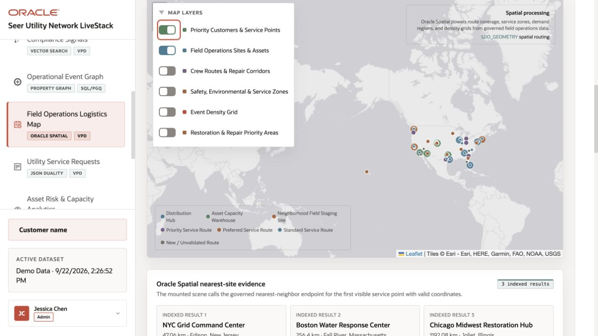
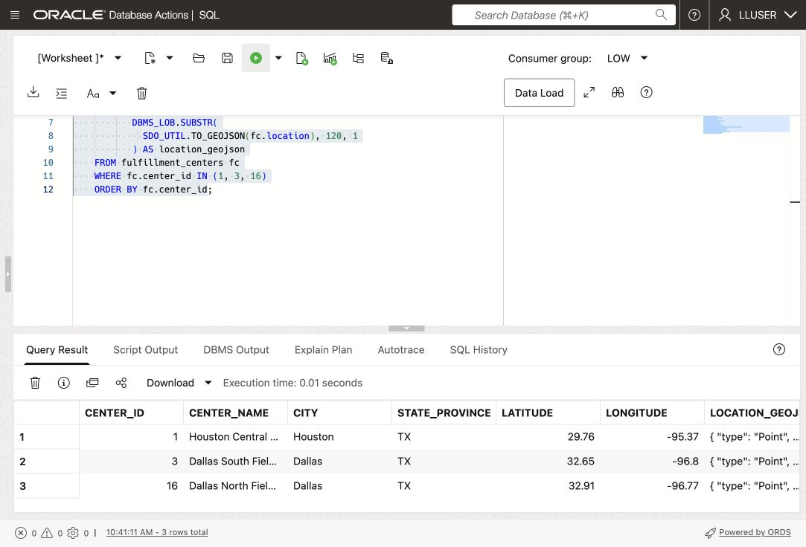
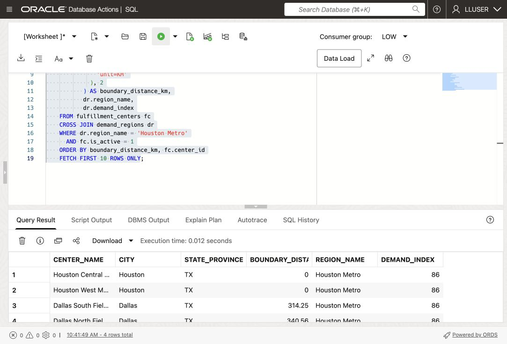
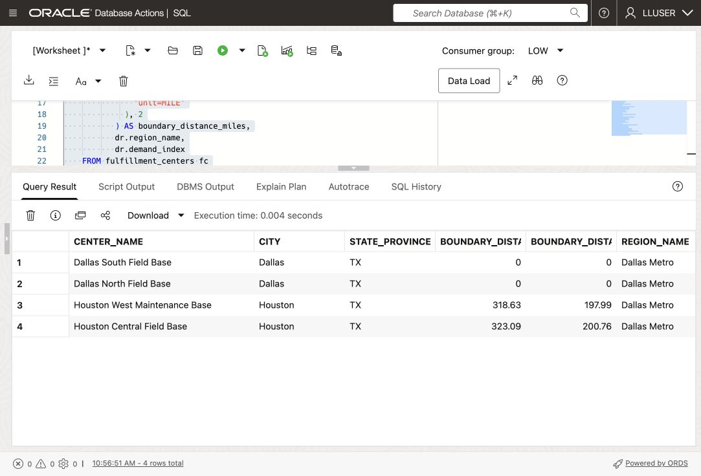
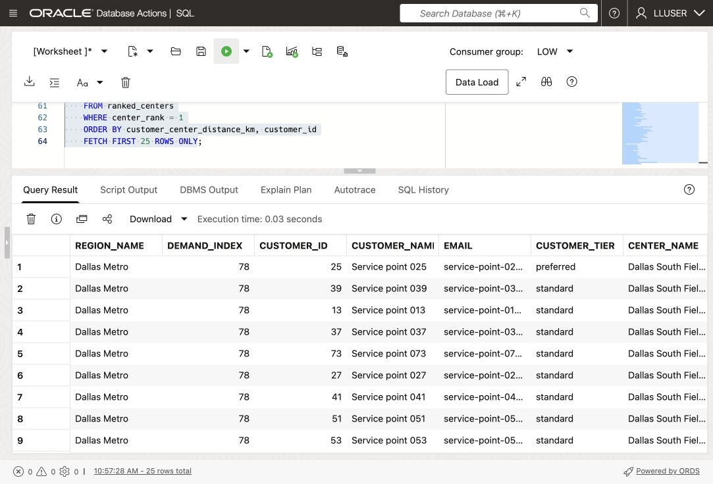

# Route Customers to the Closest Field Logistics Site

## Introduction

Moon Kai, Seer Utility Network's spatial specialist, needs to identify service points in a territory with growing demand and find the nearest active field logistics site for each one.

Use stored points and territory polygons to measure distance, select service points, and build a list for operations to review.


<details>
<summary><strong>Key terms: point, polygon, distance, spatial relationship, and GeoJSON</strong></summary>

> - A **point** is one location, represented by longitude and latitude. In this lab, a field logistics site is stored as an `SDO_GEOMETRY` point.
>
> - A **polygon** is an area made from connected points. Service territories are stored as polygons.
>
> - **Distance** measures how far two spatial objects are from each other. Here, it shows how far a field logistics site is from a service-territory polygon. A distance of zero means the center is inside or touching the region.
>
> - A **spatial relationship** describes how two shapes relate to each other. `SDO_GEOM.RELATE` can test whether a service-point location is inside or touches a service territory.
>
> - **GeoJSON** is a JSON format for map locations and shapes. `SDO_UTIL.TO_GEOJSON` lets an application display the same database location on a map.
>
</details>

The LiveStack Field Operations Logistics Map illustrates how an application presents locations and site details.



*LiveStack Energy & Utilities Demo: Field Operations Logistics Map*

### Objectives

- Identify spatial points and polygons in the utilities data.
- Convert a database point to GeoJSON for an application map.
- Measure which field logistics sites are closest to a service territory.
- Find service points inside a service territory.
- Match each customer to the closest active field logistics site.

Estimated Time: **10 minutes**

> **Schema names:** `CUSTOMERS` represents service points; `FULFILLMENT_CENTERS` represents field logistics sites.

> **SQL Worksheet:** [Getting Started: open SQL Worksheet as LLUSER](?lab=getting-started), Task 2.

## Task 1: Look at the locations as points

Moon starts with the field-site locations. Each `SDO_GEOMETRY` point includes a geometry type, coordinate reference system, longitude, and latitude.

`SDO_UTIL.TO_GEOJSON` converts the stored geometry into a map-ready JSON object. SQL calculations and map display use the same location.

1. Run this query:

    ```sql
    <copy>
    SELECT fc.center_id,
           fc.center_name,
           fc.city,
           fc.state_province,
           fc.latitude,
           fc.longitude,
           DBMS_LOB.SUBSTR(
             SDO_UTIL.TO_GEOJSON(fc.location), 120, 1
           ) AS location_geojson
    FROM fulfillment_centers fc
    WHERE fc.center_id IN (1, 3, 16)
    ORDER BY fc.center_id;
    </copy>
    ```

    `LOCATION` is the database point. `LATITUDE` and `LONGITUDE` make the value easy to read, and `LOCATION_GEOJSON` gives an application a map-ready representation of the same point. GeoJSON lists longitude first and latitude second. `SDO_UTIL.TO_GEOJSON` returns a CLOB, so `DBMS_LOB.SUBSTR` limits the displayed text to 120 characters; it does not change the stored geometry.

    **Expected output: Field Logistics Site Points**

    

2. Review the point data.

    Check the coordinates and GeoJSON output for the same site.

## Task 2: Find the closest centers to a service territory

Moon uses the seeded Houston Metro demonstration territory and compares active field-site points with its polygon. These synthetic boundaries illustrate Spatial functions and are not official service territories.

1. Run the distance query:

    ```sql
    <copy>
    SELECT fc.center_name,
           fc.city,
           fc.state_province,
           ROUND(
             SDO_GEOM.SDO_DISTANCE(
               fc.location,
               dr.boundary,
               0.005,
               'unit=KM'
             ), 2
           ) AS boundary_distance_km,
           dr.region_name,
           dr.demand_index
    FROM fulfillment_centers fc
    CROSS JOIN demand_regions dr
    WHERE dr.region_name = 'Houston Metro'
      AND fc.is_active = 1
    ORDER BY boundary_distance_km, fc.center_id
    FETCH FIRST 10 ROWS ONLY;
    </copy>
    ```

    `SDO_GEOM.SDO_DISTANCE` compares the field-site point with the service-territory polygon. The function returns the shortest distance between the two shapes. A value of `0` means the point is inside or touching the region.

    The four arguments in this query have simple roles:

    - `fc.location` is the first geometry: the field-site point.
    - `dr.boundary` is the second geometry: the service-territory polygon.
    - `0.005` is the tolerance used when Oracle compares the geometries. It helps Oracle handle small differences in the stored coordinates.
    - `'unit=KM'` tells Oracle to return the distance in kilometers. Change it to `'unit=MILE'` when the application needs miles.

    The `ROUND(..., 2)` around the function result only formats the answer to two decimal places. It does not change the spatial calculation.

    The query also returns `DEMAND_INDEX`, so Moon can read location and demand together. The center with the smallest distance is the first center operations should check for available capacity.

    **Expected output: Houston Service Coverage**

    Expect active sites ordered by nonnegative distance, nearest first.

    

2. Try another region.

    Change the region name to `Dallas Metro`, add a miles calculation, and run the modified query:

    ```sql
    <copy>
    SELECT fc.center_name,
           fc.city,
           fc.state_province,
           ROUND(
             SDO_GEOM.SDO_DISTANCE(
               fc.location,
               dr.boundary,
               0.005,
               'unit=KM'
             ), 2
           ) AS boundary_distance_km,
           ROUND(
             SDO_GEOM.SDO_DISTANCE(
               fc.location,
               dr.boundary,
               0.005,
               'unit=MILE'
             ), 2
           ) AS boundary_distance_miles,
           dr.region_name,
           dr.demand_index
    FROM fulfillment_centers fc
    CROSS JOIN demand_regions dr
    WHERE dr.region_name = 'Dallas Metro'
      AND fc.is_active = 1
    ORDER BY boundary_distance_km, fc.center_id
    FETCH FIRST 10 ROWS ONLY;
    </copy>
    ```

    

    Compare kilometers and miles. A zero distance means the site intersects the polygon. The seeded demand indexes are 86 for Houston and 78 for Dallas.

    Distance to a territory does not locate individual service points. Next, find those points and compare their nearest sites.

## Task 3: Match service points to the closest active field site

Select service points inside Houston Metro, compare each with active field sites, and retain the closest site.

1. Run the service-point routing query:

    ```sql
    <copy>
    WITH regional_customers AS (
      SELECT dr.region_name,
             dr.demand_index,
             c.customer_id,
             c.first_name || ' ' || c.last_name AS customer_name,
             c.email,
             c.customer_tier,
             c.location
      FROM customers c
      CROSS JOIN demand_regions dr
      WHERE dr.region_name = 'Houston Metro'
        AND SDO_GEOM.RELATE(
              dr.boundary,
              'ANYINTERACT',
              c.location,
              0.005
            ) = 'TRUE'
    ), ranked_centers AS (
      SELECT rc.region_name,
             rc.demand_index,
             rc.customer_id,
             rc.customer_name,
             rc.email,
             rc.customer_tier,
             fc.center_name,
             fc.city AS center_city,
             fc.capacity_units,
             fc.current_load_pct,
             ROUND(
               SDO_GEOM.SDO_DISTANCE(
                 rc.location,
                 fc.location,
                 0.005,
                 'unit=KM'
               ), 2
             ) AS customer_center_distance_km,
             ROW_NUMBER() OVER (
               PARTITION BY rc.customer_id
               ORDER BY SDO_GEOM.SDO_DISTANCE(
                          rc.location,
                          fc.location,
                          0.005,
                          'unit=KM'
                        ), fc.center_id
             ) AS center_rank
      FROM regional_customers rc
      CROSS JOIN fulfillment_centers fc
      WHERE fc.is_active = 1
    )
    SELECT region_name,
           demand_index,
           customer_id,
           customer_name,
           email,
           customer_tier,
           center_name,
           center_city,
           capacity_units,
           current_load_pct,
           customer_center_distance_km
    FROM ranked_centers
    WHERE center_rank = 1
    ORDER BY customer_center_distance_km, customer_id
    FETCH FIRST 25 ROWS ONLY;
    </copy>
    ```

    `SDO_GEOM.RELATE` keeps service points whose location falls inside or touches the Houston Metro polygon. `SDO_GEOM.SDO_DISTANCE` then measures the distance from each matching customer to every active center. `ROW_NUMBER` keeps the nearest center for each customer.

2. Review the result as an operations decision.

    Review each service point alongside its nearest site, distance, capacity, current load, and territory demand score.

    

3. Change the query to `Dallas Metro`.

    Compare the service points and nearest sites with the Houston result. Only the territory filter changes.

    

> **Interpretation:** These queries measure geodetic proximity, not road travel time or dispatch feasibility. Check crew skills, safety, territory eligibility and capacity before a field assignment.

## Conclusion: Turn Location into a Service Decision

Moon has a territory-specific list of service points and nearby field sites. Operations can use it to review coverage alongside capacity and crew eligibility.

## Next Steps

For more spatial exercises, open the [Oracle Spatial LiveLabs workshop](https://livelabs.oracle.com/ords/r/dbpm/livelabs/view-workshop?clear=RR,180&wid=800).

## Acknowledgements

* **Authors** - Matt Kowalik, Kevin Lazarz
* **Contributor** - Eugenio Galiano, Linda Foinding
* **Last Updated By/Date** - Oracle Database Product Management, October 2026
