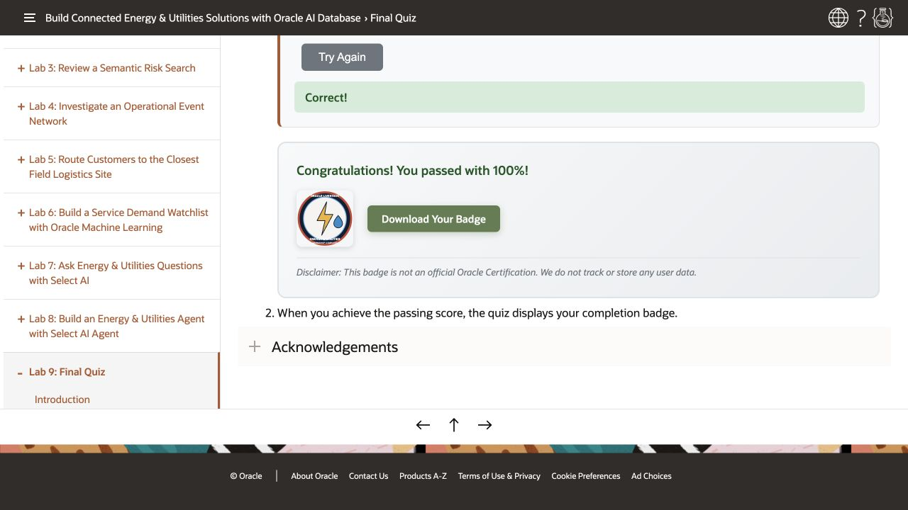

# Final Quiz

```quiz-config
passing: 75
badge: images/energy-utilities-badge.svg
```

## Introduction

Use this scored quiz to check whether you can explain how the database results support Seer Utility Network's operations.

### Objectives

- Review the main database capabilities used in the workshop.
- Earn the workshop badge by answering the scored questions.

Estimated Time: **3 minutes**

## Task 1: Answer the quiz questions

1. Complete the scored quiz.

    ```quiz score
    Q: What does JSON Relational Duality help Seer Utility Network do in the service-request lab?
    - Copy service-request documents into a separate document database.
    * Use the same service-request data as JSON documents or relational tables without maintaining duplicate records.
    - Remove relational tables from the service-request review process.
    - Force analysts to manually read raw JSON for every review.
    > A duality view presents relational rows as a JSON document. Applications get the payload they need, while analysts still use SQL, keys, joins, and database controls against the same source.

    Q: In the vector lab, what does the similarity score help an analyst do?
    - Prove that a warning sign is a confirmed asset fault.
    - Replace the service and signal tables with embeddings only.
    * Rank services or signals by how closely they match the search phrase.
    - Count how many rows exist in each utilities table.
    > The query turns vector distance into a similarity score, where a higher score means the stored service or signal text is closer in meaning to the search phrase.

    Q: What business problem does the property graph lab solve for restoration investigators?
    - It scores future electricity prices.
    * It explains connections across events, assets and shared restoration records.
    - It stores service coverage regions for operations teams.
    - It replaces relationship records with flat service totals.
    > The graph shows connected events, assets, crews, inspections, and work orders. Analysts can follow these paths without writing a separate series of joins for each path length.

    Q: Why does Seer Utility Network use spatial data in the service coverage lab?
    - To make coverage decisions outside the workshop database.
    - To hide capacity data from service operations leaders.
    * To find the closest field logistics site for a service point or high-demand region and combine that location with center capacity and current workload.
    - To replace spatial queries with static labels.
    > Spatial functions calculate distance and location relationships. SQL combines those results with service point, service-center, capacity, and demand data to support routing decisions.

    Q: In the OML lab, what does the surge probability mean?
    - It guarantees that the prediction will happen.
    * It is the model's estimated probability of a surge, which still needs review.
    - It is the number of rows in the OML model catalog.
    - It means the model no longer needs business context.
    > The class probability supports ranking, not certainty. Evaluate accuracy with separate observations that were not used to train the model. The synthetic scoring rows only demonstrate how to call it.

    Q: How can Nina check Select AI answers and control database access?
    - The model can query every object in the database automatically.
    - The narrative wording is guaranteed to be identical every time.
    * The profile guides SQL generation, database privileges control access, and Nina can inspect the SQL.
    - The answer bypasses the database and uses only general model knowledge.
    > The utilities Select AI profile has a narrow object list. The showsql action returns the generated query. Database privileges control access, and Nina compares the explanation with the query result.

    Q: What is the main advantage of using Oracle AI Database as the converged foundation for this workshop?
    - Each utilities capability must use a separate specialized data store.
    * One Oracle AI Database connects relational, JSON, vector, graph, spatial, machine-learning, and AI capabilities to the same data and database permissions.
    - Application screenshots replace the need to check query results.
    - Operations teams must reconcile copied data before every investigation.
    > Each lab uses a different capability, but the teams work from connected data in one database. This reduces duplicate copies and separate integration paths while preserving database controls.
    ```

2. When you achieve the passing score, the quiz displays your completion badge.

    

## Acknowledgements

* **Authors** - Matt Kowalik, Kevin Lazarz
* **Contributors** - Teodor Nechita
* **Last Updated By/Date** - Oracle Database Service Management, October 2026
