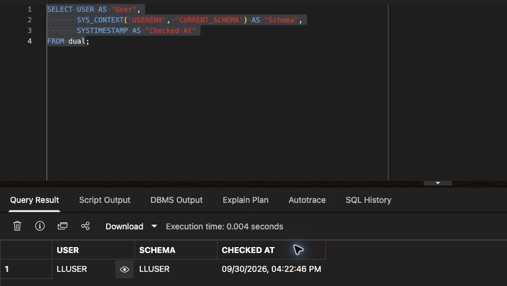
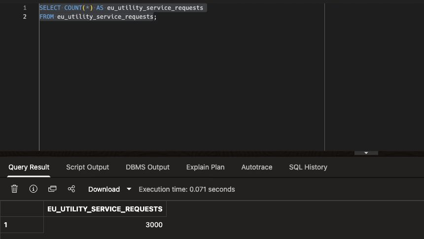

# Getting Started

## Introduction

Before Jessica can investigate service requests, she needs to know which account and dataset her queries use. You will open Database Actions SQL Worksheet as `LLUSER`, check the connection, and confirm that the prepared Energy and Utilities data is available. You do not run the backend loader in this workshop.

Estimated Time: **5 minutes**

### Objectives

- Open the LiveLabs reservation information.
- Sign in to Database Actions as `LLUSER`.
- Verify the Energy and Utilities dataset before starting Lab 1.

## Task 1: Launch the LiveLabs environment

1. Open your LiveLabs reservation and select **View Login Info**. For a facilitator-provided environment, use the launch details supplied by the facilitator instead.
2. Confirm that the workshop username is `LLUSER` and copy the supplied database password. Do not save it in a script, screenshot, or workshop file.
3. Open the supplied Database Actions login URL in another tab. Use the environment assigned to you, not a URL copied from a result screenshot.
4. Sign in with username `LLUSER` and the supplied password.

> **Checkpoint:** Keep the reservation tab open. It contains the environment details you may need if your Database Actions session expires.

## Task 2: Open SQL Worksheet

1. On the Database Actions launchpad, open **Development** and select **SQL**. If SQL Worksheet opens directly, continue there.
2. Locate the editor, **Run Statement** button, and **Query Result** panel. Paste the code below into the editor. Select and run the first statement to identify the connected user and current schema, then select and run the second statement to count service requests.

    ```sql
    <copy>
    SELECT USER AS "User",
           SYS_CONTEXT('USERENV', 'CURRENT_SCHEMA') AS "Schema",
           SYSTIMESTAMP AS "Checked At"
    FROM dual;

    SELECT COUNT(*) AS eu_utility_service_requests
    FROM eu_utility_service_requests;
    </copy>
    ```

3. Confirm that `User` and `Schema` are both `LLUSER`. The timestamp describes your run and will differ from the illustration. If either account value differs, stop and contact the facilitator before querying workshop data.

    

4. Confirm that the service-request count is **3,000** in the prepared dataset. This is a readiness check, not the number of urgent or open requests that you will investigate in Lab 1.

    

    **Expected output pattern**

    | Check | Expected evidence |
    | --- | --- |
    | Connected user | `LLUSER` |
    | Current schema | `LLUSER` |
    | Dataset | `EU_UTILITY_SERVICE_REQUESTS` contains 3,000 prepared requests. |

## Task 3: Use SQL Worksheet throughout the workshop

1. Use each SQL code block's **Copy** button, then paste one block at a time into the worksheet.
2. For a `SELECT` query, select one statement and use **Run Statement**. For a PL/SQL block in a later lab, follow that lab's execution instruction; do not run an entire page at once.
3. Review the result grid before moving on. Widen columns or scroll horizontally to read full names. A sample image illustrates a result; it does not replace checking your own returned rows.
4. Keep this browser tab open. Each lab links back to this task when a worksheet reminder is useful.

> **Troubleshooting:** If an object is missing, stop and tell the workshop facilitator. The lab loader must complete before learners begin.

> **Checkpoint:** Can you identify the connected account, the service-request count, and the panel that displays query results? You are ready to build Jessica's energy operations review query.

Labs 1–6 use prepared database objects. Labs 7–8 additionally require the platform-owned `EU_GENAI` profile and approved provider configuration; their live validation remains pending. You can complete the earlier labs without calling an AI provider.

## Acknowledgements

* **Author** - Oracle Database Product Management
* **Last Updated By/Date** - Oracle Database Product Management, September 2026
