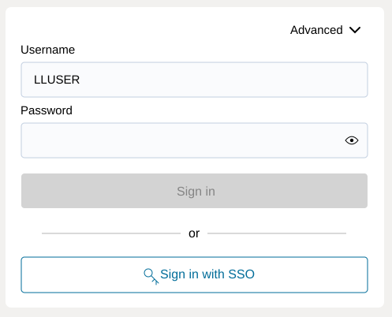
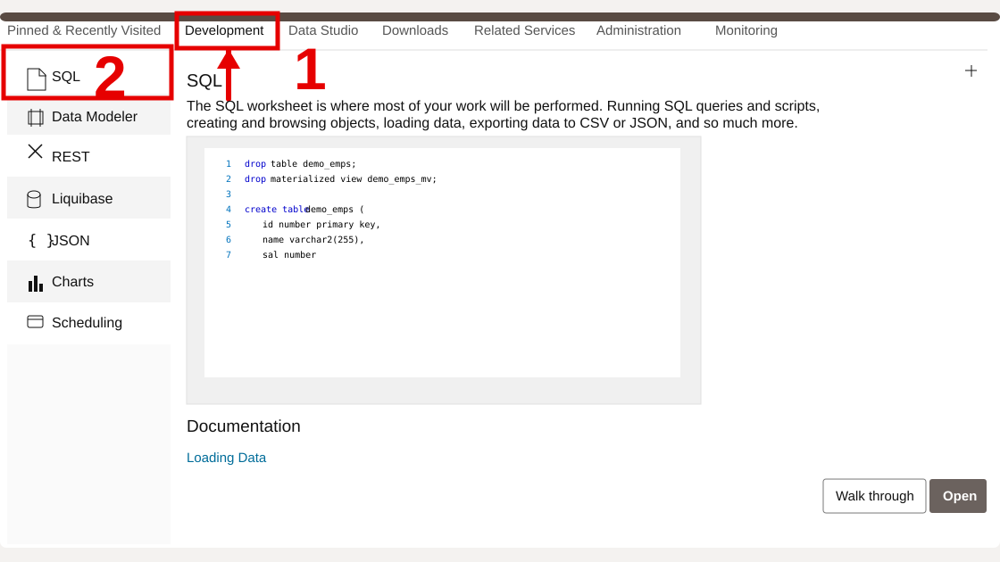
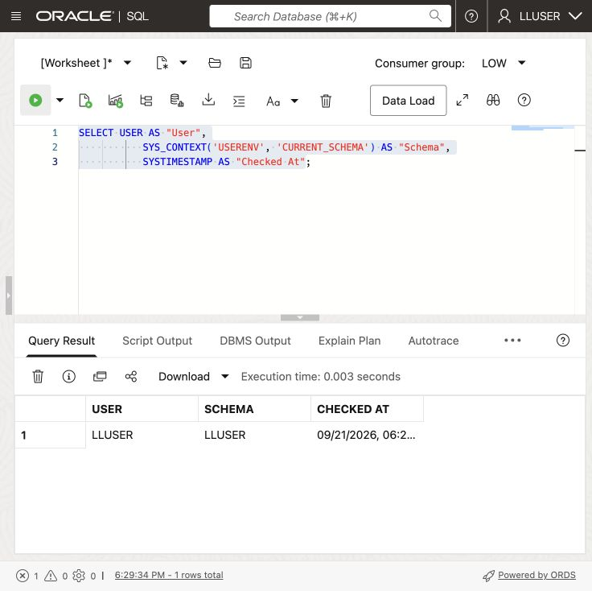

# Getting Started

## Introduction

The Energy & Utilities workshop runs in a **LiveLabs Sandbox**, launched using the green **Start** button. LiveLabs automatically prepares the database, workshop data, and required tools.

Once provisioning is complete, open **View Login Info** in your reservation. Use the supplied credentials to sign in as `LLUSER` and open **SQL Worksheet**, where you will run the lab queries.

Estimated Time: **5 minutes**

### Objectives

In this lab, you will:

- Launch the LiveLabs workshop environment.
- Use the reservation login information to open Database Actions.
- Confirm that SQL Worksheet is connected as the workshop schema user.

## Task 1: Launch the LiveLabs environment

Open the LiveLabs reservation for this workshop. It contains the database link and sign-in details.

1. Sign in to [LiveLabs](https://livelabs.oracle.com) with your Oracle account.

2. Open this workshop, select **Start**, and select **Run on LiveLabs Sandbox**.

3. Wait for your sandbox to finish provisioning. In **My Reservations**, select **Launch Workshop** for this reservation.

4. Select **View Login Info** and keep the database credentials available for the next task.

    

## Task 2: Open SQL Worksheet

Open SQL Worksheet as `LLUSER`. Run each query there and review the returned table.

1. In the **Reservation Information** dialog, confirm that **1 - Login** shows `LLUSER`.

2. Select **Copy** for **2 - Password**.

    

3. Select **Open Link** for **3 - Login URL**.

    

4. On the Database Actions sign-in page, confirm that **Username** shows `LLUSER`, paste the password from the reservation information, and select **Sign in**.

    

5. Before SQL Worksheet opens, select **Development**, then select **SQL** from the tools menu.

    

6. Use the same SQL Worksheet pattern throughout the workshop.

    - Confirm the user dropdown shows `LLUSER`.
    - Paste each workshop SQL block into the editor.
    - Select **Run Statement** or press **Ctrl+Enter** to run the current SQL statement.
    - Review the output in **Query Result** or **Script Output**, depending on the step.
    - Use **Navigator** only when you want to inspect tables, views, or other objects.

7. Run this check.

    Both `USER` and `CURRENT_SCHEMA` should show `LLUSER`. The first identifies the signed-in user; the second determines where unqualified table names resolve.

    ```sql
    <copy>
    SELECT USER AS "User",
           SYS_CONTEXT('USERENV', 'CURRENT_SCHEMA') AS "Schema",
           SYSTIMESTAMP AS "Checked At";
    </copy>
    ```

    

    **Expected output: Connected SQL Worksheet Session**

    | User | Schema | Checked At |
    | --- | --- | --- |
    | LLUSER | LLUSER | Current SQL Worksheet timestamp |

## Acknowledgements

* **Authors** - Matt Kowalik, Kevin Lazarz
* **Contributor** - Linda Foinding, Principal Database Service Manager
* **Last Updated By/Date** - Oracle Database Service Management, May 2026
