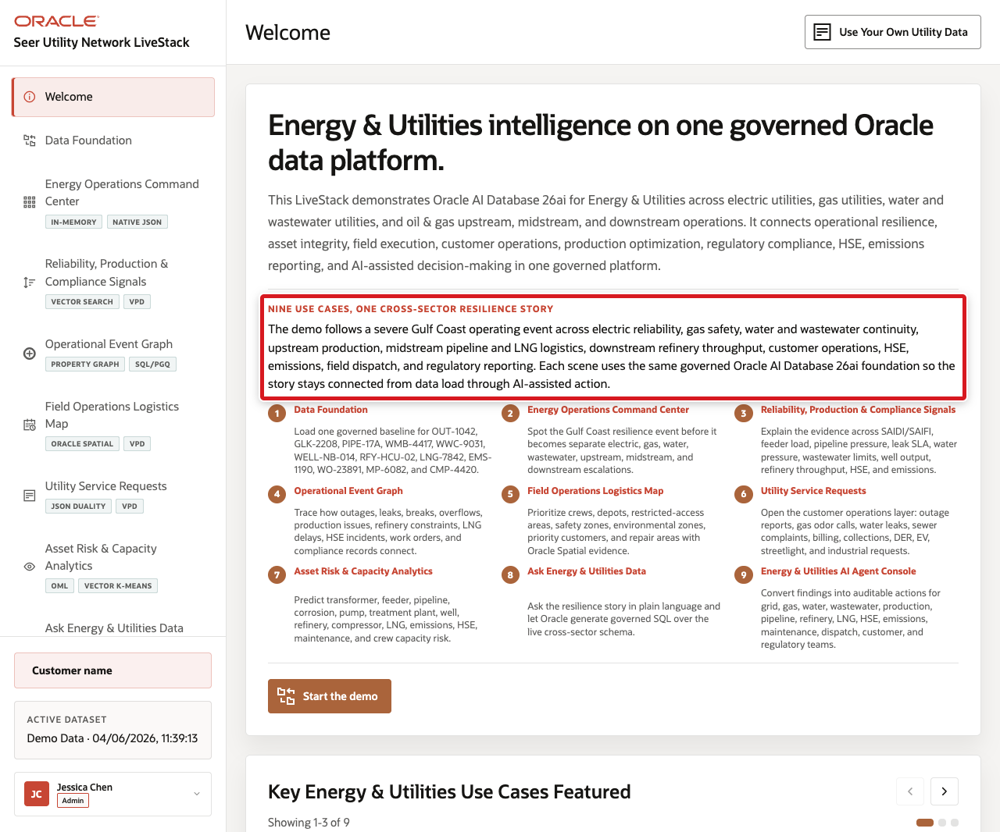

# Build Connected Energy and Utilities Solutions with Oracle AI Database

## Introduction

Jessica Chan is the database administrator at Seer Utility Network. Her teams operate electric, gas, water, wastewater, and oil and gas services. They need to respond to reliability signals, coordinate field work, manage service requests, and explain operational decisions with evidence.

The requests look different, but they share one problem: the data already lives in Oracle AI Database, and each team needs to use it in a different way.

- Thomas needs utility service requests as JSON for an application.
- Gilly needs semantic search that finds operational signals by meaning.
- Bob needs to follow relationships among outages, assets, crews, service points, and reliability gaps.
- Moon needs to calculate distances between service points and field logistics sites.
- Otto needs to train and score a service-demand model.
- Nina needs to ask utility operations questions in plain language and turn the results into controlled actions.

Jessica helps each team meet its requirement without creating a new copy of operational data or a separate security model for every feature. Relational tables remain the system of record, while JSON, vectors, graphs, spatial data, machine learning, Select AI, and Select AI Agent work with the same governed foundation.

### What the team builds

| Team member | Requirement | What you will see |
| --- | --- | --- |
| Jessica, DBA | Build the query behind an operations command center. | One SQL result connects requests, signals, logistics, and capacity evidence. |
| Thomas, application developer | Give the application flexible service-request documents. | JSON Relational Duality exposes relational request data as application-ready JSON. |
| Gilly, AI engineer | Find utility services related to an operational concern. | Vector search ranks records by meaning and keeps the result joined to business data. |
| Bob, graph specialist | Trace restoration and reliability pathways. | A property graph reveals connected assets, crews, events, and gaps. |
| Moon, spatial expert | Route field work to an appropriate site. | Oracle Spatial calculates distance using stored service-point and site locations. |
| Otto, data scientist | Identify services likely to face a demand surge. | Oracle Machine Learning trains and scores in the database. |
| Nina, operations analyst | Ask questions without writing every query from scratch. | Select AI exposes generated SQL; Select AI Agent uses approved tools and records execution history. |

<strong>Learn more: What does "converged database" mean?</strong>

> A converged database supports different data types and workloads on one database foundation. In this workshop, that includes relational rows, JSON documents, vectors, property graphs, geographic data, machine learning models, and AI-assisted SQL. Teams use the form that fits their task while privileges and evidence stay connected.

Throughout the workshop, select a **Learn more**, **Checkpoint**, or **Interactive challenge** heading to expand it. These sections add context without interrupting the main task flow.

### Objectives

- Follow Jessica and her team through one connected Energy and Utilities story.
- Use relational SQL, JSON, vectors, graphs, spatial data, Oracle Machine Learning, Select AI, and Select AI Agent.
- Inspect generated SQL and agent execution evidence before trusting an AI-assisted answer.
- Connect each database task to the Seer Utility Network application experience.

Estimated Workshop Time: **90 minutes**

## Acknowledgements

* **Author** - Oracle Database Product Management
* **Contributors** - LiveStack Energy and Utilities demo team
* **Last Updated By/Date** - Oracle Database Product Management, September 2026
