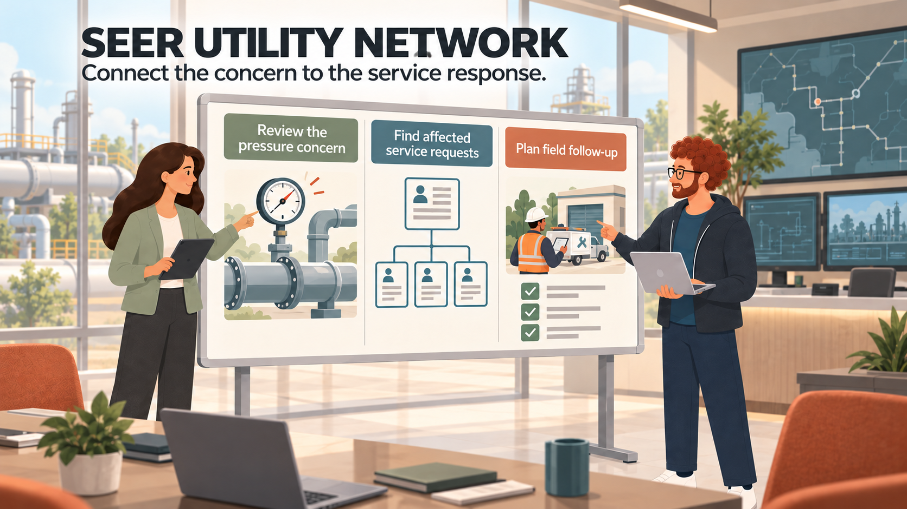
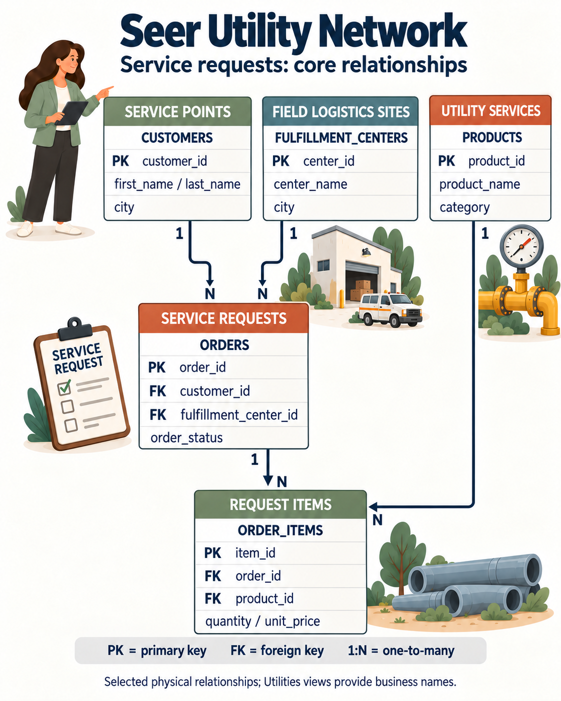
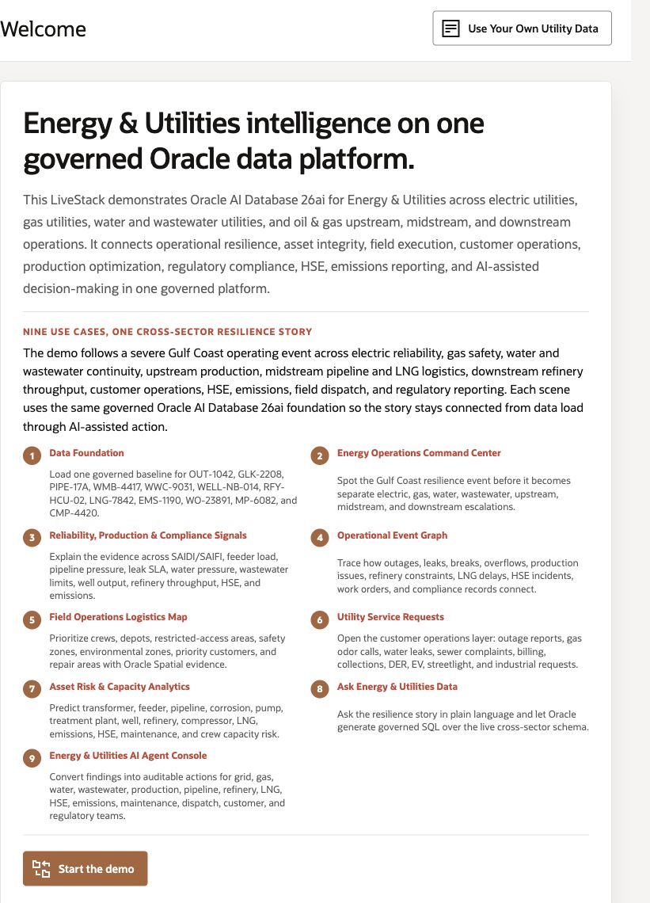

# Build Connected Energy & Utilities Solutions with Oracle AI Database

## Introduction

Jessica Chen, the DBA at Seer Utility Network, starts the morning with a question from utility operations. A field team has reported a gas pipeline pressure concern. Which service requests involve the affected services, and what should the team check before arranging field follow-up?

Jessica brings the team together around the records in Oracle AI Database. Follow each specialist as they build a dashboard, serve service-request documents, investigate operational signals, and plan a response. Before assigning field work, operations must still check asset condition, crew qualifications, site access, and available supplies. A database result supports that review; it does not authorize a dispatch.

### Seer Utility Network data model

Seer Utility Network is a fictional energy and utilities operator. This diagram shows the core service-request relationships used by the LiveStack: service points submit requests, field logistics sites support requests, and each request contains items for utility services or supplies.

*The diagram shows selected physical relationships in the reference application. `CUSTOMERS` represents service points, `ORDERS` holds service requests, and `PRODUCTS` holds utility services and supplies. Utilities views give these records business-facing names. A request can be unassigned to a field site; the diagram summarizes relationship direction rather than optionality. The workshop loader retains the depicted names and relationships.* [Open the full-size diagram](images/seer-utility-network-erd.png).

### What the team builds

| Team member | Your task |
| --- | --- |
| Jessica, DBA | Combine reliability signals, JSON service requests, semantic matches, and locations in one dashboard query. |
| Thomas, application developer | Compare JSON storage options and create and update service-request documents through a duality view. |
| Gilly, AI engineer | Search utility services by meaning and identify service points with related requests. |
| Bob, graph specialist | Trace operational events through assets, inspections, crews, and shared restoration records. |
| Moon, spatial specialist | Find service points in a territory and compare their nearest active field logistics sites. |
| Otto, data scientist | Train a service-demand model and build a service activity watchlist. |
| Nina, operations analyst | Ask questions with Select AI, then build an agent with an approved SQL tool. |

<strong>What does "converged database" mean?</strong>

> A **converged database** handles several data types and kinds of work in one database. Here, teams use relational rows, JSON documents, vectors, graphs, geographic data, machine learning models, and AI-assisted SQL.
>
> Teams use the form their application needs and keep the records and access controls together. They can query these data types without maintaining a separate store for each one.

### Objectives

- Run queries across relational, JSON, vector, graph, and spatial data.
- Train a service-demand model and use Select AI and Select AI Agent to query the Utilities schema.
- Interpret results, check database permissions and AI profile settings, and review the agent's tool history.
- Connect each database exercise to the Seer Utility Network application without maintaining separate copies of the operational records.

Estimated Workshop Time: **90 minutes**, with additional time for the optional AutoML experiment.

## Application example

Explore the [Seer Utility Network LiveStack Demo](http://134.98.142.113:8505/).

The application follows a Gulf Coast resilience event across electricity, gas, water and wastewater, and oil-and-gas operations. Its pages connect operational signals, restoration relationships, field logistics, service requests, analytics, and AI-assisted questions. The workshop begins with one pressure concern so you can follow the data and SQL step by step.

*LiveStack Energy & Utilities Demo: Welcome*

## Acknowledgements

* **Authors** - Matt Kowalik, Kevin Lazarz
* **Contributor** - Kevin Lazarz
* **Last Updated By/Date** - Oracle Database Product Management, October 2026
