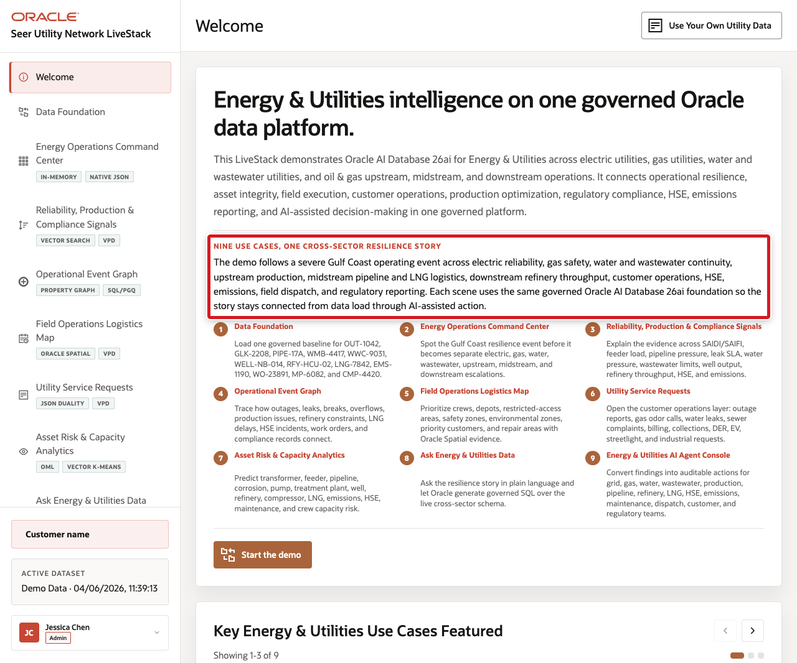

# Build Connected Energy and Utilities Solutions with Oracle AI Database

## Introduction

Jessica Chan is the database administrator at Seer Utility Network, which supports electric, gas, water, wastewater, and oil and gas services. Customers depend on reliable service. When a service request needs an operational response, the team must understand the request, investigate possible reliability problems, and check whether field-logistics sites can supply or support that response.

Jessica helps the team trace each dashboard number and recommendation back to database evidence. In this workshop, **reliability risk** means evidence of a possible utility-service problem, not proof of an outage. **Field-logistics capacity** means the inventory and site workload available to support a response, not electrical generation capacity or an automatic dispatch decision.

- Thomas needs utility service requests as JSON for an application.
- Gilly needs semantic search that finds service descriptions related to an operational concern.
- Bob needs to follow relationships among outages, assets, crews, service points, and reliability gaps.
- Moon needs to calculate distances between service points and field logistics sites.
- Otto needs to evaluate a prepared demand-surge model and combine its scores with capacity constraints.
- Nina needs to ask utility operations questions in plain language and turn the results into controlled operational review.

The welcome screen below shows the broader Seer Utility Network application. Use it as business context, not as an expected SQL result or a checklist of features built in every lab.

The workshop demonstrates convergence across successive labs. Lab 1 uses relational SQL; later labs inspect JSON documents, search vectors, follow graph relationships, compare locations, and evaluate machine-learning scores. These exercises keep evidence connected to its business rows. Labs 7–8 introduce provider-backed assistance, which also requires approved external AI configuration and data-sharing controls.

### What the team builds

| Team member | Requirement | What you will see |
| --- | --- | --- |
| Jessica, DBA | Build an energy operations review query. | Relational SQL connects requests, signals, logistics, and capacity evidence. |
| Thomas, application developer | Give the application flexible service-request documents. | JSON Relational Duality exposes relational request data as application-ready JSON. |
| Gilly, AI engineer | Find utility services related to an operational concern. | Vector search ranks records by meaning and keeps the result joined to business data. |
| Bob, graph specialist | Inspect the evidence linked to an operational event. | A directed, one-hop graph query and prepared findings connect events with assets and other evidence. |
| Moon, spatial expert | Identify nearby sites for review. | Straight-line geodetic distance ranks candidates; capacity and workload still matter. |
| Otto, data scientist | Build a demand and capacity watchlist. | A prepared Oracle Machine Learning model is evaluated on held-out labeled cases, then used for scoring. |
| Nina, operations analyst | Investigate site workload and service capacity in plain language. | Select AI and an operational review agent are planned exercises whose live behavior remains environment-dependent. |

> **Labs 7–8 prerequisite:** Live execution requires an enabled, `LLUSER`-accessible `EU_GENAI` profile, an approved provider credential and model, provider connectivity, and the governed Energy and Utilities context list. Live validation remains pending. If the profile is unavailable, read those labs as a design exercise and continue to the quiz; do not create or configure a profile yourself.

<strong>Learn more: What does "converged database" mean?</strong>

> A converged database supports different data types and workloads on one database foundation. In this workshop, that includes relational rows, JSON documents, vectors, property graphs, geographic data, machine learning models, and AI-assisted SQL. Teams use the form that fits their task while privileges and evidence stay connected.

Throughout the workshop, an arrow beside **Key terms**, **Learn more**, or **Challenge answer** opens optional detail. Try each challenge before expanding its answer.

### Objectives

- Follow Jessica and her team through one connected Energy and Utilities story.
- Explain how relational review, JSON Relational Duality, AI Vector Search, Property Graph, Spatial, and Oracle Machine Learning answer different operational questions.
- Distinguish evidence for human review from predictions, proximity rankings, and operational authorization.
- Describe how to review generated SQL and agent history when the Labs 7–8 environment is available.
- Connect each result to the service, reliability, or capacity decision it supports.

Estimated Workshop Time: **90 minutes**

## Acknowledgements

* **Author** - Oracle Database Product Management
* **Contributors** - LiveStack Energy and Utilities demo team
* **Last Updated By/Date** - Oracle Database Product Management, September 2026
