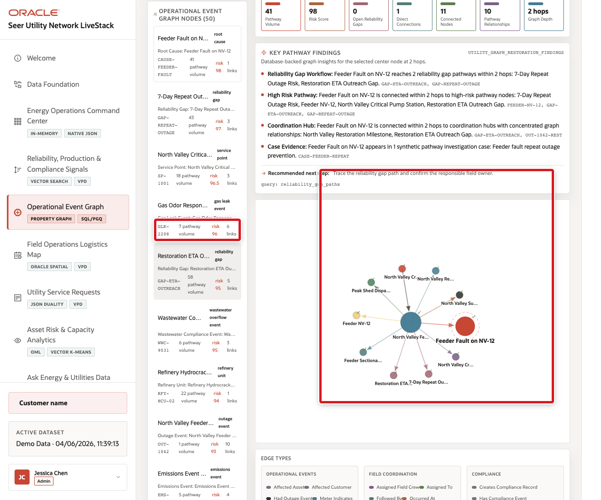

# Investigate an Operational Event Network

## Introduction

Bob Green is the graph specialist. A gas odor response can connect to a pipeline segment, pressure sensor, inspection, field crew, work order, HSE event, and customer safety callback. Repeating table joins for every possible path becomes difficult to review. Bob maps the same governed rows as the `EU_SERVICE_RESTORATION_NETWORK` property graph.

Estimated Time: **10 minutes**

### Objectives

- Inspect the direct evidence around event `GLK-2208`.
- Express the same one-hop relationship as a SQL/PGQ graph pattern.
- Widen the investigation without moving data to a graph-only database.

### Hands-on Scenario

Bob and Jessica start with the gas leak response event and follow evidence to the affected asset. The seed is the starting node, an edge is a relationship, and this directed pattern follows one outgoing hop from the seed.

> **SQL Worksheet reminder:** Return to [Getting Started Task 2](?lab=getting-started#Task2:OpenSQLWorksheet) if you need the launch and execution steps.

## Task 1: Follow the event with relational SQL

1. Run the direct-connection query.

    <copy>
    ```sql
    SELECT seed.node_id AS seed_node,
           seed.display_name AS seed_name,
           r.relationship_type,
           reached.node_id AS reached_node,
           reached.node_type,
           reached.display_name AS reached_name,
           reached.risk_score
    FROM eu_utility_graph_entities seed
    JOIN eu_utility_graph_relationships r
      ON r.from_entity_id = seed.entity_id
    JOIN eu_utility_graph_entities reached
      ON reached.entity_id = r.to_entity_id
    WHERE seed.node_id = 'GLK-2208'
    ORDER BY reached.risk_score DESC,
             reached.node_id,
             r.relationship_type;
    ```
    </copy>

2. Confirm that `PIPE-17A` appears as affected-asset evidence. The query follows outgoing relationships only; it is not a bidirectional adjacency search.

    **Expected output pattern**

    | Seed | Relationship evidence | Reached node |
    | --- | --- | --- |
    | `GLK-2208` | `affected_asset` | `PIPE-17A` |

## Task 2: Read the same connection as a graph

1. Run the SQL/PGQ pattern.

    <copy>
    ```sql
    SELECT seed_node,
           relationship_type,
           reached_node,
           reached_type,
           reached_name,
           risk_score
    FROM GRAPH_TABLE (
      eu_service_restoration_network
      MATCH (seed IS utility_entity)
            -[edge IS restoration_link]->
            (reached IS utility_entity)
      WHERE seed.node_id = 'GLK-2208'
      COLUMNS (
        seed.node_id AS seed_node,
        edge.relationship_type AS relationship_type,
        reached.node_id AS reached_node,
        reached.node_type AS reached_type,
        reached.display_name AS reached_name,
        reached.risk_score AS risk_score
      )
    )
    ORDER BY risk_score DESC,
             reached_node,
             relationship_type;
    ```
    </copy>

    

2. Compare the columns with Task 1. The graph pattern expresses the same directed, one-outgoing-hop traversal; the relational tables remain the source.

## Task 3: Review wider restoration findings

1. Query the curated database-derived findings view. Unlike the raw one-hop pattern in Task 2, this view expands selected relationships in both directions and summarizes findings from one through three hops.

    <copy>
    ```sql
    SELECT center_node_id,
           finding_type,
           title,
           supporting_node_ids,
           supporting_edge_types,
           risk_score,
           recommended_action,
           min_graph_depth
    FROM eu_utility_graph_restoration_findings
    WHERE center_node_id IN ('GLK-2208', 'PIPE-17A')
    ORDER BY risk_score DESC,
             min_graph_depth,
             center_node_id,
             finding_type,
             title
    FETCH FIRST 15 ROWS ONLY;
    ```
    </copy>

> **Checkpoint:** A connected node does not prove causality. It gives Bob a traceable path and supporting evidence to investigate.

> **🎯 Interactive challenge:** Run the restoration-findings query for only `PIPE-17A`, then compare its top finding with the combined two-node result.

<details>
<summary><strong>Challenge answer</strong></summary>

Replace the two-value `IN` list with `WHERE center_node_id = 'PIPE-17A'`. The narrower result shows evidence centered on the asset, while the combined query can surface findings from the event or asset.

</details>

## Conclusion: Make relationships easy to review

Bob used SQL/PGQ to describe a relationship pattern while Oracle Database continued to govern the underlying entity and relationship rows.

## Next Steps

Moon adds location and distance to the operational decision.

## Acknowledgements

* **Author** - Oracle Database Product Management
* **Last Updated By/Date** - Oracle Database Product Management, September 2026
