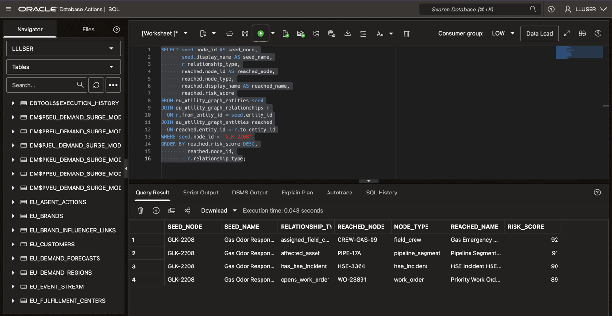
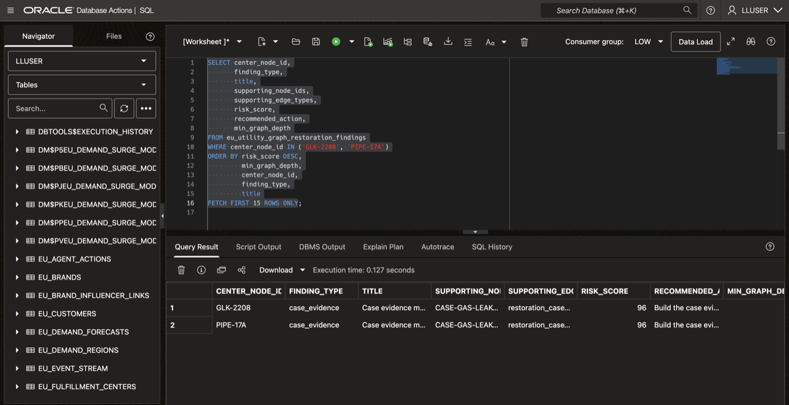

# Investigate an Operational Event Network

## Introduction


Bob Green is the graph specialist at Seer Utility Network. He helps Jessica’s operations team investigate how operational events, assets, and crews are connected. When the team reviews a gas leak-response event, it needs more than an event record: **which asset is affected, which crew is connected, and what related work deserves attention?**

Bob’s starting point is simple: an operational event does not tell the whole story on its own. Its connections to assets, crews, and related work provide context for the investigation. Those relationships help the team understand what is recorded, identify questions that remain unanswered, and decide what needs further review.

Bob uses the prepared `EU_SERVICE_RESTORATION_NETWORK` property graph. It represents entities as vertices and their connections as edges, giving the team another way to query relationships stored in Oracle AI Database. Jessica can continue working with relational SQL, while Bob expresses relationship patterns using SQL Property Graph Queries (SQL/PGQ).

In this lab, you work with Bob to investigate the recorded connections around a gas leak-response event. You first read a direct connection using relational joins, then express that connection with SQL/PGQ. Finally, you review a prepared findings view for additional context.

The goal is to give the operations team evidence it can inspect and explain. A recorded connection does not, by itself, prove the cause of a reliability problem or authorize restoration work.


<details>
<summary><strong>Key terms: property graph, vertex, edge, label, hop, and SQL/PGQ</strong></summary>

- A **property graph** represents entities and the relationships between them. In this lab, it connects operational events, assets, crews, and related work. Properties hold information about those entities and connections.

- A **vertex**, or node, represents an entity, such as the gas leak-response event `GLK-2208` or an asset connected to it.

- An **edge** represents a relationship between two vertices. For example, an event can be connected to an affected asset. Its direction matters: following outgoing connections is different from following incoming connections.

- A **label** identifies a kind of graph element used in a query pattern. Task 2 uses the vertex label `utility_entity` and the edge label `restoration_link`. The value `affected_asset` describes the relationship through a property; it is not a separate edge label.

- A **hop** is one step across an edge from one vertex to another. Task 2 follows exactly one outgoing hop from `GLK-2208`. Following another edge from a connected asset would be a second hop. Hop count measures relationship steps, not physical distance or response time.

- **SQL Property Graph Queries (SQL/PGQ)** let you describe graph patterns in SQL, such as “start at this event and follow its outgoing connections.” Bob can investigate relationships while the underlying data remains in Oracle AI Database.

</details>

### Objectives

- Inspect the direct connections around operational event using relational SQL.
- Express the same directed, one-hop relationship using SQL/PGQ.
- Compare the direct query results with the broader context provided by a prepared findings view.
- Explain what the recorded relationships show and what requires further investigation before an operational response.

Estimated Time: **10 minutes**

<video controls width="100%">
  <source src="https://c4u04.objectstorage.us-ashburn-1.oci.customer-oci.com/p/EcTjWk2IuZPZeNnD_fYMcgUhdNDIDA6rt9gaFj_WZMiL7VvxPBNMY60837hu5hga/n/c4u04/b/livelabsfiles/o/livestack%2FVideos%2FFinance%2F04-Finance%20Workshop_LAB-4_with-CC.mp4" type="video/mp4">
  Your browser does not support the video tag.
</video>

*The video uses a Finance example. Follow the E&U tasks below for this lab’s approved profile, views, and operational questions.*

### Hands-on Scenario

Bob helps Jessica trace the recorded connections around gas leak-response event `GLK-2208`, then compare that direct evidence with the broader findings prepared for review.

| Step | Energy & Utilities focus |
| --- | --- |
| Business Problem | The operations team needs to understand which asset and supporting work are connected to a gas leak-response event. |
| Technical Challenge | Distinguish direct relationships from the broader context summarized in a findings view. |
| Persona Focus | You work with Bob, the graph specialist, to help Jessica review the event’s recorded connections. |
| What You Will Do | Compare relational joins with SQL/PGQ queries for the outgoing connections from `GLK-2208`, then review the prepared findings. |
| Database Capability | `GRAPH_TABLE` queries a property graph backed by relational data in Oracle AI Database. |
| Outcome | Explain the recorded connection between `GLK-2208` and `PIPE-17A`, and identify evidence that supports further human review. |


> **SQL Worksheet reminder:** Need a reminder on how to open and use the SQL Worksheet? Return to [Getting Started Task 2: Open SQL Worksheet](?lab=getting-started#Task2:OpenSQLWorksheet) for the step-by-step graphic showing where to paste and run SQL statements.


## Task 1: Follow the event with relational SQL

Before Bob introduces the graph query, Jessica asks a practical question: **what is directly connected to gas leak-response event `GLK-2208`?** She starts with relational SQL to establish a result they can compare with Bob’s graph approach.

The query uses the entity table twice: `seed` identifies the starting event, while `reached` identifies a connected entity. The relationship table links them and describes how they are connected.

1. Run the direct-connection query. Read each result row as “starting event, relationship, connected entity.”

    ```sql
    <copy>
    SELECT seed.node_id AS seed_node,
           seed.display_name AS seed_name,
           r.relationship_type,
           reached.node_id AS reached_node,
           reached.node_type,
           reached.display_name AS reached_name,
           reached.risk_score
    FROM eu_utility_graph_entities seed
    JOIN eu_utility_graph_relationships r
      ON r.from_entity_id = seed.entity_id
    JOIN eu_utility_graph_entities reached
      ON reached.entity_id = r.to_entity_id
    WHERE seed.node_id = 'GLK-2208'
    ORDER BY reached.risk_score DESC,
             reached.node_id,
             r.relationship_type;
    </copy>
    ```

2. Locate `PIPE-17A` and confirm that its relationship type is `affected_asset`. This records the pipeline asset’s connection to the event; it does not, by itself, establish the cause of the incident.

    **Expected output: Four direct outgoing connections**

    In the prepared dataset, the query returns a crew, the affected pipeline asset, a health, safety, and environment (HSE) event, and a work order. The following table highlights one of those connections:

    | Starting event | Relationship type | Connected entity |
    | --- | --- | --- |
    | `GLK-2208` | `affected_asset` | `PIPE-17A` |

    

    The results are ordered by the connected entity’s risk score, highest first, with node ID and relationship type used to break ties. The score helps organize the review; it does not automatically authorize an operational response.

> **Checkpoint:** This query follows only outgoing relationships from `GLK-2208`. It does not include incoming connections or continue through a connected entity to find a second hop.

## Task 2: Read the same connection as a graph

Jessica has established the direct connections using relational joins. Bob now expresses the same question as a graph pattern: **start at the event, follow an outgoing relationship, and return the connected entity.**

The property graph is already prepared over the backing relational data. You do not create a new graph or copy data in this task.

1. Run the SQL/PGQ query. Notice how `MATCH` describes the connection and `COLUMNS` exposes graph properties as columns in a SQL result.

    ```sql
    <copy>
    SELECT seed_node,
           relationship_type,
           reached_node,
           reached_type,
           reached_name,
           risk_score
    FROM GRAPH_TABLE (
      eu_service_restoration_network
      MATCH (seed IS utility_entity)
            -[edge IS restoration_link]->
            (reached IS utility_entity)
      WHERE seed.node_id = 'GLK-2208'
      COLUMNS (
        seed.node_id AS seed_node,
        edge.relationship_type AS relationship_type,
        reached.node_id AS reached_node,
        reached.node_type AS reached_type,
        reached.display_name AS reached_name,
        reached.risk_score AS risk_score
      )
    )
    ORDER BY risk_score DESC,
             reached_node,
             relationship_type;
    </copy>
    ```

    **Expected output: Four direct outgoing connections**

    

    *The screenshot shows an excerpt of the SQL/PGQ query and all four returned connections. The `affected_asset` relationship connects `GLK-2208` to `PIPE-17A`, whose recorded risk score is `91` in the captured dataset.*

2. Compare the results with Task 1. Match each `RELATIONSHIP_TYPE` and `REACHED_NODE`, then compare the connected entity’s name and risk score.

    Task 1 includes `SEED_NAME` and calls the connected entity’s type `NODE_TYPE`; this query omits `SEED_NAME` and uses `REACHED_TYPE`. Those presentation differences do not change the connections being investigated.

> **Checkpoint:** Both queries should identify the same four connections in the prepared dataset. The graph pattern expresses the joins as a directed, one-hop relationship. Neither query follows incoming edges or continues through a connected entity to a second hop.

## Task 3: Review wider restoration findings

The direct connections give Jessica a starting point. Bob now turns to a prepared findings view for broader context around the event and its affected asset.

Unlike the one-hop query in Task 2, this view summarizes selected relationships followed in both directions, covering one through three hops. You read those prepared findings rather than write a new multi-hop graph pattern.

1. Run the findings query for `GLK-2208` and `PIPE-17A`.

    ```sql
    <copy>
    SELECT center_node_id,
           finding_type,
           title,
           supporting_node_ids,
           supporting_edge_types,
           risk_score,
           recommended_action,
           min_graph_depth
    FROM eu_utility_graph_restoration_findings
    WHERE center_node_id IN ('GLK-2208', 'PIPE-17A')
    ORDER BY risk_score DESC,
             min_graph_depth,
             center_node_id,
             finding_type,
             title
    FETCH FIRST 15 ROWS ONLY;
    </copy>
    ```
    **Expected output: Restoration findings for the event and affected asset**

    

    *Compare the findings centered on `GLK-2208` and `PIPE-17A`. Review the supporting nodes and relationship types before interpreting each recommended action. If a value is truncated in the result grid, expand the cell to read it in full.*

2. Review the supporting evidence before interpreting the recommended action.

    The prepared result contains findings centered on `GLK-2208` and `PIPE-17A`. Use the following columns to explain each finding:

    | Column | What to review |
    | --- | --- |
    | `CENTER_NODE_ID` | Identifies the event or asset the finding concerns. |
    | `SUPPORTING_NODE_IDS` | Identifies the entities supporting the finding. |
    | `SUPPORTING_EDGE_TYPES` | Describes the relationships supporting the finding. |
    | `MIN_GRAPH_DEPTH` | Indicates the nearest supporting graph depth represented by the finding, not distance in kilometers. |
    | `RECOMMENDED_ACTION` | Provides a suggested next step for human review, not an automatically authorized action. |

    The query places higher-risk findings first. Graph depth and identifying columns break ties.

> **Checkpoint:** A connected node does not prove causality. It provides a relationship Bob and Jessica can investigate alongside other evidence.

**🎯 Interactive challenge:** Run the restoration-findings query for only `PIPE-17A`, then compare its top finding with the combined two-node result. Which supporting nodes and relationships help explain the asset-centered finding?

<details>
<summary><strong>Challenge answer</strong></summary>

Replace:

```sql
<copy>
WHERE center_node_id IN ('GLK-2208', 'PIPE-17A')
</copy>
```

with:

```sql
<copy>
WHERE center_node_id = 'PIPE-17A'
</copy>
```

In the prepared dataset, this narrows the result from two findings to one asset-centered finding. Review its supporting node IDs and relationship types to explain which evidence remains relevant to the asset.

A smaller result answers a narrower question. It does not mean that the excluded event is no longer important.

</details>

## Conclusion: Make relationships easy to review

Bob and Jessica retrieved the same direct connections using relational joins and a graph pattern, then reviewed broader findings through a prepared view. Each approach helps them explain the evidence at a different level: direct relationships first, wider context second.

Jessica can now describe which asset and supporting work are connected to the event, while keeping recorded relationships separate from conclusions about cause or an authorized response.

## Next Steps

Next, Moon investigates a separate prepared case: the highest-urgency open service request. She ranks nearby active field-logistics sites and reviews their capacity constraints.

## Acknowledgements

* **Author** - Zileyah Onafowora
* **Last Updated By/Date** - Zileyah Onafowora, September 2026
