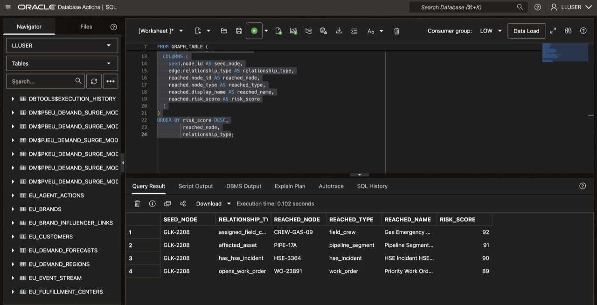

# Investigate an Operational Event Network

## Introduction

Jessica has found service requests that deserve operational review. She now needs to understand the evidence around a gas leak response: which asset is affected, which crew is connected, and what other work needs attention?

Bob Green, the graph specialist, helps Jessica follow those relationships. The prepared `EU_SERVICE_RESTORATION_NETWORK` property graph maps database rows to vertices and edges. You first read a direct connection with relational joins, then express the same connection with SQL Property Graph Queries (SQL/PGQ). Finally, you review a prepared findings view for wider context.

This lab investigates relationships. It does not prove the cause of a reliability problem or automatically authorize restoration work.

Estimated Time: **10 minutes**

### Objectives

- Inspect the direct evidence around event `GLK-2208`.
- Express the same one-hop relationship as a SQL/PGQ graph pattern.
- Distinguish a directed one-hop query from the wider investigation summarized by a findings view.
- Explain which evidence supports further operational review.

### Hands-on Scenario

| Step | Energy & Utilities focus |
| --- | --- |
| Business problem | A gas leak response needs a traceable connection to the affected asset and supporting work. |
| Technical challenge | Jessica needs to distinguish direct connections from wider findings. |
| Persona focus | You review Bob's graph approach with Jessica. |
| What you will see | Relational and SQL/PGQ queries return the direct connections from `GLK-2208`. |
| Database capability | `GRAPH_TABLE` queries a property graph backed by governed relational rows. |
| Outcome | An evidence list supports a human investigation of the event and `PIPE-17A`. |

<details>
<summary><strong>Key terms: vertex, edge, label, and hop</strong></summary>

> - A **vertex**, or node, represents an event, asset, crew, or other entity.
> - An **edge** connects two vertices. Its direction matters in this lab.
> - A **label** identifies a kind of graph element. Task 2 uses vertex label `utility_entity` and edge label `restoration_link`. The value `affected_asset` is a relationship-type property, not a separate edge label.
> - A **hop** crosses one edge. The arrow in Task 2 follows exactly one outgoing hop from the starting event.

</details>

> **SQL Worksheet reminder:** Return to [Getting Started Task 2](?lab=getting-started#Task2:OpenSQLWorksheet) if you need the launch and execution steps.

## Task 1: Follow the event with relational SQL

Jessica starts with ordinary joins so Bob can compare the graph result against familiar SQL. The entity table appears twice: once for the starting event and once for the entity reached through the relationship table.

1. Run the direct-connection query. Read the result as “event, relationship, connected entity.”

    <copy>
    ```sql
    SELECT seed.node_id AS seed_node,
           seed.display_name AS seed_name,
           r.relationship_type,
           reached.node_id AS reached_node,
           reached.node_type,
           reached.display_name AS reached_name,
           reached.risk_score
    FROM eu_utility_graph_entities seed
    JOIN eu_utility_graph_relationships r
      ON r.from_entity_id = seed.entity_id
    JOIN eu_utility_graph_entities reached
      ON reached.entity_id = r.to_entity_id
    WHERE seed.node_id = 'GLK-2208'
    ORDER BY reached.risk_score DESC,
             reached.node_id,
             r.relationship_type;
    ```
    </copy>

2. Confirm that `PIPE-17A` appears as affected-asset evidence. The query follows outgoing relationships only; it is not a bidirectional adjacency search.

    **Expected output pattern**

    | Seed | Relationship evidence | Reached node |
    | --- | --- | --- |
    | `GLK-2208` | `affected_asset` | `PIPE-17A` |

    In the prepared dataset, the query returns four outgoing connections: a crew, the affected pipeline asset, an HSE event, and a work order. Risk score sorts the review list; node ID and relationship type break ties. A higher score prioritizes inspection of the evidence, not an automatic action.

## Task 2: Read the same connection as a graph

Bob describes the same investigation as a pattern: start at the event, follow an outgoing relationship, and return the connected vertex. The graph is already prepared; you do not create or copy its backing data in this task.

1. Run the SQL/PGQ pattern. Notice how `MATCH` states the relationship and `COLUMNS` turns graph properties into a normal SQL result.

    <copy>
    ```sql
    SELECT seed_node,
           relationship_type,
           reached_node,
           reached_type,
           reached_name,
           risk_score
    FROM GRAPH_TABLE (
      eu_service_restoration_network
      MATCH (seed IS utility_entity)
            -[edge IS restoration_link]->
            (reached IS utility_entity)
      WHERE seed.node_id = 'GLK-2208'
      COLUMNS (
        seed.node_id AS seed_node,
        edge.relationship_type AS relationship_type,
        reached.node_id AS reached_node,
        reached.node_type AS reached_type,
        reached.display_name AS reached_name,
        reached.risk_score AS risk_score
      )
    )
    ORDER BY risk_score DESC,
             reached_node,
             relationship_type;
    ```
    </copy>

    

    *The SQL/PGQ pattern excerpt and all four directed connections from `GLK-2208` are visible. The `affected_asset` row leads to `PIPE-17A` with risk score `91`; the result is ordered by risk score and the documented tie-breakers.*

2. Compare the columns with Task 1. The graph pattern expresses the same directed, one-outgoing-hop traversal; the relational tables remain the source.

    **Checkpoint:** Both queries should identify the same four connections. Neither query follows incoming edges or searches multiple hops. The core entity and relationship tables contain 78 entities and 97 relationships; the full graph also includes case-related backing data, so those numbers are not totals for every graph element.

## Task 3: Review wider restoration findings

1. Query the curated database-derived findings view. Unlike the raw one-hop pattern in Task 2, this view expands selected relationships in both directions and summarizes findings from one through three hops.

    <copy>
    ```sql
    SELECT center_node_id,
           finding_type,
           title,
           supporting_node_ids,
           supporting_edge_types,
           risk_score,
           recommended_action,
           min_graph_depth
    FROM eu_utility_graph_restoration_findings
    WHERE center_node_id IN ('GLK-2208', 'PIPE-17A')
    ORDER BY risk_score DESC,
             min_graph_depth,
             center_node_id,
             finding_type,
             title
    FETCH FIRST 15 ROWS ONLY;
    ```
    </copy>

    The prepared result contains findings centered on `GLK-2208` and `PIPE-17A`. Read `SUPPORTING_NODE_IDS` and `SUPPORTING_EDGE_TYPES` before the recommended action. `MIN_GRAPH_DEPTH` describes the nearest supporting graph depth represented by the finding; it is not distance in kilometers. The ordering puts higher-risk findings first and breaks ties with depth and identifying columns.

> **Checkpoint:** A connected node does not prove causality. It gives Bob a traceable path and supporting evidence to investigate.

> **🎯 Interactive challenge:** Run the restoration-findings query for only `PIPE-17A`, then compare its top finding with the combined two-node result.

<details>
<summary><strong>Challenge answer</strong></summary>

Replace the two-value `IN` list with `WHERE center_node_id = 'PIPE-17A'`. The prepared dataset narrows from two findings to one asset-centered finding. Explain which supporting nodes remain relevant to the asset. A smaller result is a narrower question, not evidence that the excluded event no longer matters.

</details>

## Conclusion: Make relationships easy to review

Bob and Jessica obtained the same direct evidence through joins and a graph pattern, then reviewed wider findings separately. Jessica can now explain which asset and supporting work are connected to the event without confusing a relationship with a proven cause.

## Next Steps

The relationship evidence identifies what deserves attention. Moon next asks which active field-logistics sites are nearby and what capacity constraints a dispatcher should review.

## Acknowledgements

* **Author** - Oracle Database Product Management
* **Last Updated By/Date** - Oracle Database Product Management, September 2026
