# Investigate an Operational Event Network

## Introduction

Bob Green is Seer Utility Network's graph specialist. A pressure concern does not stop at one service request. A gas leak event can connect to a pipeline segment, an inspection, a sensor reading, a field crew and a work order. Bob needs to explain those paths while keeping the supporting records available.

Jessica can join the relational entity and relationship tables. As the investigation expands, each additional hop adds another pair of joins. Bob uses a property graph to describe the path directly, then opens the same records in Graph Studio. SQL provides a repeatable result table; the visualization helps the team follow the connections.

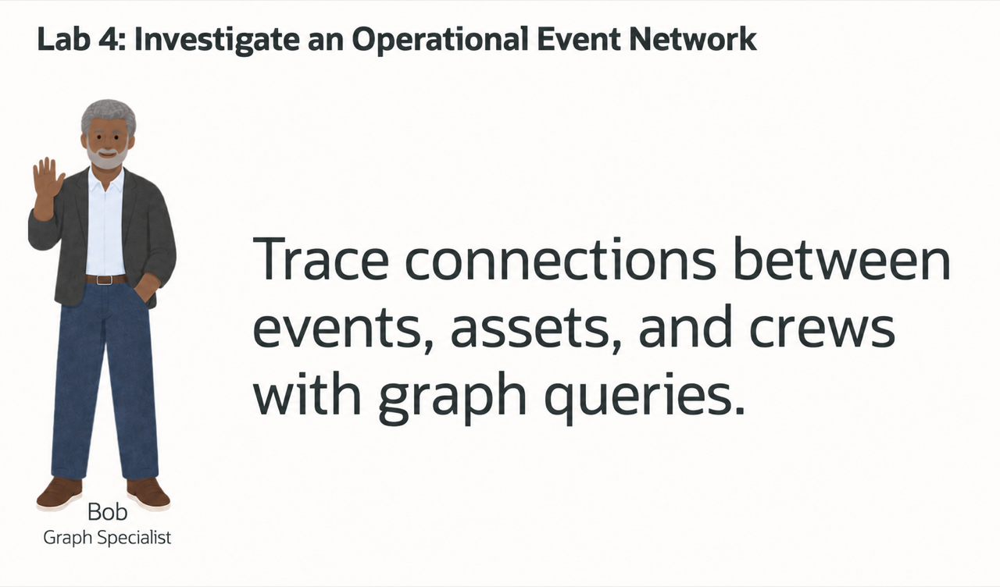

<details>
<summary><strong>Key terms: property graph, vertex, edge, hop, and SQL/PGQ</strong></summary>

> - A **property graph** represents entities and their relationships. The Utilities graph includes events, assets, crews, inspections and restoration cases.
> - A **vertex** represents an entity. `utility_entity` vertices expose keys, types, names, operational domains and risk scores.
> - An **edge** connects vertices. A `restoration_link` carries a relationship type, strength and supporting notes.
> - A **hop** is one edge crossing. Event to pipeline is one hop; event to pipeline to inspection is two. Hop count is neither travel distance nor elapsed time.
> - **SQL/PGQ** expresses patterns over the graph while Oracle Database retains the relational source rows.

</details>

### Objectives

- Identify vertices and edges in a property graph.
- Follow connections from an operational event.
- Find entity pairs that share operational records.
- Open Graph Studio from Database Actions.
- Import and run the Utilities restoration-network notebook.
- Explain the result in terms an operations reviewer can act on.

Estimated Time: **15 minutes**

> **SQL Worksheet:** [Getting Started: open SQL Worksheet as LLUSER](?lab=getting-started), Task 2.

## Task 1: Follow an operational event with SQL

Start with outgoing relationships from gas leak event `GLK-2208`, which connects to pipeline `PIPE-17A` in the workshop data.

1. Review Jessica's direct-connection query.

```sql
<copy>
SELECT event.entity_key AS event_key,
           connected.entity_key AS connected_key,
           connected.entity_type AS connected_type,
           rel.relationship_type,
           connected.risk_score AS connected_risk
    FROM utility_graph_entities event
    JOIN utility_graph_relationships rel
      ON rel.from_entity_id = event.entity_id
    JOIN utility_graph_entities connected
      ON connected.entity_id = rel.to_entity_id
    WHERE event.entity_key = 'GLK-2208'
    ORDER BY connected_risk DESC;
</copy>
```

The first copy of `UTILITY_GRAPH_ENTITIES` identifies the event; the second identifies a connected entity. `UTILITY_GRAPH_RELATIONSHIPS` supplies the source and destination keys. Compare the result with the source rows before interpreting it.

**Expected result:** Review the connected entity key, type, relationship, and risk score, including the affected pipeline.

2. Compare the same approach across one through four hops.

```sql
<copy>
SELECT event_key, connected_key, connected_type,
           relationship_path, connected_risk
    FROM (
      SELECT seed.entity_key AS event_key,
             reached.entity_key AS connected_key,
             reached.entity_type AS connected_type,
             r1.relationship_type AS relationship_path,
             reached.risk_score AS connected_risk
      FROM utility_graph_entities seed
      JOIN utility_graph_relationships r1
        ON r1.from_entity_id = seed.entity_id
      JOIN utility_graph_entities reached
        ON reached.entity_id = r1.to_entity_id
      WHERE seed.entity_key = 'GLK-2208'

      UNION

      SELECT seed.entity_key,
             reached.entity_key,
             reached.entity_type,
             r1.relationship_type || ' -> ' || r2.relationship_type,
             reached.risk_score
      FROM utility_graph_entities seed
      JOIN utility_graph_relationships r1
        ON r1.from_entity_id = seed.entity_id
      JOIN utility_graph_entities v1
        ON v1.entity_id = r1.to_entity_id
      JOIN utility_graph_relationships r2
        ON r2.from_entity_id = v1.entity_id
      JOIN utility_graph_entities reached
        ON reached.entity_id = r2.to_entity_id
      WHERE seed.entity_key = 'GLK-2208'

      UNION

      SELECT seed.entity_key,
             reached.entity_key,
             reached.entity_type,
             r1.relationship_type || ' -> ' ||
               r2.relationship_type || ' -> ' ||
               r3.relationship_type,
             reached.risk_score
      FROM utility_graph_entities seed
      JOIN utility_graph_relationships r1
        ON r1.from_entity_id = seed.entity_id
      JOIN utility_graph_entities v1
        ON v1.entity_id = r1.to_entity_id
      JOIN utility_graph_relationships r2
        ON r2.from_entity_id = v1.entity_id
      JOIN utility_graph_entities v2
        ON v2.entity_id = r2.to_entity_id
      JOIN utility_graph_relationships r3
        ON r3.from_entity_id = v2.entity_id
      JOIN utility_graph_entities reached
        ON reached.entity_id = r3.to_entity_id
      WHERE seed.entity_key = 'GLK-2208'

      UNION

      SELECT seed.entity_key,
             reached.entity_key,
             reached.entity_type,
             r1.relationship_type || ' -> ' ||
               r2.relationship_type || ' -> ' ||
               r3.relationship_type || ' -> ' ||
               r4.relationship_type,
             reached.risk_score
      FROM utility_graph_entities seed
      JOIN utility_graph_relationships r1
        ON r1.from_entity_id = seed.entity_id
      JOIN utility_graph_entities v1
        ON v1.entity_id = r1.to_entity_id
      JOIN utility_graph_relationships r2
        ON r2.from_entity_id = v1.entity_id
      JOIN utility_graph_entities v2
        ON v2.entity_id = r2.to_entity_id
      JOIN utility_graph_relationships r3
        ON r3.from_entity_id = v2.entity_id
      JOIN utility_graph_entities v3
        ON v3.entity_id = r3.to_entity_id
      JOIN utility_graph_relationships r4
        ON r4.from_entity_id = v3.entity_id
      JOIN utility_graph_entities reached
        ON reached.entity_id = r4.to_entity_id
      WHERE seed.entity_key = 'GLK-2208'
    ) paths
    ORDER BY connected_risk DESC;
</copy>
```

Each branch adds one relationship join and one entity join. `UNION` combines the path lengths and removes duplicate result rows. The output includes a path description, which can distinguish paths to the same entity. This query illustrates the cost of expressing each path length separately; it is not a claim that graph queries always run faster.

3. Explain how a fifth hop would change the SQL. Identify the additional joins and consider cycles and repeated paths.

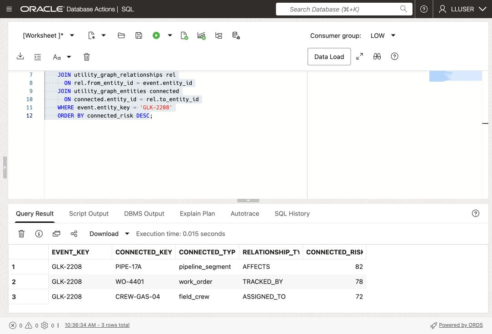

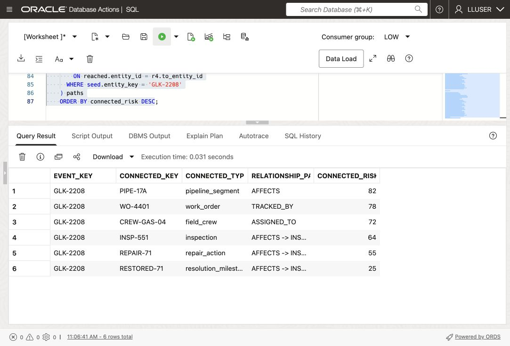

## Task 2: Read the same connections as a graph

Initialization creates `SERVICE_RESTORATION_NETWORK` over the existing relational rows. These queries use its `utility_entity` and `restoration_link` labels.

1. Run the equivalent one-hop pattern.

```sql
<copy>
SELECT event_key,
           connected_key,
           connected_type,
           relationship_type,
           connected_risk
    FROM GRAPH_TABLE ( service_restoration_network
      MATCH (event IS utility_entity) -[edge IS restoration_link]-> (connected IS utility_entity)
      WHERE event.entity_key = 'GLK-2208'
      COLUMNS (
        event.entity_key AS event_key,
        connected.entity_key AS connected_key,
        connected.entity_type AS connected_type,
        edge.relationship_type AS relationship_type,
        connected.risk_score AS connected_risk
      )
    )
    ORDER BY connected_risk DESC;
</copy>
```

`MATCH` describes one outgoing relationship. `COLUMNS` projects graph properties into a normal SQL result. Compare the entity keys, relationship types and risk scores with Task 1, including direction. The two representations should describe the same direct relationships.

## Task 3: Trace four-hop restoration reach

1. Expand the event investigation to paths of one through four hops.

```sql
<copy>
SELECT DISTINCT entity_key, display_name, entity_type,
       relationship_hops, risk_score, operations_domain, volume_count
FROM GRAPH_TABLE ( service_restoration_network
  MATCH (seed IS utility_entity)
        -[e IS restoration_link]->{1,4} (reached IS utility_entity)
  WHERE seed.entity_key = 'GLK-2208'
  COLUMNS (
    reached.entity_key AS entity_key,
    reached.display_name AS display_name,
    reached.entity_type AS entity_type,
    COUNT(e.relationship_type) AS relationship_hops,
    reached.risk_score AS risk_score,
    reached.operations_domain AS operations_domain,
    reached.volume_count AS volume_count
  )
)
ORDER BY risk_score DESC, entity_key, relationship_hops
FETCH FIRST 25 ROWS ONLY;
</copy>
```

`->{1,4}` expresses the path-length range. `COUNT(e.relationship_type)` exposes its hop count. `DISTINCT` removes duplicate projected rows; one entity may still appear at several depths. Review the seed, direction and bounds rather than treating every reachable vertex as equally relevant.

2. Review the reached entities and their hop counts. A relationship supports investigation; it does not prove causality or authorize dispatch.

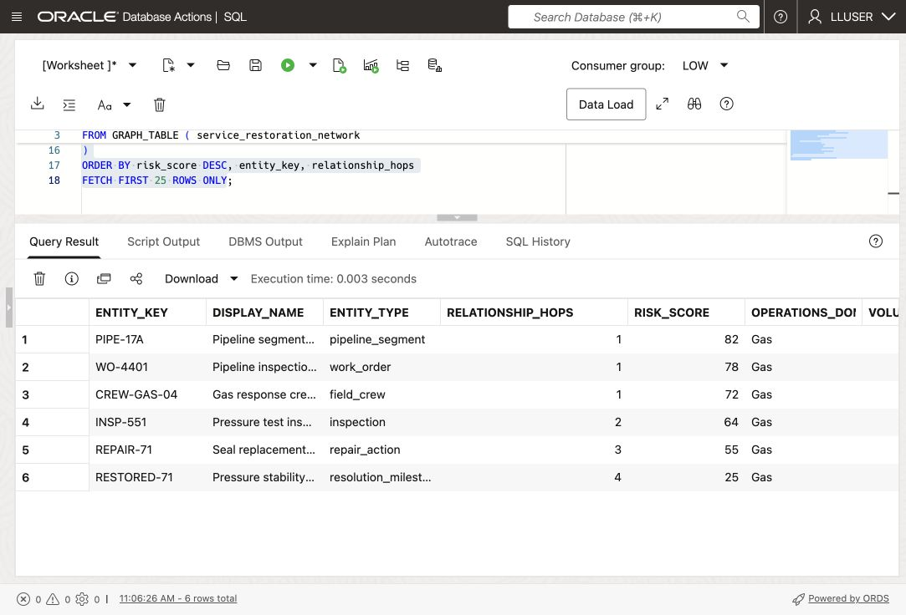

## Task 4: Find entities that share operational records

Bob now asks which entities share a pipeline segment, crew, or work order.

1. Run the shared-connection query.

```sql
<copy>
SELECT entity_a, shared_entity, shared_type, entity_b,
       a_risk, b_risk, ROUND((a_risk + b_risk) / 2, 1) AS combined_risk,
       e1_type, e2_type
FROM GRAPH_TABLE ( service_restoration_network
  MATCH (a IS utility_entity)
        -[e1 IS restoration_link]- (shared IS utility_entity)
        -[e2 IS restoration_link]- (b IS utility_entity)
  WHERE a.entity_id < b.entity_id
    AND a.entity_id <> shared.entity_id
    AND b.entity_id <> shared.entity_id
    AND shared.entity_type IN ('pipeline_segment', 'field_crew', 'work_order')
    AND (a.risk_score >= 70 OR b.risk_score >= 70)
  COLUMNS (
    a.entity_key AS entity_a,
    shared.entity_key AS shared_entity,
    shared.entity_type AS shared_type,
    b.entity_key AS entity_b,
    a.risk_score AS a_risk, b.risk_score AS b_risk,
    e1.relationship_type AS e1_type, e2.relationship_type AS e2_type
  )
)
ORDER BY combined_risk DESC, shared_entity, entity_a, entity_b
FETCH FIRST 25 ROWS ONLY;
</copy>
```

These undirected pattern edges examine adjacency in either direction. This is deliberately different from Tasks 1-3. Read `E1_TYPE` and `E2_TYPE` against the stored edge direction when interpreting the result. `a.entity_id < b.entity_id` avoids returning the same pair in reverse order; the other predicates exclude the shared vertex itself.

2. Review the shared node and both relationship types. A crew linked to two events may indicate shared workload, but not necessarily a capacity conflict. Check schedules and operational records before drawing that conclusion. The combined risk is a review-order calculation, not a calibrated failure probability.

> **Check:** `GLK-2208` and `GLK-2209` share `PIPE-17A`, `CREW-GAS-04`, and `WO-4401`. Inspect both relationship types for each shared node.

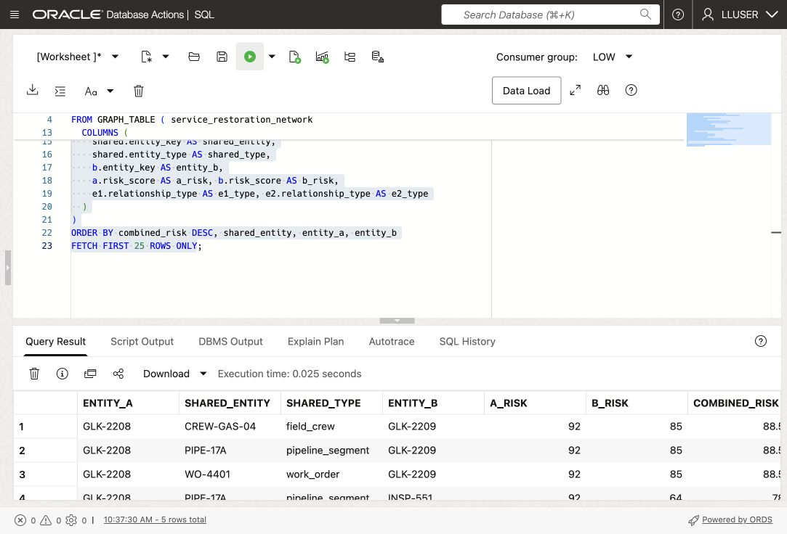

## Task 5: Visualize the relationship using Oracle Graph Studio

Bob uses Graph Studio to explain the paths behind the SQL result. Keep the same workshop identity and graph so the visualization can be compared with the relational records.

1. Open the Database Actions Launchpad and confirm `LLUSER`.
2. On **Development**, select **Graph Studio**, then **Open**.
3. If prompted, sign in as `LLUSER` using the workshop login information.
4. Confirm the Graph Studio home page provides **Graphs**, **Notebooks**, **Templates**, and **Jobs**. If the service or access is unavailable, stop and ask the facilitator to resolve the prerequisite.

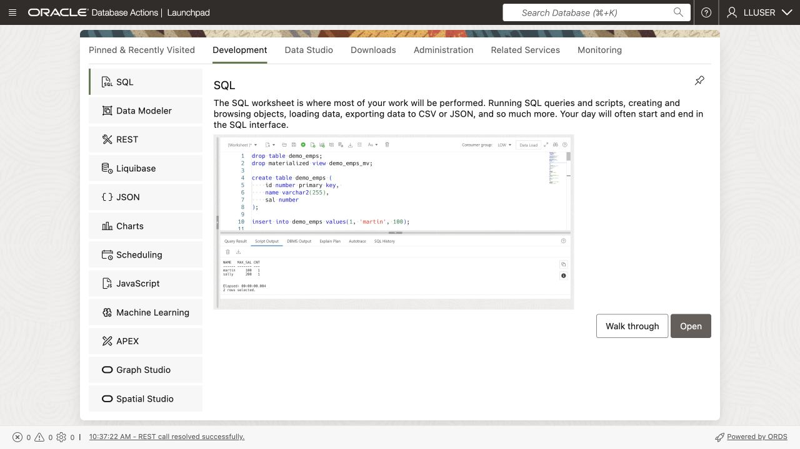
>
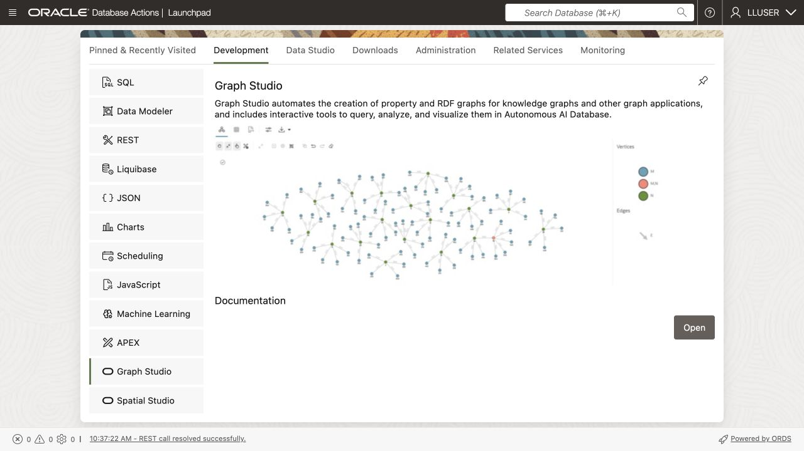
>
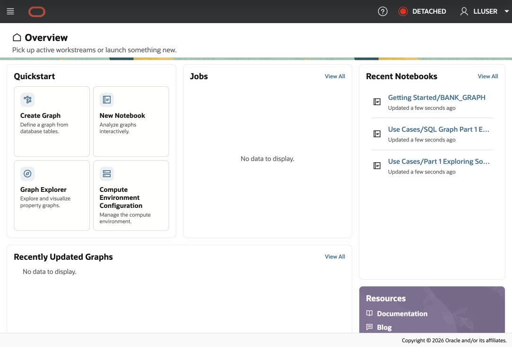

## Task 6: Download and import the Utilities notebook

The notebook contains eight paragraphs: explanations, a table query, and two graph visualizations. Run it to generate your own results.

1. Download [utilities-restoration-network-graph-studio.dsnb](files/utilities-restoration-network-graph-studio.dsnb). If it opens as text, use **Save Link As**.
2. In Graph Studio, select **Notebooks**.
3. Select **Import**.
4. Choose the downloaded file, review the filename, and import it. Open **Utilities Restoration Network**.

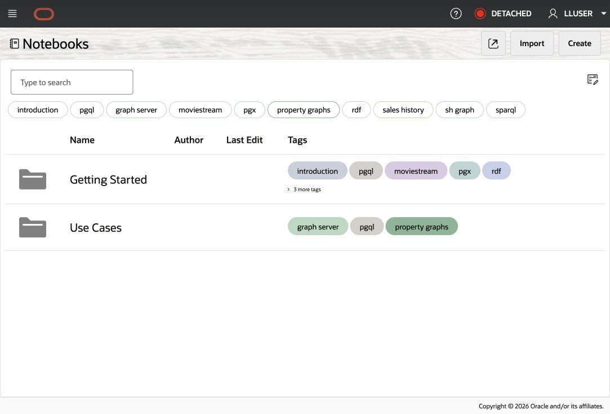
>
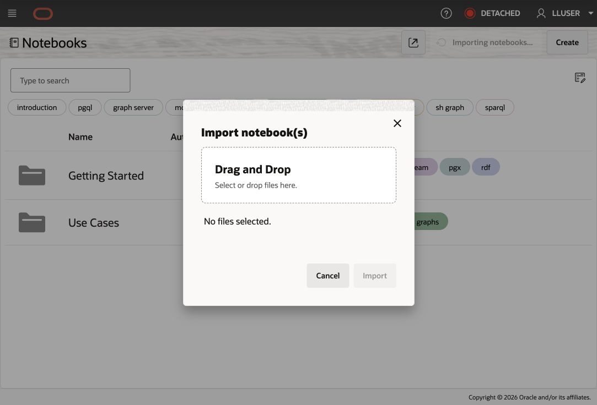
>
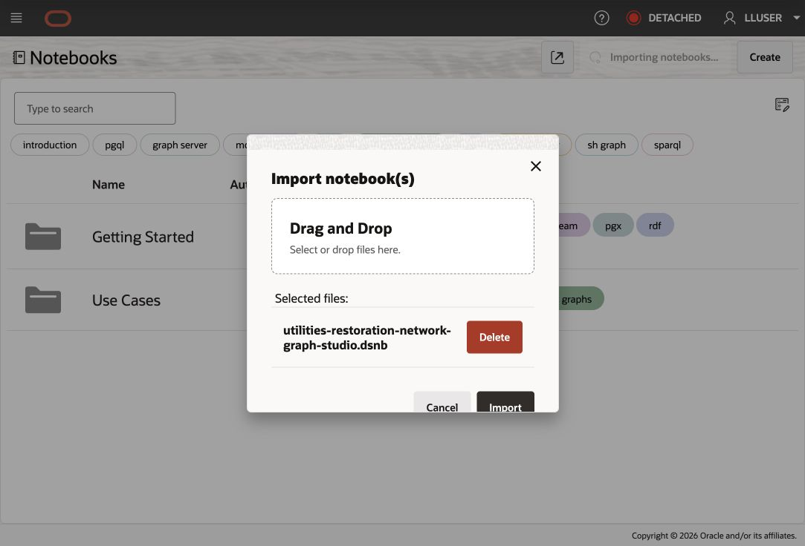

## Task 7: Run and interpret the Graph Studio notebook

1. Read the opening explanation, then run the first SQL paragraph. It starts from `GLK-2208` and follows one or two outgoing hops. Task 3 used up to four hops; compare the same depth when checking equality.

    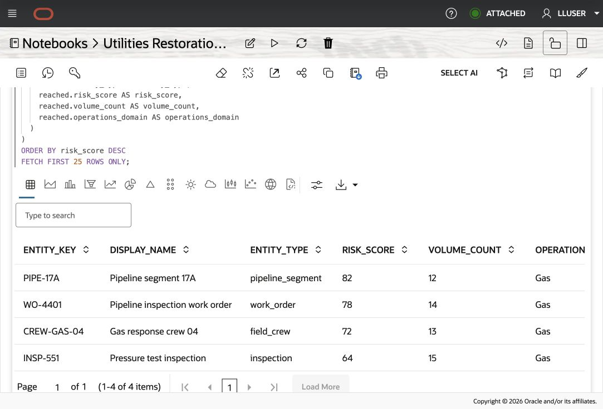

2. Compare the notebook paragraphs.

| Paragraph | Result | Investigation purpose |
| --- | --- | --- |
| Bounded traversal from `GLK-2208` | Table | Rank reached entities and their operational context. |
| Graph Visualization of previous query | Markdown | Introduce the visual version of the traversal. |
| `SELECT *` with `ONE ROW PER STEP` | Graph | Show the vertices and edges on the one- and two-hop paths. |
| Shared Entity Connections | Markdown | Introduce the asset-centered view. |
| Adjacency around `PIPE-17A` | Graph | Show entities directly connected to the pipeline in either direction. |

3. Run the path-visualization paragraph. Select vertices and follow the displayed relationships. Check the key and edge type against the table result.

    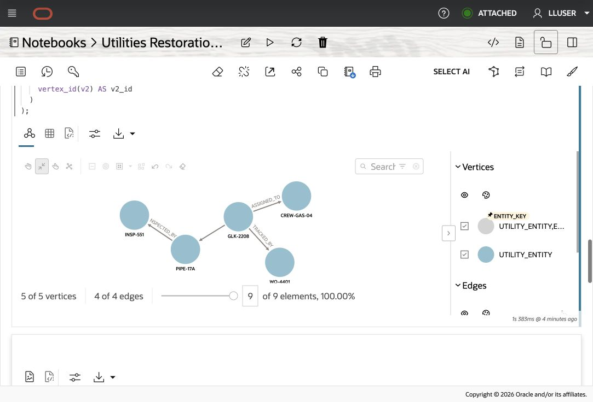

4. Run the final asset-centered paragraph. It anchors on `PIPE-17A` and examines incident relationships in both directions. Compare the actual connected entities with the underlying relationship rows; do not infer a specific cluster or color from a prior screenshot.

    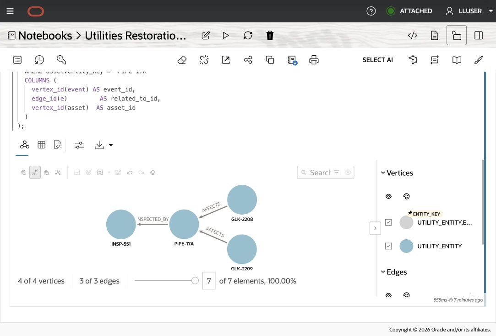

Graph layouts may change between runs. Compare entity keys, relationship types, direction, and query results.

## Conclusion: Make Relationships Easy to Review

Bob can explain the event through joins, graph patterns, and visual paths. Use bounded traversal for deeper context and shared neighbors to identify shared records.

## Appendix: Create the Property Graph

This reference SQL defines the workshop graph. It includes entity and restoration-case vertices, relationship edges, and case-membership edges. The loader establishes these tables and the graph before the lab. This appendix documents the definition; do not replace the graph during the exercise.

```sql
<copy>
CREATE OR REPLACE PROPERTY GRAPH service_restoration_network
      VERTEX TABLES (
        utility_graph_entities KEY (entity_id)
          LABEL utility_entity
          PROPERTIES (
            entity_id,
            entity_key,
            node_id,
            entity_type,
            node_type,
            display_name,
            operations_label,
            description,
            operations_domain,
            risk_score,
            volume_count,
            engagement_rate,
            city,
            region,
            is_verified,
            summary
          ),
        restoration_cases KEY (case_id)
          LABEL restoration_case
          PROPERTIES (
            case_id,
            case_key,
            case_type,
            severity,
            status,
            risk_score,
            summary
          )
      )
      EDGE TABLES (
        utility_graph_relationships
          KEY (relationship_id)
          SOURCE KEY (from_entity_id) REFERENCES utility_graph_entities (entity_id)
          DESTINATION KEY (to_entity_id) REFERENCES utility_graph_entities (entity_id)
          LABEL restoration_link
          PROPERTIES (
            relationship_type,
            strength,
            interaction_count,
            evidence_text
          ),
        restoration_case_entities
          KEY (case_entity_id)
          SOURCE KEY (case_id) REFERENCES restoration_cases (case_id)
          DESTINATION KEY (entity_id) REFERENCES utility_graph_entities (entity_id)
          LABEL restoration_case_involves
          PROPERTIES (
            role,
            evidence_score,
            note
          )
      );
</copy>
```

`UTILITY_GRAPH_ENTITIES` uses the `utility_entity` label. `UTILITY_GRAPH_RELATIONSHIPS` supplies directed source and destination keys for `restoration_link`. Case membership is retained because it supports the application even though the traversal tasks focus on entity-to-entity relationships.

## Acknowledgements

* **Authors** - Matt Kowalik, Kevin Lazarz
* **Contributor** - Eugenio Galiano, Ramu Murakami Gutierrez
* **Last Updated By/Date** - Oracle Database Product Management, October 2026
