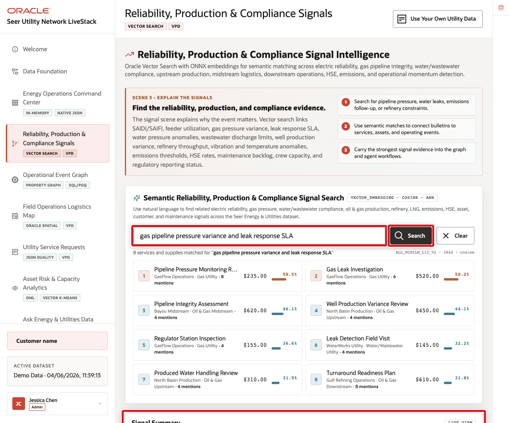

# Review a Semantic Risk Search

## Introduction

Gilly Bourne is the AI engineer behind the Reliability and Load Signals experience. Operators describe concerns in their own words; Gilly needs to find related utility services even when the stored descriptions use different terms. Oracle AI Vector Search keeps embeddings and source records together.

Estimated Time: **10 minutes**

### Objectives

- Verify the in-database embedding model and vector data.
- Rank utility services by semantic similarity.
- Distinguish search evidence from an operational conclusion.

### Hands-on Scenario

Gilly begins with a gas pressure and leak-response concern, then changes only the question to test how meaning changes the ranking. The platform supplies the shared `ADMIN.ALL_MINILM_L12_V2` embedding model and grants LLUSER access to it.

> **SQL Worksheet reminder:** Return to [Getting Started Task 2](?lab=getting-started#Task2:OpenSQLWorksheet) if you need the launch and execution steps.

## Task 1: Verify vector readiness

1. Run the readiness query.

    <copy>
    ```sql
    SELECT (SELECT COUNT(*)
            FROM all_mining_models
            WHERE owner = 'ADMIN'
              AND model_name = 'ALL_MINILM_L12_V2'
              AND mining_function = 'EMBEDDING') AS embedding_model_count,
           (SELECT COUNT(*)
            FROM eu_product_embeddings
            WHERE embedding IS NOT NULL) AS embedded_service_count,
           (SELECT MIN(VECTOR_DIMENSION_COUNT(embedding))
            FROM eu_product_embeddings) AS embedding_dimensions,
           (SELECT MIN(VECTOR_DIMENSION_FORMAT(embedding))
            FROM eu_product_embeddings) AS embedding_format,
           (SELECT COUNT(*)
            FROM user_indexes
            WHERE index_name = 'EU_IDX_PRODUCT_VEC'
              AND index_type = 'VECTOR'
              AND status = 'VALID') AS vector_index_count
    FROM dual;
    ```
    </copy>

2. Confirm the model count and vector-index count are `1`, all 31 services have embeddings, the dimension count is `384`, and the format is `FLOAT32`. If the model count is `0`, the shared platform model or its LLUSER grant is missing; stop and ask the workshop administrator to correct the environment.

## Task 2: Search utility services by meaning

1. Run the same semantic query used by the LiveStack application. The `query_vector` common table expression contains the only call to `VECTOR_EMBEDDING`; `NO_MERGE` keeps that one-row query block separate so the ranked search can reuse the query vector.

    <copy>
    ```sql
    WITH query_vector AS (
      SELECT /*+ NO_MERGE */
             VECTOR_EMBEDDING(
               ADMIN.ALL_MINILM_L12_V2
               USING 'gas pipeline pressure variance and leak response SLA' AS DATA
             ) AS embedding
      FROM dual
    ),
    ranked_services AS (
      SELECT p.product_id AS utility_service_id,
           p.product_name AS utility_service_name,
           p.category AS utility_category,
           b.brand_name AS utility_operator_or_partner,
             VECTOR_DISTANCE(pe.embedding, q.embedding, COSINE) AS distance_value
      FROM eu_product_embeddings pe
      JOIN eu_products p ON p.product_id = pe.product_id
      JOIN eu_brands b ON b.brand_id = p.brand_id
      CROSS JOIN query_vector q
      ORDER BY VECTOR_DISTANCE(pe.embedding, q.embedding, COSINE)
      FETCH APPROXIMATE FIRST 5 ROWS ONLY
    )
    SELECT utility_service_id,
           utility_service_name,
           utility_category,
           utility_operator_or_partner,
           ROUND(1 - distance_value, 4) AS similarity_score
    FROM ranked_services
    ORDER BY distance_value, utility_service_id;
    ```
    </copy>

    

2. Confirm the result includes readable service and operator context—not only a distance value.

    **Expected output pattern**

    | Column | Stable check |
    | --- | --- |
    | `UTILITY_SERVICE_NAME` | Identifies the matched operational service. |
    | `UTILITY_OPERATOR_OR_PARTNER` | Provides business context. |
    | `SIMILARITY_SCORE` | Is computed as `1 - cosine distance`; exact values and ordering can change with model or source-text changes. |

## Task 3: Change the operational concern

1. Replace the single search phrase in `query_vector` with `wastewater compliance threshold and discharge risk`, then run the query again.
2. Identify which service moves up the result set.

> **Checkpoint:** Similarity scores and ordering are dynamic. The lab reports `1 - cosine distance`, so a higher value means a closer match; it is not a probability or confidence score. A close semantic match is evidence for review, not proof of a failure, breach, or causal relationship. `FETCH APPROXIMATE` allows Oracle to use an approximate vector-index search. Its target accuracy is a recall target rather than a guarantee, so a rebuilt index or changed data can slightly change the top results. On a small table, the optimizer can still choose an exact scan.

> **🎯 Interactive challenge:** Rewrite the concern using field-operator language. Review which services remain in the top three and which source descriptions support the matches.

<details>
<summary><strong>Challenge answer</strong></summary>

There is no fixed ranking. A useful result keeps related services near the top when wording changes; verify each match against its source description and score.

</details>

## Conclusion

Gilly kept the model, vectors, relational service records, and SQL in Oracle AI Database. The application can change the question without moving sensitive operational descriptions to a separate vector store.

## Next Steps

Bob follows governed operational relationships with SQL/PGQ.

## Acknowledgements

* **Author** - Oracle Database Product Management
* **Last Updated By/Date** - Oracle Database Product Management, September 2026
