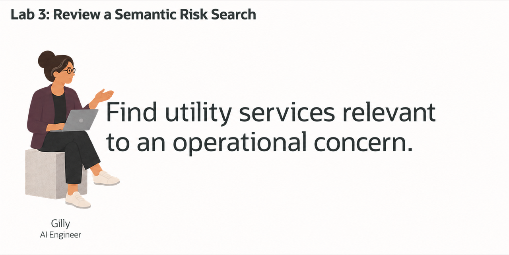
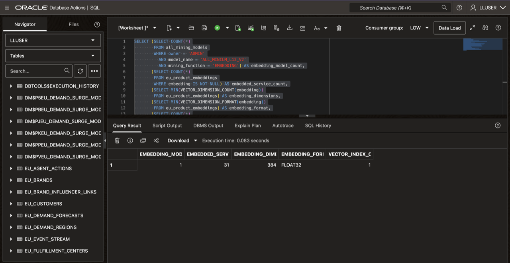
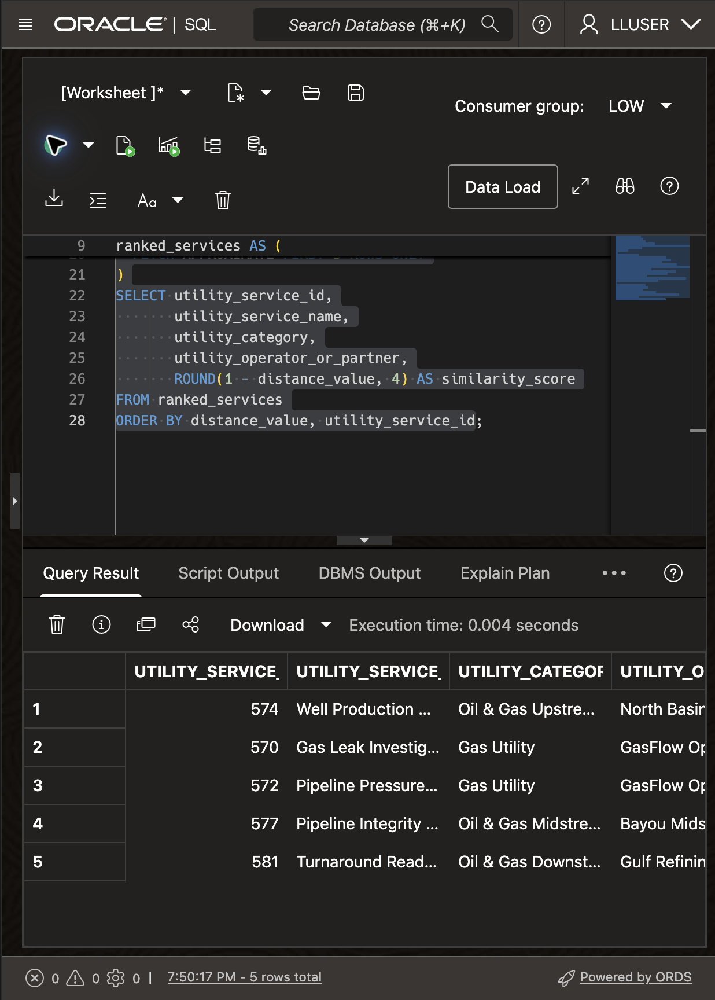
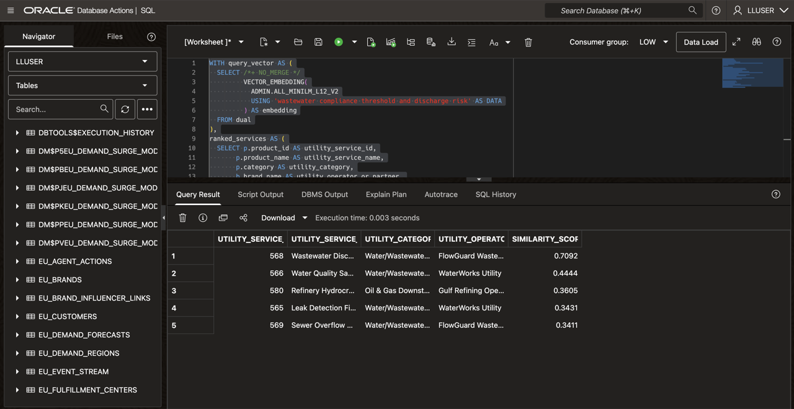

# Review a Semantic Risk Search

## Introduction

Gilly Bourne is an AI engineer at Seer Utility Network. She is helping Jessica’s operations team find utility services relevant to a reported concern. An operator describes gas pressure variation and needs to identify services that could support the investigation. The operator may not know the exact service names or use the same wording as the service catalog.

Gilly’s design problem is connecting that plain-language concern to the existing service records. A keyword search may overlook a relevant service described in different terms. Semantic search compares meaning, helping the operator find related services even when the wording differs. A useful result must show more than a similarity score: it should identify the service, its category, and its associated operator so the team can assess its relevance.

Gilly could maintain the service text and embeddings in a separate vector system, but that would introduce another copy to synchronize and another system to manage. Oracle AI Vector Search lets her compare vectors and retrieve the related service information within the same database.

In this lab, you review Gilly’s prepared search. You check the embedding model and stored service vectors, turn an operational concern into a query vector, and examine the five highest-ranked matches returned by the search. You then change the concern and compare the results to see how the wording affects relevance.

The search helps operators identify services worth reviewing. It does not confirm a gas leak, identify affected customers, or automatically choose an operational response.



<details>
<summary><strong>Key terms: embedding, vector, embedding model, and semantic search</strong></summary>

> - An **embedding** is a numerical representation of text that captures patterns in its meaning. In this lab, embeddings help compare an operator’s concern with utility-service descriptions, even when they use different wording.
> - A **vector** is an ordered list of numbers used to represent an embedding. The prepared model produces 384 numbers for each service description and search phrase.
> - An **ONNX embedding model** is a machine-learning model stored in the Open Neural Network Exchange (ONNX) format. This lab uses a model already available in the database to turn the search phrase into a vector.
> - **Cosine distance** compares the directions of two vectors. A smaller distance indicates a closer match in the model’s representation of meaning. It does not measure geographic distance or operational risk.
> - **Semantic search** finds related information by meaning rather than requiring the same words. For example, a concern about gas pressure variation can return relevant utility services whose names or descriptions use different terms.
> - The displayed **similarity score** is calculated as `1 - cosine distance`, so a higher score indicates a closer match. It is not a probability, a confidence percentage, or confirmation of a service problem.

</details>


Gilly has prepared a semantic search over the utility-service catalog. In this lab, you review how it connects an operator’s plain-language concern to ranked service matches. You inspect the database components supporting the search, run a query, and change the search phrase to explore a different operational concern.

### Objectives

- Check the prepared embedding model, stored service vectors, and vector index.
- Generate a vector from an operator’s search phrase inside the database.
- Find relevant utility services and review their names, categories, operators, and similarity scores.
- Change the search phrase and explain how the returned matches differ.
- Explain how vector search works alongside relational service data in the same database.
- Distinguish a relevant search result from confirmation of a service problem.

Estimated Time: **10 minutes**

<video controls width="100%">
  <source src="https://c4u04.objectstorage.us-ashburn-1.oci.customer-oci.com/p/EcTjWk2IuZPZeNnD_fYMcgUhdNDIDA6rt9gaFj_WZMiL7VvxPBNMY60837hu5hga/n/c4u04/b/livelabsfiles/o/livestack%2FVideos%2FFinance%2F03-Finance%20Workshop_LAB-3_with-CC.mp4" type="video/mp4">
  Your browser does not support the video tag.
</video>

*The video uses a Finance example. Follow the E&U tasks below for this lab’s approved profile, views, and operational questions.*

### Hands-on Scenario

Gilly tests whether an operator’s concern about gas pressure and leak response returns relevant utility services. She then changes the search phrase to a wastewater concern and compares the matches. The platform provides the shared `ADMIN.ALL_MINILM_L12_V2` embedding model and grants `LLUSER` access to use it.

| Step | Energy & Utilities focus |
| --- | --- |
| Business Problem | Operators need to find relevant utility services even when they do not know the catalog’s exact names or terminology. |
| Technical Challenge | Search by meaning and return service names, categories, and operators that help users assess each match. |
| Persona Focus | You review Gilly’s prepared search and help Jessica interpret the results for operational review. |
| What You Will Do | Check the model and stored vectors, search for services related to a gas concern, and compare the results with a wastewater search. |
| Database Capability | In-database text embeddings, vector-distance calculations, and relational joins work together in one SQL query. |
| Outcome | Explain why a returned service may be relevant to an investigation while recognizing that similarity does not establish operational risk or confirm a service problem. |

Persona focus: You are reviewing the search tool Gilly prepared to help utility operators find services relevant to an operational concern.

> **SQL Worksheet reminder:** Need a reminder on how to open and use the SQL Worksheet? Return to [Getting Started Task 2: Open SQL Worksheet](?lab=getting-started#Task2:OpenSQLWorksheet) for the step-by-step guide showing how to run SQL statements.


## Task 1: Verify vector readiness

Before Gilly tests the search, she checks that the database has the components it needs: an embedding model to convert the operator’s search phrase into a vector, stored vectors for the utility services, and a valid vector index to support vector search.

Jessica has arranged for the platform to provide these components. You will inspect their availability as `LLUSER` before running the search.

The query checks three sources:

- `ALL_MINING_MODELS` identifies the shared embedding model visible to your account.
- `EU_PRODUCT_EMBEDDINGS` contains the prepared utility-service vectors.
- `USER_INDEXES` reports whether the expected vector index is valid.

Although the table and index names contain `PRODUCT`, they support the utility-service catalog used in this workshop.

1. Run the readiness query.

    ```sql
    <copy>
    SELECT (SELECT COUNT(*)
            FROM all_mining_models
            WHERE owner = 'ADMIN'
              AND model_name = 'ALL_MINILM_L12_V2'
              AND mining_function = 'EMBEDDING') AS embedding_model_count,
           (SELECT COUNT(*)
            FROM eu_product_embeddings
            WHERE embedding IS NOT NULL) AS embedded_service_count,
           (SELECT MIN(VECTOR_DIMENSION_COUNT(embedding))
            FROM eu_product_embeddings) AS embedding_dimensions,
           (SELECT MIN(VECTOR_DIMENSION_FORMAT(embedding))
            FROM eu_product_embeddings) AS embedding_format,
           (SELECT COUNT(*)
            FROM user_indexes
            WHERE index_name = 'EU_IDX_PRODUCT_VEC'
              AND index_type = 'VECTOR'
              AND status = 'VALID') AS vector_index_count
    FROM dual;
    </copy>
    ```

2. Compare the single result row with the expected values for the prepared dataset.

    **Expected output: Vector readiness**

    | Visible embedding models | Non-null service embeddings | Minimum dimensions | Minimum format | Valid vector indexes |
    | --- | --- | --- | --- | --- |
    | 1 | 31 | 384 | FLOAT32 | 1 |

    

    The result indicates that your account can see the expected model, that 31 service embeddings are populated, and that the expected vector index is valid. The dimension and format columns report minimum values across the stored vectors; they do not verify that every vector has the same dimensions and format.

    If a result differs from the expected values, ask the workshop administrator to check the environment before continuing. The shared model and service vectors are prepared for you; this task does not create or modify them.

> **Checkpoint:** The stored vectors represent the utility-service descriptions. In the next task, Gilly uses the embedding model to create a vector for the operator’s search phrase and compares it with those stored vectors.


## Task 2: Search utility services by meaning

An operator asks Gilly which utility services might be relevant to gas pressure variation and leak response. The operator knows the concern but may not know the catalog’s exact service names. Gilly uses semantic search to find related services and returns their names, categories, and operators so Jessica’s team can assess the matches.

The search phrase is `gas pipeline pressure variance and leak response SLA`. Here, SLA means service-level agreement.

The query has three parts:

- `query_vector` converts the search phrase into an embedding.
- `ranked_services` compares that embedding with the stored service vectors and joins the matches to service and operator details.
- The final query displays the five returned candidates, placing the closest matches first.

1. Run the following search.

    ```sql
    <copy>
    WITH query_vector AS (
      SELECT /*+ NO_MERGE */
             VECTOR_EMBEDDING(
               ADMIN.ALL_MINILM_L12_V2
               USING 'gas pipeline pressure variance and leak response SLA' AS DATA
             ) AS embedding
      FROM dual
    ),
    ranked_services AS (
      SELECT p.product_id AS utility_service_id,
           p.product_name AS utility_service_name,
           p.category AS utility_category,
           b.brand_name AS utility_operator_or_partner,
             VECTOR_DISTANCE(pe.embedding, q.embedding, COSINE) AS distance_value
      FROM eu_product_embeddings pe
      JOIN eu_products p ON p.product_id = pe.product_id
      JOIN eu_brands b ON b.brand_id = p.brand_id
      CROSS JOIN query_vector q
      ORDER BY VECTOR_DISTANCE(pe.embedding, q.embedding, COSINE)
      FETCH APPROXIMATE FIRST 5 ROWS ONLY
    )
    SELECT utility_service_id,
           utility_service_name,
           utility_category,
           utility_operator_or_partner,
           ROUND(1 - distance_value, 4) AS similarity_score
    FROM ranked_services
    ORDER BY distance_value, utility_service_id;
    </copy>
    ```

    **Expected output: Five services relevant to the gas concern**

    In the captured `LLUSER` run, Well Production Variance Review, Gas Leak Investigation, and Pipeline Pressure Monitoring Review appeared near the top. Your exact scores and returned candidates may differ because the query requests approximate retrieval.

    

2. Review the service names, categories, operators, and similarity scores together. Gilly needs enough context to explain each match, rather than presenting a score on its own.

    | Column | What to examine |
    | --- | --- |
    | `UTILITY_SERVICE_ID` | Identifies the service record for follow-up. |
    | `UTILITY_SERVICE_NAME` | Helps you judge how the service relates to the gas concern. |
    | `UTILITY_CATEGORY` | Shows the service’s catalog category. The search does not restrict matches to one category. |
    | `UTILITY_OPERATOR_OR_PARTNER` | Identifies the operator or partner associated with the service. |
    | `SIMILARITY_SCORE` | Shows `1 - cosine distance`. A higher value indicates a closer semantic match, not greater operational risk. |

> **Checkpoint:** Choose one returned service and explain why its name and category make it worth reviewing. What additional information would an operator need before deciding whether that service is appropriate for the reported concern?

<details>
<summary><strong>Learn more: Query-vector reuse and approximate retrieval</strong></summary>

The one-row `query_vector` common table expression contains the query’s single written call to `VECTOR_EMBEDDING`. The `NO_MERGE` hint asks the optimizer to preserve that query block. The hint alone does not prove how many times the function executes at runtime.

`FETCH APPROXIMATE FIRST 5 ROWS ONLY` requests approximate retrieval. The optimizer may choose an exact scan for this small dataset. The final `ORDER BY` sorts the returned candidates by distance and uses the service identifier to break ties; it does not guarantee that approximate retrieval always selects the same five candidates.

</details>

## Task 3: Change the operational concern

The operations team now asks Gilly about wastewater compliance instead of gas pressure. She keeps the same service catalog and query structure, changing only the search phrase. This lets Jessica see how the search responds to a different business concern.

1. Replace the search phrase in `query_vector` with:

    ```text
    wastewater compliance threshold and discharge risk
    ```

    Run the complete query again.

2. Compare the first three service names and categories with the gas-search results from Task 2. Which services now appear more relevant to a wastewater investigation?

    **Expected output: Five services relevant to the wastewater concern**

    Wastewater Discharge Compliance Review ranked first in the validated run, followed by Water Quality Sampling. These are candidates for further review; their appearance does not establish that a discharge limit was breached.

    

    *The query excerpt shows the changed search phrase. The screenshot records the five services returned in the captured run. Your returned candidates and similarity scores may differ.*

> **Checkpoint:** Changing the phrase changes the meaning being compared with the stored service vectors. Compare the relevance of the returned services rather than expecting fixed scores or an identical ranking on every run.


**🎯 Interactive challenge:** Return to the gas concern from Task 2 and express it in your own words. Change only the search phrase, then compare the top three service names, categories, and operators with the original results. Would you select the same services for further review? Explain your reasoning.

<details>
<summary><strong>Challenge answer</strong></summary>

There is no single correct phrase or fixed ranking. A useful answer explains which returned services relate to the gas concern, which appear less relevant, and whether rewording changed the review candidates.

Use the service names, categories, and operators to support your explanation. Similarity scores help compare matches within each result, but they do not establish that a service problem exists.

The query does not return full service descriptions or actual reliability events. Those would need further investigation before deciding on an operational response.

</details>

## Conclusion

Gilly connected an operator’s plain-language concern to utility-service records using an embedding model, stored vectors, and SQL. The results combined semantic similarity with service names, categories, and operators, giving Jessica’s team context for deciding what to investigate.

By changing the search phrase, you explored a different concern without rebuilding the service catalog or moving its data to a separate vector store. The search provides a starting point for review; the team still needs operational evidence to determine whether a problem exists and how to respond.

## Next Steps

Semantic search helps the team find relevant services. Bob next investigates a different question: which events, assets, crews, and supporting records are explicitly connected? You will follow those stored relationships using SQL property graph queries (SQL/PGQ).

## Acknowledgements

* **Author** - Zileyah Onafowora
* **Last Updated By/Date** - Zileyah Onafowora September 2026
