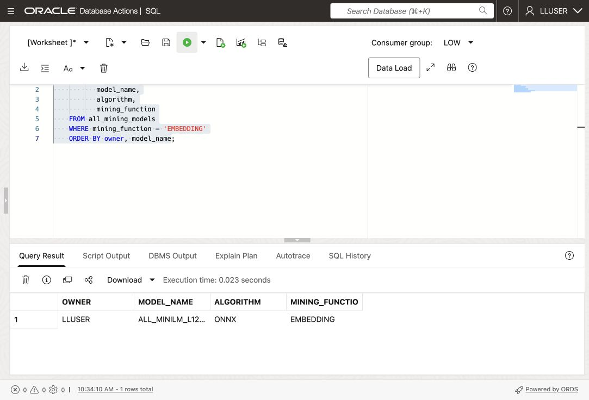
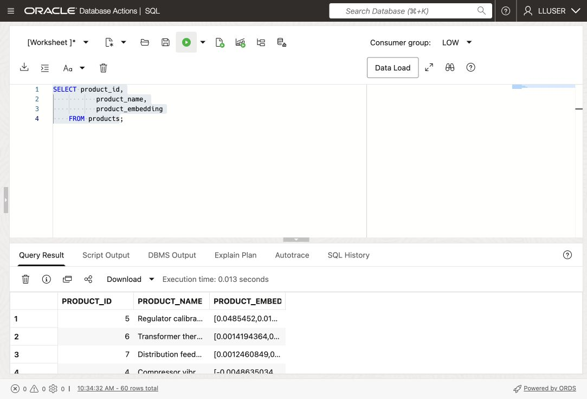
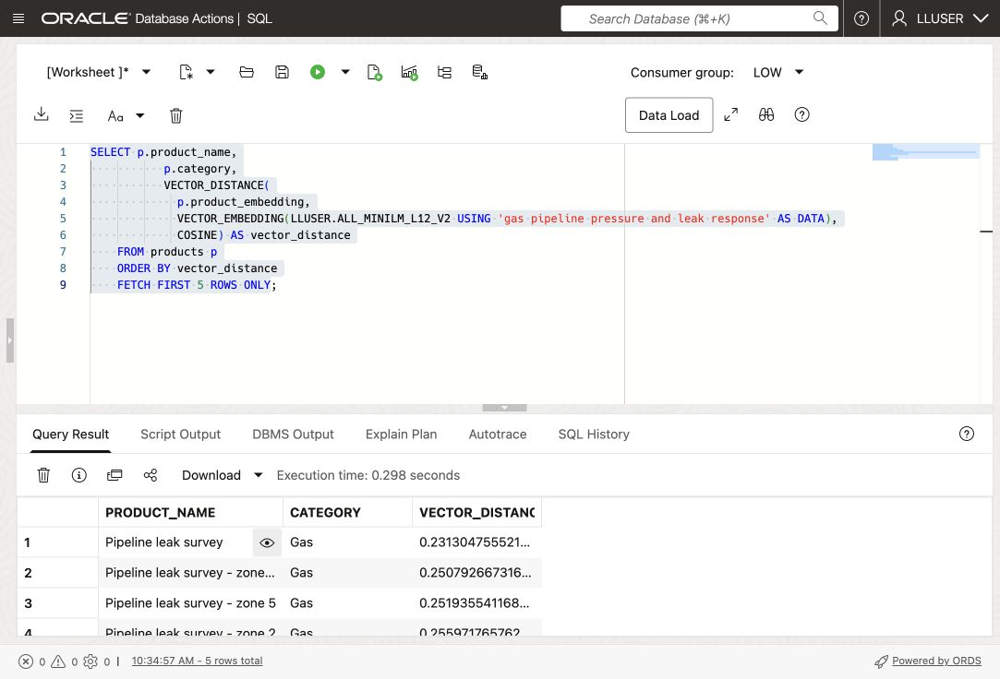
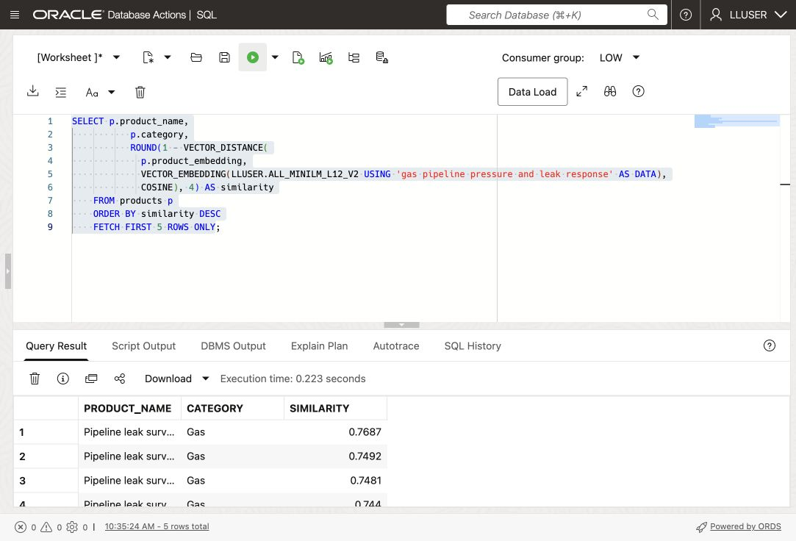
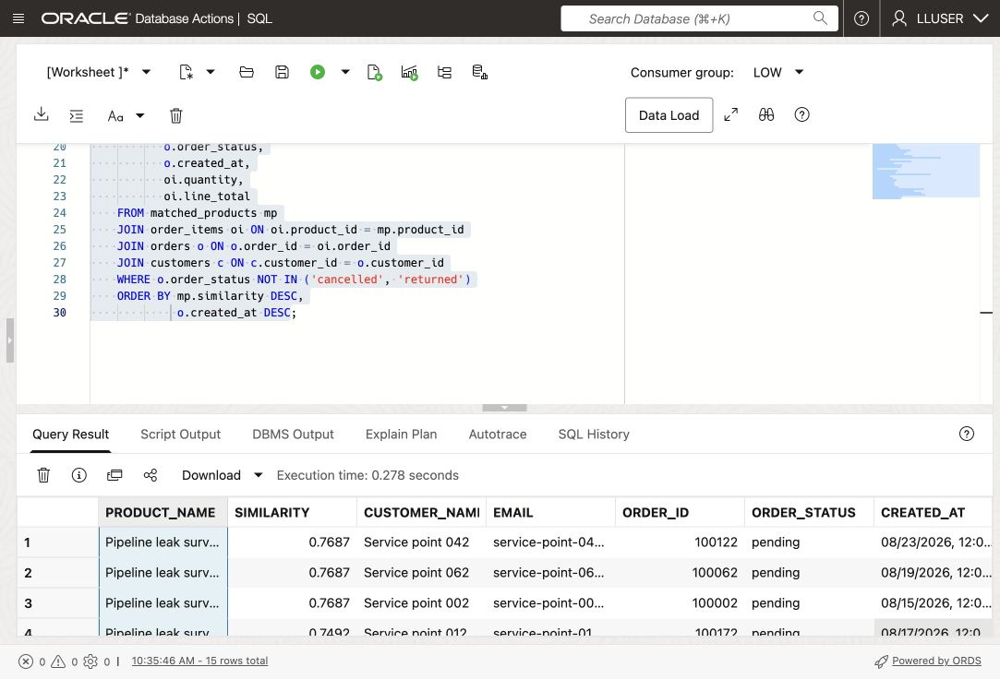

# Review a Semantic Risk Search

## Introduction

Gilly Bourne, Seer Utility Network's AI engineer, is building a search for the concern **“Which service points may be affected by a gas pipeline pressure issue?”** She first finds related utility services, then identifies the service points that requested them.

Review her implementation: create service embeddings, rank matches by meaning, and join them to request and contact details. The vectors and relational data stay in Oracle AI Database.


<details>
<summary><strong>Key terms: embedding, vector, vector distance, and semantic search</strong></summary>

> - An **embedding** is a numerical profile of what text means. In this lab, service data is embedded so similar utilities ideas sit near each other mathematically, even when the wording is different.
>
> - An **ONNX embedding model** is a portable machine-learning model saved in the Open Neural Network Exchange (ONNX) format. It turns text into a vector of numbers that captures meaning. Oracle AI Database can load and run this model inside the database, close to the service rows.
>
> - A **vector** is the stored numerical form of an embedding. Oracle Database can store vectors beside the utilities rows they describe, so the search stays connected to service names, request counts, notice counts, and other business columns.
>
> - **Vector distance** measures how close two vectors are. A smaller distance means the meanings are more similar; a larger distance means they are farther apart. In this lab, distance helps rank which utility services or risk notices best match a business user's question.
>
> - **Semantic search** means searching by meaning instead of exact words. A search for "gas pipeline pressure and leak response" can find related gas services even when the service names use different wording.

</details>

### Objectives

- Check the embedding model Gilly needs for semantic search.
- Create a vector from service data inside the database.
- Review a semantic service search for a business question.
- Turn service matches into a service-point follow-up list.
- Explain why vector search belongs beside utilities data and access controls.

Estimated Time: **10 minutes**

> **Video pending:** A Utilities walkthrough for this lesson has not yet been recorded.

> **Schema names:** `PRODUCTS` stores utility services and supplies; `ORDERS`, `ORDER_ITEMS`, and `CUSTOMERS` link them to requests and service points.

> **SQL Worksheet:** [Getting Started: open SQL Worksheet as LLUSER](?lab=getting-started), Task 2.

## Task 1: Check the embedding model

Similarity search needs vectors for the service text and the question, produced by the same embedding model.

1. Run the following query to see which embedding models are available:

    ```sql
    <copy>
    SELECT owner,
           model_name,
           algorithm,
           mining_function
    FROM all_mining_models
    WHERE mining_function = 'EMBEDDING'
    ORDER BY owner, model_name;
    </copy>
    ```

    **Expected output: Available Embedding Models**

    

    Initialization loads `LLUSER.ALL_MINILM_L12_V2`. If it is absent, stop here. This compact model turns text into 384-number vectors. The `EMBEDDING` value confirms that the model can turn text into vectors for similarity search.

2. Review what this means for Gilly's application.

    Gilly calls the database model from SQL with `VECTOR_EMBEDDING(...)`.

## Task 2: Create a service vector

> **Learner-created column:** The loader leaves `PRODUCTS.PRODUCT_EMBEDDING` absent for this exercise. Its separate `PRODUCT_EMBEDDINGS` table supplies Lab 1. Both use the LLUSER-owned 384-dimensional model.

Gilly decides that one vector per service is enough. Each service record is short and describes one service, so she combines its name, category, and subcategory into one text value before creating the vector.

1. Review the text Gilly will embed:

    ```sql
    <copy>
    SELECT product_id,
           product_name,
           category,
           subcategory,
           product_name || '. Category: ' || category ||
             '. Subcategory: ' || subcategory AS embedding_text
    FROM products
    FETCH FIRST 5 ROWS ONLY;
    </copy>
    ```

    The combined text gives the model the service name and its business classification. Gilly does not need to embed price, dates, or other values that do not describe what the service is.

2. Add a vector column to `PRODUCTS`:

    ```sql
    <copy>
    ALTER TABLE products ADD (product_embedding VECTOR(384));
    </copy>
    ```

    The column has 384 dimensions because `ALL_MINILM_L12_V2` produces 384-dimensional vectors.

3. Create the service vectors inside Oracle Database:

    ```sql
    <copy>
    UPDATE products
    SET product_embedding = VECTOR_EMBEDDING(
      LLUSER.ALL_MINILM_L12_V2 USING
        product_name || '. Category: ' || category ||
        '. Subcategory: ' || subcategory AS DATA)
    WHERE product_embedding IS NULL;

    COMMIT;
    </copy>
    ```

    The model reads the text in each row and writes the vector back to that same row. No service text leaves the database.

4. Verify the new column and its data:

    ```sql
    <copy>
    SELECT product_id,
           product_name,
           product_embedding
    FROM products;
    </copy>
    ```

    

    Confirm that every populated service row has a 384-dimensional vector.

    > **Chunking:** Each service description is short enough for one vector. Long documents may need separate vectors for sections that answer different questions.

## Task 3: Test the service vector

Now Gilly tests the new column with a simple vector query. She asks for utility services related to gas pipeline pressure and leak response and lets the database rank them by meaning.

1. Run the following query:

    The SQL creates an embedding for the phrase `gas pipeline pressure and leak response`, compares it with the vectors in `PRODUCTS.PRODUCT_EMBEDDING`, and returns the cosine distance. A smaller distance means the two vectors are closer in meaning, so the query orders the smallest distance first.

    ```sql
    <copy>
    SELECT p.product_name,
           p.category,
           VECTOR_DISTANCE(
             p.product_embedding,
             VECTOR_EMBEDDING(LLUSER.ALL_MINILM_L12_V2 USING 'gas pipeline pressure and leak response' AS DATA),
             COSINE) AS vector_distance
    FROM products p
    ORDER BY vector_distance
    FETCH FIRST 5 ROWS ONLY;
    </copy>
    ```

    **Expected output: Utility Service Matches**

    

2. Review the ranked utility services.
    Confirm that the closest matches appear first. `VECTOR_DISTANCE(..., COSINE)` returns smaller values for closer matches.

3. Show the result as a similarity score:

    Display `1 - distance` as similarity, rounded to four decimal places. Higher values now mean closer matches.

    ```sql
    <copy>
    SELECT p.product_name,
           p.category,
           ROUND(1 - VECTOR_DISTANCE(
             p.product_embedding,
             VECTOR_EMBEDDING(LLUSER.ALL_MINILM_L12_V2 USING 'gas pipeline pressure and leak response' AS DATA),
             COSINE), 4) AS similarity
    FROM products p
    ORDER BY similarity DESC
    FETCH FIRST 5 ROWS ONLY;
    </copy>
    ```

    This changes the display, not the matching calculation.

    

## Task 4: Find customers affected by a service concern

Turn the service matches into a follow-up list with request status, date, and service-point contact details.

1. Run the following query for the concern `gas pipeline pressure and leak response`:

    ```sql
    <copy>
    WITH matched_products AS (
        SELECT p.product_id,
               p.product_name,
               ROUND(1 - VECTOR_DISTANCE(
                 p.product_embedding,
                 VECTOR_EMBEDDING(
                   LLUSER.ALL_MINILM_L12_V2
                   USING 'gas pipeline pressure and leak response' AS DATA
                 ),
                 COSINE), 4) AS similarity
        FROM products p
        ORDER BY similarity DESC
        FETCH FIRST 5 ROWS ONLY
    )
    SELECT mp.product_name,
           mp.similarity,
           c.first_name || ' ' || c.last_name AS customer_name,
           c.email,
           o.order_id,
           o.order_status,
           o.created_at,
           oi.quantity,
           oi.line_total
    FROM matched_products mp
    JOIN order_items oi ON oi.product_id = mp.product_id
    JOIN orders o ON o.order_id = oi.order_id
    JOIN customers c ON c.customer_id = o.customer_id
    WHERE o.order_status NOT IN ('cancelled', 'returned')
    ORDER BY mp.similarity DESC,
             o.created_at DESC;
    </copy>
    ```

    The first part ranks utility services by meaning. The remaining joins use ordinary relational keys to find the matching order items, orders, and customers.

    **Expected output: Service-point Follow-up List**

    

2. Review the business result.

    Check that each contact is linked through a matching service request. Only service descriptions are vectorized; relational joins supply the exact request and contact details.

## Conclusion

Gilly can now turn an operational concern into a service-point follow-up list. Next, Bob investigates the relationships behind the event.

## Acknowledgements

* **Authors** - Matt Kowalik, Kevin Lazarz
* **Contributor** - Eugenio Galiano, Pat Shepherd
* **Last Updated By/Date** - Oracle Database Product Management, October 2026
