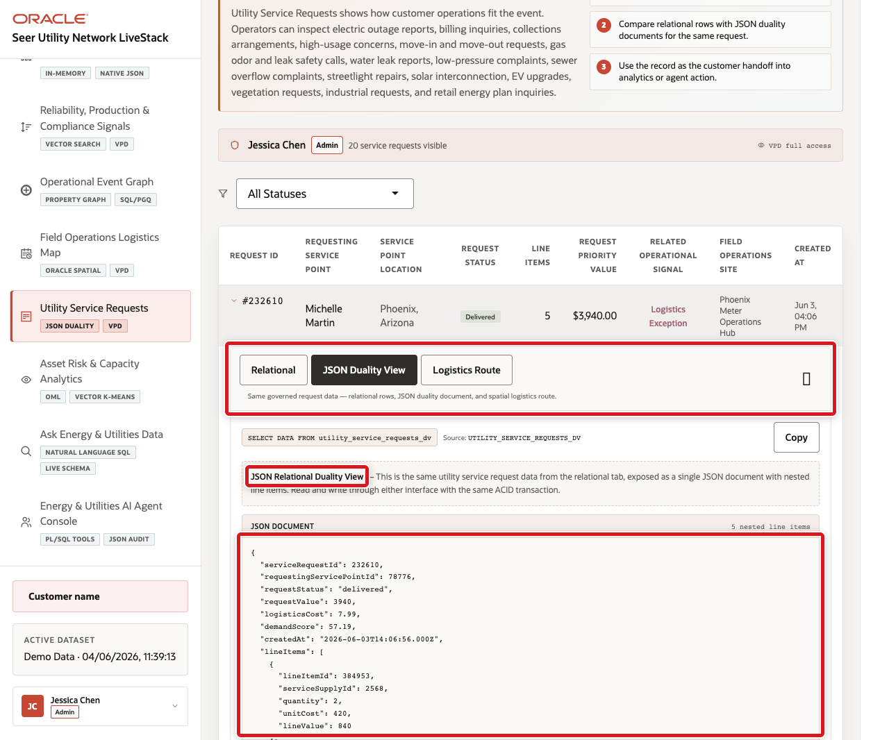

# Build a JSON Application Model

## Introduction

Thomas Brune develops the utility service-request workspace. The application wants a nested JSON document, while Jessica needs requests and line items to remain relational for reporting, integrity, and shared governance. JSON Relational Duality provides both representations from the same data. This workshop view maps `UPDATE` operations to its parent and child tables; insert and delete support would require matching annotations in the view definition.

Estimated Time: **10 minutes**

### Objectives

- Read a utility service request as JSON.
- Project JSON fields into SQL.
- Compare the document with its relational source rows.

### Hands-on Scenario

Thomas verifies the document used by the Service Tickets page, then proves that it is backed by the existing request and item tables.

> **SQL Worksheet reminder:** Return to [Getting Started Task 2](?lab=getting-started#Task2:OpenSQLWorksheet) if you need the launch and execution steps.

## Task 1: Read a service-request document

1. Return one document from the duality view.

    <copy>
    ```sql
    SELECT JSON_SERIALIZE(d.data RETURNING CLOB PRETTY) AS service_request_document
    FROM eu_utility_service_requests_dv d
    ORDER BY JSON_VALUE(d.data, '$._id' RETURNING NUMBER)
    FETCH FIRST 1 ROW ONLY;
    ```
    </copy>

2. Expand the result and locate `_id`, `requestingServicePointId`, `requestStatus`, `requestValue`, and `lineItems`.

    

> **Checkpoint:** The document is assembled from the backing request and line-item tables. It is not a second, independently synchronized copy.

The operations available through a duality view come from its DDL annotations. `WITH UPDATE` in this workshop enables the demonstrated update path; it should not be read as unrestricted insert or delete support. Concurrent document updates also use duality-view concurrency controls such as the document ETAG, so an application should treat a stale ETAG as a conflict rather than silently overwrite newer data.

## Task 2: Project document fields with SQL

1. Run the following query.

    <copy>
    ```sql
    SELECT JSON_VALUE(d.data, '$._id' RETURNING NUMBER) AS service_request_id,
           JSON_VALUE(d.data, '$.requestStatus') AS request_status,
           JSON_VALUE(d.data, '$.requestValue' RETURNING NUMBER) AS request_value,
           JSON_QUERY(d.data, '$.lineItems') AS line_items
    FROM eu_utility_service_requests_dv d
    ORDER BY service_request_id
    FETCH FIRST 10 ROWS ONLY;
    ```
    </copy>

2. Notice that SQL can filter and project a document without application-side parsing.

## Task 3: Compare the relational representation

1. Run the matching relational query.

    <copy>
    ```sql
    SELECT r.service_request_id,
           r.request_status,
           r.request_value,
           COUNT(i.line_item_id) AS line_item_count,
           SUM(i.line_value) AS line_value
    FROM eu_utility_service_requests r
    JOIN eu_utility_request_items i
      ON i.service_request_id = r.service_request_id
    GROUP BY r.service_request_id, r.request_status, r.request_value
    ORDER BY r.service_request_id
    FETCH FIRST 10 ROWS ONLY;
    ```
    </copy>

2. Match a `SERVICE_REQUEST_ID` to the JSON `_id`. Thomas can give the application documents while Jessica keeps ordinary SQL available for operations and audit.

    **Expected output pattern**

    | JSON field | Relational evidence |
    | --- | --- |
    | `_id` | `SERVICE_REQUEST_ID` |
    | `requestStatus` | `REQUEST_STATUS` |
    | `lineItems` | `LINE_ITEM_COUNT` and `LINE_VALUE` |

> **🎯 Interactive challenge:** Choose one document `_id`, filter the relational query to the same identifier, and confirm that status, value, and line-item count agree.

<details>
<summary><strong>Challenge answer</strong></summary>

Add a `WHERE` predicate for the selected service-request identifier before the `GROUP BY`. The JSON and relational values should describe the same request.

</details>

## Conclusion: Choose the right JSON representation

You used a duality view when the same request needed both document and relational access. Oracle Database maintains the relationship; the application does not need a separate document database.

## Next Steps

Gilly now uses in-database vectors to find services whose descriptions match an operational concern.

## Acknowledgements

* **Author** - Oracle Database Product Management
* **Last Updated By/Date** - Oracle Database Product Management, September 2026
