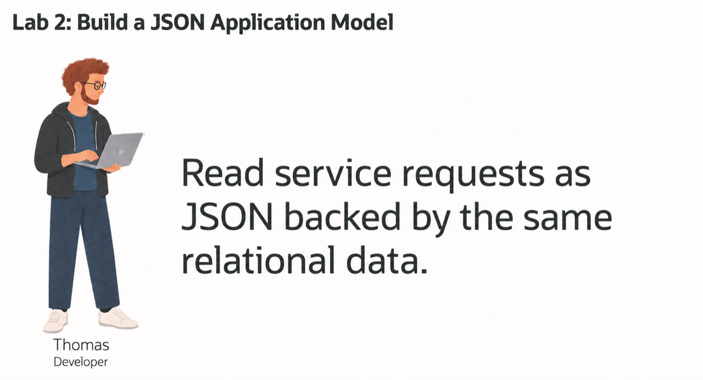
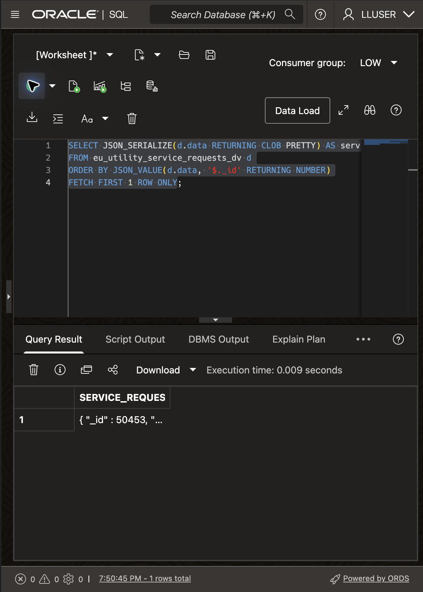
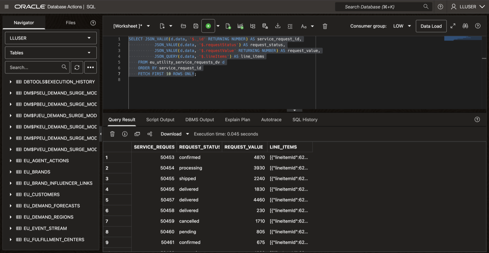
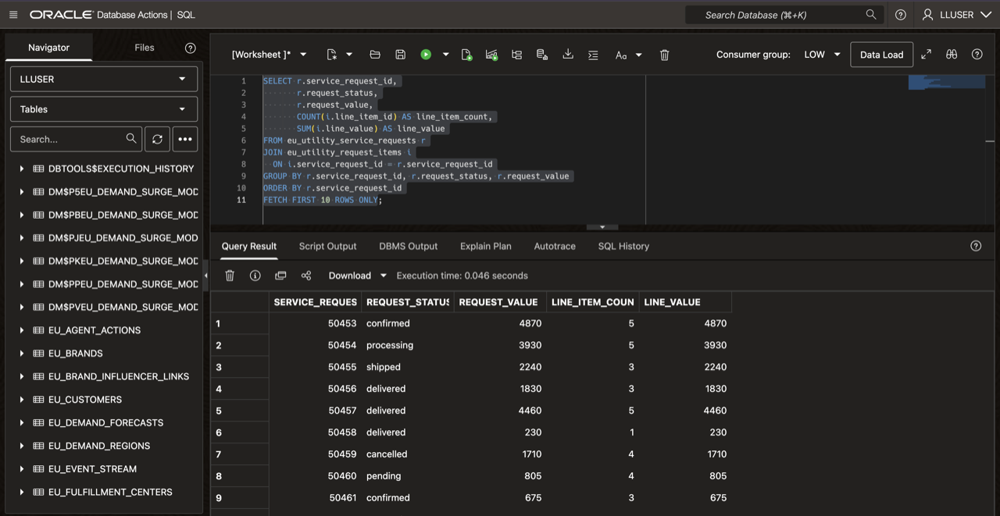

# Build a JSON Application Model

## Introduction

Thomas Brune is an application developer at Seer Utility Network. He and his team are building a service-request workspace for utility operators. After Jessica identifies requests that need attention, operators need to open a request and see its status, value, and requested services or supplies together.

Thomas wants this information in one nested JavaScript Object Notation (JSON) document that the application can consume directly. A document can group the request details and its line items into a payload that matches the workspace screen, reducing the need for the application to assemble separate query results.

Jessica, the DBA, needs the same information available as relational rows for reporting, SQL queries, and database controls. Maintaining an independent document store would introduce another copy to keep synchronized whenever a request changes.

Thomas and Jessica use a JSON Relational Duality View to provide a document representation of the existing relational data. In this lab, you read a prepared service-request document, select fields from it using SQL, and compare those values with the underlying request and line-item rows. You will see how application developers and database teams can work with different representations of the same stored records.



<details>
<summary><strong>Key terms: JSON Relational Duality View, JSON document, and projection</strong></summary>

> - A **JSON Relational Duality View** presents relational data as JSON documents. In this lab, it brings a service request and its line items together in one document, while the underlying data remains in relational tables.
> - A **JSON document** groups related information into named fields and nested structures. Here, `_id` identifies the service request, and `lineItems` contains an array of its requested services or supplies.
> - **Projection** means selecting particular fields from a document to display in a query result. `JSON_VALUE` extracts a single value, such as the request status. `JSON_QUERY` retrieves a JSON object or array, such as `lineItems`.

</details>


Thomas’s application needs a document that brings a service request and its line items together, such as this shortened excerpt from request `50453`:

```json
{
  "_id": 50453,
  "serviceRequestId": 50453,
  "requestingServicePointId": 9376,
  "requestStatus": "confirmed",
  "requestValue": 4870,
  "lineItems": [
    {
      "lineItemId": 62419,
      "serviceSupplyId": 564,
      "quantity": 2,
      "unitCost": 780,
      "lineValue": 1560
    }
  ]
}
```

This excerpt shows selected fields and one of the request’s five line items. The complete document also includes metadata and additional request details. The `requestValue` represents the full request, not just the single item shown here.

The application reads this information as a JSON document, while the database keeps the request and its line items in relational tables. In this lab, you read the prepared document, extract selected fields with SQL, and compare them with the underlying relational rows.


### Objectives

- Read a utility service request as JSON.
- Project JSON fields into SQL.
- Compare the document with its relational source rows.

Estimated Time: **10 minutes**

<video controls width="100%">
  <source src="https://c4u04.objectstorage.us-ashburn-1.oci.customer-oci.com/p/EcTjWk2IuZPZeNnD_fYMcgUhdNDIDA6rt9gaFj_WZMiL7VvxPBNMY60837hu5hga/n/c4u04/b/livelabsfiles/o/livestack%2FVideos%2FFinance%2F02-Finance%20Workshop_LAB-2_with-CC.mp4" type="video/mp4">
  Your browser does not support the video tag.
</video>

*The video uses a Finance example. Follow the E&U tasks below for this lab’s approved profile, views, and operational questions.*

### Hands-on Scenario

Thomas checks the service-request document his application can consume, then works with Jessica to compare its contents with the underlying relational rows.

| Step | Energy & Utilities focus |
| --- | --- |
| Business Problem | Operators need request details and line items together when reviewing an operational response. |
| Technical Challenge | The application needs a nested JSON document while the database retains relational rows and controls. |
| Persona Focus | Thomas reviews the application document; Jessica verifies that its contents match the relational data. |
| What You Will Do | Read one JSON document, extract selected fields from ten request documents, and compare the results with relational rows. |
| Database Capability | JSON Relational Duality and SQL/JSON functions provide document access to existing relational data. |
| Outcome | Explain how the application and operational reports can use different representations of the same service-request data without maintaining a separate document copy. |

Persona focus: You are Thomas, working with Jessica to understand how the service-request workspace can read JSON documents while operational reports use the same data as relational rows.

### One service request, two representations

Thomas’s application needs the service request and its line items together in a nested JSON document. Jessica needs to query those records as relational rows for operational reporting. A JSON Relational Duality View connects these two representations by assembling the document from existing request and line-item tables.

Thomas can read the document shape his application needs, while Jessica uses SQL to inspect the underlying records. They do not need to maintain a separate document copy or build a synchronization process between two data stores.

In this lab, you inspect the prepared duality view and compare its JSON output with relational query results to verify that both representations describe the same service requests.

> **SQL Worksheet reminder:** Need a reminder on how to open and use the SQL Worksheet? Return to [Getting Started Task 2: Open SQL Worksheet](?lab=getting-started#Task2:OpenSQLWorksheet) for the step-by-step guide on how to run SQL statements.

## Task 1: Read a service-request document

Thomas is preparing the request-details screen for the utility service-request workspace. When an operator opens a request, the screen needs to show its status, value, and requested services or supplies together. Before connecting the application, Thomas checks whether the prepared JSON document contains the information the screen needs.

Jessica points him to `EU_UTILITY_SERVICE_REQUESTS_DV`, a JSON Relational Duality View that assembles each request and its line items from the underlying relational tables. Thomas starts by reading one document and examining its fields and nested `lineItems` array.

The query below uses `JSON_SERIALIZE` to display the document as readable text. Ordering by the numeric `_id` selects the request with the lowest identifier, giving Thomas and Jessica a consistent example to inspect and compare in the following tasks.

1. Return one document from the duality view.

    ```sql
    <copy>
    SELECT JSON_SERIALIZE(d.data RETURNING CLOB PRETTY) AS service_request_document
    FROM eu_utility_service_requests_dv d
    ORDER BY JSON_VALUE(d.data, '$._id' RETURNING NUMBER)
    FETCH FIRST 1 ROW ONLY;
    </copy>
    ```

2. Open or expand the document cell and locate `_id`, `requestingServicePointId`, `requestStatus`, `requestValue`, and `lineItems`.

    **Expected output: One service-request document**

    The prepared dataset starts with request `50453`. Record its status and value, then count the elements in `lineItems` for comparison in Task 3. The screenshot shows the document header, request fields, and the beginning of the `lineItems` array. Open the result cell and scroll through the document to inspect all five items. This is a read-only result, not a demonstrated update.

    

> **Checkpoint:** The document is assembled from the backing request and line-item tables. It is not a second, independently synchronized copy.

<details>
<summary><strong>Learn more: Supported updates are separate from this read-only exercise</strong></summary>

> The view definition includes `WITH UPDATE` annotations for the request and line-item tables. Those annotations permit supported updates through the view; they do not grant unrestricted insert or delete behavior. This lab only reads the view and does not test update behavior. Applications that update duality documents must also handle concurrency checks, including document ETAG conflicts, rather than silently overwrite newer data.

</details>

## Task 2: Project document fields with SQL

Thomas does not always need the full document. For a request-summary screen, he needs the request identifier, status, and value as separate columns, while keeping the line items together as JSON. The next query selects those fields and orders the first ten requests by identifier so you can compare them with the relational results in Task 3.

1. Run the following query.

    ```sql
    <copy>
    SELECT JSON_VALUE(d.data, '$._id' RETURNING NUMBER) AS service_request_id,
           JSON_VALUE(d.data, '$.requestStatus') AS request_status,
           JSON_VALUE(d.data, '$.requestValue' RETURNING NUMBER) AS request_value,
           JSON_QUERY(d.data, '$.lineItems') AS line_items
    FROM eu_utility_service_requests_dv d
    ORDER BY service_request_id
    FETCH FIRST 10 ROWS ONLY;
    </copy>
    ```

2. Review the first ten requests. `LINE_ITEMS` remains a JSON array; this query selects fields but does not turn each line item into a separate result row.

    **Expected output: Ten service requests with selected document fields**

    In the prepared dataset, the first identifier is `50453`, matching Task 1. Each row contains the request identifier, status, value, and its line-item array. This lets Thomas retrieve selected document fields directly through SQL without extracting them in application code.

    

## Task 3: Compare the relational representation

Thomas has checked the JSON document his application can read. Jessica now verifies the same request information using relational SQL. She wants to confirm that the application document and operational reports agree on the request’s identifier, status, value, and line items.

The query joins each request to its items and groups the results into one row per request. `COUNT` returns the number of line items, while `SUM` adds their line values. Jessica can obtain this summary directly from the relational data without parsing JSON.

1. Run the matching relational query.

    ```sql
    <copy>
    SELECT r.service_request_id,
           r.request_status,
           r.request_value,
           COUNT(i.line_item_id) AS line_item_count,
           SUM(i.line_value) AS line_value
    FROM eu_utility_service_requests r
    JOIN eu_utility_request_items i
      ON i.service_request_id = r.service_request_id
    GROUP BY r.service_request_id, r.request_status, r.request_value
    ORDER BY r.service_request_id
    FETCH FIRST 10 ROWS ONLY;
    </copy>
    ```

2. Compare the results with the JSON document from Task 1 and the selected fields from Task 2.

    **Expected output: Ten relational request summaries**

    | JSON evidence | Relational result to compare |
    | --- | --- |
    | `_id` | `SERVICE_REQUEST_ID` |
    | `requestStatus` | `REQUEST_STATUS` |
    | `requestValue` | `REQUEST_VALUE` |
    | Number of elements in `lineItems` | `LINE_ITEM_COUNT` |
    | Sum of the `lineValue` fields in `lineItems` | `LINE_VALUE` |

    

    *The screenshot shows nine of the ten returned rows. Request `50453` is `confirmed` and has five line items. Its request value and summed line value are both `4870`, matching the document inspected in Task 1.*

Thomas can use the JSON document in the application while Jessica uses relational SQL for operational reporting. Both access the same underlying request and item records.

> **🎯 Interactive challenge:** Compare request `50453` across all three task results without changing the queries. Which fields establish that the document and relational results describe the same request? How can you verify its item count and summed line value?

<details>
<summary><strong>Challenge answer</strong></summary>

Match JSON `_id` to `SERVICE_REQUEST_ID`, `requestStatus` to `REQUEST_STATUS`, and `requestValue` to `REQUEST_VALUE`.

Count the five elements in the complete `lineItems` array and compare that count with `LINE_ITEM_COUNT`. Then add their `lineValue` values:

`1560 + 2040 + 310 + 620 + 340 = 4870`

Compare that total with `LINE_VALUE`. The item count and summed value measure different things: one counts line items, while the other adds their values.

These checks show that the JSON and relational results agree for this request. This exercise reads and compares data; it does not demonstrate a document update.

</details>


## Conclusion: Read the same request as JSON and relational data

Thomas needs a service-request document for the application, while Jessica needs relational rows for operational reporting. In this lab, you explored how a JSON Relational Duality View supports both needs using the same underlying data.

| Representation | What you inspected | How it helps the team |
| --- | --- | --- |
| Complete JSON document | One request with its details and nested `lineItems` array. | Thomas can retrieve the information needed for a request-details screen together. |
| Selected JSON fields | Request identifiers, statuses, and values as SQL columns, with line items retained as JSON. | Thomas can retrieve selected fields without extracting them in application code. |
| Relational summary | Request rows joined to their items, with an item count and summed line value. | Jessica can use familiar SQL to report on requests and compare the results with the application document. |

`EU_UTILITY_SERVICE_REQUESTS_DV` provides the document shape over the existing request and line-item data. Thomas can read that document while Jessica queries the underlying records, without maintaining a separate document copy.

By comparing identifiers, statuses, values, and line items, you verified that the JSON and relational results describe the same request. The lab demonstrated reading and comparing these representations; it did not change the request data.

## Next Steps

Thomas now understands how the application can read a complete service-request document from existing relational data. Gilly tackles a different problem next: helping operators find relevant utility services when they describe a concern using different words from the stored service names.
## Acknowledgements

* **Author** - Zileyah Onafowora
* **Last Updated By/Date** - Zileyah Onafowora, September 2026
