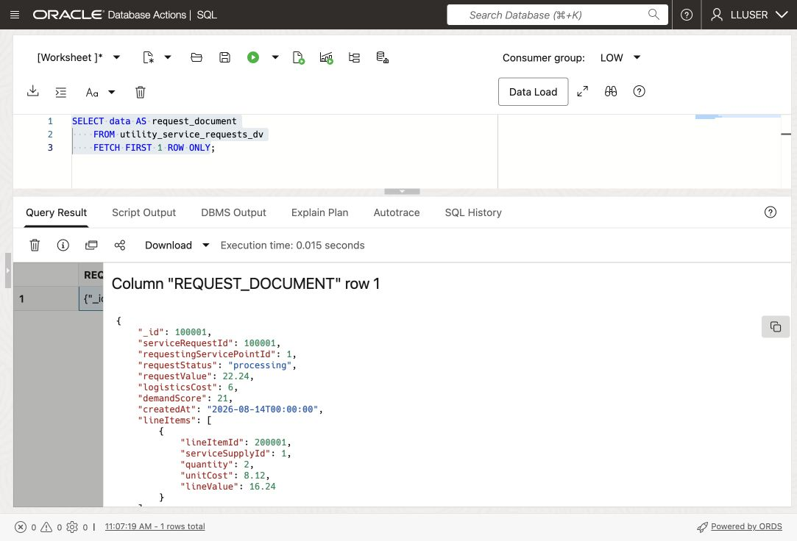
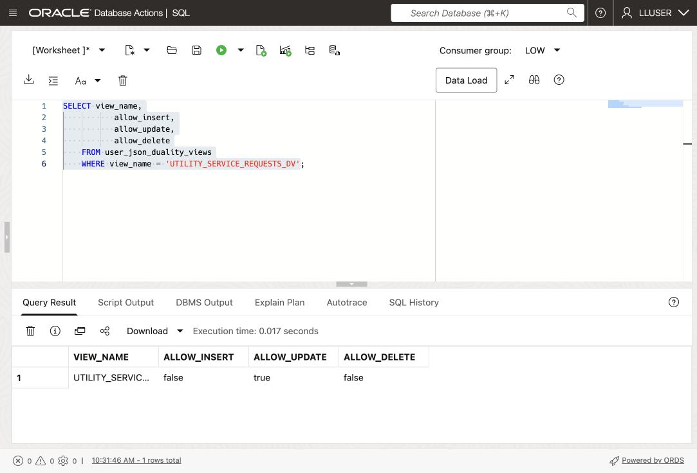
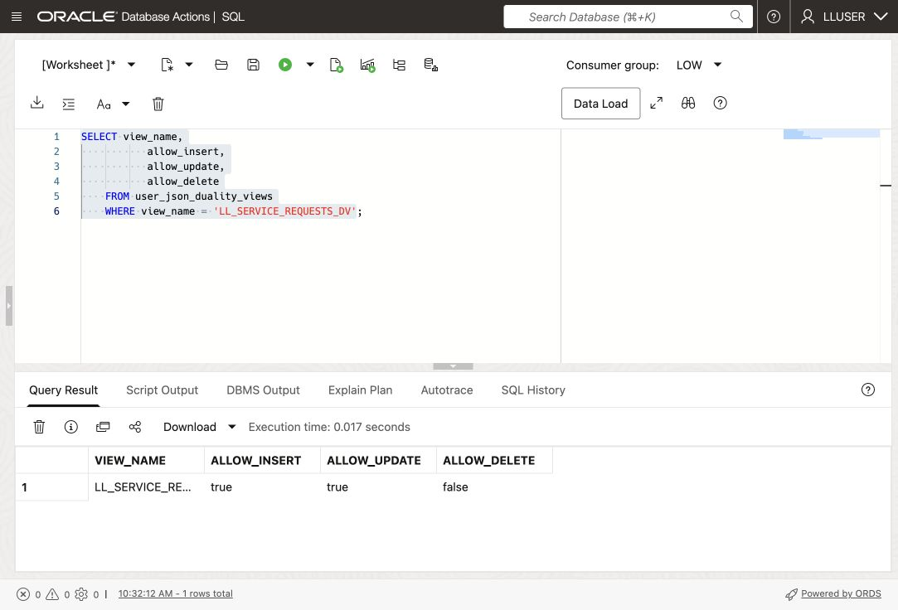
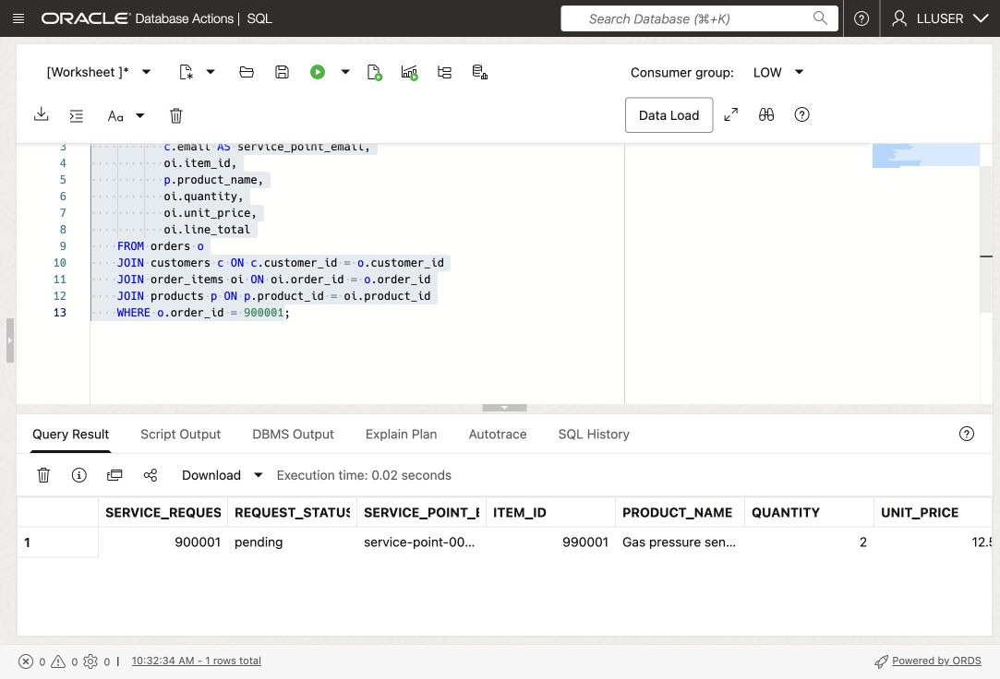
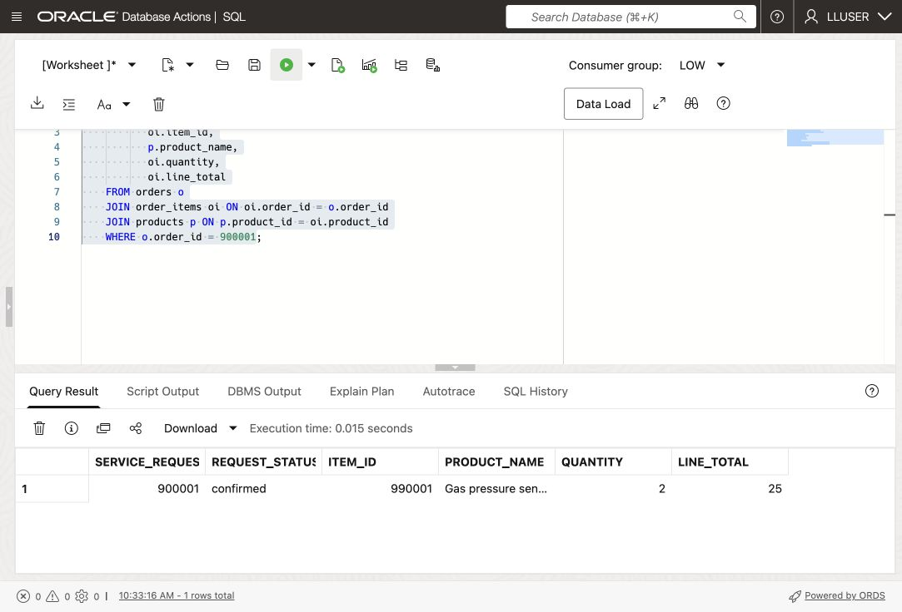
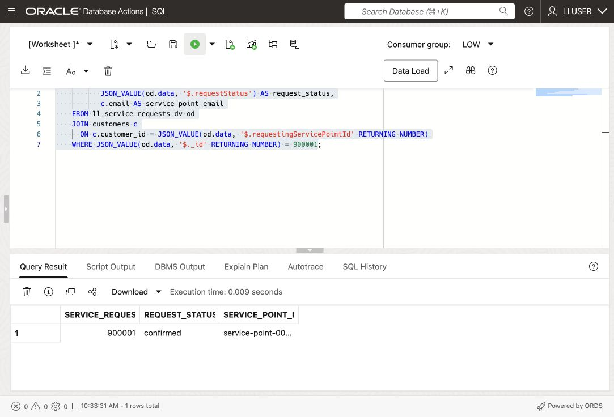
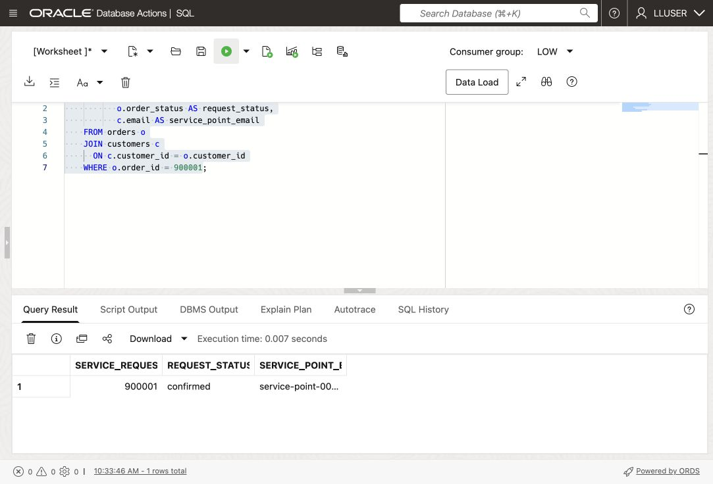

# Build a JSON Application Model

## Introduction

Thomas Brune is building a customer web and mobile application for Seer Utility Network. Each screen needs a JSON payload containing a service request, its status, and line items.

With Jessica, the DBA, compare three approaches: a JSON column for optional attributes, a collection for application-owned documents, and a duality view over existing relational rows.


<details>
<summary><strong>Key terms: JSON columns, JSON collections, and JSON Relational Duality</strong></summary>

> - A **JSON column** stores a JSON value in a relational table alongside normal typed columns, keys, and constraints. Thomas can use it for optional or changing application attributes without turning every new attribute into a schema change.
>
> - A **JSON collection** is a special table or view that provides a set of JSON documents through one `JSON`-typed `DATA` column. Each document can have a top-level `_id` used to identify it.
>
> - **JSON Relational Duality** lets Oracle Database expose relational data as JSON documents without copying it into a separate document database. The application gets the document shape Thomas wants for its API. The database keeps the relational rows and controls.
>

</details>

Thomas's application needs a payload with the service request and its line items together, such as this:

```json
{
  "_id": 900001,
  "requestingServicePointId": 1,
  "requestStatus": "confirmed",
  "lineItems": [
    { "lineItemId": 990001, "serviceSupplyId": 1, "quantity": 2, "unitCost": 12.50 }
  ]
}
```

### Objectives

- Store flexible application attributes as JSON in a relational table.
- Create and query a JSON Collection Table of service-request documents.
- Read `UTILITY_SERVICE_REQUESTS_DV`, then create and update documents through the lab view `LL_SERVICE_REQUESTS_DV`.
- Compare the three JSON approaches and choose the right one for an application feature.

Estimated Time: **10 minutes**

> **Video pending:** A Utilities walkthrough for this lesson has not yet been recorded.

> **Schema names:** `ORDERS` stores service requests, `ORDER_ITEMS` stores their items, and `CUSTOMERS` represents service points.

> **SQL Worksheet:** [Getting Started: open SQL Worksheet as LLUSER](?lab=getting-started), Task 2.

## Task 1: Store flexible application data as JSON

Thomas starts with optional screen settings. Add a table with a native `JSON` column linked to an existing service request.

1. Create the application-data table and add one sample payload.

    <copy>
    ```sql
    CREATE TABLE ll_request_app_data (
        order_id  NUMBER PRIMARY KEY,
        app_data  JSON NOT NULL
    );

    INSERT INTO ll_request_app_data (order_id, app_data)
    SELECT order_id,
           JSON_OBJECT(
               'screen'    VALUE 'service-request-detail',
               'showTotal' VALUE 'true' FORMAT JSON,
               'features'  VALUE JSON_ARRAY('live-status', 'field-contact')
               RETURNING JSON
           )
    FROM (
        SELECT order_id
        FROM orders
        ORDER BY order_id
        FETCH FIRST 1 ROW ONLY
    );

    COMMIT;
    ```
    </copy>

2. Read values from the JSON column.

    <copy>
    ```sql
    SELECT order_id,
           JSON_VALUE(app_data, '$.screen') AS screen_name,
           JSON_VALUE(app_data, '$.showTotal' RETURNING BOOLEAN) AS show_total,
           JSON_QUERY(app_data, '$.features') AS app_features
    FROM ll_request_app_data;
    ```
    </copy>

    `ORDER_ID` remains a relational key. `APP_DATA` can change as the application changes. Thomas can query both with SQL in one table.

## Task 2: Create a JSON Collection Table

Next, store application-owned documents in a JSON Collection Table. Each document occupies the `DATA` column and has an `_id`.

1. Create the collection and add the sample service-request document.

    <copy>
    ```sql
    CREATE JSON COLLECTION TABLE ll_service_request_docs
    WITH ETAG;

    INSERT INTO ll_service_request_docs (data)
    SELECT JSON_OBJECT(
               '_id'        VALUE o.order_id,
               'requestingServicePointId' VALUE o.customer_id,
               'requestStatus'     VALUE o.order_status,
               'lineItems'      VALUE (
                   SELECT JSON_ARRAYAGG(
                              JSON_OBJECT(
                                  'lineItemId'    VALUE oi.item_id,
                                  'serviceSupplyId' VALUE oi.product_id,
                                  'quantity'  VALUE oi.quantity,
                                  'unitCost' VALUE oi.unit_price
                                  RETURNING JSON
                              ) ORDER BY oi.item_id RETURNING JSON
                          )
                   FROM order_items oi
                   WHERE oi.order_id = o.order_id
               ) FORMAT JSON
               RETURNING JSON
           )
    FROM orders o
    JOIN ll_request_app_data t ON t.order_id = o.order_id;

    COMMIT;
    ```
    </copy>

    `WITH ETAG` adds `_metadata.etag`, a version tag that changes with the document. An application can use the tag it last read to detect a concurrent change before overwriting it.

2. Query the collection as documents.

    <copy>
    ```sql
    SELECT JSON_SERIALIZE(data PRETTY) AS request_document
    FROM ll_service_request_docs
    WHERE JSON_VALUE(data, '$._id' RETURNING NUMBER) =
          (SELECT order_id FROM ll_request_app_data);
    ```
    </copy>

    SQL and document APIs can read this collection. Its documents are stored separately from `ORDERS` and `ORDER_ITEMS`.

## Task 3: Read a customer document from relational data

Thomas now tests the document shape his application can consume directly.

1. Run this query:

    <copy>
    ```sql
    SELECT data AS request_document
    FROM utility_service_requests_dv
    FETCH FIRST 1 ROW ONLY;
    ```
    </copy>

    **Expected output:**

    

2. Expand the document in SQL Worksheet.
    Inspect `_id`, `requestingServicePointId`, `requestStatus`, totals, timestamps, and `lineItems`. Oracle constructs this payload from the relational rows.

    > **Note:** Locate `_metadata.etag`; the application can use it to detect changes before updating the document.

## Task 4: Enable document inserts and updates

> **Lab object:** `LL_SERVICE_REQUESTS_DV` is a separate learner-created view. Keep `UTILITY_SERVICE_REQUESTS_DV` unchanged. Run the first capability query against the supplied application-shaped view, then the second query against the lab view you create.

The supplied `UTILITY_SERVICE_REQUESTS_DV` supports document updates. Create `LL_SERVICE_REQUESTS_DV` to allow inserts as well. Its definition controls which fields and write operations the application can use; relational keys and constraints still apply.

1. Check the current document-write capabilities.

    <copy>
    ```sql
    SELECT view_name,
           allow_insert,
           allow_update,
           allow_delete
    FROM user_json_duality_views
    WHERE view_name = 'UTILITY_SERVICE_REQUESTS_DV';
    ```
    </copy>

    **Expected output: Current Document Capabilities**

    

    The reference application view declares updates; confirm the deployed capability flags rather than assuming them. The root `ORDERS` table controls document insertion. The nested `ORDER_ITEMS` rows must also allow inserts so the document can include line items.

2. Enable insert and update for the document and its line items.

    Both the root request and its nested items need `WITH INSERT UPDATE`.

    <copy>
    ```sql
    CREATE JSON RELATIONAL DUALITY VIEW ll_service_requests_dv AS
    SELECT JSON {
        '_id'         : o.order_id,
        'requestingServicePointId'  : o.customer_id,
        'requestStatus'      : o.order_status,
        'requestValue'       : o.order_total,
        'logisticsCost': o.shipping_cost,
        'demandScore' : o.demand_score,
        'createdAt'   : o.created_at,
        'lineItems' : [
            SELECT JSON {
                'lineItemId'    : oi.item_id,
                'serviceSupplyId' : oi.product_id,
                'quantity'  : oi.quantity,
                'unitCost' : oi.unit_price
            }
            FROM order_items oi WITH INSERT UPDATE
            WHERE oi.order_id = o.order_id
        ]
    }
    FROM orders o WITH INSERT UPDATE;
    ```
    </copy>

    `ORDERS` supplies the document root; related `ORDER_ITEMS` rows form `lineItems`.

    **Expected output: View Definition Updated**

    Verify the new view capabilities in the next step.

3. Run the capability query again.

    <copy>
    ```sql
    SELECT view_name,
           allow_insert,
           allow_update,
           allow_delete
    FROM user_json_duality_views
    WHERE view_name = 'LL_SERVICE_REQUESTS_DV';
    ```
    </copy>

    **Expected output: Document Capabilities Enabled**

    

    Confirm that the lab view permits both document inserts and updates.

## Task 5: Create and update a JSON service request

> **Reserved practice IDs:** The workshop loader uses explicit numeric keys. It seeds service point 1 and service 1, and reserves request 900001 and item 990001 for this lesson. These IDs belong to the practice dataset; the running application uses its own data.

Thomas now tests a complete service request. He creates it as one nested JSON document, then confirms that Jessica can immediately see the same data as structured relational rows.

1. Insert the supplied workshop service-request document.

    Insert through `LL_SERVICE_REQUESTS_DV` to create request `900001` with one line item for service point `1` and service `1`. Its initial status is `pending`. Stop if either reserved identifier is already occupied: `NOT EXISTS` avoids a duplicate insert but does not establish ownership of an existing row.

    <copy>
    ```sql
    INSERT INTO ll_service_requests_dv (data)
    SELECT JSON(
      '{
        "_id": 900001,
        "requestingServicePointId": 1,
        "requestStatus": "pending",
        "requestValue": 25.00,
        "logisticsCost": 0,
        "lineItems": [
          {
            "lineItemId": 990001,
            "serviceSupplyId": 1,
            "quantity": 2,
            "unitCost": 12.50
          }
        ]
      }'
    )
    WHERE NOT EXISTS (
      SELECT 1
      FROM orders
      WHERE order_id = 900001
    );

    COMMIT;
    ```
    </copy>

    **Expected output: Service Request Document Created**

    On the first run, you insert one document. On later runs, the `NOT EXISTS` check returns zero rows because the workshop service request is already present.

2. Confirm the JSON document became relational rows.

    > **Note:** This query reads the relational `ORDERS` and `ORDER_ITEMS` tables.

    <copy>
    ```sql
    SELECT o.order_id AS service_request_id,
           o.order_status AS request_status,
           c.email AS service_point_email,
           oi.item_id,
           p.product_name,
           oi.quantity,
           oi.unit_price,
           oi.line_total
    FROM orders o
    JOIN customers c ON c.customer_id = o.customer_id
    JOIN order_items oi ON oi.order_id = o.order_id
    JOIN products p ON p.product_id = oi.product_id
    WHERE o.order_id = 900001;
    ```
    </copy>

    **Expected output: Created Service Request Rows**

    

3. Update the document status through the duality view.

    Change `requestStatus` through the duality view. Oracle maps it to `ORDERS.ORDER_STATUS`.

    <copy>
    ```sql
    UPDATE ll_service_requests_dv
    SET data = JSON_TRANSFORM(data, SET '$.requestStatus' = 'confirmed')
    WHERE JSON_VALUE(data, '$._id' RETURNING NUMBER) = 900001;

    COMMIT;
    ```
    </copy>

    **Expected output: Request Status Updated**

    Oracle updates one document. The following query confirms that the relational order row now has status `confirmed`.

4. Verify the updated relational status.

    <copy>
    ```sql
    SELECT o.order_id AS service_request_id,
           o.order_status AS request_status,
           oi.item_id,
           p.product_name,
           oi.quantity,
           oi.line_total
    FROM orders o
    JOIN order_items oi ON oi.order_id = o.order_id
    JOIN products p ON p.product_id = oi.product_id
    WHERE o.order_id = 900001;
    ```
    </copy>

    **Expected output: Updated Service Request Rows**

    

## Task 6: Project JSON fields with SQL

Jessica now checks the JSON fields Thomas's application receives. Projecting fields means extracting selected document values as SQL result columns.

1. Run this SQL/JSON projection query:

    `JSON_VALUE` extracts the request ID, status, and service-point identifier. The query joins that identifier to `CUSTOMERS` for the email address.

    <copy>
    ```sql
    SELECT JSON_VALUE(od.data, '$._id' RETURNING NUMBER) AS service_request_id,
           JSON_VALUE(od.data, '$.requestStatus') AS request_status,
           c.email AS service_point_email
    FROM ll_service_requests_dv od
    JOIN customers c
      ON c.customer_id = JSON_VALUE(od.data, '$.requestingServicePointId' RETURNING NUMBER)
    WHERE JSON_VALUE(od.data, '$._id' RETURNING NUMBER) = 900001;
    ```
    </copy>

    **Expected output: JSON Field Projection**

    

2. Run the equivalent query against the relational tables.

    <copy>
    ```sql
    SELECT o.order_id AS service_request_id,
           o.order_status AS request_status,
           c.email AS service_point_email
    FROM orders o
    JOIN customers c
      ON c.customer_id = o.customer_id
    WHERE o.order_id = 900001;
    ```
    </copy>

    

    Compare the result with the previous query. The request ID, status, and client email should match. Thomas's application is reading the JSON document, while Jessica's relational query reads the underlying rows.

## Conclusion: Choose the right JSON approach

Choose the JSON approach according to who owns the data:

| Approach | Choose it for | Data location |
| --- | --- | --- |
| JSON column | Optional request attributes, such as screen settings. | A relational table with a native `JSON` column. |
| JSON Collection Table | Application-owned documents, such as saved request drafts. | One document per `DATA` row. |
| JSON Relational Duality View | A request-and-items document over existing relational data. | `ORDERS` and `ORDER_ITEMS`; the view defines the JSON shape. |

For this service-request feature, Thomas uses a duality view because `ORDERS` and `ORDER_ITEMS` already hold the data.

## Acknowledgements

* **Authors** - Matt Kowalik, Kevin Lazarz
* **Contributor** - Eugenio Galiano
* **Last Updated By/Date** - Oracle Database Product Management, October 2026
