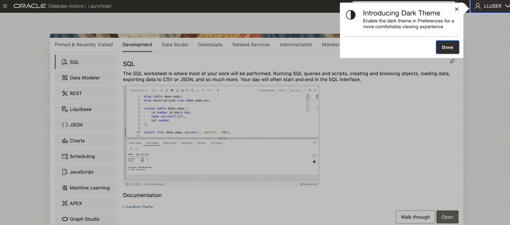
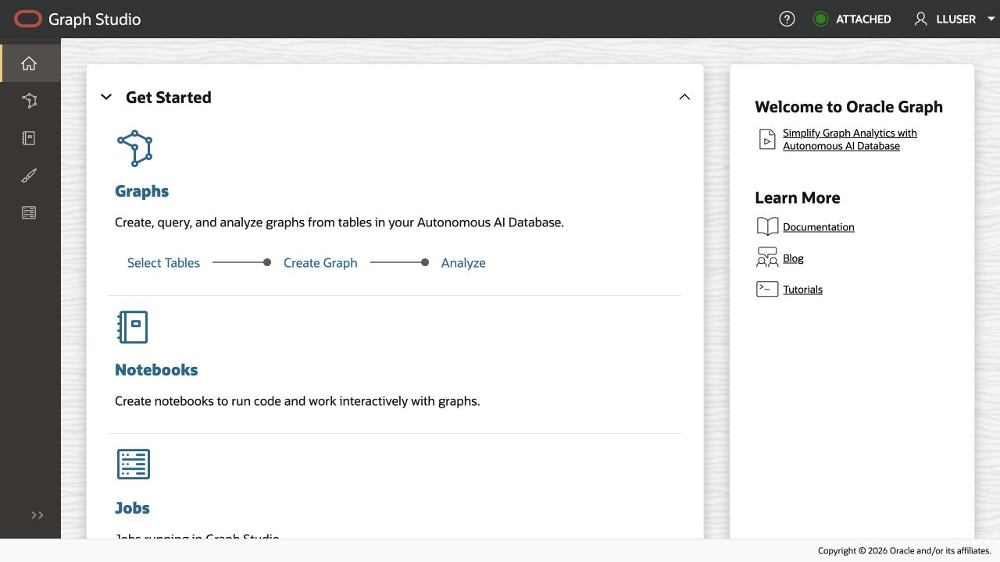
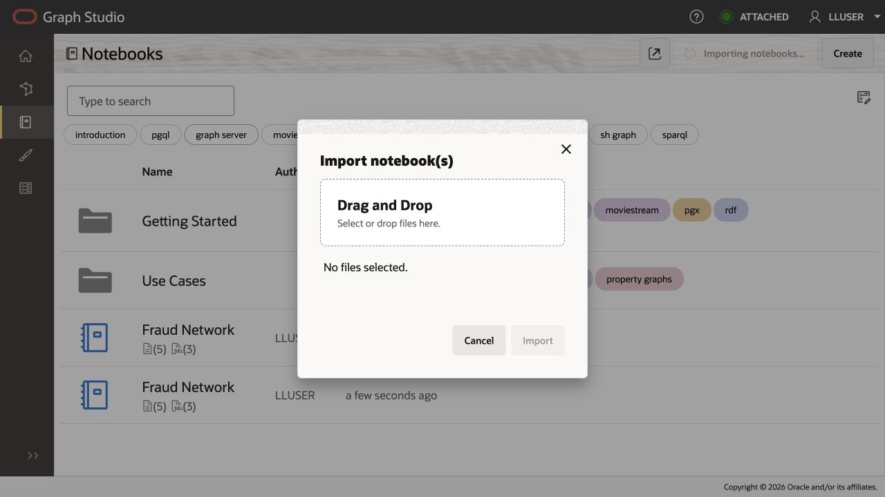
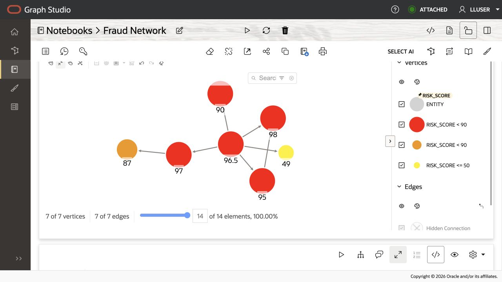

# Financial Crime Network with Property Graph

## Introduction

When an account looks suspicious, investigators need to know what other accounts, devices, IP addresses, payees, phones, or emails are connected to it. This lab uses Oracle Property Graph and SQL/PGQ to investigate those connections.

Fraud patterns often hide in relationships rather than in a single transaction row. A shared device, reused phone number, mule payee, or repeated IP address can reveal coordinated activity that looks unrelated when each transaction is reviewed on its own.

A suspicious signal often leads to the question, *Who or what else is connected?* The graph lets you move from one risky account to the connected records that may support escalation.

<details>
<summary><strong>Key terms: property graph, entity, relationship, and SQL Property Graph Queries (SQL/PGQ)</strong></summary>

> - A **property graph** represents things and how they are connected. In this lab, things include accounts, devices, IP addresses, phone numbers, payees, branches, and cases. The value of the graph is that it can show relationship patterns that are hard to see in a flat table.
>
> - An **entity** is a graph node that represents something investigators care about, such as an account, device, IP address, payee, phone number, or case. An entity can carry properties, such as a risk score, channel, location, or exposure amount.
>
> - A **relationship** is a connection between entities, such as an account using a device, sharing a phone number, sending funds to a payee, or opening activity from an IP address. Relationships let investigators ask who or what is connected to a suspicious account.
>
> - **SQL Property Graph Queries (SQL/PGQ)** let you describe graph patterns in SQL, such as "start with this account and follow related entities." That makes relationship investigation queryable without moving fraud evidence into a separate graph-only database.

</details>

The first image below is a concept graphic for the financial-crime graph pattern. It shows the idea behind the lab: a suspicious account becomes more meaningful when you can follow its relationships to devices, IP addresses, payees, phone numbers, branches, and cases.


The second image is the **Financial Crime Network** application workspace. The left side ranks connected risk entities, while the graph area shows how a selected account connects through shared infrastructure and mule-payment relationships.


### Objectives

- Run SQL/PGQ queries that trace fraud-network reach from a suspicious account.
- Interpret the account, device, IP address, payee, phone, and email records connected to suspicious accounts.
- Open Graph Studio from Database Actions.
- Import and run the finance fraud-network notebook.
- Compare SQL results with graph visualizations so the table results and visual investigation show the same connected records.

Estimated Time: **25 minutes**

### Business Scenario

| Step | Finance focus |
| --- | --- |
| Business Problem | Fraud teams need to see relationships that are hard to detect from transaction tables alone. |
| Technical Challenge | Investigators need path-based relationship analysis without writing and maintaining long chains of self-joins. |
| Persona Focus | Fraud analysts interpret the network; database developers provide the graph pattern that explains why entities are connected. |
| What You Will See | SQL/PGQ queries and a Graph Studio notebook expose fraud ring reach and shared entity clusters. |
| Database Capability | FRAUD\_NETWORK and GRAPH\_TABLE support SQL/PGQ traversal. |
| Outcome | Investigators can explain why entities are related and prioritize high-risk nodes. |

**Persona focus:** You are helping a fraud analyst move from ACCT-8841 to the connected accounts, devices, payees, IP addresses, phones, and emails that explain why the account needs review.

## Task 1: Trace two-hop fraud reach in SQL Worksheet

Start in SQL Worksheet so you can see the exact SQL/PGQ pattern that traces connected accounts, devices, IP addresses, phone numbers, and emails. Then you will open Graph Studio to view the same investigation as a visual map.

1. Start from suspicious account `ACCT-8841` and trace connected entities within two relationship hops:

    > **SQL Worksheet reminder:** Need a reminder on how to open and use the SQL Worksheet? Return to [Getting Started Task 2: Open SQL Worksheet](?lab=getting-started#Task2:OpenSQLWorksheet) for the step-by-step graphic showing where to paste and run SQL statements.

    This query treats the fraud data as a graph. In the `MATCH` pattern, `(seed IS entity)` is the starting account, `-[e IS related_to]->{1,2}` means follow one or two relationship hops, and `(reached IS entity)` is every entity reached from that starting point.

    The `WHERE` clause anchors the search on `ACCT-8841`, and the `COLUMNS` clause returns graph properties in a normal SQL result table.

    This is much easier than writing the same logic with ordinary joins. Without SQL/PGQ graph pattern matching, you would need separate self-joins for one-hop and two-hop paths, extra union logic for each relationship depth, and more code every time investigators want to follow another type of relationship.

    The graph pattern says the investigation in plain terms: start with this account, follow the relationships, and show what is connected.

    <details>
    <summary><strong>Why this matters: graph belongs with the transaction data</strong></summary>

    > Fraud investigation often starts with transactions but quickly becomes a relationship problem. If graph data lives in a separate graph-only system, teams must move or copy account, device, and transaction evidence before they can investigate it.
    >
    > Oracle Database keeps relational transaction data and property graph analysis close together. You can use SQL to move from account evidence to relationship evidence without changing databases.

    </details>

    ```sql
    <copy>
    SELECT DISTINCT entity_key, display_name, entity_type,
           risk_score, risk_level, total_amount, channel
    FROM GRAPH_TABLE ( fraud_network
      MATCH (seed IS entity) -[e IS related_to]->{1,2} (reached IS entity)
      WHERE seed.entity_key = 'ACCT-8841'
      COLUMNS (
        reached.entity_key AS entity_key,
        reached.display_name AS display_name,
        reached.entity_type AS entity_type,
        reached.risk_score AS risk_score,
        reached.risk_level AS risk_level,
        reached.total_amount AS total_amount,
        reached.channel AS channel
      )
    )
    ORDER BY risk_score DESC
    FETCH FIRST 25 ROWS ONLY;
    </copy>
    ```

    **Expected output: High Risk Fraud Entities**

    | Entity Key | Display Name | Entity Type | Risk Score | Risk Level | Total Amount | Channel |
    | --- | --- | --- | --- | --- | --- | --- |
    | DEV-fp-91a7 | Mobile Fingerprint 91a7 | device | 98 | critical | 42211.05 | network |
    | PAYEE-MULE-017 | Mule Payee 017 | payee | 97 | critical | 36110.75 | payments |
    | IP-198.51.100.44 | Residential Proxy 198.51.100.44 | ip\_address | 95 | critical | 38200.25 | network |
    | PHONE-212-0199 | Reused VOIP 212-0199 | phone | 90 | critical | 25110.25 | contact\_center |
    | PAYEE-CRYPTO-3 | Crypto Ramp Wallet 3 | payee | 87 | high | 14325.5 | payments |
    | BRANCH-NY-014 | NY Midtown Branch 014 | branch | 49 | medium | 2800 | branch |


2. Review the high-risk entities as an investigation queue.
    The result shows what ACCT-8841 touches or shares, then sorts those entities by risk so the analyst can prioritize account holds, case escalation, or deeper review before exploring lower-risk branches of the network.

    The expected rows show the evidence connected to suspicious account `ACCT-8841`.
    For example:
    * `DEV-fp-91a7` is a device
    * `PAYEE-MULE-017` is a payee
    * `IP-198.51.100.44` is an IP address
    * `PHONE-212-0199` is a phone number

    These rows matter because they show what the suspicious account touched or shared.

The result gives investigators a risk-ordered table of connected entities. High risk scores and large amounts point to records that may require account holds, case escalation, or deeper review before lower-risk branches of the network.

## Task 2: Find accounts sharing device, IP, phone, or email in SQL Worksheet

Next, find account pairs that share identifying evidence such as a device, IP address, phone, or email. This moves the investigation from one suspicious account to the broader pattern of reused identifiers:

1. Run this shared-entity graph query.

    This query looks for an account-to-shared-entity-to-account pattern. In graph terms, it finds `(a) -> (shared) <- (b)`: two accounts connected through the same device, IP address, phone, or email.

    The `a.entity_id < b.entity_id` filter prevents returning the same account pair twice, and the risk filter keeps the result focused on relationships where at least one account is already concerning.

    This is where SQL/PGQ is especially useful. A relational version would need multiple joins back to the same entity and relationship tables, separate conditions for each shared entity type, and careful duplicate handling for account pairs. The graph query is shorter and closer to the fraud question: "Which risky accounts share the same identifying evidence?"

    ```sql
    <copy>
    SELECT account_a, shared_entity, shared_type, account_b,
           a_risk, b_risk,
           ROUND((a_risk + b_risk) / 2, 1) AS combined_risk,
           e1_type, e2_type
    FROM GRAPH_TABLE ( fraud_network
      MATCH (a IS entity) -[e1 IS related_to]-> (shared IS entity) <-[e2 IS related_to]- (b IS entity)
      WHERE a.entity_type = 'account'
        AND b.entity_type = 'account'
        AND a.entity_id < b.entity_id
        AND shared.entity_type IN ('device','ip_address','phone','email')
        AND (a.risk_score >= 70 OR b.risk_score >= 70)
      COLUMNS (
        a.entity_key AS account_a,
        shared.entity_key AS shared_entity,
        shared.entity_type AS shared_type,
        b.entity_key AS account_b,
        a.risk_score AS a_risk,
        b.risk_score AS b_risk,
        e1.relationship_type AS e1_type,
        e2.relationship_type AS e2_type
      )
    )
    ORDER BY combined_risk DESC, shared_entity
    FETCH FIRST 25 ROWS ONLY;
    </copy>
    ```

    **Expected output: Shared Entity Connections**

    | Account A | Shared Entity | Shared Type | Account B | A Risk | B Risk | Combined Risk | E1 Type | E2 Type |
    | --- | --- | --- | --- | --- | --- | --- | --- | --- |
    | ACCT-8841 | DEV-fp-91a7 | device | ACCT-1190 | 96.5 | 91 | 93.8 | shared\_device | shared\_device |
    | ACCT-8841 | IP-198.51.100.44 | ip\_address | ACCT-1190 | 96.5 | 91 | 93.8 | shared\_ip | shared\_ip |
    | ACCT-8841 | PHONE-212-0199 | phone | ACCT-1190 | 96.5 | 91 | 93.8 | same\_phone | same\_phone |
    | ACCT-8841 | DEV-fp-91a7 | device | ACCT-5077 | 96.5 | 88 | 92.3 | shared\_device | shared\_device |
    | ACCT-9204 | DEV-emulator-22 | device | ACCT-2188 | 94 | 86 | 90 | shared\_device | shared\_device |
    | ACCT-9204 | IP-203.0.113.17 | ip\_address | ACCT-2188 | 94 | 86 | 90 | shared\_ip | shared\_ip |
    | ACCT-1190 | DEV-fp-91a7 | device | ACCT-5077 | 91 | 88 | 89.5 | shared\_device | shared\_device |
    | ACCT-8841 | IP-198.51.100.44 | ip\_address | ACCT-3320 | 96.5 | 81.5 | 89 | shared\_ip | shared\_ip |
    | ACCT-1190 | IP-198.51.100.44 | ip\_address | ACCT-3320 | 91 | 81.5 | 86.3 | shared\_ip | shared\_ip |
    | ACCT-5077 | EMAIL-risk-drop-01 | email | ACCT-3320 | 88 | 81.5 | 84.8 | same\_email | same\_email |
    | ACCT-7712 | DEV-browser-7c | device | ACCT-6642 | 77 | 74 | 75.5 | shared\_device | shared\_device |


2. Use the result to explain investigation priority.
    A shared device, IP address, phone, or email can connect accounts that look separate in transaction tables. The combined risk score helps prioritize pairs where both accounts are risky, not just connected.

    A shared device, IP address, phone, or email can connect accounts that look separate in transaction tables. That is why shared evidence matters: two accounts may look unrelated until the same phone, device, or network shows up in both histories. The combined risk score helps prioritize pairs where both sides of the relationship are risky, not just connected.

    This turns dashboard suspicion into explainable relationship evidence. The fraud analyst can say which accounts are connected, what they share, and why that connection matters.

## Task 3: Open Graph Studio

Open Graph Studio so the same fraud relationships can be explored visually after you have reviewed the SQL results:

1. If the dark-theme message appears, click **Done**.

2. Confirm that the upper-right corner shows `LLUSER`.

    

3. On the **Development** tab, select **Graph Studio** from the left-side tool list and click **Open**.

    

4. If prompted, sign in with `LLUSER` and the workshop password.

5. Confirm that the Graph Studio home page opens. The left navigation provides **Graphs**, **Notebooks**, **Templates**, and **Jobs**.

    

## Task 4: Download and import the finance notebook

Import the supplied Graph Studio notebook so you can run the prepared fraud-network investigation without rebuilding the visual workflow from scratch:

1. Download [finance-fraud-network-graph-studio.dsnb](files/finance-fraud-network-graph-studio.dsnb).

    If the notebook opens in your browser instead of downloading, right-click the link and select **Save Link As**.

2. In **Graph Studio**, click **Notebooks** in the left navigation. If the page layout differs from the screenshot, use the Notebooks label in the navigation as your guide.

3. Click **Import** in the upper-right corner.

    

4. The import window opens.

    

5. Drag & drop the `finance-fraud-network-graph-studio.dsnb` file from your local computer into the import window, or browse to the file on your computer. Review the selected filename and click **Import**. Open **Fraud Network** after the import completes.

## Task 5: Run and interpret the Graph Studio notebook

Run the same fraud-network investigation in **Graph Studio** so you can compare the **SQL Worksheet** table results with the visual graph:

1. Start at the top of the **Fraud Network** notebook and read the opening paragraph, **Financial Crime Network with Property Graph**.

    

2. Read the explanation to understand why the query starts with `ACCT-8841`, then run the SQL paragraph that starts with `SELECT DISTINCT`.

    This is the same first investigation pattern you ran in SQL Worksheet: start from `ACCT-8841`, follow one or two relationship hops, and return the connected entities as a prioritized table.

3. Continue through the notebook and review these results:

    | Paragraph | Result | Investigation purpose |
    | --- | --- | --- |
    | `SELECT DISTINCT ... WHERE seed.entity_key = 'ACCT-8841'` | Table | Ranks entities reached within one or two hops of `ACCT-8841`. |
    | `Graph Visulization of previous query` | Markdown label | Introduces the visual version of the first traversal. |
    | `SELECT * ... WHERE src.entity_key = 'ACCT-8841'` | Graph visualization | Draws the one-hop and two-hop path from the suspicious account. |
    | `Shared Entity Connections` | Markdown label and explanation | Introduces the device-centered relationship view. |
    | `SELECT * ... WHERE device.entity_key = 'DEV-fp-91a7'` | Graph visualization | Centers on `DEV-fp-91a7` and draws its directly connected accounts. |

4. Under **Graph Visulization of previous query**, run the SQL paragraph that starts with `SELECT *` and anchors on `ACCT-8841`. Review the graph visualization that appears below the paragraph.

    

5. Under **Shared Entity Connections**, read the device-centered explanation, then run the final SQL paragraph that anchors on `DEV-fp-91a7`. Review the graph visualization that appears below the paragraph.

    

6. For the two visualization paragraphs, select the graph visualization if Graph Studio initially displays a table. Select a node to inspect its properties and follow the relationship evidence back to the seed account or device.

7. Compare the notebook results with the SQL Worksheet results you ran earlier. SQL Worksheet showed the returned records. Graph Studio shows the same relationships visually.

> **Note:** Graph layouts and node positions can vary between runs. Focus on the entity keys, connected records, query results, and investigation takeaway.

## Next Steps

You used **SQL/PGQ** to move from `ACCT-8841` to connected devices, IP addresses, phone numbers, payees, and related accounts. You then compared the same investigation in **Graph Studio**, where the relationship pattern is easier to explore and explain.

For more property graph practice, try these follow-up resources:

* Open the [Oracle Graph LiveLabs workshop](https://livelabs.oracle.com/ords/r/dbpm/livelabs/run-workshop?p210_wid=770&p210_wec=&session=112325984461564&P0_REDIRECT=Y) for a deeper hands-on introduction to property graph concepts and Graph Studio.
* Download [getting-started-bank-graph.dsnb](files/getting-started-bank-graph.dsnb) and import it into Graph Studio for an additional bank graph exercise.

## Acknowledgements

* **Authors** - Linda Foinding, Principal Database Product Manager
* **Contributors** - Ramu Murakami Gutierrez, Pat Shepherd, 
* **Last Updated By/Date** - Oracle Database Product Management, August 2026
