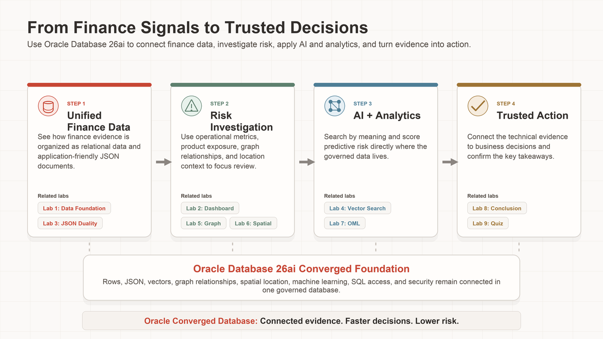
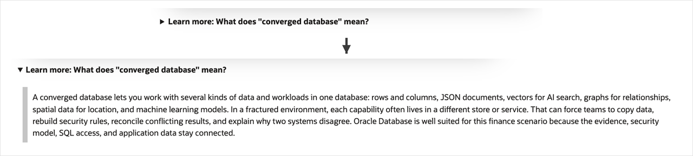
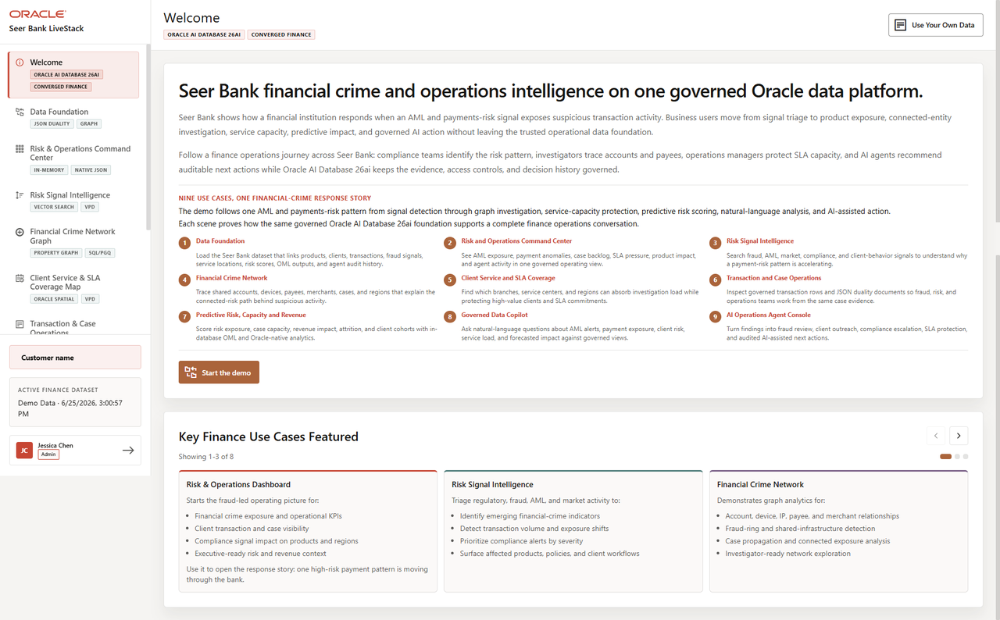

# Build Financial Intelligence with Oracle AI Database 26ai

## Introduction

Financial institutions need fast decisions, but speed is not enough. When a risk alert, fraud pattern, service issue, transaction detail, prediction, AI answer, or agent action is questioned later, teams must be able to show the database evidence behind it.

Seer Bank risk, fraud, compliance, service, analytics, application, and AI teams all need to work from the same facts instead of reconciling different copies of the truth.

In this workshop, **Seer Bank** uses **Oracle AI Database 26ai** as a converged financial-intelligence foundation. Relational transactions, JSON documents, vector search, property graph relationships, spatial service coverage, in-database machine learning, Select AI, and Select AI Agents all operate against connected finance data.

Throughout the workshop, you will see small arrows next to expandable sections. Select the arrow when you want extra context about a term, concept, or Oracle Database capability. These sections are closed by default so the main lab stays focused, but you can expand them whenever you want more explanation.

The example below shows an expandable section before and after it is opened.

<strong>Learn more: What does "converged database" mean?</strong>

> A converged database lets you work with several kinds of data and workloads in one database: rows and columns, JSON documents, vectors for AI search, graphs for relationships, spatial data for location, and machine learning models.
>
> In a fractured environment, each capability often lives in a different store or service. That can force teams to copy data, rebuild security rules, reconcile conflicting results, and explain why two systems disagree. Oracle Database is well suited for this finance scenario because the evidence, security model, SQL access, and application data stay connected.

The hands-on work follows one finance decision flow. First, you orient yourself to the data foundation. Then you turn that foundation into dashboard evidence, inspect transaction documents, search risk language by meaning, follow fraud relationships, evaluate service coverage, score predictive models, ask governed natural-language questions, and coordinate a controlled risk-triage action.

Each lab starts with a practical finance question and then shows the SQL evidence behind the answer.

As you move through the labs, treat every query as part of the same operating record. The dashboard numbers are not isolated metrics. They point to products, transactions, signals, relationships, case-processing capacity, and predictions that all remain connected inside Oracle Database.

The image below is the Seer Bank Finance LiveStack welcome page. It introduces the application as one connected financial-intelligence journey: monitor risk, investigate exposure, route work, analyze capacity, and use predictive evidence. The workshop uses SQL to explain the database evidence behind those same application pages.

### Objectives

- Query the current Seer Bank finance data foundation.
- Use SQL, JSON Relational Duality, AI Vector Search, Property Graph, Oracle Spatial, Oracle Machine Learning (OML), Select AI, and Select AI Agents to support one connected finance decision workflow.
- Explain why a converged Oracle Database foundation is critical for risk, operations, application development, investigation, and analytics.
- Connect the application pages to repeatable database evidence.

Estimated Workshop Time: **125 minutes**

### Business Scenario

| Step | Finance focus |
| --- | --- |
| Business Problem | Seer Bank needs faster risk, fraud, compliance, service, and predictive decisions without spreading evidence across disconnected systems. |
| Technical Challenge | Application, data, and AI teams otherwise stitch together separate stores, services, indexes, pipelines, and governance controls for each data type. |
| Persona Focus | A risk leader, fraud analyst, service operations leader, finance analyst, and AI engineer each use the same Seer Bank data foundation for different decisions. |
| What You Will See | One Oracle AI Database 26ai foundation can support the finance decision loop from awareness to action. |
| Database Capability | SQL queries, JSON documents, vector search, graph queries, spatial calculations, OML scoring, Select AI, and Select AI Agents all use connected finance data in Oracle AI Database 26ai. |
| Outcome | Risk, operations, and engineering teams can observe, investigate, decide, act, and review from database-backed evidence instead of reconciling disconnected outputs. |

**Persona focus:** You support finance business users who need timely, explainable decisions. Your job is to connect each business question to database evidence that can be reviewed and repeated.

## Acknowledgements

* **Authors** - Pat Shepherd, Linda Foinding
* **Contributors** - Teodor Nechita
* **Last Updated By/Date** - Oracle Database Product Management, August 2026
