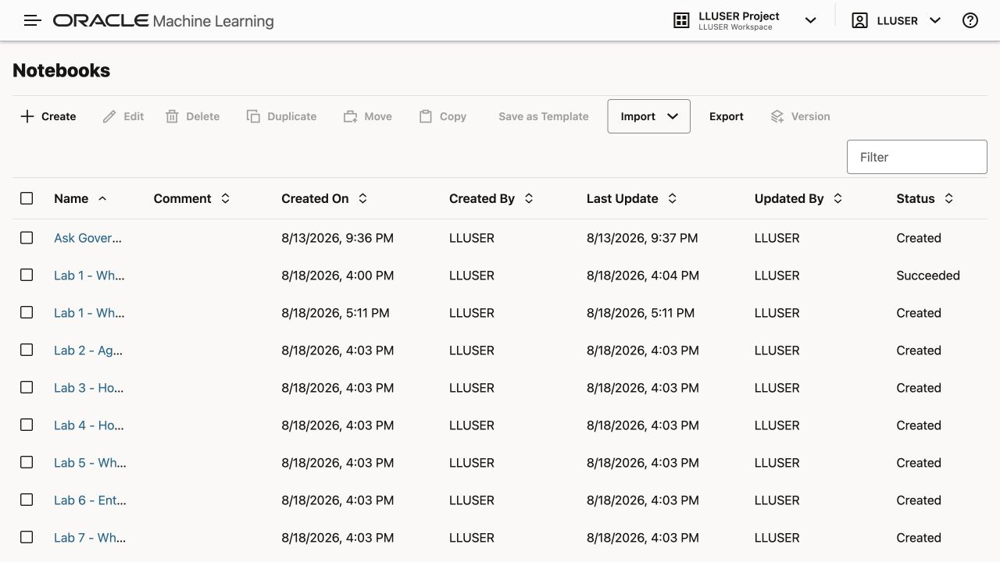
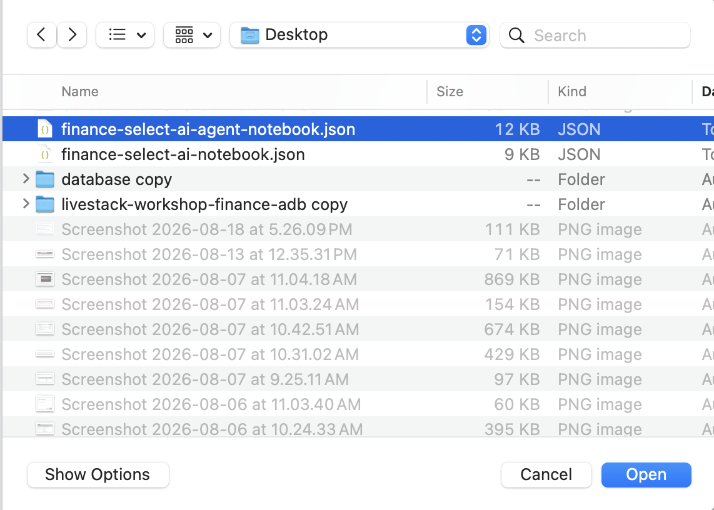
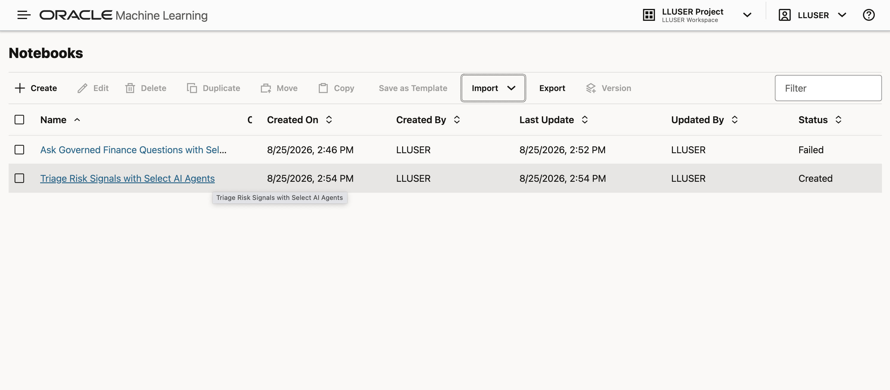

# Triage Risk Signals with Select AI Agents

## Introduction

Seer Bank has moved from dashboards and SQL evidence to governed natural-language answers. The risk analyst can ask which product categories have the highest exposure. They can inspect the SQL behind the answer.

The next step is action. When a high-priority signal appears, the team needs a consistent workflow. It must retrieve evidence, apply the review rule, and leave an audit record.

In this lab, you run an Oracle Machine Learning notebook. It creates function tools, an agent, a task, and a team. Then you run `SELECT AI AGENT` and inspect the action history.

The agent has two function tools:

- `FINANCE_SIGNAL_LOOKUP_TOOL` retrieves the highest-priority current risk signal.
- `FINANCE_ESCALATE_TOOL` checks the score threshold and creates one simulated analyst-review record.

The tools cannot change transactions, accounts, balances, products, clients, or source risk signals.

### Objectives

- Import and run the supplied Select AI Agent notebook in Oracle Machine Learning.
- Create helper functions for controlled lookup and escalation.
- Create Select AI Agent tools, an agent, a task, and a team.
- Run a conditional finance workflow with `SELECT AI AGENT`.
- Inspect the business audit record and Oracle agent histories.
- Prove that repeated requests do not create duplicate escalations.

Estimated Time: **22 minutes**

### Business Scenario

| Step | Finance focus |
| --- | --- |
| Business Problem | High-risk signals need consistent triage and a durable review record. |
| Technical Challenge | An agent must retrieve evidence, apply a rule, and record the outcome without changing protected finance data. |
| Persona Focus | A risk operations analyst requests triage; an AI engineer exposes narrow tools; a reviewer inspects the audit history. |
| What You Will See | A Select AI Agent can coordinate approved read and write tools inside a constrained database boundary. |
| Database Capability | Oracle Select AI Agents, function tools, OML notebooks, `AGENT_ACTIONS`, and native history views. |
| Outcome | Seer Bank turns AI-assisted triage into a controlled, reviewable database workflow. |

## Task 1: Import the Finance Select AI Agent Notebook

In this lab, you run the hands-on steps from an Oracle Machine Learning notebook.

1. Download [finance-select-ai-agent-notebook.json](files/finance-select-ai-agent-notebook.json).

    If the notebook opens in your browser instead of downloading, right-click the link and select **Save Link As**.

2. From the Oracle Machine Learning home page, click **Notebooks**.

    

3. Click **Import** and select **From File**.

    

4. Choose `finance-select-ai-agent-notebook.json` from your local computer.

    

5. After the import completes, open **Triage Risk Signals with Select AI Agents** from the Notebooks table.

    

Leave the notebook open. Tasks 2 through 12 run in this OML notebook. Each SQL paragraph is already included. Click the play button to run each paragraph in order.

## Task 2: Activate the Profile

Set the `genai` profile. Then limit the object list to the Seer Bank objects the agent needs.

1. Run the profile setup paragraph.

    ```sql
    <copy>
    EXEC DBMS_CLOUD_AI.SET_PROFILE('genai');
    
    BEGIN
      DBMS_CLOUD_AI.SET_ATTRIBUTE(
        profile_name    => 'genai',
        attribute_name  => 'object_list',
        attribute_value => '[{"owner": "' || USER || '", "name": "RISK_SIGNALS_V"},' ||
                           '{"owner": "' || USER || '", "name": "SIGNAL_SOURCES_V"},' ||
                           '{"owner": "' || USER || '", "name": "AGENT_ACTIONS"}]'
      );
    END;
    /
    </copy>
    ```

    > This command is already in your notebook. Click the play button to run it.

    **Expected result:** The profile is set and the object list is refreshed.

## Task 3: Create the Helper Functions

The agent tools call database functions. One function reads the highest-priority signal. The other applies the escalation rule and writes one controlled action row.

1. Create the helper functions.

    ```sql
    <copy>
    CREATE OR REPLACE FUNCTION finance_get_top_signal
    RETURN VARCHAR2 AS
      v_result VARCHAR2(4000);
    BEGIN
      SELECT 'signal_id=' || rs.signal_id ||
             '; criticality_score=' || rs.criticality_score ||
             '; severity_band=' || rs.severity_band ||
             '; exposure_count=' || rs.exposure_count ||
             '; source_name=' || NVL(ss.source_name, 'Unknown') ||
             '; recommended_action=' ||
               CASE
                 WHEN rs.criticality_score >= 70 THEN 'Create analyst-review escalation'
                 ELSE 'Monitor signal without escalation'
               END
        INTO v_result
        FROM risk_signals_v rs
        LEFT JOIN signal_sources_v ss
          ON ss.source_id = rs.source_id
       ORDER BY rs.criticality_score DESC,
                rs.exposure_count DESC,
                rs.signal_id
       FETCH FIRST 1 ROW ONLY;
    
      RETURN v_result;
    EXCEPTION
      WHEN NO_DATA_FOUND THEN
        RETURN 'NO_SIGNAL_FOUND';
    END;
    /
    
    CREATE OR REPLACE FUNCTION finance_escalate_top_signal
    RETURN VARCHAR2 AS
      PRAGMA AUTONOMOUS_TRANSACTION;
      v_signal_id          NUMBER;
      v_criticality_score  NUMBER;
      v_severity_band      VARCHAR2(4000);
      v_source_name        VARCHAR2(4000);
      v_existing_actions   NUMBER;
      v_action_id          NUMBER;
    BEGIN
      SELECT rs.signal_id,
             rs.criticality_score,
             rs.severity_band,
             NVL(ss.source_name, 'Unknown')
        INTO v_signal_id,
             v_criticality_score,
             v_severity_band,
             v_source_name
        FROM risk_signals_v rs
        LEFT JOIN signal_sources_v ss
          ON ss.source_id = rs.source_id
       ORDER BY rs.criticality_score DESC,
                rs.exposure_count DESC,
                rs.signal_id
       FETCH FIRST 1 ROW ONLY;
    
      IF v_criticality_score < 70 THEN
        RETURN 'NO_ESCALATION_CREATED; signal_id=' || v_signal_id ||
               '; criticality_score=' || v_criticality_score ||
               '; reason=Criticality score is below threshold';
      END IF;
    
      SELECT COUNT(*)
        INTO v_existing_actions
        FROM agent_actions
       WHERE agent_name = 'FINANCE_RISK_AGENT'
         AND action_type = 'ESCALATE_REVIEW'
         AND entity_type = 'RISK_SIGNAL'
         AND entity_id = v_signal_id;
    
      IF v_existing_actions > 0 THEN
        RETURN 'ESCALATION_ALREADY_EXISTS; signal_id=' || v_signal_id ||
               '; criticality_score=' || v_criticality_score;
      END IF;
    
      INSERT INTO agent_actions (
        agent_name,
        action_type,
        entity_type,
        entity_id,
        decision_payload,
        confidence,
        execution_status,
        executed_at
      ) VALUES (
        'FINANCE_RISK_AGENT',
        'ESCALATE_REVIEW',
        'RISK_SIGNAL',
        v_signal_id,
        'signal_id=' || v_signal_id ||
          '; criticality_score=' || v_criticality_score ||
          '; severity_band=' || v_severity_band ||
          '; source_name=' || v_source_name,
        0.950,
        'completed',
        SYSTIMESTAMP
      )
      RETURNING action_id INTO v_action_id;
    
      COMMIT;
    
      RETURN 'ESCALATION_CREATED; action_id=' || v_action_id ||
             '; signal_id=' || v_signal_id ||
             '; criticality_score=' || v_criticality_score;
    EXCEPTION
      WHEN NO_DATA_FOUND THEN
        RETURN 'NO_SIGNAL_FOUND';
      WHEN OTHERS THEN
        ROLLBACK;
        RAISE;
    END;
    /
    
    SELECT object_name,
           status
    FROM user_objects
    WHERE object_type = 'FUNCTION'
      AND object_name IN (
        'FINANCE_GET_TOP_SIGNAL',
        'FINANCE_ESCALATE_TOP_SIGNAL'
      )
    ORDER BY object_name;
    </copy>
    ```

    > This command is already in your notebook. Click the play button to run it.

    **Expected result:** `FINANCE_GET_TOP_SIGNAL` and `FINANCE_ESCALATE_TOP_SIGNAL` compile successfully.

## Task 4: Test the Lookup Function

Before creating tools, test the read-only helper function directly.

1. Inspect the top risk signal.

    ```sql
    <copy>
    SELECT finance_get_top_signal() AS signal_evidence
    FROM dual;
    </copy>
    ```

    > This command is already in your notebook. Click the play button to run it.

    **Expected result:** One text value identifies the top risk signal.

## Task 5: Reset Agent Objects and Action Rows

Before creating the agent objects, remove any earlier workshop copy. This includes the tools, agent, task, team, and simulated action rows.

1. Reset the workshop agent objects.

    ```sql
    <copy>
    BEGIN
      DBMS_CLOUD_AI_AGENT.DROP_TEAM('FINANCE_RISK_TEAM', TRUE);
    EXCEPTION WHEN OTHERS THEN NULL;
    END;
    /
    
    BEGIN
      DBMS_CLOUD_AI_AGENT.DROP_TASK('FINANCE_RISK_TASK', TRUE);
    EXCEPTION WHEN OTHERS THEN NULL;
    END;
    /
    
    BEGIN
      DBMS_CLOUD_AI_AGENT.DROP_AGENT('FINANCE_RISK_AGENT', TRUE);
    EXCEPTION WHEN OTHERS THEN NULL;
    END;
    /
    
    BEGIN
      DBMS_CLOUD_AI_AGENT.DROP_TOOL('FINANCE_SIGNAL_LOOKUP_TOOL', TRUE);
    EXCEPTION WHEN OTHERS THEN NULL;
    END;
    /
    
    BEGIN
      DBMS_CLOUD_AI_AGENT.DROP_TOOL('FINANCE_ESCALATE_TOOL', TRUE);
    EXCEPTION WHEN OTHERS THEN NULL;
    END;
    /
    
    DELETE FROM agent_actions
    WHERE agent_name = 'FINANCE_RISK_AGENT';
    
    COMMIT;
    </copy>
    ```

    > This command is already in your notebook. Click the play button to run it.

    **Expected result:** The previous team, task, agent, and tools are removed. Prior simulated action rows from this workshop agent are also removed.

## Task 6: Create the Agent Tools

The tools are the agent boundary. They expose only the two database functions needed for risk triage.

1. Create the lookup and escalation tools.

    ```sql
    <copy>
    BEGIN
      DBMS_CLOUD_AI_AGENT.CREATE_TOOL(
        tool_name   => 'FINANCE_SIGNAL_LOOKUP_TOOL',
        attributes  => '{"instruction": "Retrieve the highest-priority current Seer Bank risk signal. This tool has no parameters. Always call it before deciding whether to escalate.",
                        "function": "finance_get_top_signal"}',
        description => 'Returns the highest-priority finance risk signal and its evidence'
      );
    
      DBMS_CLOUD_AI_AGENT.CREATE_TOOL(
        tool_name   => 'FINANCE_ESCALATE_TOOL',
        attributes  => '{"instruction": "Create one analyst-review escalation for the highest-priority risk signal. This tool has no parameters and independently enforces a criticality threshold of 70. Call it only after FINANCE_SIGNAL_LOOKUP_TOOL.",
                        "function": "finance_escalate_top_signal"}',
        description => 'Creates a controlled risk-signal review record when the threshold is met'
      );
    END;
    /
    </copy>
    ```

    > This command is already in your notebook. Click the play button to run it.

    **Expected result:** Both tools are created and enabled.

## Task 7: Create the Agent, Task, and Team

Now build the agent workflow. The role defines the boundary. The task requires evidence before action. The team activates the task for `SELECT AI AGENT`.

1. Create the agent, task, and team.

    ```sql
    <copy>
    BEGIN
      DBMS_CLOUD_AI_AGENT.CREATE_AGENT(
        agent_name  => 'FINANCE_RISK_AGENT',
        attributes  => '{"profile_name": "genai",
                        "role": "You are a Seer Bank risk-triage agent. Use only the supplied tools. Always retrieve database evidence before deciding. You may create a simulated analyst-review escalation, but you must never change transactions, accounts, balances, products, clients, or the source risk signal."}',
        description => 'Coordinates controlled finance risk-signal triage'
      );
    
      DBMS_CLOUD_AI_AGENT.CREATE_TASK(
        task_name   => 'FINANCE_RISK_TASK',
        attributes  => '{"instruction": "For each request: 1) call FINANCE_SIGNAL_LOOKUP_TOOL; 2) report the returned signal evidence; 3) call FINANCE_ESCALATE_TOOL; 4) report the exact escalation tool result. Never claim a write occurred unless the escalation tool confirms it. User request: {query}",
                        "tools": ["FINANCE_SIGNAL_LOOKUP_TOOL", "FINANCE_ESCALATE_TOOL"]}',
        description => 'Looks up the strongest finance risk signal and conditionally escalates it'
      );
    
      DBMS_CLOUD_AI_AGENT.CREATE_TEAM(
        team_name   => 'FINANCE_RISK_TEAM',
        attributes  => '{"agents": [{"name": "FINANCE_RISK_AGENT", "task": "FINANCE_RISK_TASK"}],
                        "process": "sequential"}',
        description => 'Finance risk-triage team'
      );
    END;
    /
    </copy>
    ```

    > This command is already in your notebook. Click the play button to run it.

    **Expected result:** The agent, task, and sequential team are created and enabled.

## Task 8: Verify the Agent Components

Check that the tools, agent, task, and team were created successfully.

1. Verify the component inventory.

    ```sql
    <copy>
    SELECT 'TOOL' AS object_type,
           tool_name AS object_name,
           status
    FROM user_ai_agent_tools
    WHERE tool_name IN (
      'FINANCE_SIGNAL_LOOKUP_TOOL',
      'FINANCE_ESCALATE_TOOL'
    )
    UNION ALL
    SELECT 'AGENT', agent_name, status
    FROM user_ai_agents
    WHERE agent_name = 'FINANCE_RISK_AGENT'
    UNION ALL
    SELECT 'TASK', task_name, status
    FROM user_ai_agent_tasks
    WHERE task_name = 'FINANCE_RISK_TASK'
    UNION ALL
    SELECT 'TEAM', agent_team_name, status
    FROM user_ai_agent_teams
    WHERE agent_team_name = 'FINANCE_RISK_TEAM'
    ORDER BY object_type, object_name;
    </copy>
    ```

    > This command is already in your notebook. Click the play button to run it.

    **Expected result:** The notebook lists the two tools, the agent, the task, and the team.

## Task 9: Run the Risk-Triage Agent

Now ask the agent to triage the current highest-priority risk signal. The task requires evidence first. The agent calls the escalation tool only when the threshold is met.

1. Run the agent request.

    ```sql
    <copy>
    EXEC DBMS_CLOUD_AI_AGENT.SET_TEAM('FINANCE_RISK_TEAM');
    
    SELECT AI AGENT Triage the current highest-priority Seer Bank risk signal now and report the tool results;
    </copy>
    ```

    > This command is already in your notebook. Click the play button to run it.

    **Expected result:** The agent reports the risk signal evidence and whether an analyst-review escalation was created.

## Task 10: Review the Business Action Record

The escalation is not trusted just because the agent says it happened. Verify the database action row.

1. Inspect the simulated analyst-review action.

    ```sql
    <copy>
    SELECT action_id,
           action_type,
           entity_type,
           entity_id AS signal_id,
           execution_status,
           executed_at
    FROM agent_actions
    WHERE agent_name = 'FINANCE_RISK_AGENT'
    ORDER BY action_id DESC
    FETCH FIRST 5 ROWS ONLY;
    </copy>
    ```

    > This command is already in your notebook. Click the play button to run it.

    **Expected result:** The query returns one completed `ESCALATE_REVIEW` row when the top signal meets the threshold.

## Task 11: Review the Native Agent History

Oracle records agent execution history. Use the history views to confirm tool calls and team status.

1. Review the latest tool and team history.

    ```sql
    <copy>
    SELECT tool_name,
           TO_CHAR(start_date, 'HH24:MI:SS') AS called_at,
           SUBSTR(output, 1, 120) AS result
    FROM user_ai_agent_tool_history
    WHERE tool_name IN (
      'FINANCE_SIGNAL_LOOKUP_TOOL',
      'FINANCE_ESCALATE_TOOL'
    )
    ORDER BY start_date DESC
    FETCH FIRST 10 ROWS ONLY;
    
    SELECT team_name,
           TO_CHAR(start_date, 'HH24:MI:SS') AS started,
           state
    FROM user_ai_agent_team_history
    WHERE team_name = 'FINANCE_RISK_TEAM'
    ORDER BY start_date DESC
    FETCH FIRST 5 ROWS ONLY;
    </copy>
    ```

    > This command is already in your notebook. Click the play button to run it.

    **Expected result:** The tool history shows recent calls, and the latest `FINANCE_RISK_TEAM` row shows the agent execution state.

## Task 12: Prove the Escalation Is Idempotent

A triage workflow should not create duplicate review rows for the same question.

1. Run the same request again and confirm the action row count.

    ```sql
    <copy>
    EXEC DBMS_CLOUD_AI_AGENT.SET_TEAM('FINANCE_RISK_TEAM');
    
    SELECT AI AGENT Triage the current highest-priority Seer Bank risk signal again and report whether an escalation already exists;
    
    SELECT entity_id AS signal_id,
           COUNT(*) AS escalation_rows
    FROM agent_actions
    WHERE agent_name = 'FINANCE_RISK_AGENT'
      AND action_type = 'ESCALATE_REVIEW'
    GROUP BY entity_id
    ORDER BY entity_id;
    </copy>
    ```

    > This command is already in your notebook. Click the play button to run it.

    **Expected result:** The agent reports that the escalation already exists or that no duplicate was created. The grouped count remains `1` for the escalated signal.

You created a constrained Select AI Agent workflow. It reads current risk evidence, applies a threshold rule, writes one controlled review record, and leaves audit evidence behind.

## Acknowledgements

* **Author** - Linda Foinding, Principal Database Product Manager
* **Last Updated By/Date** - Oracle Database Product Management, August 2026
