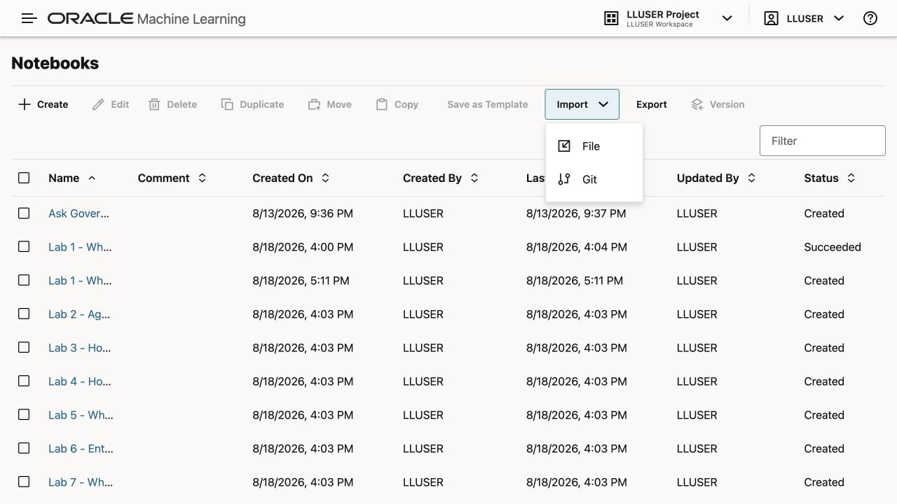
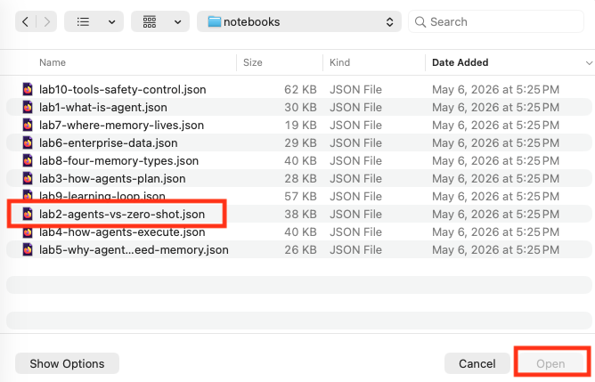

# Ask Governed Finance Questions with Select AI

## Introduction

Seer Bank analysts have followed one risk story across the workshop. They inspected the data foundation, reviewed dashboard evidence, opened transaction documents, searched risk language, traced fraud relationships, checked service coverage, and scored predictive models.

Now the team asks the next question in plain language: which product categories and risk signals deserve attention first?

A general AI chat response can explain finance risk. Seer Bank needs more than a general answer. The analyst needs approved database evidence. The reviewer needs the generated SQL behind the answer.

In this lab, you use Oracle Machine Learning (OML) to run a notebook that compares three Select AI actions:

- `SELECT AI CHAT` answers a general finance question without querying Seer Bank data.
- `SELECT AI SHOWSQL` turns a natural-language finance question into reviewable SQL.
- `SELECT AI NARRATE` queries approved finance objects and explains the result.

> **Important:** Select AI output is generated. Wording and aliases can vary. The approved object boundary, generated SQL, and database result remain reviewable.

### Objectives

- Import and run the supplied finance notebook in OML.
- Use `SELECT AI CHAT` for a general finance question.
- Add approved Seer Bank objects to the `genai` profile.
- Review generated SQL before trusting the natural-language answer.
- Confirm that Select AI remains read-only.

Estimated Time: **18 minutes**

### Business Scenario

| Step | Finance focus |
| --- | --- |
| Business Problem | Seer Bank analysts need fast natural-language answers without losing the evidence trail. |
| Technical Challenge | Natural-language questions must stay inside an approved data boundary and produce reviewable SQL. |
| Persona Focus | A risk analyst asks the question; an AI engineer controls the profile and approved objects. |
| What You Will See | Chat can explain finance concepts. Select AI can query Seer Bank data and show the generated SQL. |
| Database Capability | Oracle Select AI, `DBMS_CLOUD_AI`, finance semantic views, schema comments, and OML notebooks. |
| Outcome | Analysts receive a narrated answer while reviewers retain the SQL and database evidence. |

**Persona focus:** You help the risk team ask governed natural-language questions over Seer Bank data.

## Task 1: Import the Finance Select AI Notebook

In this lab, you run the hands-on steps from an Oracle Machine Learning notebook.

1. Download [finance-select-ai-notebook.json](files/finance-select-ai-notebook.json).

2. From the Oracle Machine Learning home page, click **Notebooks**.

    

3. Click **Import** and select **From File**.

    

4. Choose `finance-select-ai-notebook.json`.

    

5. Open the imported notebook from the Notebooks table.

    

Leave the notebook open. Tasks 2 through 5 run in this OML notebook. Each runnable paragraph includes the title, explanation, and command together.

## Task 2: Experience Select AI Chat

Start with `SELECT AI CHAT` to see the baseline. Chat explains general finance concepts. It does not read Seer Bank objects.

1. Activate the `genai` profile.

    ```sql
    <copy>
    EXEC DBMS_CLOUD_AI.SET_PROFILE('genai');

    SELECT profile_name,
           status
    FROM user_cloud_ai_profiles
    WHERE LOWER(profile_name) = 'genai';
    </copy>
    ```

    > This command is already in your notebook. Click the play button (▶) to run it.

    **Expected result:** The profile is set for the OML session.

2. Ask a general finance question.

    ```sql
    <copy>
    SELECT AI CHAT
      What business factors commonly increase fraud and compliance risk at a financial institution?;
    </copy>
    ```

    > This command is already in your notebook. Click the play button (▶) to run it.

    **Expected result:** Select AI Chat returns a general explanation of finance risk factors. The generated wording can vary.

3. Ask a question that requires current Seer Bank rows.

    ```sql
    <copy>
    SELECT AI CHAT
      Which Seer Bank risk signal currently has the highest criticality score?;
    </copy>
    ```

    > This command is already in your notebook. Click the play button (▶) to run it.

    **Expected result:** Chat cannot verify the answer from Seer Bank rows. `CHAT` does not query approved database objects.

This gives Seer Bank a baseline: chat can explain, but it does not supply database evidence.

## Task 3: Set the Governed Finance Boundary

Now tell Select AI which Seer Bank objects it can read. The profile needs approved objects before it can ground questions in your schema.

1. Set the approved object list for this lab.

    ```sql
    <copy>
    BEGIN
      DBMS_CLOUD_AI.SET_ATTRIBUTE(
        profile_name    => 'genai',
        attribute_name  => 'object_list',
        attribute_value => '[{"owner": "' || USER || '", "name": "FINANCE_PRODUCTS_V"},' ||
                           '{"owner": "' || USER || '", "name": "RISK_SIGNALS_V"},' ||
                           '{"owner": "' || USER || '", "name": "SIGNAL_SOURCES_V"},' ||
                           '{"owner": "' || USER || '", "name": "POST_PRODUCT_MENTIONS"},' ||
                           '{"owner": "' || USER || '", "name": "AGENT_ACTIONS"}]'
      );
    END;
    /

    SELECT object_name,
           object_type
    FROM user_objects
    WHERE object_name IN (
      'FINANCE_PRODUCTS_V',
      'RISK_SIGNALS_V',
      'SIGNAL_SOURCES_V',
      'POST_PRODUCT_MENTIONS',
      'AGENT_ACTIONS'
    )
    ORDER BY object_name;
    </copy>
    ```

    > This command is already in your notebook. Click the play button (▶) to run it.

    **Expected output:** The notebook returns the approved finance objects used by this lab: product categories, risk signals, signal sources, post-to-product links, and the action audit table.

## Task 4: Query Seer Bank Data with Select AI

Use Select AI to move from natural language to reviewable SQL. Then ask for a grounded narrated answer.

1. Generate SQL from a natural-language finance question.

    ```sql
    <copy>
    SELECT AI SHOWSQL
      Which Seer Bank product categories have the highest current risk exposure?;
    </copy>
    ```

    > This command is already in your notebook. Click the play button (▶) to run it.

    **Expected result:** Select AI generates a read-only statement over approved finance objects. Table aliases and SQL shape can vary.

2. Review the generated statement. Confirm that it does not contain `INSERT`, `UPDATE`, `DELETE`, `MERGE`, or DDL.

3. Ask Select AI to query the approved objects and explain the answer.

    ```sql
    <copy>
    SELECT AI NARRATE
      Which Seer Bank product categories have the highest current risk exposure?;
    </copy>
    ```

    > This command is already in your notebook. Click the play button (▶) to run it.

    **Expected result:** Select AI returns an explanation grounded in current Seer Bank rows. The wording can vary.

4. Verify the generated answer with stable SQL evidence.

    ```sql
    <copy>
    SELECT fp.product_category,
           COUNT(DISTINCT rs.signal_id) AS signal_count,
           ROUND(AVG(rs.criticality_score), 1) AS avg_criticality,
           SUM(rs.exposure_count) AS exposure_count
    FROM risk_signals_v rs
    JOIN post_product_mentions ppm
      ON ppm.post_id = rs.signal_id
    JOIN finance_products_v fp
      ON fp.financial_product_id = ppm.product_id
    GROUP BY fp.product_category
    ORDER BY exposure_count DESC
    FETCH FIRST 5 ROWS ONLY;
    </copy>
    ```

    > This command is already in your notebook. Click the play button (▶) to run it.

    **Expected output:** The query returns up to five product categories ordered by exposure. Use these rows to verify the Select AI answer.

## Task 5: Confirm the Read-Only Boundary

Select AI can read and explain approved data. It cannot create business action rows without an agent write tool.

1. Count the action rows before and after one more narrated question.

    ```sql
    <copy>
    SELECT COUNT(*) AS actions_before
    FROM agent_actions
    WHERE agent_name = 'FINANCE_RISK_AGENT';

    SELECT AI NARRATE
      Which current Seer Bank risk signal should an analyst review first, and why?;

    SELECT COUNT(*) AS actions_after
    FROM agent_actions
    WHERE agent_name = 'FINANCE_RISK_AGENT';
    </copy>
    ```

    > This command is already in your notebook. Click the play button (▶) to run it.

    **Expected result:** The action count before and after the narrated question is unchanged.

You compared general chat, generated SQL, governed narration, and read-only behavior. The next lab turns the same Seer Bank evidence into a controlled agent action.

## Acknowledgements

* **Author** - Linda Foinding, Principal Database Product Manager
* **Last Updated By/Date** - Oracle Database Product Management, August 2026
