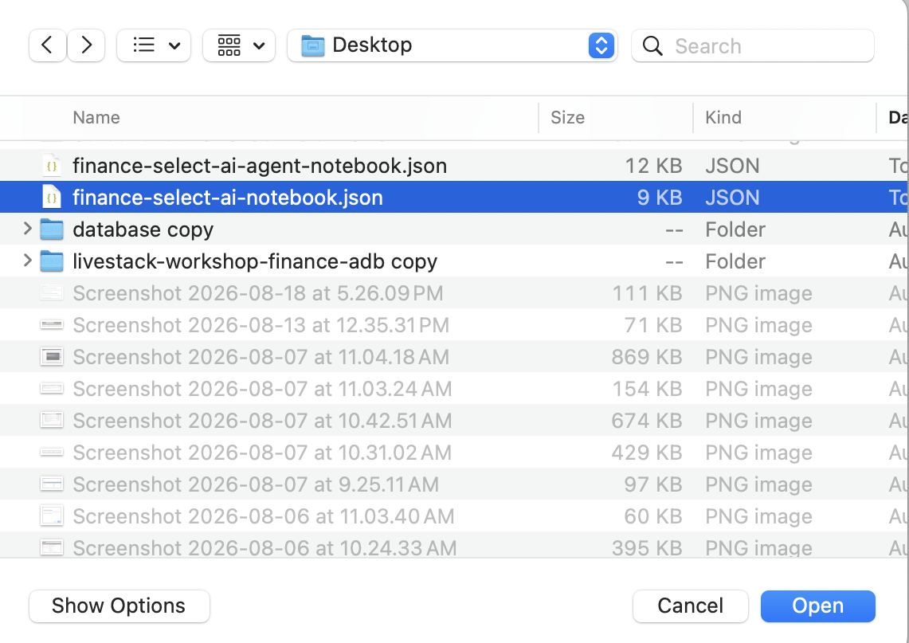

# Ask Governed Finance Questions with Select AI

## Introduction

Seer Bank analysts need quick answers, but they cannot accept guesses. A risk answer must come from approved database views, and reviewers must be able to inspect the SQL behind it.

In this lab, you run an Oracle Machine Learning notebook that shows the difference between general AI chat and Select AI questions over approved Seer Bank views. You create AI-ready views, limit the `genai` profile to approved objects, review generated SQL, ask for a narrated answer, and confirm that the lab stays read-only.

> **Important:** Select AI output is generated. Wording, aliases, and SQL shape can vary. Review the generated SQL and database results before trusting the answer.

<details>
<summary><strong>Key terms: Select AI, GenAI profile, Select AI Chat, SHOWSQL, and NARRATE</strong></summary>

- Import and run the supplied finance Select AI notebook in **Oracle Machine Learning**.
- Ask governed natural-language questions over approved Seer Bank data.
- Review generated SQL before trusting an AI answer.
- Compare general chat with database-grounded **Select AI** responses.

</details>

### Objectives

- Import and run the supplied finance Select AI notebook in Oracle Machine Learning.
- Ask governed natural-language questions over Seer Bank data.
- Review generated SQL before trusting an AI answer.
- Compare general chat with database-grounded Select AI responses.

Estimated Time: **18 minutes**

### Business Scenario

| Step | Finance focus |
| --- | --- |
| Business Problem | Seer Bank analysts need fast natural-language answers without losing the SQL and database results behind them. |
| Technical Challenge | Natural-language questions must stay inside an approved data boundary and produce reviewable SQL. |
| Persona Focus | A risk analyst asks the question; an AI engineer controls the profile and approved objects. |
| What You Will See | Chat can explain finance concepts. Select AI can query approved Seer Bank data and show generated SQL. |
| Database Capability | Oracle Select AI, `DBMS_CLOUD_AI`, finance semantic views, schema comments, and OML notebooks. |
| Outcome | Analysts receive a narrated answer while reviewers retain the SQL and database evidence. |

## Task 1: Import the Finance Select AI Notebook

Import the supplied notebook so the **Select AI** workflow is already staged in **Oracle Machine Learning**:

1. Download [finance-select-ai-notebook.json](files/finance-select-ai-notebook.json).

    If the notebook opens in your browser instead of downloading, right-click the link and select **Save Link As**.

2. From the Oracle Machine Learning home page, click **Notebooks**.

    

3. Click **Import** and select **From File**.

    

4. Choose `finance-select-ai-notebook.json` from your local computer.

    

5. After the import completes, open **Ask Governed Finance Questions with Select AI** from the Notebooks table.

    

Leave the notebook open. Tasks **2** through **9** run in this OML notebook, and each SQL paragraph is already included. Run the paragraphs in order so the profile, views, prompts, and checks build on one another.

## Task 2: Activate the Select AI Profile

Activate the `genai` profile for this OML session so Select AI uses the intended model access and schema-grounding configuration:

1. Run the profile setup paragraph.

    ```sql
    <copy>
    EXEC DBMS_CLOUD_AI.SET_PROFILE('genai');
    
    SELECT profile_name,
           status
    FROM user_cloud_ai_profiles
    WHERE LOWER(profile_name) = 'genai';
    </copy>
    ```

    > This command is already in your notebook. Click the play button to run it.

    **Expected result:** The profile query returns `GENAI` with status `ENABLED`.

## Task 3: Create AI-Ready Views

Create AI-ready views with clear names and comments so natural-language prompts map to approved Seer Bank views rather than broad schema objects:

1. Create the views and comments.

    ```sql
    <copy>
    CREATE OR REPLACE VIEW select_ai_product_risk_v AS
    SELECT fp.product_category,
           COUNT(DISTINCT rs.signal_id) AS signal_count,
           ROUND(AVG(rs.criticality_score), 1) AS avg_criticality,
           SUM(rs.exposure_count) AS exposure_count
    FROM risk_signals_v rs
    JOIN post_product_mentions ppm
      ON ppm.post_id = rs.signal_id
    JOIN finance_products_v fp
      ON fp.financial_product_id = ppm.product_id
    GROUP BY fp.product_category;
    
    CREATE OR REPLACE VIEW select_ai_top_signal_v AS
    SELECT signal_id,
           DBMS_LOB.SUBSTR(signal_text, 1000, 1) AS signal_text,
           criticality_score,
           severity_band,
           exposure_count,
           source_id
    FROM (
      SELECT signal_id,
             signal_text,
             criticality_score,
             severity_band,
             exposure_count,
             source_id
      FROM risk_signals_v
      ORDER BY criticality_score DESC,
               exposure_count DESC,
               signal_id
    )
    WHERE ROWNUM = 1;
    
    COMMENT ON TABLE select_ai_product_risk_v IS
      'AI-ready view of Seer Bank product categories ranked by current risk exposure.';
    COMMENT ON COLUMN select_ai_product_risk_v.product_category IS
      'Financial product category.';
    COMMENT ON COLUMN select_ai_product_risk_v.signal_count IS
      'Number of current risk signals linked to the product category.';
    COMMENT ON COLUMN select_ai_product_risk_v.avg_criticality IS
      'Average risk signal criticality score for the product category.';
    COMMENT ON COLUMN select_ai_product_risk_v.exposure_count IS
      'Total exposure count across risk signals for the product category.';
    
    COMMENT ON TABLE select_ai_top_signal_v IS
      'AI-ready view containing the single highest-priority current Seer Bank risk signal.';
    COMMENT ON COLUMN select_ai_top_signal_v.signal_id IS
      'Identifier of the highest-priority risk signal.';
    COMMENT ON COLUMN select_ai_top_signal_v.criticality_score IS
      'Criticality score for the risk signal.';
    COMMENT ON COLUMN select_ai_top_signal_v.severity_band IS
      'Severity band for the risk signal.';
    COMMENT ON COLUMN select_ai_top_signal_v.exposure_count IS
      'Exposure count for the risk signal.';
    
    SELECT object_name,
           status
    FROM user_objects
    WHERE object_name IN (
      'SELECT_AI_PRODUCT_RISK_V',
      'SELECT_AI_TOP_SIGNAL_V'
    )
    ORDER BY object_name;
    </copy>
    ```

    > This command is already in your notebook. Click the play button to run it.

    **Expected result:** The notebook returns `SELECT_AI_PRODUCT_RISK_V` and `SELECT_AI_TOP_SIGNAL_V` with status `VALID`.

    **Note:** Generated SQL can vary in aliases and shape. Focus on whether the statement is read-only, uses the approved view, and answers the intended finance question.

## Task 4: Set the Governed Object Boundary

Limit the profile to the two AI-ready views so each question stays inside the approved evidence boundary for this lab:

1. Set the approved object list.

    ```sql
    <copy>
    BEGIN
      DBMS_CLOUD_AI.SET_ATTRIBUTE(
        profile_name    => 'genai',
        attribute_name  => 'object_list',
        attribute_value => '[{"owner": "' || USER || '", "name": "SELECT_AI_PRODUCT_RISK_V"},' ||
                           '{"owner": "' || USER || '", "name": "SELECT_AI_TOP_SIGNAL_V"}]'
      );
    END;
    /
    
    SELECT object_name,
           object_type
    FROM user_objects
    WHERE object_name IN (
      'SELECT_AI_PRODUCT_RISK_V',
      'SELECT_AI_TOP_SIGNAL_V'
    )
    ORDER BY object_name;
    </copy>
    ```

    > This command is already in your notebook. Click the play button to run it.

    **Expected result:** The notebook returns the two approved views used by this lab.

## Task 5: Verify the Product Risk Evidence with SQL

Before asking a natural-language question, run SQL against the product-risk view so you know what evidence Select AI should be able to find:

1. Run the product category baseline query.

    ```sql
    <copy>
    SELECT product_category,
           signal_count,
           avg_criticality,
           exposure_count
    FROM select_ai_product_risk_v
    ORDER BY exposure_count DESC
    FETCH FIRST 5 ROWS ONLY;
    </copy>
    ```

    > This command is already in your notebook. Click the play button to run it.

    **Expected result:** The query returns up to five product categories ordered by exposure.

## Task 6: Ask Select AI to Show the SQL

Use `SHOWSQL` to turn the finance question into reviewable SQL before accepting any generated answer.

1. Ask Select AI to generate SQL for the product exposure question.

    ```sql
    <copy>
    SELECT AI SHOWSQL
      Show product_category signal_count avg_criticality and exposure_count from select_ai_product_risk_v ordered by exposure_count descending;
    </copy>
    ```

    > This command is already in your notebook. Click the play button to run it.

    **Expected result:** Select AI generates a read-only statement over `SELECT_AI_PRODUCT_RISK_V`. Table aliases and SQL shape can vary.

2. Review the generated statement before trusting the answer. Confirm that it queries `SELECT_AI_PRODUCT_RISK_V` and does not contain `INSERT`, `UPDATE`, `DELETE`, `MERGE`, or DDL.

**Note:** Generated SQL can vary in aliases and shape. Focus on whether the statement is read-only, uses the approved view, and answers the intended finance question.

## Task 7: Ask Select AI to Narrate the Highest-Exposure Category

Use NARRATE after reviewing the approved evidence path, so the natural-language answer remains tied to database results.

1. Ask for a short, fixed-format answer for the highest-exposure category.

    ```sql
    <copy>
    SELECT AI NARRATE
      Using select_ai_product_risk_v, find the row with the largest exposure_count. Reply only with the phrase Highest exposure category, then a colon, then the product_category value;
    </copy>
    ```

    > This command is already in your notebook. Click the play button to run it.

    **Note:** **Select AI** wording may vary. Focus on whether the answer identifies the highest-exposure category from the approved view and follows the requested format.

## Task 8: Optional: Ask a General Chat Question

Ask a general chat question only after the governed database examples, so learners can clearly see the difference between model knowledge and database-grounded evidence:

1. Ask a general finance risk question.

    ```sql
    <copy>
    SELECT AI CHAT
      What business factors commonly increase fraud and compliance risk at a financial institution;
    </copy>
    ```

    > This command is already in your notebook. Click the play button to run it.

    **Note:** General chat answers can vary and are not database evidence. Use this result only to compare general explanation with governed Select AI over approved Seer Bank data.

## Task 9: Confirm the Read-Only Boundary

Confirm the read-only boundary by checking that this **Select AI** question-and-answer lab did not create agent action records:

1. Check the current finance risk agent action row count.

    ```sql
    <copy>
    SELECT COUNT(*) AS finance_risk_agent_actions
    FROM agent_actions
    WHERE agent_name = 'FINANCE_RISK_AGENT';
    </copy>
    ```

    > This command is already in your notebook. Click the play button to run it.

    **Expected result:** The count can be `0` or higher depending on whether the agent lab has already run.

You used **Select AI** as a question-and-answer layer over approved Seer Bank views. The next lab adds **Select AI Agents**, where the workflow can act only through controlled database tools.

## Acknowledgements

* **Author** - Linda Foinding, Principal Database Product Manager
* **Last Updated By/Date** - Oracle Database Product Management, August 2026
