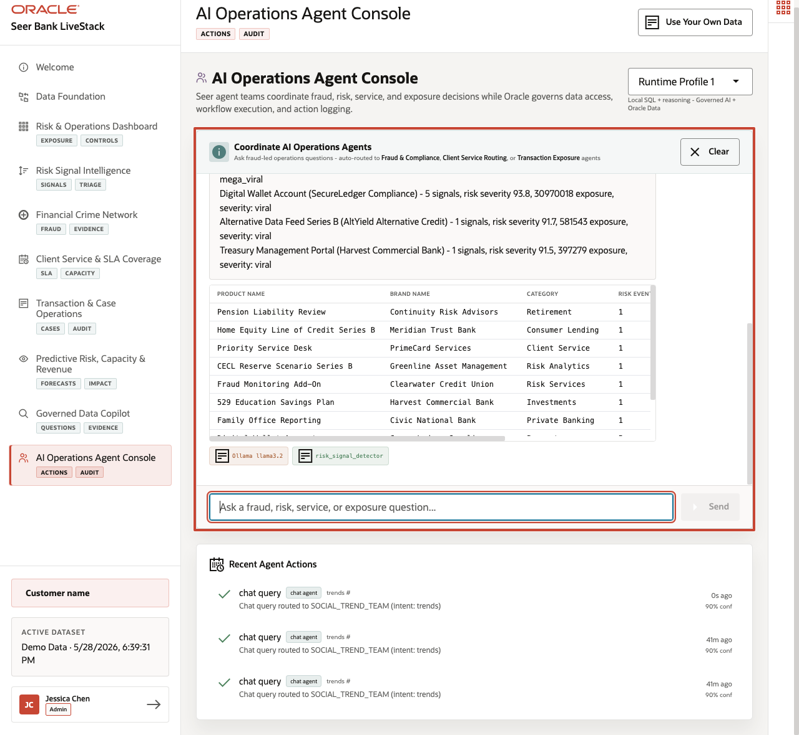

# AI Operations Agent Console: Trusted Actions

## Introducción

An AI-assisted workflow debe no be un black box. It debe summarize riesgo mediante approved herramientas y leave un durable record de what was proposed o done. Esta lab uses base de datos-backed helper functions behind la agente console pattern.

La final operating step es controlled action. An AI-assisted workflow debe no solo summarize riesgo; it debe use approved herramientas y leave un durable record de what action was proposed o taken.

After evidence es found, ranked, investigated, y governed, la bank necesita un action record. Esta lab shows that un AI-assisted workflow puede use approved base de datos herramientas y leave un audit fila.

<details>
<summary><strong>Key terms: agente, herramienta, Procedural Language/Structured Consulta Language (PL/SQL) function, y audit fila</strong></summary>

> - An **agente** es software that puede help summarize information, route un request, o ask un approved herramienta un perform work. In finanzas, un agente debe be observable porque recommendations y actions may affect riesgo, compliance, service, o client outcomes.
>
> - A **herramienta** es un approved function la agente es allowed un call. Tools keep la agente de acting solo mediante free-form text; they define la controlled operations la agente puede perform, such como summarizing riesgo signals o logging un decision.
>
> - A **PL/SQL function** es base de datos logic stored in Oracle Base de datos. En este laboratorio, PL/SQL represents la approved negocio logic un agente-style workflow puede call near governed finanzas datos.
>
> - An **audit fila** es un base de datos record that shows what happened, who o what performed la action, y cuando it occurred. Audit filas turn un AI-assisted interaction en durable evidence that un operator o reviewer puede inspect later.

</details>

La image below es la AI Operations Agent Console. It es no meant un be un generic chatbot screen; it shows un operational agente surface donde finanzas preguntas puede be routed un approved herramientas, returned como structured base de datos-backed evidence, y recorded in un recent actions audit trail. La SQL in this lab uses la mismo pattern: call controlled base de datos logic y then inspect la durable action record.



### Objetivos

- Call la riesgo signal helper function.
- Log y inspect un agente decision.

Tiempo estimado: **8 minutes**

### Negocio Scenario

| Paso | Finanzas focus |
| --- | --- |
| Problema de negocio | AI-assisted operations necesita un record de what was decided, why, y cuando. |
| Reto técnico | Agent workflows necesita controlled herramientas y durable audit filas instead de untracked chat actions. |
| Enfoque de la persona | Operations leaders review actions; AI engineers y base de datos developers expose approved PL/SQL herramientas y audit records. |
| Lo que verás | PL/SQL herramientas puede return grounded summaries y write auditable action history. |
| Capacidad de la base de datos | Stored functions y AGENT\_ACTIONS provide controlled herramienta execution y audit records. |
| Resultado | Agent workflows become reviewable base de datos events instead de untracked chat output. |

Persona focus: Tú support la operations leader by turning un AI-assisted action en un base de datos event that puede be inspected y governed.

## Tarea 1: Call la trend detection function

Call la approved PL/SQL helper function that summarizes current riesgo signals para operations review.

1. Ejecutar la approved PL/SQL helper function.

    > **SQL Worksheet reminder:** Need un reminder on how un open y use la SQL Worksheet? Return un [Getting Started Tarea 2: Open SQL Worksheet](?lab=getting-started#Tarea2:OpenSQLWorksheet) para la step-by-step graphic showing donde un paste y run SQL statements.

    Tú son calling la mismo kind de controlled base de datos herramienta un AI-assisted operations workflow puede use. La SQL invokes `DETECT_TRENDING_PRODUCTS` con un 48-hour window y un minimum severity threshold, then returns un concise riesgo summary produced by approved PL/SQL logic.

    <details>
    <summary><strong>Why this matters: agente herramientas debe live close un governed datos</strong></summary>

    > In un fractured environment, un AI assistant may summarize datos de one system, trigger actions in another, y leave audit history somewhere else. That makes it hard un know what datos was used y whether la action was recorded correctly.
    >
    > Oracle Base de datos puede hold la governed datos, la approved PL/SQL herramienta, y la audit trail together. That makes agente-assisted work more controlled y reviewable.

    </details>

    ```sql
    <copy>
    SELECT detect_trending_products(48, 50) AS risk_signal_summary
    FROM dual;
    </copy>
    ```

    **Resultado esperado: Riesgo Signal Tool Summary**

    | Riesgo Signal Summary |
    | --- |
    | Found 10 critical financiero productos (last 48h): Options Trading Enablement (Civic National Bank) - 1 signals, riesgo severity 72.3, 512667 exposure,... |


2. Revisar la summary text.
    La function packages consulta logic behind un controlled herramienta interface. That gives un agente un safe way un summarize current riesgo sin generating unsupported text de outside la base de datos.

    Resultado esperado starts con un phrase like `Found 10 critical financiero productos`. La function turns current signal datos en un operations-ready summary that un agente o analyst puede use un decide what necesita escalation.

    Esta matters porque la summary es produced by un approved base de datos function, no by free-form interpretation outside la governed datos boundary. La agente puede help move work forward, but la base de datos todavíun provides la controlled evidence path.

## Tarea 2: Log un auditable agente action

Log un agente action y inspect la audit trail that confirms la action was recorded.

1. Ejecutar this consulta:

    Tú son recording un operational escalation como durable base de datos evidence. La SQL calls `LOG_AGENT_DECISION` con la acting equipo, action type, entity type, y rationale so la agente workflow produces un auditable fila instead de solo un chat response.

    ```sql
    <copy>
    SELECT log_agent_decision(
             'RISK_SIGNAL_TEAM',
             'ESCALATE',
             'RISK_SIGNAL',
             'Critical signal exposure escalation for operations review'
           ) AS result
    FROM dual;
    </copy>
    ```

    **Resultado esperado: Agent Decision Result**

    | Result |
    | --- |
    | Decision logged: ESCALATE by RISK\_SIGNAL\_TEAM |


2. Inspeccionar la latest audit filas.

    Tú son confirming that la action tú just logged es visible in la audit trail. La SQL reads la latest filas de `AGENT_ACTIONS`, pedidos by newest action first, y returns la actor, action, entity type, status, y execution time para review.

    ```sql
    <copy>
    SELECT agent_name,
           action_type,
           entity_type,
           execution_status,
           executed_at
    FROM agent_actions
    ORDER BY action_id DESC
    FETCH FIRST 5 ROWS ONLY;
    </copy>
    ```

    **Resultado esperado: Agent Action Audit Trail**

    | Agent Name | Action Type | Entity Type | Execution Status | Executed At |
    | --- | --- | --- | --- | --- |
    | RISK\_SIGNAL\_TEAM | ESCALATE | RISK\_SIGNAL | completed | timestamp varies |
    | RISK\_SIGNAL\_TEAM | ESCALATE | RISK\_SIGNAL | completed | timestamp varies |
    | RISK\_SIGNAL\_TEAM | ESCALATE | RISK\_SIGNAL | completed | timestamp varies |
    | RISK\_SIGNAL\_TEAM | ESCALATE | RISK\_SIGNAL | completed | timestamp varies |
    | RISK\_SIGNAL\_TEAM | ESCALATE | RISK\_SIGNAL | completed | timestamp varies |


3. Confirmar la action es recorded.
    La first consulta writes la action; la second confirms la write es visible in la audit trail. Together they show la difference between un AI suggestion y un operational action la bank puede review.

    La audit fila es la base de datos evidence that la action occurred. It records who la agente acted como, what action was requested, what entity type was affected, la execution status, y la timestamp.

    That es la difference between "la assistant said something" y "la bank has un reviewable operational record."

    Esta es la operational payoff: la mismo base de datos foundation that produced riesgo evidence también records la AI-assisted response para later review.

## Agradecimientos

* **Author** - Pat Shepherd, Senior Principal Base de datos Product Manager
* **Contributor** - Linda Foinding, Principal Base de datos Product Manager
* **Last Updated By/Date** - Oracle Base de datos Product Management, June 2026
