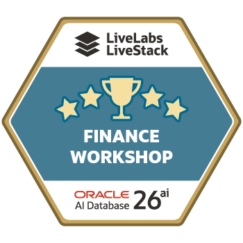

# Cuestionario final

```quiz-config
passing: 75
badge: images/badge.png
```

## Introducción

Utilice este cuestionario puntuado para comprobar si puede relacionar cada resultado financiero de Seer Bank con la información de la base de datos que revisó en los laboratorios.

### Objetivos

- Repasar las principales capacidades de la base de datos utilizadas en el taller.
- Relacionar cada resultado financiero con la información de la base de datos que lo respalda.
- Obtener la insignia del taller al responder las preguntas puntuadas.

Tiempo estimado: **5 minutos**

## Tarea 1: Responder las preguntas del cuestionario

1. Complete el cuestionario puntuado.

    ```quiz score
    Q: ¿Por qué comienza el taller con la base de datos financiera?
    - Para instalar manualmente cada tabla financiera.
    * Para identificar los datos compartidos que utiliza cada flujo financiero posterior.
    - Para sustituir el panel de la aplicación por informes de catálogo.
    - Para mover los registros financieros a archivos de análisis externos.
    > El laboratorio de la base de datos le orienta sobre los objetos compartidos que utiliza la aplicación. Los laboratorios posteriores reutilizan esa base para la información del panel, los documentos de transacciones, la búsqueda vectorial, el análisis de grafos, la cobertura espacial y la puntuación de Oracle Machine Learning (OML).

    Q: ¿Cuál es el valor principal de negocio de reproducir con SQL la información de un panel?
    - Oculta las filas que respaldan el proceso de revisión de riesgos y operaciones.
    - Trata las capturas del panel como la fuente final de información.
    * Conecta los resúmenes de KPI con información de la base de datos que se puede revisar.
    - Elimina la necesidad de vistas semánticas financieras.
    > El laboratorio del panel trata sobre la posibilidad de explicar los resultados. Las agregaciones SQL conectan el resumen de la aplicación con información revisable de señales, exposición, transacciones, productos y servicios.

    Q: ¿Qué ayuda a hacer JSON Relational Duality a Seer Bank en el laboratorio de transacciones?
    - Copiar los documentos de transacciones a una base de datos de documentos separada.
    * Servir los datos de transacciones como JSON y mantener el acceso SQL a la misma fuente.
    - Eliminar las tablas relacionales del proceso de revisión de transacciones.
    - Obligar a los analistas a leer manualmente el JSON sin procesar en cada revisión.
    > JSON Relational Duality permite que la aplicación lea una transacción como documento JSON, mientras los analistas pueden proyectar sus campos en columnas SQL y unirlos con datos relacionales controlados.

    Q: ¿Por qué es útil AI Vector Search dentro de la base de datos para la inteligencia de señales de riesgo?
    * Los analistas pueden buscar por significado dentro de los datos financieros controlados.
    - Los analistas deben exportar el texto de las señales a un servicio de búsqueda separado.
    - Los resultados de búsqueda proceden únicamente de los metadatos de tablas y columnas.
    - El SQL revisable se sustituye por una respuesta de prompt oculta.
    > El laboratorio de vectores muestra una búsqueda semántica por intención, no solo por palabras clave. La ventaja de control es que la creación de embeddings y la puntuación de similitud permanecen cerca de los datos financieros.

    Q: En el laboratorio de vectores, ¿qué ayuda a hacer la puntuación de similitud a un analista?
    - Demostrar que una señal de riesgo es fraude confirmado.
    - Sustituir las tablas de productos y señales únicamente por embeddings.
    * Clasificar productos o señales según su cercanía a la frase de búsqueda.
    - Contar cuántas filas existen en cada tabla financiera.
    > La consulta convierte la distancia vectorial en una puntuación de similitud: una puntuación más alta significa que el texto almacenado del producto o de la señal se acerca más al significado de la frase de búsqueda.

    Q: ¿Qué problema de negocio resuelve el laboratorio de grafos de propiedades para los investigadores de fraude?
    - Puntúa los ingresos futuros de productos y segmentos financieros.
    * Explica las conexiones entre cuentas y entidades compartidas.
    - Almacena regiones de cobertura de servicio para los equipos de operaciones.
    - Sustituye la información de relaciones por totales de productos planos.
    > El laboratorio de grafos se centra en la información de relaciones. Un analista de fraude puede priorizar cuentas, dispositivos, beneficiarios, direcciones IP y teléfonos conectados sin depender de cadenas frágiles de JOIN manuales.

    Q: ¿Por qué utiliza datos espaciales el laboratorio de cobertura de servicios?
    - Para tomar decisiones de cobertura fuera de la base de datos controlada.
    - Para ocultar la información de capacidad a los responsables de operaciones de servicio.
    * Para comparar la distancia a los centros de servicio, las regiones con demanda y las zonas de respuesta de SLA.
    - Para sustituir las consultas espaciales por etiquetas estáticas.
    > Los datos espaciales permiten a los equipos de operaciones medir qué centros de servicio están cerca de las regiones con mayor demanda y si los compromisos de tiempo de respuesta pueden cubrir el trabajo de los casos.

    Q: ¿Qué resultado permite la puntuación de OML dentro de la base de datos?
    - Los registros financieros deben exportarse a un almacén de predicciones separado.
    - El resultado del modelo solo puede revisarse en la interfaz de la aplicación.
    - Se puede confiar en los modelos sin mostrar información SQL.
    * Las predicciones pueden puntuarse donde ya viven los datos controlados.
    > El laboratorio de OML no trata solo de los nombres de los modelos. Muestra cómo los modelos desplegados producen predicciones revisables cerca de los datos que las generan.

    Q: En el laboratorio de OML, ¿qué significa la confianza del modelo?
    - Garantiza que la predicción se producirá.
    * Es la probabilidad del modelo para una predicción y aún debe revisarse.
    - Es el número de filas del catálogo de modelos OML.
    - Significa que el modelo ya no necesita contexto de negocio.
    > La confianza ayuda a comparar predicciones más fuertes y más débiles, pero no es certeza. El laboratorio también utiliza una comprobación sencilla de coincidencia para comparar las etiquetas predichas con las etiquetas de la demostración.

    Q: ¿Cuál es la principal ventaja de utilizar Oracle Database como base convergente de este taller?
    - Cada capacidad financiera debe utilizar un almacén de datos especializado separado.
    * La información de SQL, JSON, vectores, grafos, datos espaciales y OML permanece conectada.
    - Las capturas de la aplicación sustituyen la necesidad de información de la base de datos.
    - Los equipos de riesgos deben reconciliar los datos copiados antes de cada investigación.
    > El taller utiliza distintas capacidades de la base de datos para distintas preguntas financieras, pero su valor está en que todas trabajan con datos controlados y conectados. Esto reduce las copias, la reconciliación y las explicaciones fragmentadas.
    ```

2. Revise la insignia de finalización.

    

## Agradecimientos

* **Autor** - Pat Shepherd, Senior Principal Database Product Manager
* **Colaborador** - Linda Foinding, Principal Database Product Manager
* **Última actualización por/fecha** - Oracle Database Product Management, junio de 2026
