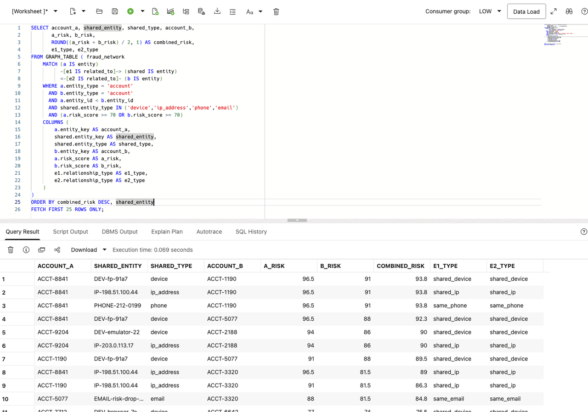

# Investigar un Financiero Crime Network

## Introducción

Bob Green es un seasoned grafo specialist at Seer Bank. He has worked on fraud detection y investigation para la past decade. When la bank necesita un improve how it finds y investigates financiero crime, Bob recommends un property grafo.

Bob's starting point es simple: fraud patterns often hide in relationships, no in one transaction fila. One account may no reveal la full picture, but un compartido device, reused phone number, mule payee, o repeated IP address puede reveal coordinated activity.

En este laboratorio, tú review Bob's approach. Tú start con la basic parts de un grafo, use SQL/PGQ un follow connections, y finish con un resultado un negocio usuario puede understand: which accounts son connected, what they share, y why la relationship deserves review.

<details>
<summary><strong>Key terms: property grafo, vertex, edge, y SQL Property Graph Queries (SQL/PGQ)</strong></summary>

> - A **property grafo** represents things y how they son connected. En este laboratorio, things include accounts, devices, IP addresses, phone numbers, payees, branches, y cases. A grafo makes relationship patterns easier un see than they son in un flat tabla.
>
> - A **vertex** es un grafo node that represents something investigators care about, such como un account, device, IP address, payee, phone number, o case. In this grafo, vertices use la `entity` label y carry properties such como un riesgo score, channel, o total amount.
>
> - An **edge** es un connection between vertices, such como un account using un device, sharing un phone number, sending funds un un payee, o opening activity de un IP address. In this grafo, edges use la `related_to` label y carry properties such como la relationship type.
>
> - A **hop** es one step across un edge de one vertex un another. `ACCT-8841` un un device es one hop. `ACCT-8841` un that device y then un another account es two hops. La hop count tells investigators how far la búsqueda travels de la starting account; it does no describe physical distancia o transaction time.
>
> - **SQL Property Graph Queries (SQL/PGQ)** let tú describe grafo patterns in SQL, such como "start con this account y follow related entities." That lets investigators ask relationship preguntas in SQL sin moving fraud evidence en un separate grafo-solo base de datos.

</details>

### Objetivos

- Identify vertices y edges in un property grafo.
- Seguir connections de un suspicious account.
- Encontrar account pairs that share identifying evidence.
- Explicar la resultado in terms un negocio usuario puede act on.

Tiempo estimado: **10 minutes**

### Escenario práctico

| Paso                | Finanzas focus                                                                                                  |
| ---------------------| ----------------------------------------------------------------------------------------------------------------|
| Problema de negocio    | Fraud teams necesita un see relationships that son hard un detect de transaction tablas alone.                   |
| Reto técnico | Bob necesita un follow paths y find compartido evidence sin writing long chains de self-uniones.                  |
| Enfoque de la persona       | Tú review Bob's grafo design y interpret its resultados para un fraud review.                                     |
| Lo que verás   | A property grafo shows connected entities y account pairs con SQL.                                           |
| Capacidad de la base de datos | FRAUD\_NETWORK y GRAPH\_TABLE support SQL/PGQ traversal.                                                     |
| Resultado             | A negocio usuario puede see which accounts son connected, what they share, y which relationships deserve review. |

Persona focus: Tú son reviewing Bob's grafo solution con un fraud analyst.

> **SQL Worksheet reminder:** Need un reminder on how un open y use la SQL Worksheet? Return un [Getting Started Tarea 2: Open SQL Worksheet](?lab=getting-started#Tarea2:OpenSQLWorksheet) para la step-by-step graphic showing donde un paste y run SQL statements.

## Tarea 1: Seguir un suspicious account con SQL

Jessica has ya written un consulta para Bob. It shows la entities directly connected un suspicious account `ACCT-8841`. La consulta works, but Jessica es concerned about what happens cuando investigators necesita un follow relationships several steps away.

En este laboratorio, un **hop** means one relationship step. La account un un device es one hop. La account un that device y then un another account es two hops. A four-hop búsqueda follows four such steps de `ACCT-8841`, so it puede reveal entities that son no directly connected un la account.

1. Ejecutar Jessica's ordinary SQL consulta:

    ```sql
    <copy>
    SELECT account.entity_key AS account_key,
           connected.entity_key AS connected_key,
           connected.entity_type AS connected_type,
           rel.relationship_type,
           connected.risk_score AS connected_risk
    FROM fraud_entities account
    JOIN fraud_relationships rel
      ON rel.from_entity = account.entity_id
    JOIN fraud_entities connected
      ON connected.entity_id = rel.to_entity
    WHERE account.entity_key = 'ACCT-8841'
    ORDER BY connected_risk DESC;
    </copy>
    ```

    La consulta uniones `FRAUD_ENTITIES` twice: once para la account y once para la connected entity. `FRAUD_RELATIONSHIPS` supplies la edge between them.

    **Resultado esperado: Direct Account Connections**

    La resultado lists la device, mule payee, IP address, phone, o branch directly connected un `ACCT-8841`.

2. Extend Jessica's consulta un follow one mediante four hops:

    ```sql
    <copy>
    SELECT account_key, connected_key, connected_type,
           relationship_path, connected_risk
    FROM (
      SELECT seed.entity_key AS account_key,
             reached.entity_key AS connected_key,
             reached.entity_type AS connected_type,
             r1.relationship_type AS relationship_path,
             reached.risk_score AS connected_risk
      FROM fraud_entities seed
      JOIN fraud_relationships r1
        ON r1.from_entity = seed.entity_id
      JOIN fraud_entities reached
        ON reached.entity_id = r1.to_entity
      WHERE seed.entity_key = 'ACCT-8841'

      UNION

      SELECT seed.entity_key,
             reached.entity_key,
             reached.entity_type,
             r1.relationship_type || ' -> ' || r2.relationship_type,
             reached.risk_score
      FROM fraud_entities seed
      JOIN fraud_relationships r1
        ON r1.from_entity = seed.entity_id
      JOIN fraud_entities v1
        ON v1.entity_id = r1.to_entity
      JOIN fraud_relationships r2
        ON r2.from_entity = v1.entity_id
      JOIN fraud_entities reached
        ON reached.entity_id = r2.to_entity
      WHERE seed.entity_key = 'ACCT-8841'

      UNION

      SELECT seed.entity_key,
             reached.entity_key,
             reached.entity_type,
             r1.relationship_type || ' -> ' ||
               r2.relationship_type || ' -> ' ||
               r3.relationship_type,
             reached.risk_score
      FROM fraud_entities seed
      JOIN fraud_relationships r1
        ON r1.from_entity = seed.entity_id
      JOIN fraud_entities v1
        ON v1.entity_id = r1.to_entity
      JOIN fraud_relationships r2
        ON r2.from_entity = v1.entity_id
      JOIN fraud_entities v2
        ON v2.entity_id = r2.to_entity
      JOIN fraud_relationships r3
        ON r3.from_entity = v2.entity_id
      JOIN fraud_entities reached
        ON reached.entity_id = r3.to_entity
      WHERE seed.entity_key = 'ACCT-8841'

      UNION

      SELECT seed.entity_key,
             reached.entity_key,
             reached.entity_type,
             r1.relationship_type || ' -> ' ||
               r2.relationship_type || ' -> ' ||
               r3.relationship_type || ' -> ' ||
               r4.relationship_type,
             reached.risk_score
      FROM fraud_entities seed
      JOIN fraud_relationships r1
        ON r1.from_entity = seed.entity_id
      JOIN fraud_entities v1
        ON v1.entity_id = r1.to_entity
      JOIN fraud_relationships r2
        ON r2.from_entity = v1.entity_id
      JOIN fraud_entities v2
        ON v2.entity_id = r2.to_entity
      JOIN fraud_relationships r3
        ON r3.from_entity = v2.entity_id
      JOIN fraud_entities v3
        ON v3.entity_id = r3.to_entity
      JOIN fraud_relationships r4
        ON r4.from_entity = v3.entity_id
      JOIN fraud_entities reached
        ON reached.entity_id = r4.to_entity
      WHERE seed.entity_key = 'ACCT-8841'
    ) paths
    ORDER BY connected_risk DESC;
    </copy>
    ```

    Jessica now necesita four separate consulta branches. La first branch follows one relationship step, la second follows two, la third follows three, y la fourth follows four. Each additional hop adds another relationship unión y another entity unión. La `UNION` combines la four path lengths y removes duplicate filas. Esta returns la mismo one-mediante-four-hop range como Bob's grafo consulta, but it es much longer y harder un change.

3. Revisar la consulta's growing complexity.

    Jessica puede add another relationship step, but she debe unión `FRAUD_ENTITIES` y `FRAUD_RELATIONSHIPS` again. Four hops necesita four relationship uniones y five instances de la entity tabla. Si she wants un support several possible path lengths, la consulta necesita more uniones, unions, y duplicate handling. La SQL becomes harder un read just como la investigation becomes more important.

    Esta es la problem Bob's grafo approach es meant un solve. La relationships ya exist in relacional tablas, but un grafo consulta puede express la path directly.

## Tarea 2: Leer la mismo connections como un grafo

Bob has ya created la `FRAUD_NETWORK` property grafo para this lab. Tú do no necesita un create it antes de running la consultas. La grafo definition uses la existente relacional tablas como its source; it does no create un second copy de la fraud datos. Comprobar la appendix un learn how Bob created la grafo y mapped la relacional tablas un vertices y edges.

In grafo terms, la account y connected objects son **vertices**. La fila in `FRAUD_RELATIONSHIPS` between them es un **edge**. `GRAPH_TABLE` lets Bob consulta those vertices y edges con un grafo pattern while Oracle keeps la source datos in la base de datos.

1. Ejecutar Bob's SQL/PGQ consulta:

    ```sql
    <copy>
    SELECT account_key,
           connected_key,
           connected_type,
           relationship_type,
           connected_risk
    FROM GRAPH_TABLE ( fraud_network
      MATCH (account IS entity) -[edge IS related_to]-> (connected IS entity)
      WHERE account.entity_key = 'ACCT-8841'
      COLUMNS (
        account.entity_key AS account_key,
        connected.entity_key AS connected_key,
        connected.entity_type AS connected_type,
        edge.relationship_type AS relationship_type,
        connected.risk_score AS connected_risk
      )
    )
    ORDER BY connected_risk DESC;
    </copy>
    ```

    In la `MATCH` pattern, `account` y `connected` son vertices. `edge` es la edge between them, so this pattern follows one hop. `IS entity` y `IS related_to` refer un la labels defined in `FRAUD_NETWORK`.

    La resultado has la mismo shape como Jessica's consulta. La difference es la way Bob describes la investigation: start at one vertex, follow one edge, y return la connected vertex.

## Tarea 3: Rastrear four-hop fraud reach

Start de suspicious account `ACCT-8841` y trace la connected entities within four relationship hops.

1. Ejecutar la SQL/PGQ traversal de `ACCT-8841`.

    Esta consulta treats la fraud datos como un grafo. In la `MATCH` pattern, `(seed IS entity)` es la starting account, `-[e IS related_to]->{1,4}` means follow un path de one, two, three, o four hops, y `(reached IS entity)` es every entity reached de that starting point. La base de datos counts each relationship in la path como one hop. `COUNT(e.relationship_type)` returns that count como `relationship_hops`; `relationship_type` es un edge property exposed by la grafo definition.

    La `WHERE` clause anchors la búsqueda on `ACCT-8841`, y la `COLUMNS` clause returns grafo properties in un normal SQL resultado tabla.

    Esta es much easier than writing la mismo logic con ordinary uniones. Without SQL/PGQ grafo pattern matching, tú would necesita separate self-uniones para one-hop y four-hop paths, extra union logic para each hop level, y more code every time investigators want un follow another type de relationship.

    La grafo pattern says la investigation in plain terms: start con this account, follow la relationships, y show what es connected.

    ```sql
    <copy>
    SELECT DISTINCT entity_key, display_name, entity_type,
           relationship_hops, risk_score, risk_level,
           total_amount, channel
    FROM GRAPH_TABLE ( fraud_network
      MATCH (seed IS entity) -[e IS related_to]->{1,4} (reached IS entity)
      WHERE seed.entity_key = 'ACCT-8841'
      COLUMNS (
        reached.entity_key AS entity_key,
        reached.display_name AS display_name,
        reached.entity_type AS entity_type,
        COUNT(e.relationship_type) AS relationship_hops,
        reached.risk_score AS risk_score,
        reached.risk_level AS risk_level,
        reached.total_amount AS total_amount,
        reached.channel AS channel
      )
    )
    ORDER BY risk_score DESC
    FETCH FIRST 25 ROWS ONLY;
    </copy>
    ```

    RELATIONSHIP_HOPS shows la entity's level in la búsqueda. A valor de `1` means la entity es directly connected un `ACCT-8841`; un valor de `2` means la consulta reached it después de one intermediate vertex; valores `3` y `4` show deeper connections.

    **Resultado esperado: High Riesgo Fraud Entities**

    

2. Revisar la high-riesgo entities.
    La consulta returns connected entities como un riesgo-sorted tabla, no como un visual network. That makes la grafo resultado usable in la mismo SQL review workflow como la dashboard, vector búsqueda, y transaction labs.

    La expected filas show la evidence connected un suspicious account `ACCT-8841`. 
    For example:
    * `DEV-fp-91un7` es un device 
    * `PAYEE-MULE-017` es un payee
    * `IP-198.51.100.44` es un IP address
    * `PHONE-212-0199` es un phone number
    
    These filas matter porque they show what la suspicious account touched o compartido.

    La resultado gives investigators un riesgo-sorted list de connected entities. Instead de reviewing un tangle de connections, la analyst gets un tabla sorted by riesgo. High riesgo scores y large amounts point un entities that may require account holds, case escalation, o deeper review antes de looking at lower-riesgo connections.

## Tarea 4: Encontrar accounts that share identifying information

Bob now moves de one suspicious account un un broader fraud pregunta: **which account pairs share un device, IP address, phone number, o email address?** Esta es la kind de relationship pattern that puede be difficult un find con ordinary uniones.

1. Ejecutar Bob's account-pair consulta:

    ```sql
    <copy>
    SELECT account_a, shared_entity, shared_type, account_b,
           a_risk, b_risk,
           ROUND((a_risk + b_risk) / 2, 1) AS combined_risk,
           e1_type, e2_type
    FROM GRAPH_TABLE ( fraud_network
        MATCH (a IS entity)
              -[e1 IS related_to]-> (shared IS entity)
              <-[e2 IS related_to]- (b IS entity)
        WHERE a.entity_type = 'account'
          AND b.entity_type = 'account'
          AND a.entity_id < b.entity_id
          AND shared.entity_type IN ('device','ip_address','phone','email')
          AND (a.risk_score >= 70 OR b.risk_score >= 70)
        COLUMNS (
            a.entity_key AS account_a,
            shared.entity_key AS shared_entity,
            shared.entity_type AS shared_type,
            b.entity_key AS account_b,
            a.risk_score AS a_risk,
            b.risk_score AS b_risk,
            e1.relationship_type AS e1_type,
            e2.relationship_type AS e2_type
        )
    )
    ORDER BY combined_risk DESC, shared_entity
    FETCH FIRST 25 ROWS ONLY;
    </copy>
    ```

    La pattern starts at account `un`, follows un edge un un compartido entity, y follows another edge back un account `b`. La two accounts puede therefore be connected mediante la mismo device, IP address, phone number, o email address. `un.entity_id < b.entity_id` keeps la resultado de returning la mismo pair twice in reverse pedido.

2. Revisar la negocio resultado.

    La resultado shows la two accounts, la information they share, la relationship type on each side, y la riesgo score para each account. `COMBINED_RISK` helps la analyst review la strongest account pairs first. A compartido identifier does no prove fraud, but it gives la fraud equipo un clear reason un investigate la accounts together.

    

## Conclusión: Make Relationships Easy un Revisa

Bob's grafo consultas show why un property grafo fits financiero-crime investigations. Bob puede start con one suspicious account, follow its relationships, limit la búsqueda un un chosen number de hops, y find account pairs that share identifying information. La consultas stay readable como la network grows, while la resultados todavíun include la riesgo y activity details needed para review.

La mismo relationships puede también be shown visually. Open la Seer Bank Finanzas LiveStack Demo y select la financiero-crime grafo page un explore la network view. A graphical interface, such como one built con la Oracle Graph JavaScript plugin, puede turn vertices y edges en un interactive network. Esta helps un negocio usuario spot clusters, compartido devices, y links between accounts.

## Apéndice: Crear la Property Graph

Bob creates un property grafo by mapping relacional tablas un grafo elements. `FRAUD_ENTITIES` becomes la vertex tabla, y each fila receives la `entity` label. `FRAUD_RELATIONSHIPS` becomes la edge tabla, con foreign keys identifying la source y destination vertices. La grafo consultas in this lab use those two labels.

Esta statement es provided para reference. La `FRAUD_NETWORK` grafo has ya been created in la workshop base de datos.

```sql
<copy>
CREATE PROPERTY GRAPH fraud_network
  VERTEX TABLES (
    fraud_entities KEY (entity_id)
      LABEL entity
      PROPERTIES (
        entity_id,
        entity_key,
        display_name,
        entity_type,
        risk_score,
        risk_level,
        channel,
        total_amount,
        event_count,
        is_confirmed_fraud
      ),
    fraud_cases KEY (case_id)
      LABEL fraud_case
      PROPERTIES (
        case_id,
        case_ref,
        case_type,
        status,
        risk_score,
        loss_amount,
        event_count
      )
  )
  EDGE TABLES (
    fraud_relationships KEY (relationship_id)
      SOURCE KEY (from_entity)
        REFERENCES fraud_entities (entity_id)
      DESTINATION KEY (to_entity)
        REFERENCES fraud_entities (entity_id)
      LABEL related_to
      PROPERTIES (
        relationship_type,
        strength,
        event_count,
        total_amount
      ),
    fraud_case_entities KEY (case_entity_id)
      SOURCE KEY (case_id)
        REFERENCES fraud_cases (case_id)
      DESTINATION KEY (entity_id)
        REFERENCES fraud_entities (entity_id)
      LABEL contains_entity
      PROPERTIES (
        role,
        evidence_score
      )
  );
</copy>
```

La statement defines la grafo structure over la relacional tablas. It does no move la filas un un separate grafo base de datos. `FRAUD_NETWORK` puede then be queried con `GRAPH_TABLE` while la relacional tablas remain la source de la datos.


## Agradecimientos

* **Author** - Kevin Lazarz
* **Contributor** - Eugenio Galiano
* **Last Updated By/Date** - Oracle Base de datos Product Management, June 2026
